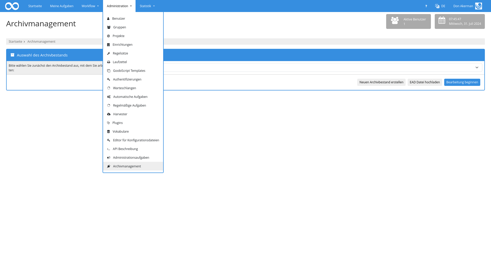
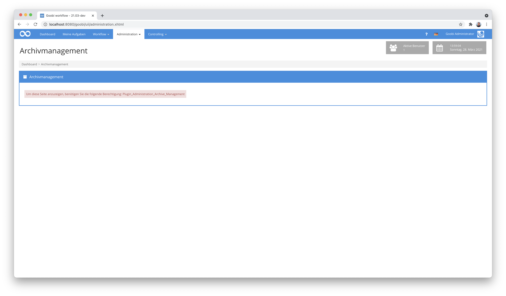
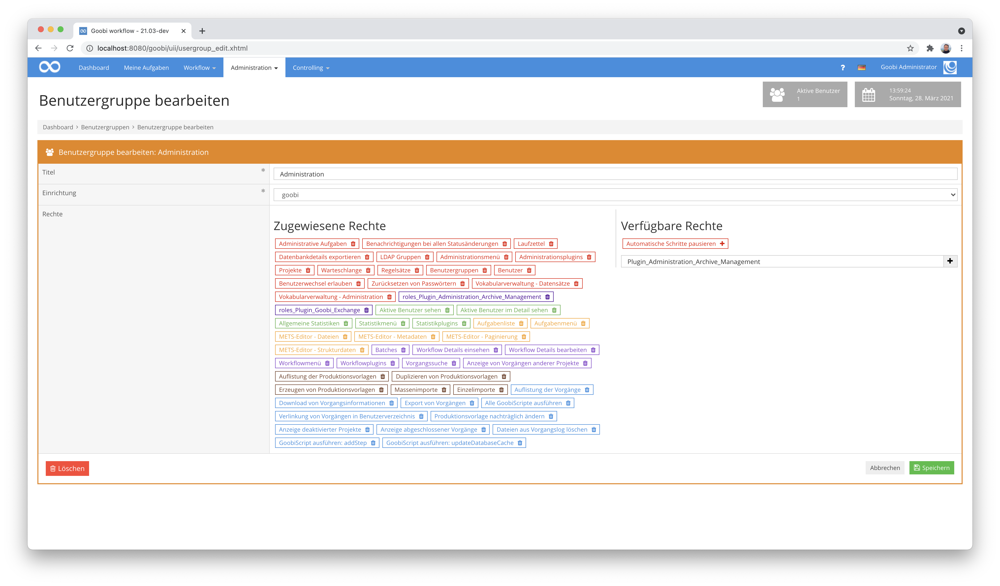

# Archiv-Management

## Übersicht

Name                     | Wert
-------------------------|-----------
Identifier               | intranda_administration_archive_management
Repository               | [https://github.com/intranda/goobi-plugin-administration-archive-management](https://github.com/intranda/goobi-plugin-administration-archive-management)
Lizenz              | GPL 2.0 oder neuer 
Letzte Änderung    | 16.09.2024 13:07:31


## Einführung
Die vorliegende Dokumentation beschreibt die Installation, die Konfiguration und den Einsatz des Administration Plugins für die Verwaltung von Archivbeständen aus Goobi workflow heraus. Dabei werden die Daten mehrerer Bestände verwaltet und erlauben auch kleinen Archiven eine standardisierte Datenerfassung ohne Inbetriebnahme einer kostenpflichtigen Drittsoftware. Der Export als standardisierte EAD-Dateien ist jederzeit möglich und kann auch automatisch in regelmäßigen Abständen durchgeführt werden.

## Installation

### Installation des Plugins
Das Plugin besteht insgesamt aus den folgenden zu installierenden Dateien

```bash
plugin-administration-archive-management-base.jar
plugin-administration-archive-management-gui.jar
plugin-administration-archive-management-job.jar
plugin-administration-archive-management-lib.jar
plugin_intranda_administration_archive_management.xml
```

Diese Dateien müssen in den richtigen Verzeichnissen installiert werden, so dass diese nach der Installation in folgenden Pfaden vorliegen:

```bash
/opt/digiverso/goobi/plugins/administration/plugin-administration-archive-management-base.jar
/opt/digiverso/goobi/plugins/GUI/plugin-administration-archive-management-gui.jar
/opt/digiverso/goobi/plugins/GUI/plugin-administration-archive-management-job.jar
/opt/digiverso/goobi/plugins/GUI/plugin-administration-archive-management-lib.jar
```

Darüber hinaus benötigt das Plugin noch zusätzlich eine Konfigurationsdatei, die an folgender Stelle liegen muss:

```bash
/opt/digiverso/goobi/config/plugin_intranda_administration_archive_management.xml
```

## Überblick und Funktionsweise
Das Plugin für die Bearbeitung von Archivbeständen findet sich unterhalb des Menüpunkts `Administration`.



Zur Nutzung des Plugins ist zunächst notwendig, dass der Nutzer über das Recht `Plugin_Administration_Archive_Management` verfügt. Sollte dieses Recht noch noch nicht zugewiesen worden sein, erhält der Nutzer folgenden Hinweis:



Die entsprechenden Rechte müssen den jeweiligen Benutzergruppen daher zunächst zugewiesen werden.



Nachdem die benötigten Rechte zugewiesen wurden und ggf. ein neuer Login erfolgte, kann die Nutzung des Plugins erfolgen.

Dabei hat der Nutzer erst einmal nur lesenden Zugriff. Um auch Daten ändern zu können, stehen folgende weitere Rechte zur Verfügung, die ggf. zusätzlich zugeweisen werden können:

Berechtigung | Erläuterung
-------------|-----------
`Plugin_Administration_Archive_Management_Write` | Schreibender Zugriff auf die Daten
`Plugin_Administration_Archive_Management_Upload`| Hochladen bzw. Einspielen vonb (neuen) EAD-Dateien
`Plugin_Administration_Archive_Management_New` | Erstellung von neuen Beständen
`Plugin_Administration_Archive_Management_Vocabulary` | Berechtigung zur Erweiterung von Auswahllisten aus Vokabularen
`Plugin_Administration_Archive_Management_Inventory_NAME` | Zugriff auf einzelne ausgewählte Bestände, wobei der Suffix NAME durch den Namen des Bestands zu ersetzen ist
`Plugin_Administration_Archive_Management_All_Inventories` | Zugriff auf alle Bestände
`Plugin_Administration_Archive_Management_Delete` | Löschen des ausgewählten Bestandes
`Plugin_Administration_Archive_Management_Process` | Erstellen von Vorgängen


Eine detaillierte Erläuterung über die Bedienung des Plugins bzw. dessen Funktionen findet sich auf dieser Seite:

[Bedienung des Plugins](goobi-plugin-administration-archive-management_page_01_de.md)


## Konfiguration
Nach erfolgter Installation erfolgt die Konfiguration des Plugins und der zugehörigen Oberfäche innerhalb der Konfigurationsdatei `plugin_intranda_administration_archive_management.xml`. Diese ist auf der folgenden Seite detailliert beschrieben:

[Konfiguration des Plugins](goobi-plugin-administration-archive-management_page_02_de.md)