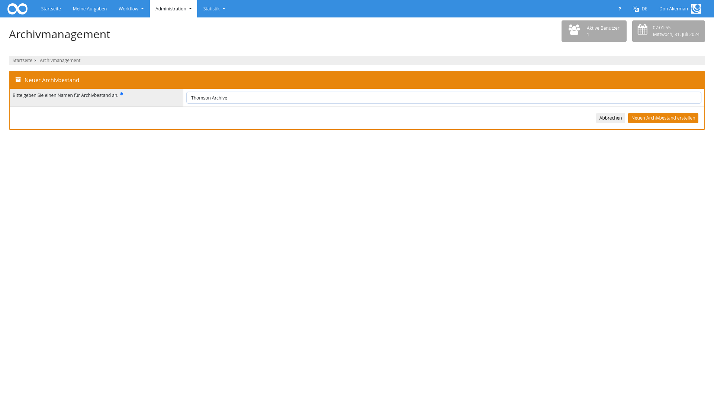
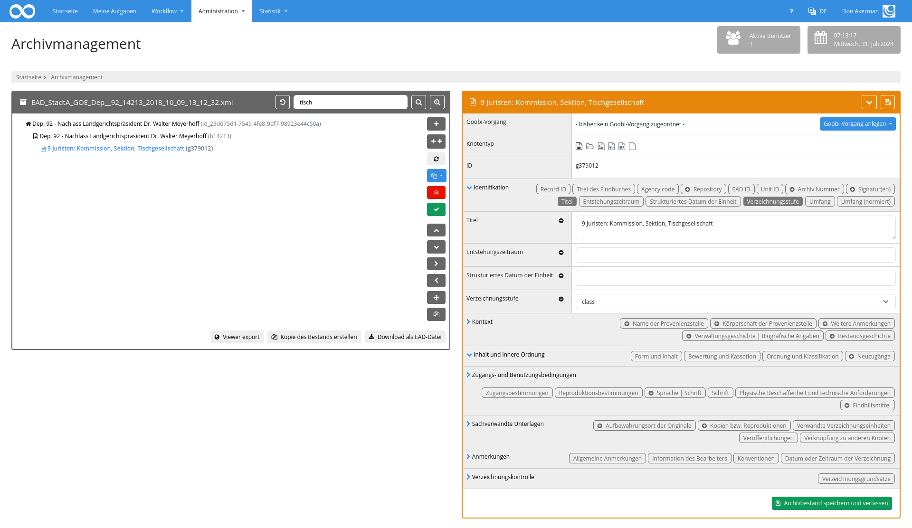

Die folgenden Funktionen stehen innerhalb des Plugins für das Archive-Management zur Verfügung:

## Auswahl von vorhandenen Beständen
Nachdem das Plugin geöffnet wurde, wird zunächst eine Liste der zur Verfügung stehenden Archivbestände angezeigt. Hier kann der Nutzer einen Archivbestand auswählen und mit der Bearbeitung beginnen.

Alternativ dazu kann ebenfalls ein neuer Archivbestand erzeugt werden. In diesem Fall muss zunächst ein Name für den Bestand vergeben werden. Der Name muss eindeutig sein, da darüber die Identifikation erfolgt. Außerdem sollten keine Sonderzeichen wie `:/\` genutzt werden, da der Name auch Grundlage für den Dateiname des EAD-Exports ist.

Als dritte Möglichkeit kann eine vorhandene Datei importiert werden. Hier kann eine EAD-Datei ausgewählt und hochgeladen werden. Wenn noch kein Bestand mit dem Namen der Datei existiert, wird die Datei als neuer Bestand importiert und direkt geöffnet. Falls der Name schon in Verwendung ist, kann nach einer Rückfrage der bestehende Bestand mit dem Inhalt der EAD-XML Datei überschrieben werden.

Sofern der Nutzer über die Berechtigung zur Erstellung neuer Bestände verfügt, kann mit dem entsprechenden Button ebenfalls eine Kopie eines Bestandes erstellt werden. Dabei wird ein neuer Bestand erstellt und alle Knoten mit all ihren Metadaten kopiert. Einzige Ausnahme ist hierbei die ID der Knoten. Diese werden automatisch neue erstellt und den Knoten zugewiesen. 

Nach der Auswahl des zu bearbeitenden Archivbestandes wird der Nutzer in die Bearbeitungsmaske weitergeleitet. Hier läßt sich nun im linken Bereich der Strukturbaum bearbeiten. Im rechten Bereich können die Details des jeweils ausgewählten Knoten bearbeitet werden.

Durch einen Klick auf die Buttons `Abbrechen` (Leserechte) oder `Archivbestand speichern und verlassen` (Schreibrechte) wird man wieder auf die Seite zur Auswahl eines Archivbestandes geleitet.

## Strukturbaum bearbeiten
Im linken Bereich der Bearbeitungsmaske lässt sich die Struktur des Archivbestandes bearbeiten. Hier lassen sich alle Knoten inklusive ihrer Hierarchie auf einen Blick einsehen. Vor jedem Element befindet sich ein Icon, mit dem sich die Unterelemente des Knotens anzeigen oder ausblenden lassen. Um einen Knoten auszuwählen, kann er angeklickt werden. Er wird dann farbig hervorgehoben und die Details des ausgewählten Knotens werden auf der rechten Seite angezeigt. Wenn ein Knoten im linken Bereich der Bearbeitungsmaske ausgewählt wurde, können ausserdem die Buttons am rechten Rand der linken Box genutzt werden, um den Knoten zu ändern. Folgende Optionen sind hierbei möglich:

| Funktion | Erläuterung |
| :--- | :--- |
| `Neuen Knoten einfügen` | Mit diesem Button kann ein neuer Knoten als Unterknoten an das Ende der bereits vorhandenen Unterknoten angefügt werden. |
| `Mehrere Unterknoten an dieser Stelle einfügen` | Öffnet ein Popup, in dem sich beliebig viele Knoten erstellen lassen.|
| `Verweise aktualisieren` | Prüft, ob für die Knoten des Bestands Vorgänge existieren. Diese Aktion aktualisiert gegebenenfalls die Verweise. |
| `Fehlende Vorgänge erstellen` | Generiert für den ausgewählten Knoten und alle Kindknoten Vorgänge, falls für diese Knoten noch keine Vorgänge existieren. |
| `Knoten löschen` | Hiermit läßt sich der ausgewählte Knoten inklusive aller Unterknoten löschen.   **Achtung:** Diese Funktion kann nicht auf der Ebene des Hauptknotens genutzt werden. |
| `Validierung ausführen` | Mit dieser Funktion läßt sich eine Validierung des ausgewählten Knotens ausführen. Verstöße gegen die konfigurierten Validierungsvorgaben werden entsprechend aufgelistet. |
| `Nach oben bewegen` | Dieser Button erlaubt das Verschieben des ausgewählten Knotens nach oben innerhalb der gleichen Hierarchieebene. |
| `Nach unten bewegen` | Dieser Button erlaubt das Verschieben des ausgewählten Knotens nach unten innerhalb der gleichen Hierarchieebene. |
| `In der Hierarchie nach unten bewegen` | Mit diesem Button ist es möglich, den ausgewählten Knoten auf eine tiefere Hierarchiestufe zu verschieben. |
| `In der Hierarchie nach oben bewegen` | Mit diesem Button ist es möglich, den ausgewählten Knoten auf eine höhere Hierarchiestufe zu verschieben. |
| `Knoten an andere Stelle bewegen` | Mit dieser Funktion öffnet sich eine andere Bearbeitungsmaske, die es ermöglicht, den aktuell ausgewählten Knoten an einer ganz andere Stelle des Hierarchiebaums zu verschieben. Hierbei wird die komplette Hierarchie angezeigt, so dass derjenige Knoten ausgewählt werden kann, innerhalb dessen der ausgewählte Knoten als Unterknoten eingefügt werden soll. |
| `Knoten duplizieren` | Öffnet ein Popup, in dem bei ausgewählten Metadaten (Attribute `visible` und `showField`) ein Präfix oder Suffix festgelegt werden kann. Die Aktion dupliziert den ausgewählten Knoten und alle Kindelemente und fügt den neuen Metadaten die angegebenen Präfixe und Suffixe hinzu.|

Um mehrere Unterknoten auf einmal zu generieren, muss die Anzahl der zu erstellenden Knoten und deren Typ festgelegt werden. Anschließend können verschiedene Metadaten definiert werden, die in alle neuen Knoten eingetragen werden. Dabei kann entweder der gleiche Text in allen Feldern genutzt werden, ein Identifier generiert werden oder ein Text mit anschließendem Zähler generiert werden. Hierbei lässt sich das Zählerformat und der Startwert festlegen.
 

Im oberen Bereich der Hierarchieanzeige kann darüber hinaus auch eine Suche innerhalb der Metadaten der Knoten erfolgen. Dabei werden die gefundenen Knoten samt Hierarchie angezeigt und farbig hervorgehoben. Um die Suche wieder zurückzusetzen genügt es, den Inhalt des Suchbegriffs wieder zu leeren und entsprechen eine leere Suche auszuführen. Alternativ kann der Button auf der linken Seite des Suchfeldes genutzt werden.

Rechts neben dem Feld kann die erweiterte Suche genutzt werden. Hier kann gezielt in einzelnen Feldern gesucht werden. Welche Felder zur Verfügung stehen, kann über die Konfigurationsdatei gesteuert werden (Attribut `searchable="true"` innerhalb von `<metadata>`).

## Bearbeitung eines ausgewählten Knotens
Sofern im linken Bereich ein Knoten ausgewählt wurde, werden im rechten Bereich die Details des ausgewählten Knotens angezeigt.

Der rechte Bereich ist dabei in mehrere Kategorien aufgeteilt. Im obersten Teil des rechten Bereichs wird der dazugehörige Goobi-Vorgang angezeigt, sowie eine Möglichkeit zum Erzeugen des Laufzettels. Wenn für den Knoten noch kein Goobi-Vorgang erzeugt wurde, kann ein neuer Vorgang auf der Basis der konfigurierten Produktionsvorlage erstellt werden. Als Dokumententyp wird entprechend der Konfiguration der ausgewählte Knotentyp verwendet. Abhängig von der Konfiguration und dem verwendeten Regelsatz stehen bespielsweise folgende Optionen zur Verfügung:

* Folder / Ordner
* File / Akte
* Image / Bild
* Audio
* Video
* Other / Sonstiges

Unterhalb des Dokumententyps werden die einzelnen Metadaten des Knotens aufgelistet. Sie sind gemäß des ISAD(G)-Standards in die folgenden Bereiche aufgeteilt:

* Identifikation
* Kontext
* Inhalt und innere Ordnung
* Zugangs- und Benutzungsbedingungen
* Sachverwandte Unterlagen
* Anmerkungen
* Verzeichnungskontrolle

Jeder dieser Bereiche lässt sich einzeln auf- und zuklappen. Auch wenn hierbei ein Bereich zugeklappt ist, läßt sich sehr einfach erkennen, welche Metadaten pro Bereich möglich und welche bereits ausgefüllt sind. Die einzelnen Metadaten werden dabei als verschieden hervorgehobene Badges angezeigt. Ein dunkler Hintergrund zeigt an, dass für diese Metadatum bereits ein Wert erfasst wurde. Ein heller Hintergrund hingeben bedeutet, dass dieses Feld noch ohne Inhalt ist. Sofern ein Feld wiederholbar angelegt werden kann, enthält der Badge ein Plus-Icon.

Wenn die Details eines Bereiches ausgeklappt werden, erfolgt eine Anzeige der einzelnen Metadaten. Standardmäßig werden dabei nur diejenigen Felder angezeigt, die bereits über einen Wert verfügen. Weitere Felder lassen sich durch einen Klick auf eines der Badges hinzufügen. Über das Minus-Icon lassen sich Felder wieder entfernen.

## Validierung der Metadaten
Sowohl der Button `Download als EAD Datei` als auch der Button `Validierung ausführen` stellen sicher, dass die Metadaten valide sind. Dabei werden die konfigurierten Regeln angewendet und es wird geprüft, ob einzelne Werte dagegen verstoßen. Ist dies der Fall, werden die betroffenen Knoten im linken Bereich farbig hervorgehoben. Wird ein solcher invalider Knoten ausgewählt, werden die betroffenen Badges rot dargestellt und in den Metadaten wird neben der Umrandung auch der konfigurierte Fehlertext angezeigt.

Eine fehlgeschlagene Validierung verhindert nicht das Speichern des Archivbestandes oder das Erzeugen von Goobi-Vorgängen.

## Speichern der Daten
Sofern die Bearbeitung nicht nur im `read-only` Modus erfolgt, werden Daten immer automatsich gespeichert, wenn man Knoten einfügt oder löscht, zu einem anderen Knoten wechselt, den Bestand exportiert, eine Kopie davon erstellt oder Verweise erstellt oder die Bearbeitung mittels `Speichern und verlassen` beendet.

## Export und Download
Die beiden Buttons zum `Download als EAD Datei` und `Viewer export` erzeugen eine neue EAD auf Basis des aktuellen Zustandes der Knoten. Dabei wird mit Ausnahme des obersten Knoten jeder Knoten als eigentständiges `<c>`-Element dargestellt. Die Daten des obersten Knoten werden innerhalb von `<archdesc>` unterhalb des `<ead>` Elements geschrieben. 

Beim Viewer export wird die erzeugte Datei in den Hotfolder des Goobi viewers geschrieben, beim Download hingegen kann sie lokal gespeichert werden. 

Die erzeugte Datei enthält dabei alle Metadaten in der Form, in der sie in der Konfigurationsdatei angegeben wurden. Dabei wird der Inhalt des `xpath` Attributs der Metadaten genutzt. Wenn für ein Feld keine Angabe existiert, handelt es sich um ein intenes Metadatum, das nicht als EAD exportiert wird.