# Installation für die Weiterentwicklung und Tests

## Übersicht

Name                     | Wert
-------------------------|-----------
Identifier               | intranda_administration_archive_management
Repository               | [https://github.com/intranda/goobi-plugin-administration-archive-management](https://github.com/intranda/goobi-plugin-administration-archive-management)
Lizenz              | GPL 2.0 oder neuer 
Letzte Änderung    | 26.07.2024 20:10:46


Soll das Archivmanagement-Plugin für Testzwecke oder für eine Weiterentwicklung in Betrieb genommen werden, kann dies etwas anders erfolgen als unter Produktivbedingungen. Gehen Sie hierzu folgendermaßen vor:

## Inbetriebnahme der Datenbank BaseX

Zunächst muss die XML-Datenbank BaseX von der BaseX-Webseite heruntergeladen werden. Der Download kann von hier erfolgen:

```text
https://basex.org/download/
```

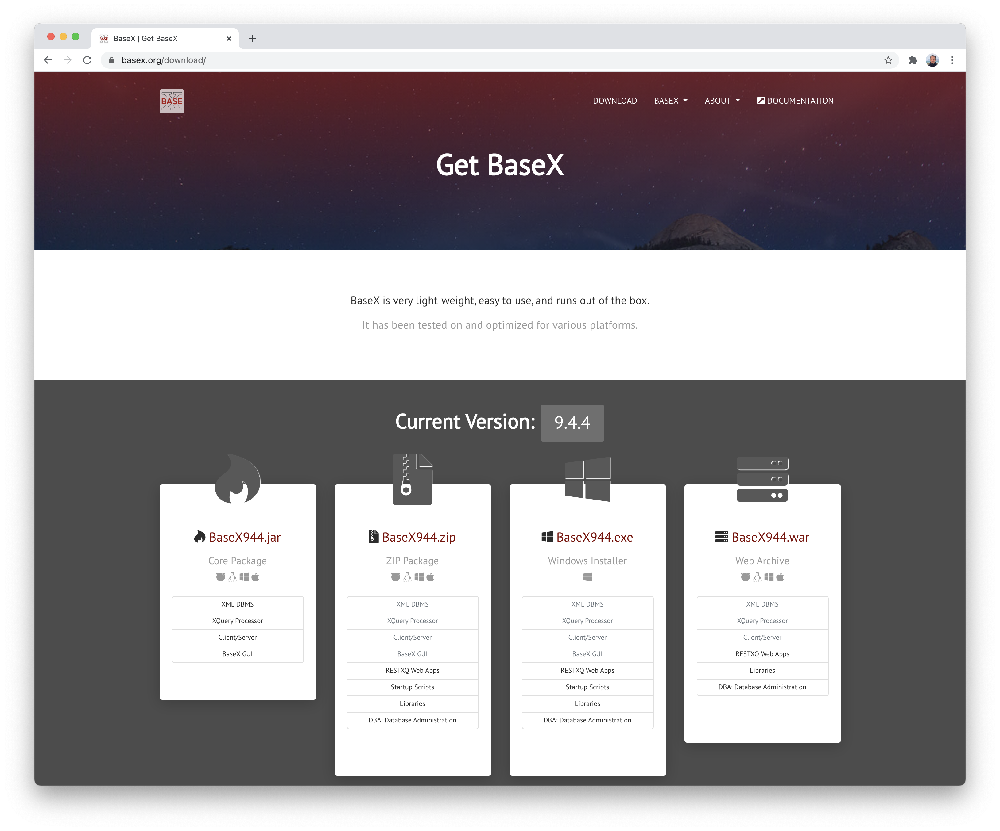

Am einfachsten erfolgt der Download von dort als `ZIP Package` beispielsweise in der Version 9.4.4:

```text
http://files.basex.org/releases/9.4.4/BaseX944.zip
```

Die heruntergeladene zip-Datei kann nun ausgepackt werden. Dort kann nun innerhalb des Verzeichnisses `bin` der Start der Datenbank mit dem Kommando `./basexhttp` erfolgen.

Aus einem Linux- oder Mac-Terminal würden alle diese Schritte folgendermaßen aufgerufen werden:

```bash
cd /opt/digiverso/
wget http://files.basex.org/releases/9.4.4/BaseX944.zip
unzip BaseX944.zip
cd basex/bin/
./basexhttp
```

Der Datenbankserver BaseX ist damit nun gestartet und kann über eine Webbrowser aufgerufen werden:

```text
http://localhost:8984/
```

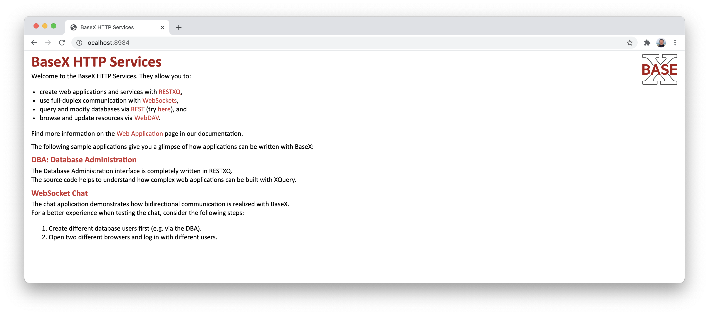

## Datenbank administrieren und EAD-Datei einspielen

Nachdem BaseX heruntergeladen und gestartet wurde, können XML-Dateien als neue Datenbanken eingespielt werden. Dazu wird zunächst der Menüpunkt `Database Administration` geöffnet, wo ein Login mit diesen Zugangsdaten erfolgen kann:

```text
Login:      admin
Passwort:   admin
```

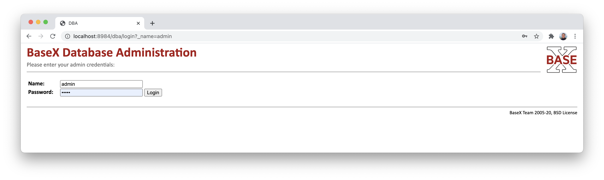

Nach dem erfolgreichen Login erhält man einen Überblick über die installierten Datenbank, Log-Dateien usw.

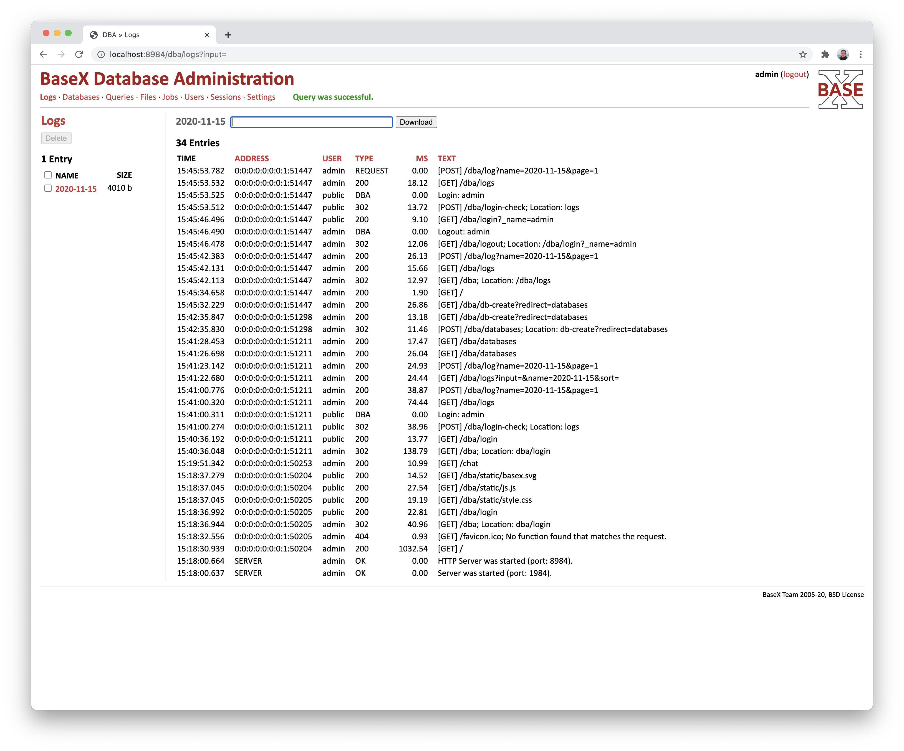

Von dort kann nun zum Menüpunkt `Databases` gegangen werden, um dann auf den Button `Create` zu klicken.

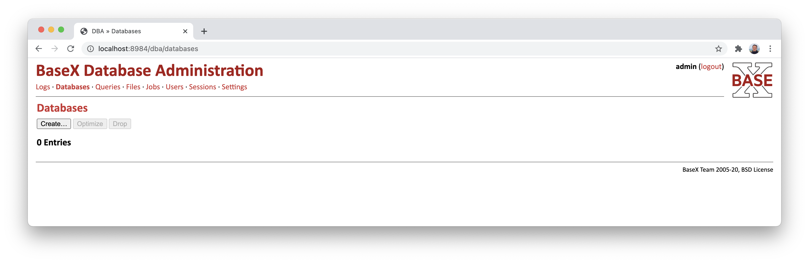

Dort kann nun ein `Name` für die neue Datenbank angegeben werden. Anschließend muss auf den Button `Create` geklickt werden.

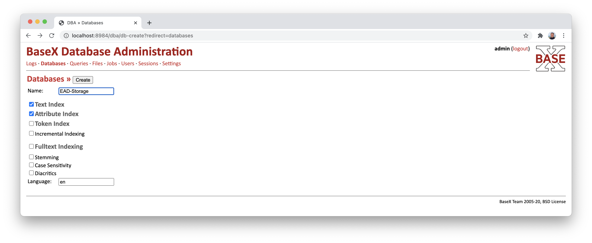

Nachdem die neue Datenbank erzeugt wurde, kann eine XML-Datei als Inhalt eingespielt werden. Klicken Sie hierzu auf den Button `Add`.

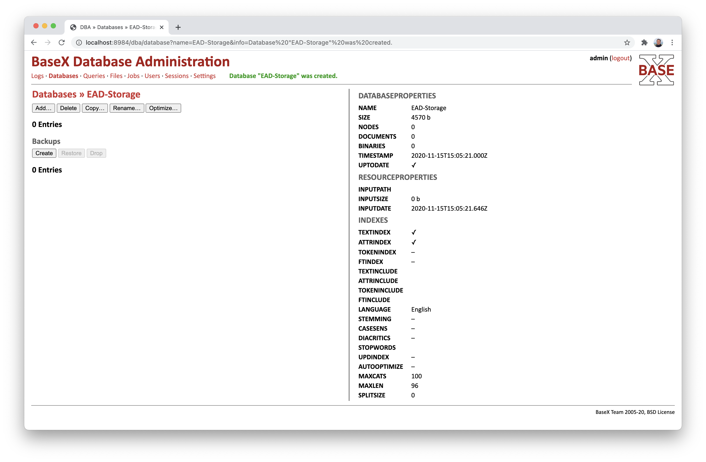

Hier kann nun eine EAD-Datei als XML-Datei ausgewählt und ein Pfad vergeben werden, unter der dieser Datenbestand erreichbar sein soll. Anschließend muss ein Klick auf den Button `Add` erfolgen.

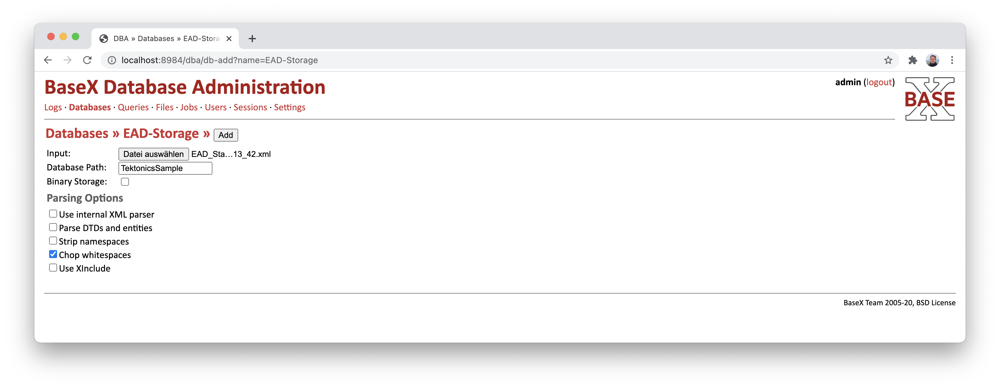

Nachdem Einspielen der EAD-Datei steht der Inhalt für das Archivmanagement-Plugin von Goobi bereits zur Verfügung.

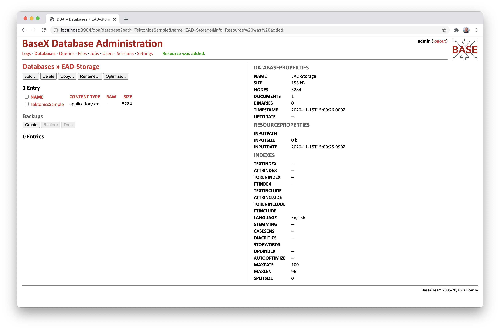

## Archivmanagement-Plugin für Goobi installieren

Nachdem der Datenbankserver gestartet und mit einem EAD-Bestand gefüllt wurde, kann das Archivmanagement-Plugin in Betrieb genommen werden. Dazu muss zunächst einmal das Archivmanagement-Plugin ausgecheckt werden.

```bash
git clone git@gitea.intranda.com:goobi-workflow/goobi-plugin-administration-archive-management.git
```

Aus dem ausgecheckten Projekt müssen nun die drei `*.xq` Dateien aus dem Verzeichnis `plugin/src/main/resources/` in den Unterordner `webapp` von BaseX kopiert werden.

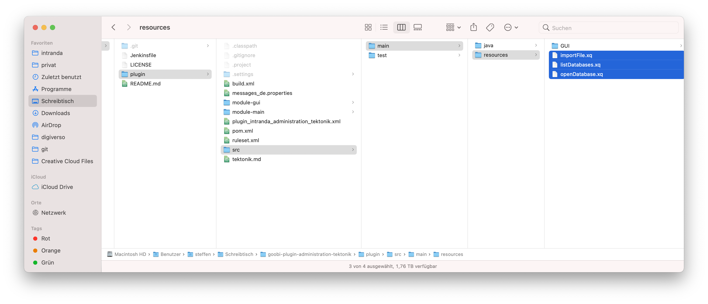

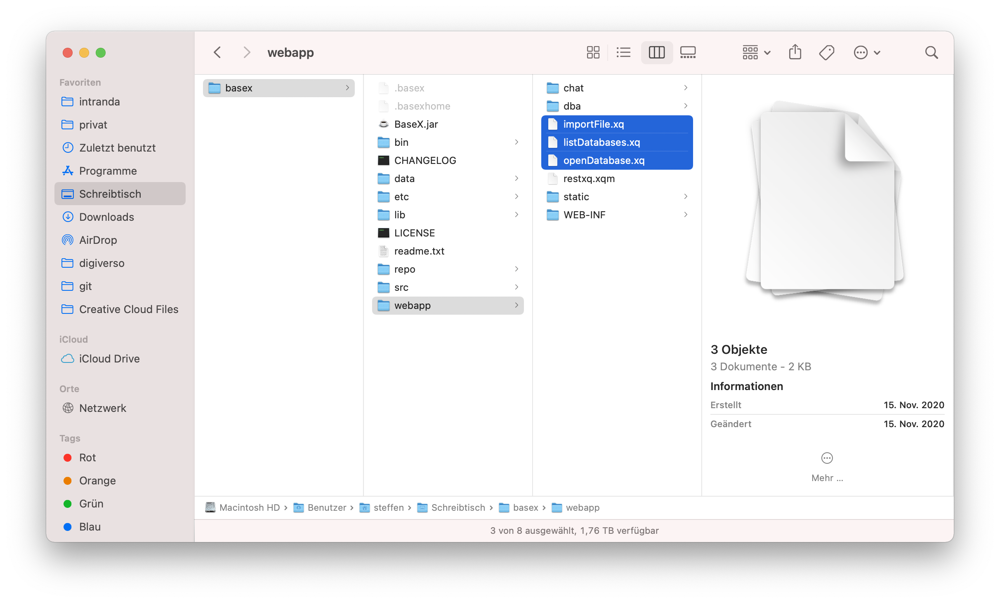

Anschließend kann das Plugin kompiliert werden:

```bash
cd goobi-plugin-administration-archive-management/plugin/
mvn package
```

Gegebenenfalls muss man vor dem Kompilieren des Plugins zunächst eine Anpassung an der Datei `plugin/module-gui/pom.xml` für die Nutzeroberfläche vornehmen und dort die folgenden beiden Zeilen auskommentieren:

```markup
  <exclude>META-INF/tags/**/*.xhtml</exclude>
  <exclude>META-INF/intranda.taglib.xml</exclude>
```

Nach dem Kompilieren des Plugins müssen die beiden Plugin-Dateien an die korrekte Stelle kopiert werden:

```bash
cp plugin/module-gui/target/plugin_intranda_administration_archive_management-GUI.jar /opt/digiverso/goobi/plugins/GUI
cp plugin/module-main/target/plugin_intranda_administration_archive_management.jar /opt/digiverso/goobi/plugins/administration
```

Außerdem kann die vorbereitete Konfigurationsdatei aus dem `test/resources`-Verzeichnis verwendet werden:

```bash
cp plugin/src/test/resources/plugin_intranda_administration_archive_management.xml /opt/digiverso/goobi/config
```

Je nachdem, wo die basex-Datenbank installiert wurde, müssen noch zwei Anpassungen für das Schreiben von EAD-Dateien im Dateisystem vorgenommen werden. Zunächst muss einmal ein Ordner erzeugt und mit entsprechenden Rechten versehen werden, damit darin EAD-Dateien gespeichert werden können. Dieser Ordner kann beispielsweise so lauten:

```bash
/opt/digiverso/basex/import/
```

Um auf dieses angegebene Verzeichnis zugreifen zu können, muss es natürlich auf dem System auch tatsächlich existieren und daher ggf. noch angelegt werden:

```bash
mkdir /opt/digiverso/basex/import
```

Dieses Verzeichnis muss nun innerhalb von zwei Konfigurationsdateien richtig konfiguriert werden. Zunächst einmal erfolgt die Anpassung in Konfigurationsdatei `plugin_intranda_administration_archive_management.xml` so, dass dort der Pfad definiert wird:

```markup
<eadExportFolder>/opt/digiverso/basex/import</eadExportFolder>
```

Außerdem muss auch die zuvor eingerichtete Datei `importFile.xq` so anpasst werden, dass darin folgende Zeile auf den richtigen Pfad verweist:

```bash
let $path := '/opt/digiverso/basex/import/' || $filename
```

## Archivmanagement-Plugin innerhalb von Goobi verwenden

Nach der erfolgreichen Installation des Plugins in Goobi, muss die entsprechende Nutzergruppe in Goobi noch mit den benötigen Rechten ausgestattet werden, um das Plugin auch verwenden zu dürfen. Hierzu müssen die Nutzer über das Recht `Plugin_Administration_Archive_Management` verfügen.

## Bearbeitung der xhtml-Dateien und der Taglib direkt aus dem Goobi Projekt in Eclipse

Für die Entwicklung direkt im Goobi-Projekt in Eclipse können die folgenden Anpassungen vorgenommen werden.

* Kopieren der Datei `plugin_administration_archive_management.xhtml` in den `uii`-Ordner
* Kopieren des Ordners `tags` und der Datei `intranda.taglib.xml` in den `WEB-INF`-Ordner
* Anpassung der Datei `web.xml` mit diesem Snippet:

```markup
<context-param>
   <param-name>javax.faces.FACELETS_LIBRARIES</param-name>
   <param-value>/WEB-INF/intranda.taglib.xml</param-value>
</context-param>
```