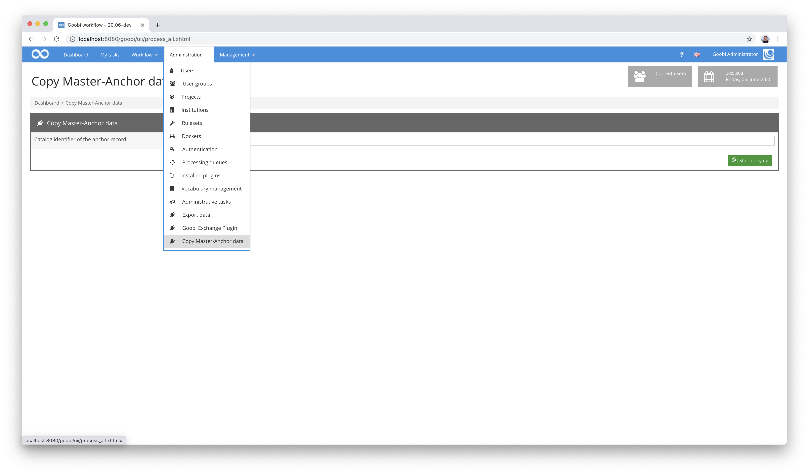
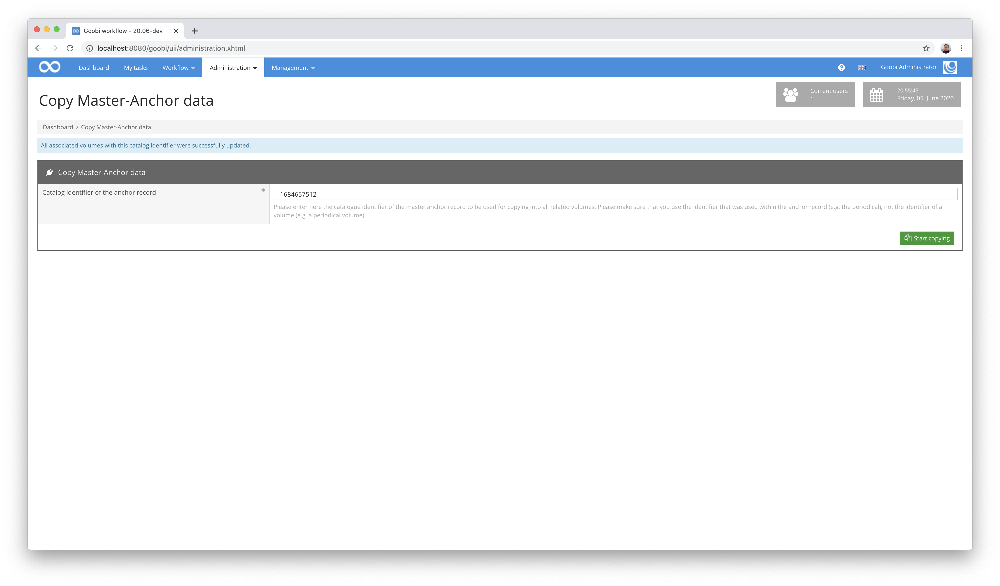

# Copy Master-Anchor

## Übersicht

Name                     | Wert
-------------------------|-----------
Identifier               | intranda_administration_copymasteranchor
Repository               | [https://github.com/intranda/goobi-plugin-administration-copyanchor](https://github.com/intranda/goobi-plugin-administration-copyanchor)
Lizenz              | GPL 2.0 oder neuer 
Letzte Änderung    | 20.07.2024 19:04:29


## Einführung
Die vorliegende Dokumentation beschreibt die Installation, die Konfiguration und den Einsatz des Administration Plugins für die automatisierte Übernahme einer zentralen Anchor-Datei eines Bandes (z.B. von Zeitschriften oder Mehrbändigen Werken) zu anderen Bänden innerhalb von Goobi workflow.


## Installation
Um das Plugin nutzen zu können, müssen folgende Dateien installiert werden:

```bash
/opt/digiverso/goobi/plugins/administration/plugin-administration-copyanchor-base.jar
/opt/digiverso/goobi/plugins/GUI/plugin-administration-copyanchor-gui.jar
```

Es existiert derzeit keine Konfigurationsdatei für dieses Plugin.


## Überblick und Funktionsweise
Wenn das Plugin korrekt installiert und konfiguriert wurde, ist es innerhalb des Menüpunkts `Administration` zu finden.


### Definition eines Master-Anchors
Nach der vollständigen Einrichtung des Plugins kann dieses verwendet werden. Dazu wird zunächst innerhalb desjenigen Bandes, der als Master-Anchor markiert werden soll, das neu definierte Metadatum `InternalNote` hinzugefügt und als Wert `AnchorMaster` eingetragen. Im folgenden Screenshot wird dies einmal verdeutlicht:


Der somit angepasste Zeitschriftenband wurde mit dieser Änderung als Master definiert. Von nun an dienen die dort verwendeten Metadaten des übergeordneten Werkes (z.B. der Zeitschrift) als Vorgabe für alle anderen zugehörigen Bände. Änderungen, die für alle Bände innerhalb der Anchor-Dateien vorgenommen werden sollen, erfolgen daher von nun an innerhalb dieses Datensatzes.


### Übernahme der Metadaten für alle zugehörigen Bände
Sowie innerhalb eines Goobi-Vorgangs ein Band als Master festgelegt wurde, kann das Plugin dazu genutzt werden, alle Metadaten des Masters auf alle zugehörigen Bände zu übertragen. Gehen Sie dazu folgendermaßen vor:

Öffnen Sie zunächst das Plugin mittels des Menüs `Administration` und darin des Menüpunktes `Kopieren von Master-Anchor Daten`.



Geben Sie in dem Inputfeld des Plugins den Katalog-Identifier des übergeordneten Werkes ein (z.B. die ID der Zeitschrift) und klicken sie anschließend auf den Butten `Kopiervorgang starten`. Hiermit wird der Kopiervorgang aufgerufen, der die Metadaten des Master-Anchor-Datensatzes automatisch in alle zugehörigen Bände (z.B. alle Bände der Zeitschrift) übernimmt.




## Konfiguration
Das Plugin verfügt nicht über eine eigene Konfigurationsdatei. Dennoch ist eine Anpassung des verwendeten Regelsatzes zwingende Voraussetzung für den Betrieb des Plugins. Beispielhaft soll dies an einem Regelsatz aufgezeigt werden, der sich beispielsweise unter folgendem Pfad findet:

```bash
/opt/digiverso/goobi/rulesets/ruleset.xml
```

Innerhalb des Regelsatzes muss das Metadatum `InternalNote` definiert werden:

```xml
<MetadataType>
  <Name>InternalNote</Name>
  <language name="de">Interne Goobi-Anmerkung</language>
  <language name="en">Internal Note for Goobi</language>
</MetadataType>
```

Dieses Metadatum muss nun innerhalb der Definition der Bände erlaubt werden. Anhand eines Zeitschriftenbandes erfolgt dies beispielhaft so:

```xml
<DocStrctType topStruct="true">
  <Name>PeriodicalVolume</Name>
  <language name="de">Zeitschriftenband</language>
  <language name="en">Periodical volume</language>
  <!-- Definitions of other metadata and structure elemtents skipped here -->
  <metadata num="*">InternalNote</metadata>
</DocStrctType>
```

Mittels dieser Anpassung am Regelsatz sind die Vorbereitungen für die Verwendung des Plugins bereits abgeschlossen.