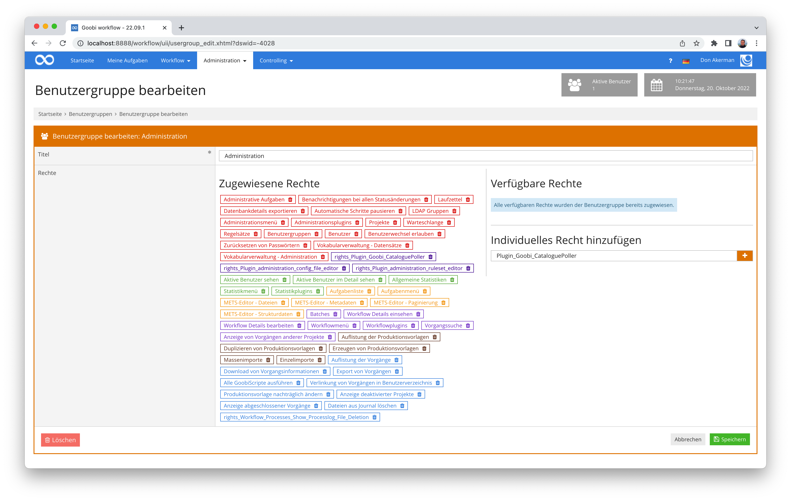
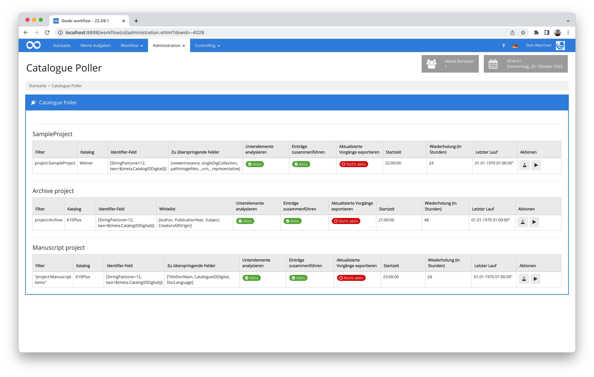
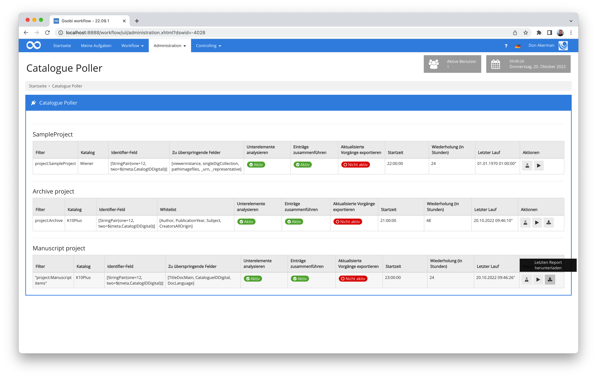
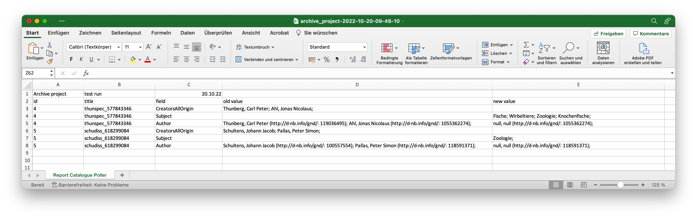
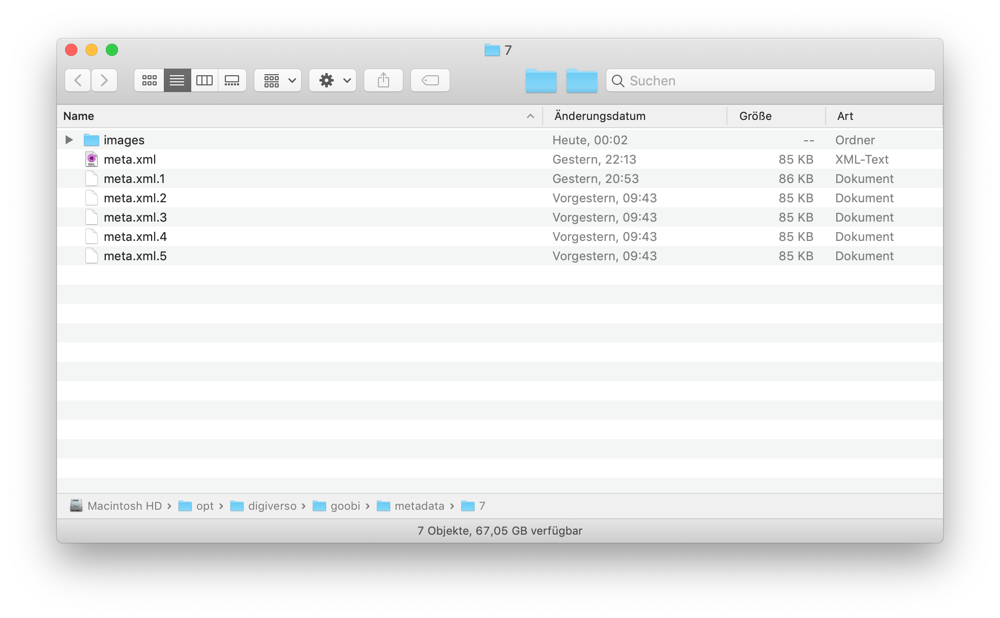
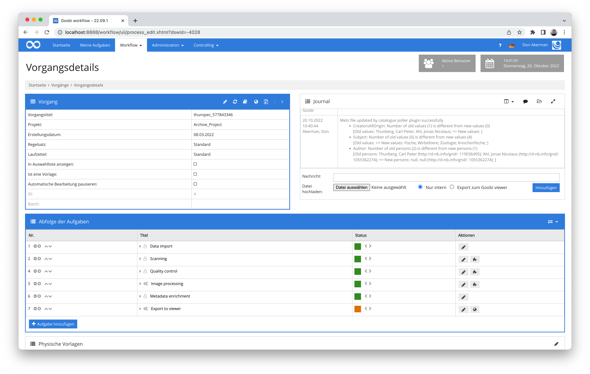

# Data Poller

## Übersicht

Name                     | Wert
-------------------------|-----------
Identifier               | intranda_administration_data_poller
Repository               | [https://github.com/intranda/goobi-plugin-administration-data-poller](https://github.com/intranda/goobi-plugin-administration-data-poller)
Lizenz              | GPL 2.0 oder neuer 
Letzte Änderung    | 07.10.2024 13:54:01


## Einführung
Die vorliegende Dokumentation beschreibt die Installation, die Konfiguration und den Einsatz des Administration-Plugins für die automatisiert wiederholte Abfrage von Daten (z.B. aus einem Katalog) zur Aktualisierung von Datensätzen in Goobi workflow.


## Installation
Das Plugin besteht insgesamt aus den folgenden zu installierenden Dateien

```bash
plugin-administration-data-poller-base.jar
plugin-administration-data-poller-gui.jar
plugin-administration-data-poller-job.jar
plugin-administration-data-poller-lib.jar
```

Diese Dateien müssen in den richtigen Verzeichnissen installiert werden, so dass diese nach der Installation in den folgenden Pfaden vorliegen:

```bash
/opt/digiverso/goobi/plugins/administration/plugin-administration-data-poller-base.jar
/opt/digiverso/goobi/plugins/GUI/plugin-administration-data-poller-gui.jar
/opt/digiverso/goobi/plugins/GUI/plugin-administration-data-poller-job.jar
/opt/digiverso/goobi/plugins/GUI/plugin-administration-data-poller-lib.jar
```

Daneben gibt es eine Konfigurationsdatei, die an folgender Stelle liegen muss:

```bash
/opt/digiverso/goobi/config/plugin_intranda_administration_data_poller.xml
```

## Überblick und Funktionsweise
Das Data Poller Plugin wird automatisch durch Goobi aktiviert. Seine Laufzeit beginnt zu der konfigurierten Startzeit und wiederholt sich entsprechend der konfigurierten Anzahl an Stunden, bspw. alle 24 Stunden, also einmal täglich.

Möchte ein Nutzer zusätzlich zu dieser Automatik ebenfalls Zugriff auf die Nutzeroberfläche des Plugins haben, so muss er einer Benutzergruppe angehören, die hierfür das folgende Plugin-spezifische Recht erhalten hat:

```text
Plugin_Goobi_DataPoller
```

Um dieses Recht zuzuweisen, muss der gewünschten Nutzergruppe zunächst die Berechtigung im rechten Bereich eingetragen werden.



Sollte die Berechtigung für die Benutzergruppe neu eingetragen werden, so muss sich der Nutzer zunächst einmal neu in Goobi einloggen, um diese Berechtigungsstufe verwenden zu können. Anschließend kann er im Menü `Administration` auf das Plugin `Data Poller` klicken und dort auch jederzeit eine Aktualisierung der Datensätze mittels Abfrage manuell neu anstoßen.








## Automatische Backups
Sollte das Plugin für einen Vorgang aktualisierte Metadaten finden und daher die METS-Datei aktualisieren, so wird zunächst automatisch ein Backup der aktuellen METS-Datei `meta.xml` und sofern relevant auch der `meta_anchor.xml` erzeugt. Das Backup wird neben der aktualisierten METS-Datei gespeichert.




## Logging innerhalb des Journals
Die Updates der Metadaten durch das Plugin finden üblicherweise vollautomatisch im Hintergrund statt. Um dennoch jederzeit für einen Datensatz nachvollziehen zu können, was mit diesem zwischenzeitlich passierte, werden die Ereignisse geloggt. Zu jedem Vorgang, für den es Änderungen aus diesem Plugin gab, werden daher automatisch detaillierte Einträge innerhalb des `Journals` eingefügt. Diese enthalten neben dem Zeitstempel unter anderem eine genaue Auflistung der geänderten Metadatenfelder samt der Inhalte. Somit ist es jederzeit möglich, auch den vorherigen bzw. den neuen Wert nachvollziehen zu können.




## Konfiguration
Die Konfiguration des Plugins erfolgt über die Konfigurationsdatei `plugin_intranda_administration_data_poller.xml` und kann im laufenden Betrieb angepasst werden. Im folgenden ist eine beispielhafte Konfigurationsdatei aufgeführt:

```xml
<?xml version="1.0" encoding="UTF-8"?>
<config_plugin>

	<!-- multiple different rules can be defined for individual use cases.
        you can specify a start time and a delay in hours. the rule will only be executed if
        enabled is true. A rule can be of type filter or hotfolder. If the type hotfolder is
        used you must specify the path inside a path element in the rule.
    -->
	<rule title="SampleProject" enabled="false" startTime="22:00:00" delay="24">

		<!-- filter which items to run through please notice that filters that contain blanks
        need to be surrounded by quotation marks -->
		<filter>project:SampleProject</filter>
		<!--
		<filter>"project:Manuscript items"</filter>
        <path>/opt/digiverso/goobi/import/</path>
        -->

		<!-- which catalogue to use (GBV, Wiener, CBL Adlib ...) -->
		<catalogue>Wiener</catalogue>
		
		<!-- which catalogue field to use and which identifier to use for the 
		catalogue request (use standard variable replacer compatible value here) -->
		<catalogueField fieldName="12" fieldValue="$(meta.CatalogIDDigital)" />

		<!-- define if existing structure subelements shall be kept (true),
        otherwise a complete new mets file is created and overwrites the
        existing one (false) -->
		<mergeRecords>true</mergeRecords>

		<!-- define if children shall be analysed as well. If a sub element contains an 
		identifier, the metadata will get imported as well -->
		<analyseSubElements>true</analyseSubElements>

		<!-- execute an automatic export of updated records;
        this is only executed if mergeRecords is set to true -->
		<exportUpdatedRecords>false</exportUpdatedRecords>

       <!-- fieldList: Must have a mode attribute which can contain either blacklist or whitelist as a value.
            blacklist: All fields are updated except the defined ones. This is a potential dangerous setting!
            whitelist: Only the definied fields are updated. All others are skipped. 
            field: Use the internal metadata names from the ruleset as field definition
        -->
         <fieldList mode="blacklist">
            <field>viewerinstance</field>
            <field>singleDigCollection</field>
            <field>pathimagefiles</field>
            <field>_urn</field>
            <field>_representative</field>
         </fieldList>
        
		<!-- alwaysExecuteStepList: specify steps that shall be performed after each run of the rule
            step: name of the step that shall be executed
         -->
        <alwaysExecuteStepList>
            <step>resize images</step>
       </alwaysExecuteStepList>

        <!-- internal timestamp for the plugin to know when the rule was last executed -->
        <lastRun>1551731078691</lastRun>

	</rule>

	<rule type="filter" title="Archive project" enabled="false" startTime="21:00:00" delay="48">
		<filter>project:Archive</filter>
		<catalogue>K10Plus</catalogue>
		<catalogueField fieldName="12" fieldValue="$(meta.CatalogIDDigital)" />
		<mergeRecords>true</mergeRecords>
		<analyseSubElements>true</analyseSubElements>
		<exportUpdatedRecords>false</exportUpdatedRecords>
        <fieldList mode="whitelist">
		  <field>Author</field>
		  <field>PublicationYear</field>
		  <field>Subject</field>
		  <field>CreatorsAllOrigin</field>
        </fieldList>
	</rule>

	<rule type="filter" title="Manuscript project" enabled="false" startTime="23:00:00" delay="24">
		<filter>"project:Manuscript items"</filter>
		<catalogue>K10Plus</catalogue>
		<catalogueField fieldName="12" fieldValue="$(meta.CatalogIDDigital)" />
		<mergeRecords>true</mergeRecords>
		<analyseSubElements>true</analyseSubElements>
		<exportUpdatedRecords>false</exportUpdatedRecords>
        <fieldList mode="blacklist">
		  <field>TitleDocMain</field>
		  <field>CatalogueIDDigital</field>
		  <field>DocLanguage</field>
        </fieldList>fieldList mode="blacklist">
	</rule>

</config_plugin>

```

### Attribute des rule Elementes

Attribut    | Erläuterung 
----------- | ------------ 
`type`      | Hier kann der Typ der `rule` bestimmt. Es kann zwischen `hotfolder` und `filter` gewählt werden. Je nach Typ müssen innerhalb der `rule` zusätzliche Parameter angegeben werden. Diese werden in den Unterabschnitten unter dieser Tabelle beschrieben.
`title`     | An dieser Stelle wird ein interner Name angegeben, der hauptsächlich für die Nutzeroberfläche zur Unterscheidung der unterschiedlichen Regeln dient
`startTime` | Mit diesem Parameter wird die Startzeit festgelegt, zu der das Plugin diese Regel ausführen soll.
`delay`     | Hiermit kann festgelegt werden, wie häufig das Plugin ausgeführt werden soll. Die Angabe erfolgt in Form von Stunden.
`enabled`   | Die Regel wird nur ausgeführt, wenn das Attribut `enabled` den Wert `true` annimmt.

### Unterelemente des rule Elementes

Element/Attribut       | Erläuterung
---------------------- | -------------
`catalogue`            | Hier kann definiert werden, welcher Katalog für die Abfrage von neuen Daten verwendet werden soll. Hierbei handelt es sich um die Bezeichnung eines Kataloges, wie er innerhalb der globalen Goobi-Katalogkonfiguration innerhalb von `goobi_opac.xml` definiert wurde. `catalogue` hat die Unterelemente `fieldName` und `fieldValue`. |
`fieldName`            | Ist ein Attribut des `catalogue`-Elementes und steuert, innerhalb welchen Feldes der Katalog abgefragt wird. Häufig ist dieser Wert `12`.
`fieldValue`           | Ist ein Attribut des `catalogue`-Elementes. Definition desjenigen Metadatums aus der METS-Datei, das für die Abfrage des Katalogs verwendet werden soll. Üblicherweise handelt es sich hierbei um denjenigen Identifier, der auch bei der erstmaligen Katalogabfrage verwendet wurde und der zumeist innerhalb der Metadatums `${meta.CatalogIDDigital}` gespeichert vorliegt.
`exportUpdatedRecords` | Wenn dieser Wert auf `true` gesetzt wird, so erfolgt im Anschluss an die Katalogabfrage für all diejenigen Datensätze ein erneuter Datenexport, die im Verlauf der Katalogabfrage auch tatsächlich aktualisiert wurden. Als Datenexport wird in diesem Fall derjenige Arbeitsschritt ausgeführt, der als erster `Export`-Arbeitsschritt innerhalb des Workflows für den Vorgang definiert wurde. Damit ist üblicherweise der Export und damit die Veröffentlichung des Vorgangs innerhalb der Goobi viewers gemeint. Zu beachten ist hierbei, dass die Vorgänge nur dann exportiert werden, wenn der Mechanismus für `mergeRecords` ebenfalls auf `true`gesetzt ist.
`mergeRecords`         | Wenn der Wert `true` gesetzt ist, wird die bestehende METS-Datei mit den aktuellen Daten aus dem Katalog aktualisiert. Eventuelle zusätzliche Metadaten können für die Aktualisierung ausgeschlossen werden. Auch bleibt der logische und physische Strukturbaum innerhalb der METS-Datei unverändert. Wenn der Wert auf `false` gesetzt wird, dann wird die bestehende METS-Datei vollständig durch eine neue METS-Datei ersetzt, die mittels der Katalogabfrage generiert wurde.
`analyseSubElements`   | Mit diesem Element lässt sich definieren, ob auch Metadaten für bereits innerhalb der METS-Dateien vorhandene Strukturelemente vom Katalog abgefragt werden sollen. Hierfür muss pro Unterelement das festgelegte Metadatum für den abzufragenden Identifier vorhanden sein. |
`fieldList`            | Hier stehen die Modi `blacklist` und `whitelist` zur Verfügung. Falls der Modus `whitelist` gewählt wird, können hier die Metadatenfelder definiert werden, die durch eine Katalogabfrage aktualisiert werden sollen. Falls der Modus `blacklist` verwendet wird, können mehrere Metadatenfelder definiert werden, die keinesfalls durch eine Katalogabfrage geändert werden sollen. Dies ist insbesondere für diejenigen Felder sinnvoll, die nicht aus einer Katalogabfrage kommen und daher zuvor zusätzlich zu den Katalogdaten erfasst wurden. Typische Beispiele für solche Felder sind unter anderem `singleDigCollection`, `accesscondition` und `pathimagefiles`. Bitte beachten Sie, dass dieser Parameter nur dann Anwendung findet, wenn der Wert für `mergeRecords` auf `true` steht.
`alwaysExecuteStepList` | Hier können die Titel der automatischen Schritte angegeben werden, die bei einem Durchlauf des Datapollers ausgeführt werden sollen. Die Titel befinden sich dabei in einem `step`-Element. Es können mehrere Schritte angegeben werden.


### zusätzliche Elemente/Parameter - rule type filter
Parameter | Erläuterung
--------- | ------------
`filter`  | Mittels des Filters können ein oder mehrere Goobi-Projekte definiert werden, für die die hier definierten Regeln gelten sollen. Mittels `*` gilt die Regel für sämtliche Projekte. Enthaltene Leerzeichen innerhalb des Filters müssen genau wie innerhalb der Goobi-Oberfläche mit Anführungszeichen umschlossen werden.


### Zusätzliche Elemente/Parameter - rule type hotfolder
Parameter                 | Erläuterung
------------------------- | -------------
`path`                    | Hier muss der Pfad des Hotfolders angegeben werden, in dem sich die zu importierenden Dateien befinden.
`createMissingProcesses`  | Wenn dieser Schalter aktiviert wird, werden für Dateien, die keinem vorhandenen Vorgang zugeordnet werden können, neue Vorgänge angelegt.
`workflow` | Hier kann angegeben werden, welche Vorlage für die neuen Vorgänge verwenden soll.
`fileHandling fileFilter` | Hier kann ein Regex-Filter spezifiziert werden, um die Dateinamen der Dateien im Hotfolder zu filtern. Ein einfacher Filter wäre z. B. `*\.xml`. Dieser Filter würde sicherstellen, dass nur XML-Dateien im Ordner verarbeitet werden.