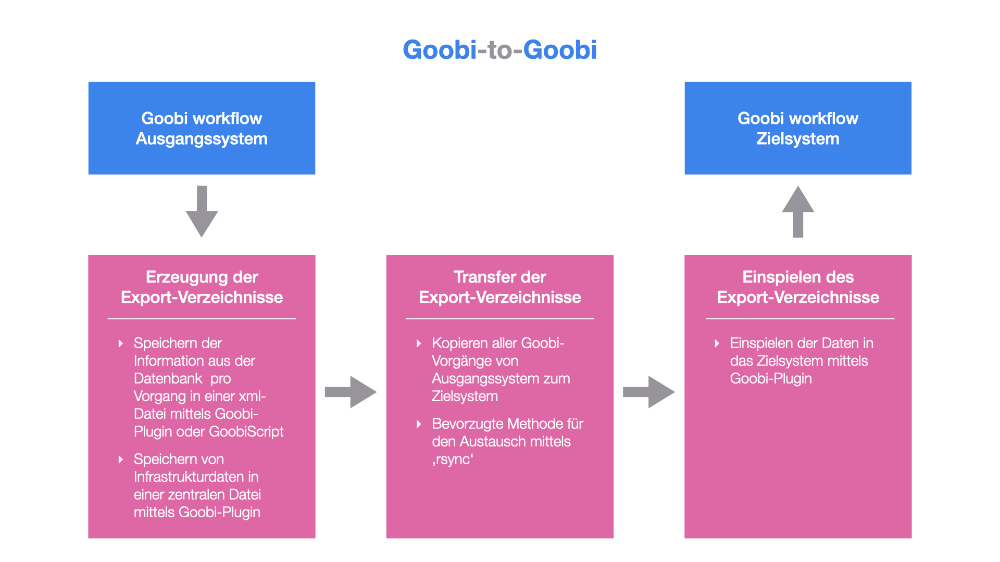

# Goobi-to-Goobi

## Übersicht

Name                     | Wert
-------------------------|-----------
Identifier               | intranda_administration_goobi2goobi_export intranda_administration_goobi2goobi_import_infrastructure intranda_administration_goobi2goobi_import_data
Repository               | [https://github.com/intranda/goobi-plugin-administration-goobi2goobi-import](https://github.com/intranda/goobi-plugin-administration-goobi2goobi-import)
Lizenz              | GPL 2.0 oder neuer 
Letzte Änderung    | 25.07.2024 11:11:13

## Einführung
Mit den beiden hier beschriebenen Plugins ist ein Datentransfer von einem Goobi workflow System zu einem anderem Goobi workflow System (`Goobi-to-Goobi`) möglich. Diese Dokumentation erläutert die Installation, Konfiguration sowie die Verwendung der zugehörigen Plugins.

## Installation und Konfiguration
Bevor die Verwendung des Export- und Import-Mechanismus erfolgen kann, müssen verschiedene Installations- und Konfigurationsschritte durchlaufen werden. Diese sind hier im Detail beschrieben:

[Installation](goobi-plugin-administration-goobi2goobi-import_page_01_00_de.md)

## Arbeitsweise
Der Mechanismus für einen Datentransfer von einem Goobi workflow System zu einem anderem Goobi workflow System (`Goobi-to-Goobi`) ist in drei große Arbeitsschritte aufgeteilt.

Diese drei Arbeitsschritte gestalten sich folgendermaßen:

### a) Erzeugung der Export-Verzeichnisse
Im ersten Arbeitsschritt erfolgt auf dem Ausgangssystem eine Anreicherung der Daten innerhalb des Dateisystems mit denjenigen Informationen, die Goobi intern in der Datenbank für jeden Vorgang gespeichert hat. Mit der Ausführung dieses Arbeitsschrittes wird somit in den Ordner eines jeden Goobi-Vorgangs eine zusätzliche xml-Datei geschrieben, die die Datenbankinformationen über den Workflow und einige weitere notwendigen Daten enthält.

[Erzeugung der Export-Verzeichnisse](goobi-plugin-administration-goobi2goobi-import_page_02_00_de.md)

### b) Transfer der Export-Verzeichnisse
Nach der vollständigen Erzeugung und Anreicherung der Export-Verzeichnisse auf dem Ausgangssystem können diese auf den Server des Zielsystems transferiert werden. Dies kann auf verschiedene Arten erfolgen. Aufgrund der Datenmengen hat sich hierfür vorrangig ein Transfer mittels `rsync` bewährt.

[Transfer der Export-Verzeichnisse](goobi-plugin-administration-goobi2goobi-import_page_03_00_de.md)

### c) Einspielen der Export-Verzeichnisse
Nachdem die Export-Verzeichnisse erfolgreich auf das Zielsystem transferiert wurden, können die Daten dort eingespielt werden. Hierzu müssen die Daten an der richtigen Stelle im System abgelegt werden und auch einige weitere Vorkehrungen hinsichtlich der Infrastruktur vorbereitet sein.

[Einspielen der Export-Verzeichnisse](goobi-plugin-administration-goobi2goobi-import_page_04_00_de.md)