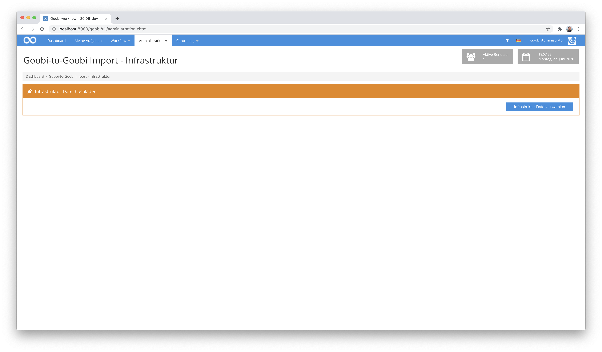
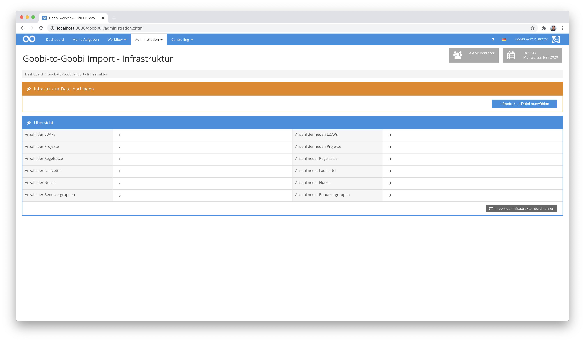
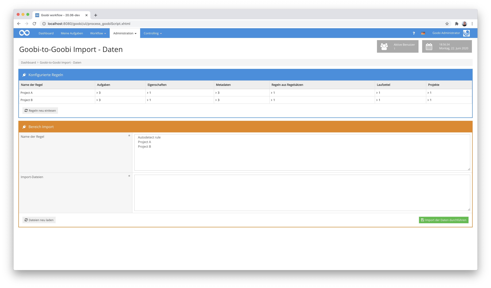
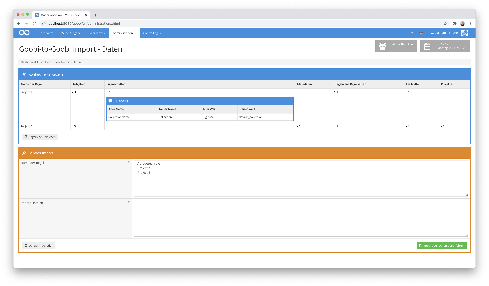

# Einspielen der Export-Verzeichnisse

## Übersicht

Name                     | Wert
-------------------------|-----------
Identifier               | intranda_administration_goobi2goobi_export intranda_administration_goobi2goobi_import_infrastructure intranda_administration_goobi2goobi_import_data
Repository               | [https://github.com/intranda/goobi-plugin-administration-goobi2goobi-import](https://github.com/intranda/goobi-plugin-administration-goobi2goobi-import)
Lizenz              | GPL 2.0 oder neuer 
Letzte Änderung    | 25.07.2024 11:11:13

Der Import von Daten auf dem Zielsystem findet mittels zweier verschiedener Plugins statt. Diese müssen zunächst installiert und entsprechend konfiguriert werden. Mehr Informationen über deren Installation und Konfiguration finden sich hier:

[Installation](page_01_00_de.md)

Nach der erfolgreichen Installation, kann mit dem eigentlichen Import fortgefahren werden. Hierbei ist zu unterscheiden zwischen dem reinen Import von Vorgängen und dem Import einer exportierten Infrastruktur. Je nach Projekt kann dabei der Import der Infrastruktur als erster Arbeitsschritt erforderlich zu sein.

## 1. Importieren der Infrastruktur

Im Bereich für den Import der Infrastruktur kann die zuvor exportierte Infrastruktur des Ausgangssystems eingespielt werden. Öffnen Sie hierfür zunächst das Plugin `Goobi-to-Goobi Import - Infrastruktur` im Menü `Administration`.

An dieser Stelle läßt sich nun eine zip-Datei hochladen, die zuvor auf dem Ausgangssystem erzeugt wurde. Nach dem erfolgreichen Upload wird die Datei auf dem Server entpackt und analysiert. Der Nutzer erhält anschließend eine Zusammenfassung über die zu importierenden Daten.

Wenn bereits Nutzer, Projekte, Gruppen etc. im Zielsystem existieren, die den gleichen Namen wie die zu importierenden Daten besitzen, zählen sie nicht zu den neu zu importierenden Daten und können nicht überschrieben werden. Nach der Auswahl der importierenden Daten kann der Import mit einem Klick auf `Import der Infrastruktur durchführen` gestartet werden.

Sollte es gewünscht sein, kann während des Imports eine Manipulation der Daten erfolgen. Dies ist durch eine Anpassung der Konfigurationsdatei `plugin_intranda_administration_goobi2goobi_import_infrastructure.xml` möglich. Genaueres hierzu findet sich im Bereich `Konfiguration für den Import der Infrastruktur` hier:

[Installation](page_01_00_de.md)

## 2. Importieren von Vorgängen

Um die Vorgänge von dem Ausgangssystem importieren zu können, müssen diese zunächst erfolgreich exportiert und auf das Zielsystem transferiert worden sein. Wie der Transfer der zum Teil sehr großen Datenmengen erfolgen kann ist hier beschrieben:

[Transfer der Export-Verzeichnisse](page_03_00_de.md)

Nach dem vollständigen Transfer der Daten zum Zielsystem können Sie den Import der Daten starten. Dazu öffnen Sie im Menü `Administration` das Plugin `Goobi-to-Goobi Import - Daten`. Dort werden im oberen Bereich der Nutzeroberfläche die konfigurierten Regeln für den Import angezeigt. Werden diese Regeln auf dem Zielsystem bearbeitet, so können Sie jederzeit durch einen Klick auf den Button `Regeln neu einlesen` neu geladen werden.

Im unteren Bereich der Nutzeroberfläche findet der eigentliche Import statt. Dort kann der Nutzer als erstes durch einen Klick auf `Dateien neu einlesen` nach den zu importierenden Daten suchen. Wenn diese Suche aufgrund der großen Datenmenge länger als 10 Sekunden dauert, findet die weitere Suche im Hintergrund statt und der Nutzer bekommt die Rückmeldung, dass er die Seite bitte nach einiger Zeit noch einmal aktualisieren soll.

Wenn nach der Suche der zu importierenden Daten erfolgreich Dateien aufgelistet werden, können diese nun ausgewählt werden. Dazu können sie entweder einzeln markiert werden, oder man lässt Goobi durch einen Klick auf `Select all` alle auswählen. Dazu muss die Regel ausgewählt werden, die für den Import angewendet werden soll. Diese lässt sich entweder direkt auswählen oder kann mittels `Autodetect rule` ermittelt werden. In diesem Fall wird geprüft, ob es eine Regel gibt, die dem Namen des Projektes entspricht, dem der Vorgang zugeordnet wurde.

Ein Klick auf den Button `Import der Daten durchführen` startet anschließend den eigentlichen Import. Während dieses Imports wird für jeden ausgewählten Vorgang ein internes Goobi-Ticket erstellt und an die interne Warteschlange (Message Queue) übermittelt. Die einzelnen Tickets werden im Hintergrund abgearbeitet und die Vorgänge so sukzessive importiert.

Eine genaue Konfiguration des Imports sowie der zugrundeliegenden Regeln kann innerhalb der Konfigurationsdatei `plugin_intranda_administration_goobi2goobi_import_data.xml` erfolgen. Weitere Informationen über diese Konfiguration findet sich im im Abschnitt `Konfiguration für den Import der Daten`:

[Installation](page_01_00_de.md)