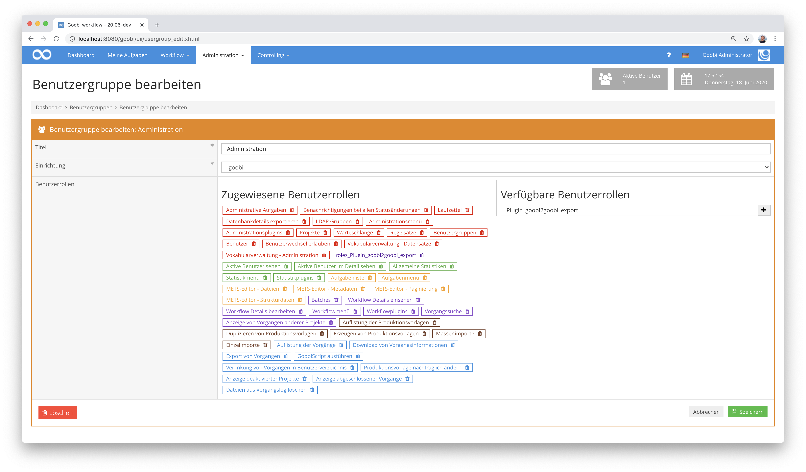

# Installation und Konfiguration

## Übersicht

Name                     | Wert
-------------------------|-----------
Identifier               | intranda_administration_goobi2goobi_export intranda_administration_goobi2goobi_import_infrastructure intranda_administration_goobi2goobi_import_data
Repository               | [https://github.com/intranda/goobi-plugin-administration-goobi2goobi-import](https://github.com/intranda/goobi-plugin-administration-goobi2goobi-import)
Lizenz              | GPL 2.0 oder neuer 
Letzte Änderung    | 25.07.2024 11:11:13


Für die Inbetriebnahme des Goobi-to-Goobi-Mechanismus müssen sowohl auf dem Ausgangssystem als auch auf dem Zielsystem verschiedene Plugins installiert und Konfigurationen vorgenommen werden. Diese werden hier detailliert beschrieben.

## 1. Ausgangssystem

Zunächst einmal muss das Ausgangssystem für den Export vorbereitet werden. Hierzu gehört zunächst einmal die Installation des korrekten Plugins. Im Anschluss daran, muss lediglich eine Berechtigung für die entsprechenden Nutzer konfiguriert werden, um den Export zu erlauben.

### 1.1. Installation

Auf dem Ausgangssystem muss zunächst das Plugin `plugin_intranda_administration_goobi2goobi_export` für die Erzeugung der Export-Verzeichnisse installiert werden. Dazu müssen die folgenden beiden Dateien an die entsprechenden Pfade kopiert werden:

```bash
/opt/digiverso/goobi/plugins/administration/plugin_intranda_administration_goobi2goobi_export.jar
/opt/digiverso/goobi/plugins/GUI/plugin_intranda_administration_goobi2goobi_export-GUI.jar
```

Zu beachten ist hierbei, dass diese Dateien für den Nutzer `tomcat` lesbar sein müssen.

### 1.2. Konfiguration

Um dem Nutzer zu ermöglichen, dass dieser einen Export der Daten durchführen kann, muss dieser über die folgenden Rollen verfügen:

```text
Datenbankdetails exportieren
Plugin_goobi2goobi_export
```

Diese Rollen können innerhalb der Benutzergruppen von Goobi workflow konfiguriert werden. Wählen Sie dazu einfach die Rollen auf der rechten Seite aus oder tragen diese in das Eingabefeld und Klicken anschließend auf das Plus-Icon.



Mit dieser Konfiguration ist die Vorbereitung auf Seiten des Ausgangssystem bereits abgeschlossen.

## 2. Zielsystem

Auch das Zielsystem muss für den Import vorbereitet werden. Nach der Installation des entsprechenden Plugins und der zugehörigen Konfigurationsdateien, müssen noch einige Konfigurationen geprüft bzw. vorgenommen werden.

### 2.1. Installation

Auf dem Zielsystem muss zunächst das Plugin `plugin_intranda_administration_goobi2goobi_import` für die Einspielen der Export-Verzeichnisse installiert werden. Dazu müssen die folgenden beiden Dateien an die entsprechenden Pfade kopiert werden:

```bash
/opt/digiverso/goobi/plugins/administration/plugin_intranda_administration_goobi2goobi_import.jar
/opt/digiverso/goobi/plugins/GUI/plugin_intranda_administration_goobi2goobi_import-GUI.jar
```

Nach der Installation des eigentlichen Plugins müssen ebenfalls die zugehörigen Konfigurationsdateien installiert werden. Diese befinden sich unter folgenden Pfaden:

```bash
/opt/digiverso/goobi/config/plugin_intranda_administration_goobi2goobi_import_data.xml
/opt/digiverso/goobi/config/plugin_intranda_administration_goobi2goobi_import_infrastructure.xml
```

Auch hier ist wieder zu beachten, dass die installierten Dateien alle für den Nutzer `tomcat` lesbar sein müssen.

### 2.2. Allgemeine Konfiguration

Um einem Nutzer die Durchführung des Imports zu ermöglichen, muss dieser über die folgende Rolle verfügen:

```text
Plugin_goobi2goobi_import
```

Diese Rolle kann innerhalb der Benutzergruppen von Goobi workflow konfiguriert werden, indem sie auf der rechten Seite in das Eingabefeld eingetragen und mittels Klick auf das Plus-Icon übernommen wird.


### 2.3. Konfiguration für den Import der Infrastruktur

Um während des Imports der Infrastruktr Einfluss auf die zu importierenden Daten zu nehmen, kann eine Anpassung der Konfigurationsdatei `plugin_intranda_administration_goobi2goobi_import_infrastructure.xml` erfolgen. Diese Konfiguration kann beispielhaft wie folgt aussehen:

```xml
<config_plugin>
    <config>
        <project name="intranda test project">
            <newProjectName>new project name</newProjectName>
            <!-- filegroups -->
            <filegroup name="SDB">
                <newFilegroupName>OBJECTS</newFilegroupName>
                <path>file:///opt/digiverso/viewer/media/$(meta.CatalogIDDigital)/</path>
                <mimeType>image/jp2</mimeType>
                <fileSuffix>jp2</fileSuffix>
                <folderValidation></folderValidation>
            </filegroup>
            <fileFormatInternal>Mets</fileFormatInternal>
            <fileFormatDmsExport>Mets</fileFormatDmsExport>
            <exportConfiguration useDmsImport="true" dmsImportCreateProcessFolder="false" dmsImportTimeOut="0" dmsImportRootPath="/opt/digiverso/viewer/hotfolder" dmsImportImagesPath="/opt/digiverso/viewer/hotfolder" dmsImportSuccessPath="/opt/digiverso/viewer/success" dmsImportErrorPath="/opt/digiverso/viewer/error" />
            <metsConfiguration metsRightsOwnerLogo="" metsRightsOwnerSite="" metsRightsOwnerMail="" metsDigiprovReference="" metsDigiprovPresentation="" metsDigiprovReferenceAnchor="" metsPointerPath="" metsPointerPathAnchor="" metsPurl="" metsContentIDs="" metsRightsSponsor="" metsRightsSponsorLogo="" metsRightsSponsorSiteURL="" metsRightsLicense="" />
        </project>

        <docket name="example docket">
            <newDocketName>first docket</newDocketName>
            <newFileName>docket.xsl</newFileName>
        </docket>

        <ruleset name="example ruleset">
            <newRulesetName>default ruleset</newRulesetName>
            <newFileName>ruleset.xml</newFileName>
        <ruleset>

        <ldap name="default ldap">
            <newLdapName>default ldap</newLdapName>
            <ldapConfiguration homeDirectory="" gidNumber="" dn="" objectClass="" sambaSID="" sn="" uid="" description="" displayName="" gecos="" loginShell="" sambaAcctFlags="" sambaLogonScript="" sambaPrimaryGroupSID="" sambaPwdMustChange="" sambaPasswordHistory="" sambaLogonHours="" sambaKickoffTime="" />
        </ldap>

        <usergroup name="Administration">
            <newUsergroupName>Admin</newUsergroupName>
            <addRole>administration_import_data</addRole>
            <removeRole>administration_export_data</removeRole>
            <addUser>johndoe</addUser>
            <removeUser>testadmin</removeUser>
        </usergroup>

        <user name="testadmin">
            <addAssignedProject>test project</addAssignedProject>
            <removeAssignedProject>example project</removeAssignedProject>
            <configuration place="" ldapgroup="" tablesize="" shortcut="" displayDeactivatedProjects="" displayFinishedProcesses="" displaySelectBoxes="" displayIdColumn="" displayBatchColumn="" displayProcessDateColumn="" displayLocksColumn="" displaySwappingColumn="" displayModulesColumn="" displayMetadataColumn="" displayThumbColumn="" displayGridView="" displayAutomaticTasks="" hideCorrectionTasks="" displayOnlySelectedTasks="" displayOnlyOpenTasks="" displayOtherTasks="" metsDisplayTitle="" metsLinkImage="" metsDisplayPageAssignments="" metsDisplayHierarchy="" metsDisplayProcessID="" customColumns="" customCss=""/>
        </user>
    </config>
</config_plugin>
```

In der dieser Konfigurationsdatei sind sämtliche Felder optional. Fehlt ein Feld, wird dessen Wert während der Konfiguration nicht überschrieben. Ist das Feld hingegen leer, wird es ebenfalls leer importiert, ansonsten wird es mit dem Wert aus dieser Konfigurationsdatei überschrieben. Die Felder zum Hinzufügen oder Entfernen sind grundsätzlich wiederholbar.

### 2.4. Konfiguration für den Import der Daten

Für den Import der Daten auf dem Zielsystem kann in der Konfigurationsdatei `plugin_intranda_administration_goobi2goobi_import_infrastructure.xml` festgelegt werden, wo sich Daten befinden und wie diese während des Imports verarbeitet werden sollen. Diese Konfiguration kann beispielhaft wie folgt aussehen:

```xml
<?xml version="1.0"?>
<config_plugin>
    <globalConfig>
        <dbExportPrefix>import/</dbExportPrefix>
        <importPath>/opt/digiverso/goobi/metadata/</importPath>
        <bucket>example-workflow-data</bucket>
        <createNewProcessIds>true</createNewProcessIds>
        <temporaryImportFolder>/opt/digiverso/transfer/</temporaryImportFolder>
    </globalConfig>
    <config>
        <rulename>Project A</rulename>
        <rulename>Project B</rulename>
        <step name="Example to delete" type="delete" />
        <step name="Example to change" type="change">
            <newStepName>New step name</newStepName>
            <priority>5</priority>
            <order>3</order>
            <useHomeDirectory>0</useHomeDirectory>
            <stepStatus>0</stepStatus>
            <types metadata="true" automatic="false" readImages="false" writeImages="false" export="false" validateOnExit="true" finalizeOnAccept="false" delayStep="false" updateMetadataIndex="false" generateDocket="false" batchStep="false" stepPlugin="" validationPlugin="" />
            <scriptStep scriptStep="true" scriptName1="script 1" scriptPath1="/bin/bash ..." scriptName2="" scriptPath2="" scriptName3="" scriptPath3="" scriptName4="" scriptPath4="" scriptName5="" scriptPath5="" />
            <httpStep httpStep="true" httpMethod="POST" httpUrl="http://itm.example.com/itm/service" httpJsonBody="{ .... } " httpCloseStep="false" />
            <usergroup>Administration</usergroup>
            <usergroup>AutomaticTasks</usergroup>
        </step>
        <step name="Example to change" type="insertAfter" >
            <newStepName>Export task</newStepName>
            <order>120</order>
            <stepStatus>0</stepStatus>
            <types automatic="true" export="true" stepPlugin="special_export_plugin" />
            <usergroup>AutomaticTasks</usergroup>
        </step>
        <docket name="Default docket">
            <newDocketName>docket</newDocketName>
            <newFileName>docket.xsl</newFileName>
        </docket>
        <project name="Project A">
            <newProjectName>Project B</newProjectName>
        </project>
        <property name="CollectionName">
            <oldPropertyValue>Digitised</oldPropertyValue>
            <newPropertyName>Collection</newPropertyName>
            <newPropertyValue>default_collection</newPropertyValue>
        </property>
        <ruleset name="Default">
            <newRulesetName>default ruleset</newRulesetName>
            <newFileName>ruleset.xml</newFileName>
        </ruleset>
        <metadata name="CatalogIDDigital" type="change">
            <valueConditionRegex>/b\d+(?:_\d+)?/</valueConditionRegex>
            <valueReplacementRegex>s/^(.+)$/IMPORT_$1/g</valueReplacementRegex>
            <position>all</position>
        </metadata>
        <metadata name="PhysicalLocation" type="delete">
            <position>top</position>
        </metadata>
        <metadata name="Testmetatda" type="add">
            <valueReplacementRegex>example text</valueReplacementRegex>
            <position>top</position>
        </metadata>
        <skipProcesslog>true</skipProcesslog>
        <skipUserImport>true</skipUserImport>
    </config>
</config_plugin>
```

Im oberen Bereich der Datei werden einige generelle Einstellungen vorgenommen, die für alle Importe gelten. Im Anschluss an diese allgemeinen Einstellungen folgen die einzelnen konfigurierten Regeln.

#### Allgemeine Einstellungen: globalConfig

| Element | Beispiel | Bedeutung |
| :--- | :--- | :--- |
| `dbExportPrefix` | `import/` | Diese Angabe wird benötigt, wenn die zu importierenden Datenbankinformationen nicht als xml-Dateien im jeweiligen Vorgangsordner liegen. Die Angabe enthält den Pfad zu den Datenbankinformationen innerhalb eines s3-Buckets und wird bei Importen in ein lokales Dateisystem nicht benötigt. |
| `importPath` | `/opt/digiverso/goobi/metadata/` | Zielverzeichnis, in das die Daten importiert werden sollen. |
| `bucket` | `example-workflow-data` | Name des s3-Buckets, in dem die zu importierenden Daten liegen. Dieser Wert wird bei Importen in ein lokales Dateisystem nicht benötigt. |
| `createNewProcessIds` | `false` | Dieser Parameter definiert, ob die Vorgangs-Identifier aus dem alten System erneut genutzt werden sollen, oder ob neue IDs erzeugt werden sollen. |
| `temporaryImportFolder` | `/opt/digiverso/transfer/` | Mit diesem Parameter wird der Pfad zu dem Ordner angegeben, in dem die zu importierenden Daten liegen. Der Wert muss nur konfiguriert werden, wenn er sich vom Wert innerhalb von `importPath` unterscheidet. |

Die einzelnen Regeln für die Importdurchführungen werden innerhalb des `<config>` Elements definiert werden. Der Name der Regel wird in `<rulename>` festgelegt. Wenn während des Imports keine Regel explizit ausgewählt wurde, wird diese über den Projektnamen des Vorgangs ermittelt. Das Feld ist wiederholbar, so dass mehrere identische Regeln erzeugt werden können, wenn zum Beispiel ein gleicher Workflow in verschiedenen Projekten genutzt wird.

### Arbeitsschritte innerhalb der Workflows: step

Mittels `<step>` lassen sich einzelne Schritte des Vorgangs manipulieren. Alle Felder sind optional. Wenn sie nicht angegeben wurden, wird der originale Wert genutzt. Andernfalls wird das Feld mit dem konfigurierten Feldinhalt überschrieben. Wenn das Feld vom Typ String ist, kann es auch leer angegeben werden, um es zu leeren.

| Element | Beispiel | Bedeutung |
| :--- | :--- | :--- |
| `@name` | `Example task` | Enthält den Namen des zu ändernden Schrittes. |
| `@type` | `delete` | Dieser Wert enthält den Typ der Manipulation. Als Werte sind `delete`, `change`, `insertBefore`, `insertAfter` möglich. |
| `newStepName` | `new step name` | Neuer Name des Schrittes. |
| `priority` | `5` | Neue Priorität des Schrittes. |
| `order` | `10` | Reihenfolge des Schrittes. |
| `useHomeDirectory` | `0` | Steuert, ob in das Homeverzeichnis des Nutzers verlinkt werden soll. |
| `stepStatus` | `0` | Setzt den Schrittstatus. Erlaubte Werte sind `0` (locked), `1` (open), `2` (inwork), `3` (done), `4` (error) und `5` (deactivated). |
| `types` | `automatic="true"` | Enthält in Attributen die verschiedenen Einstellungen eines Schrittes. |
| `scriptStep` | `scriptStep="true" scriptName1="script 1" scriptPath1="/bin/true"` | Definiert Skripte für die Arbeitsschritte. |
| `httpStep` | `httpStep="true" httpMethod="POST" httpUrl="http://itm.example.com/itm/service"` | Definiert die Konfiguration des HTTP Aufrufs für den Schritt. |
| `usergroup` | `Administration` | Name der zugewiesenen Benutzergruppe. Dieser Wert ist wiederholbar, um mehrere Nutzergruppen zu definieren. |

### Laufzettel: docket

In diesem Element kann der zugewiesene Laufzettel ersetzt werden. Die zu nutzende xsl-Datei muss auf dem Server existieren. Wenn bereits ein Docket mit den neuen Angaben definiert wurde, wird dieses verwendet, andernfalls wird ein neues Docket definiert und in der Datenbank gespeichert.

| Element | Beispiel | Bedeutung |
| :--- | :--- | :--- |
| `@name` | `Default docket` | Name des bisher verwendeten Laufzettels. Die Änderung findet nur statt, wenn der Vorgang bisher einen Laufzettel mit diesem Namen verwendet hat. |
| `newDocketName` | `docket` | Neuer Name des Laufzettels. |
| `newFileName` | `docket.xsl` | Neuer Dateiname für den Laufzettel. |

### Projekt: project

Mit dieser Regel kann das zugewiesene Projekt geändert werden. Das Projekt muss bereits existieren. Änderungen an den Projekten selbst können über `Infrastruktur importieren` vorgenommen werden.

| Element | Beispiel | Bedeutung |
| :--- | :--- | :--- |
| `@name` | `Project A` | Altes Projekt |
| `newProjectName` | `Project B` | Neues Projekt |

### Eigenschaften: property

Diese Regel dient zur Manipulation von Vorgangseigenschaften.

| Element | Beispiel | Bedeutung |
| :--- | :--- | :--- |
| `@name` | `CollectionName` | Name der anzupassenden Eigenschaft. |
| `oldPropertyValue` | `Digitised` | Wert der anzupassenden Eigenschaft. Wenn ein Wert angegeben wird, muss die Eigenschaft diesen Wert enthalten. |
| `newPropertyName` | `Collection` | Neuer Name der Eigenschaft. Optional. |
| `newPropertyValue` | `default collection` | Neuer Wert der Eigenschaft. Optional. |

### Regelsatz: ruleset

Mit dieser Regel kann der zugewiesene Regelsatz geändert werden. Falls der Regelsatz noch nicht existiert, wird er neu angelegt und in der Datenbank gespeichert. Die xml-Datei des Regelsatzes selbst muss auf dem Server existieren.

| Element | Beispiel | Bedeutung |
| :--- | :--- | :--- |
| `@name` | `Default` | Name des bisher verwendeten Regelsatzes. |
| `newRulesetName` | `default ruleset` | Neuer Name für den Regelsatz. |
| `newFileName` | `ruleset.xml` | Neuer Dateiname für den Regelsatz. Dieser muss auf dem Zielsystem existieren. |

### Metadaten: metadata

Mit dieser Regel können die Metadaten verändert werden. Dabei können Werte von vorhandenen Metadaten geändert, neue hinzugefügt oder existierende Metadaten gelöscht werden.

| Element | Beispiel | Bedeutung |
| :--- | :--- | :--- |
| `@name` | `CatalogIDDigital` | Interner Name des Metadatums. |
| `@type` | `change` | Art der Änderung. Erlaubte Werte sind `add`, `change` und `delete`. |
| `position` | `top` | Beschreibt die Stelle, an der die Änderung durchgeführt werden soll. Erlaubte Werte sind `all`, `anchor`, `top` und `physical`. |
| `valueConditionRegex` | `/PPN\d+\w?(?:_\d+)?/` | Dieser reguläre Ausdruck prüft, ob der bisherige Feldinhalt einem definierten Wert entspricht. Bei dieser Angabe kann es sich um einen festen Wert oder einen regulären Ausdruck handeln. |
| `valueReplacementRegex` | `s/^PPN(.+)$/$1/g` | Wurde als `@type` der Wert `change` verwendet, enthält dieser Parameter einen regulären Ausdruck für die Manipulation des bisherigen Metadatums. Wurde als `@type` hingegen `add` gewählt, wird der Feldinhalt als Wert des Metadatums verwendet. |

### Weitere Konfigurationen

Innerhalb einer Regel können weitere allgemeine Einstellungen festgelegt werden.

| Element | Beispiel | Bedeutung |
| :--- | :--- | :--- |
| `skipProcesslog` | `true` | Festlegung, ob das Vorgangslog des Ausgangssystem übernommen werden soll (`false`) oder ob es ignoriert werden soll (`true`). |
| `skipUserImport` | `true` | Festlegung, ob die Benutzer von importierten Aufgaben eines Workflows innerhalb von Goobi als gelöschte Nutzer angelegt werden sollen (`false`) oder ob die Informationen über die Ausführung durch konkrete Personen ignoriert werden und so anonymisiert werden sollen. (`true`). |