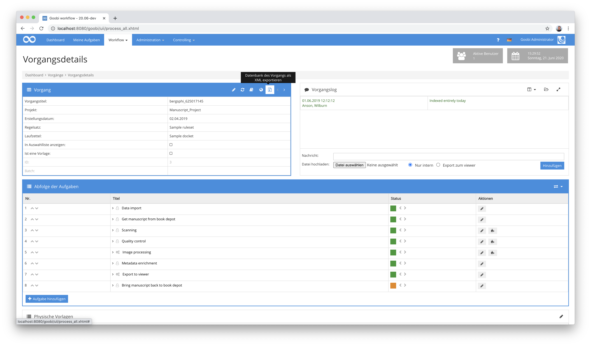
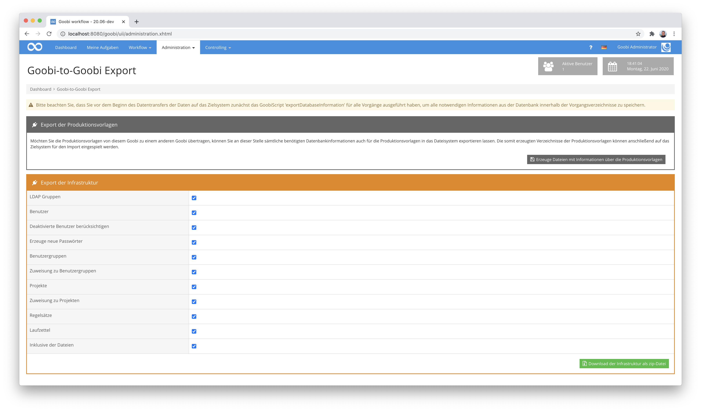
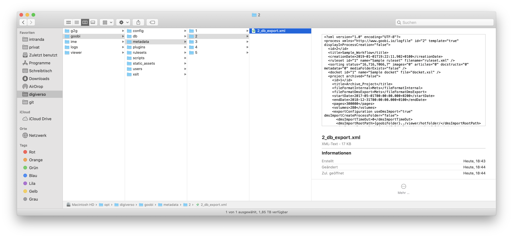
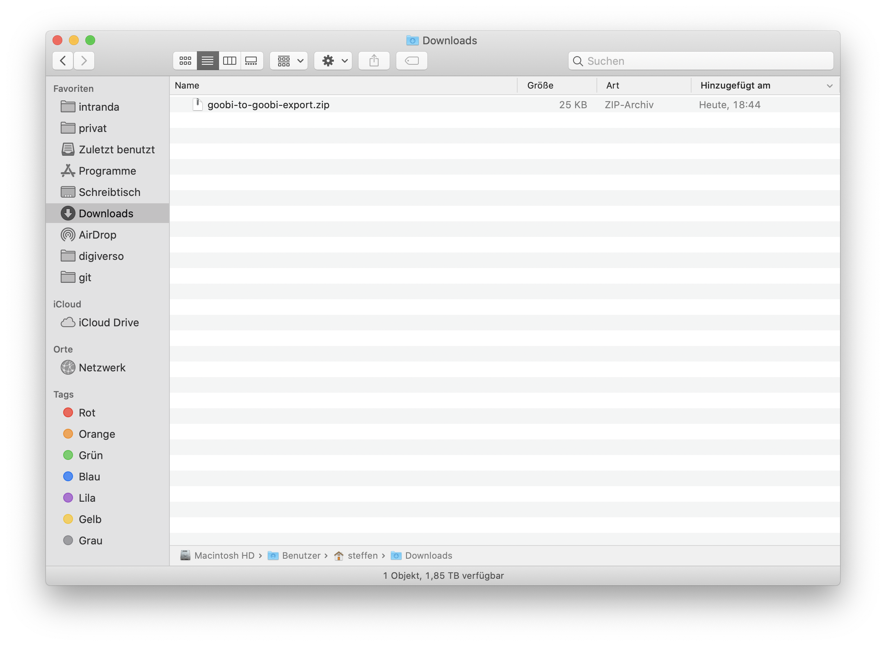

# Erzeugung der Export-Verzeichnisse

## Übersicht

Name                     | Wert
-------------------------|-----------
Identifier               | intranda_administration_goobi2goobi_export intranda_administration_goobi2goobi_import_infrastructure intranda_administration_goobi2goobi_import_data
Repository               | [https://github.com/intranda/goobi-plugin-administration-goobi2goobi-import](https://github.com/intranda/goobi-plugin-administration-goobi2goobi-import)
Lizenz              | GPL 2.0 oder neuer 
Letzte Änderung    | 25.07.2024 11:11:13


Der Export aus dem Ausgangssystem besteht aus bis zu drei Teilschritten. Bevor der Export jedoch stattfinden kann, muss zunächst innerhalb des Rollensystems von Goobi workflow festgelegt werden, dass der Nutzer über die Berechtigungen für den Export verfügen muss. Informationen über die vorzunehmenden Konfigurationen finden sich hier:

[Installation](goobi-plugin-administration-goobi2goobi-import_page_01_00_de.md)

Nach der Konfiguration der benötigen Benutzerrechte kann der eigentliche Export beginnen. In den meisten Fällen wird hierfür lediglich der erste der folgenden drei Teilschritte notwendig sein.

## 1. Teilschritt: Erzeugung der Export-Dateien für Vorgänge

Für die meisten Einsatzzwecke wird lediglich dieser Teilschritt zum Erzeugen der Export-Dateien für alle gewünschten Vorgänge benötigt. Hierbei wird für alle ausgewählten Vorgänge innerhalb des Dateisystems im Ordner jedes ausgewählten Vorgangs eine xml-Datei mit allen relevanten Informationen über den Vorgang aus der Datenbank erzeugt.


### Export mittels GoobiScript

Um einen solchen Export für mehrere Vorgänge zusammen durchzuführen, besteht die Möglichkeit, diesen mittels GoobiScript zu starten. Hierzu wird das folgende GoobiScript-Kommando benötigt:

```text
action:exportDatabaseInformation
```


Nach der Ausführung dieses GoobiScripts findet sich in jedem Vorgangsordner die jeweilige Export-xml-Datei (z.B. `5_db_export.xml`).

### Manueller Export für einzelne Vorgänge

Um einen solchen Export für einen einzelnen Vorgang durchzuführen, besteht die Möglichkeit, diesen innerhalb der Details eines Vorgangs zu starten. Klicken Sie hierzu einfach auf das entsprechende Icon für den Export.



Im Gegensatz zum Export über GoobiScript wird hierbei ein Download der xml-Datei gestartet, die die Datenbankinformationen beinhaltet.

## 2. Teilschritt: Export der Produktionsvorlagen

**Hinweis:** Dieser Teilschritt ist optional und wird nur in seltenen Fällen benötigt.

Ist gewünscht, dass nicht nur Vorgänge von einem Goobi workflow zu einem anderen übertragen werden, können auch Exportdaten für Produktionsvorlagen erzeugt werden. Da GoobiScript allerdings nicht innerhalb des Bereichs für Produktionsvorlagen verfügbar ist, kann dieser Export aus dem bereitgestellten Plugin `Goobi-to-Goobi Export` innerhalb des Menüs `Administration` erfolgen.



Klicken Sie hierzu nun auf den Button `Erzeuge Dateien mit Informationen über die Produktionsvorlagen`. Hierdurch wird für jede Produktionsvorlage ebenfalls eine xml-Datei mit den Datenbankinformationen im Dateisystem gespeichert und kann für den Transfer zu dem Zielsystem verwendet werden.



## 3. Teilschritt: Export der Infrastruktur

**Hinweis:** Dieser Teilschritt ist optional und wird nur in seltenen Fällen benötigt.

Sollen neben den eigentlichen Goobi-Vorgängen auch weitergehende Informationen über die Infrastruktur von einem Goobi workflow zu einem anderen übertragen werden, besteht die Möglichkeit, diese innerhalb des Export-Plugins ebenfalls exportieren zu lassen. Wählen Sie hierzu innerhalb des Plugins `Goobi-to-Goobi Export` die bereitgestellten Checkboxen aus, um gezielt Einfluss auf den Export vorzunehmen. Folgende Parameter stehen hierfür zur Verfügung:

| Option | Bedeutung |
| :--- | :--- |
| `LDAP Gruppen` | Exportiert die vorhandenen LDAP Gruppen |
| `Benutzer` | Export der aktiven Nutzer |
| `Deaktivierte Nutzer berücksichtigen` | Zusätzlich zu den aktiven Nutzern ebenso die deaktivierten Nutzer mit exportieren |
| `Erzeuge neue Passwörter` | Festlegung, ob die bestehenden Passwörter der Nutzer mit exportiert werden sollen. In dem Fall, dass die Checkbox gesetzt ist, müssen auf dem Zielsystem nach dem Import für die importierten Nutzer neue Passwörter gesetzt werden. |
| `Benutzergruppen` | Export der Nutzergruppen, Berechtigungen und zusätzlichen Rollen |
| `Zuweisung zu Benutzergruppen` | Export aller dem Nutzer zugewiesenen Gruppen |
| `Projekte` | Export der Projekte |
| `Zuweisung zu Projekten` | Export aller dem Nutzer zugewiesenen Projekte |
| `Regelsätze` | Export der Regelsatzinformationen |
| `Laufzettel` | Export der Laufzettelinformationen |
| `Inklusive der Dateien` | Festlegung ob die exportierte zip-Datei die Regelsätze und Laufzettel beinhalten soll |

Nach der Auswahl der gewünschten Informationen und dem Klick auf den Button `Download der Infrastruktur als zip-Datei` erzeugt Goobi eine zip-Datei und bietet diese mit dem Namen `goobi-to-goobi-export.zip` zum Download an. Diese zip-Datei enthält nun sämtliche ausgewählten Informationen aus der Goobi-Datenbank für den Transfer zu dem Zielsystem.

