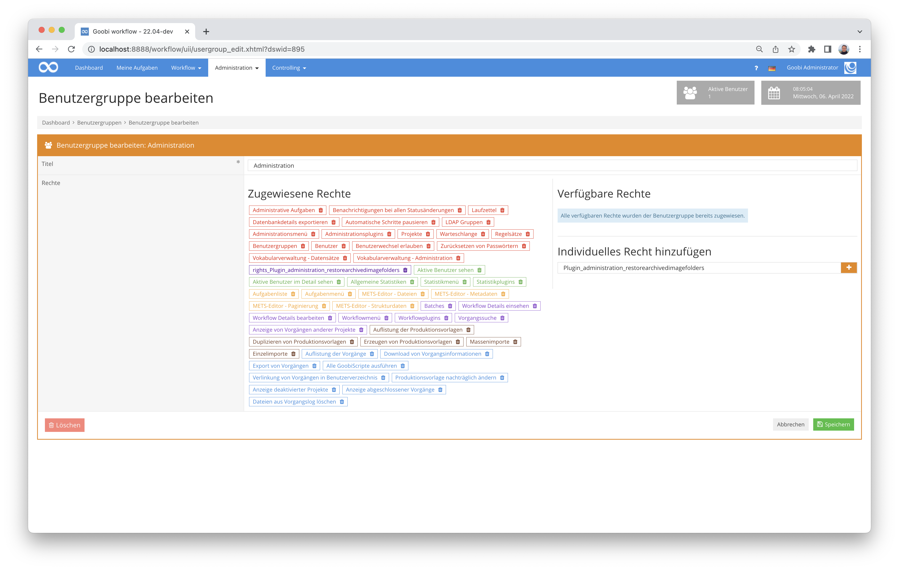

# Wiederherstellung von archivierten Bildordnern

## Übersicht

Name                     | Wert
-------------------------|-----------
Identifier               | intranda_administration_restorearchivedimagefolders
Repository               | [https://github.com/intranda/goobi-plugin-administration-restore-archived-image-folders](https://github.com/intranda/goobi-plugin-administration-restore-archived-image-folders)
Lizenz              | GPL 2.0 oder neuer 
Letzte Änderung    | 25.07.2024 11:16:07


## Einführung
Dieses Plugin für Goobi workflow stellt Bildordner wieder her, die zuvor mit dem Plugin `goobi-plugin-step-archiveimagefolder` archiviert wurden.


## Installation
Das Plugin besteht insgesamt aus den folgenden zu installierenden Dateien:

```bash
goobi_plugin_administration_restorearchivedimagefolders-base.jar
goobi_plugin_administration_restorearchivedimagefolders-gui.jar
plugin_intranda_administration_restorearchivedimagefolders.xml
```

Diese Dateien müssen in den richtigen Verzeichnissen installiert werden, so dass diese nach der Installation in folgenden Pfaden vorliegen:

```bash
/opt/digiverso/goobi/plugins/administration/plugin_intranda_administration_restorearchivedimagefolders-base.jar
/opt/digiverso/goobi/plugins/GUI/plugin_intranda_administration_restorearchivedimagefolders-gui.jar
/opt/digiverso/goobi/config/plugin_intranda_administration_restorearchivedimagefolders.xml
```

Für eine Nutzung dieses Plugins muss der Nutzer über die korrekte Rollenberechtigung verfügen. Bitte weisen Sie daher der Benutzergruppe die Rolle `Plugin_administration_restorearchivedimagefolders` zu.




## Überblick und Funktionsweise
Das Plugin bietet eine grafische Oberfläche an, die über das Menü `Administration` geöffnet werden kann. Dort kann dann ein Suchfilter verwendet werden, wie er auch an anderen Stellen von Goobi workflow (z.B. für die Vorgangsliste) verwendet wird. Mit einem Klick auf `Plugin ausführen`, werden dann die für die über den eingegebenen Filter gefundenen Vorgänge die Bilder wieder hergestellt. Die Nutzeroberfläche aktualisiert sich automatisch.


## Konfiguration
Die Konfigurationsdatei ist im Moment leer, muss aber trotzdem vorliegen.

```xml

```

Die Information, woher die Daten geholt werden sollen, sind im jeweiligen Vorgangsordner in einer XML-Datei vom Archivierungs-Plugin hinterlegt worden.

Für die Authentifizierung an ssh-Servern wird an den üblichen Stellen (`$USER_HOME/.ssh`) nach public keys gesucht. Andere Authentifizierungsmethoden wie username/password sind nicht vorgesehen.