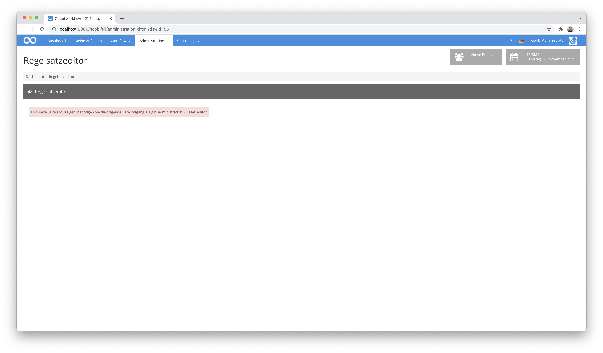
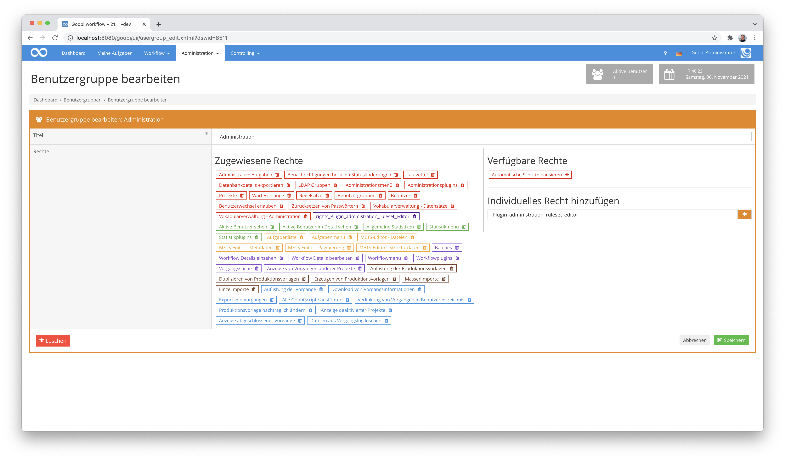
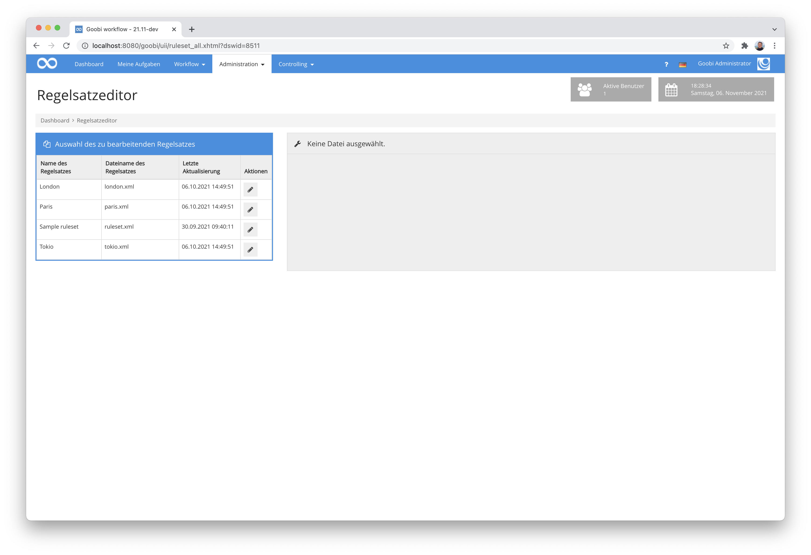
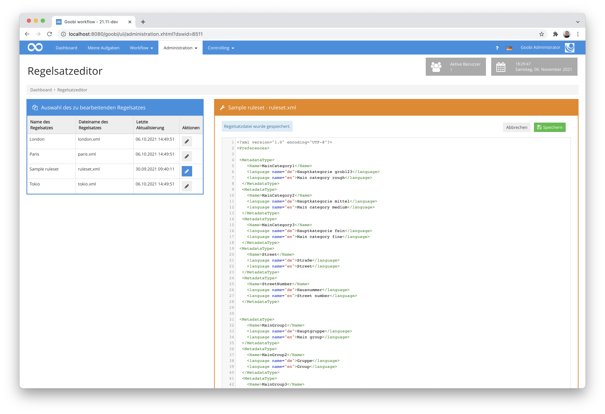

# Regelsatzeditor

## Übersicht

Name                     | Wert
-------------------------|-----------
Identifier               | intranda_administration_ruleset_editor
Repository               | [https://github.com/intranda/goobi-plugin-administration-ruleset-editor](https://github.com/intranda/goobi-plugin-administration-ruleset-editor)
Lizenz              | GPL 2.0 oder neuer 
Letzte Änderung    | 25.07.2024 11:09:29


## Einführung
Dieses Plugin dient zur direkten Bearbeitung der Regelsatzdateien von Goobi workflow direkt aus der Benutzeroberfläche innerhalb des Webbrowsers.


## Installation
Das Plugin besteht insgesamt aus den folgenden zu installierenden Dateien:

```bash
plugin-intranda-administration-ruleset-editor-base.jar
plugin-intranda-administration-ruleset-editor-gui.jar
plugin_intranda_administration_ruleset_editor.xml
```

Diese Dateien müssen in den richtigen Verzeichnissen installiert werden, so dass diese nach der Installation unter den folgenden Pfaden vorliegen:

```bash
/opt/digiverso/goobi/plugins/administration/plugin-intranda-administration-ruleset-editor-base.jar
/opt/digiverso/goobi/plugins/GUI/plugin-intranda-administration-ruleset-editor-gui.jar
/opt/digiverso/goobi/config/plugin_intranda_administration_ruleset_editor.xml
```

Dieses Plugin verfügt über eine eigene Berechtigungsstufe für die Verwendung. Aus diesem Grund müssen Nutzer über die erforderlichen Rechte verfügen.



Bitte weisen Sie daher der Benutzergruppe der entsprechenden Nutzer das folgende Recht zu:

```
Plugin_administration_ruleset_editor
```




## Überblick und Funktionsweise
Nach der Installation ist das Plugin in einem eigenen Eintrag im Menü `Administration` zu finden, von wo es geöffnet werden kann.



Nach dem Öffnen werden auf der linken Seite alle Regelsätze von Goobi aufgelistet. Diese kann man durch Anklicken des jeweiligen Icons öffnen, um sie zu bearbeiten.


Öffnet man eine Datei, erscheint auf der rechten Seite ein Texteditor, in dem die Datei bearbeitet werden kann. Bearbeitet und speichert man eine Datei, wird im definierten Backupverzeichnis automatisch ein Backup angelegt.



Entsprechend des eingestellten Wertes in der Konfigurationsdatei bleibt hier eine gewisse Anzahl an älteren Backups erhalten, bevor diese durch neuere ersetzt werden.


Wurde eine Datei verändert und wird ohne zuvor zu speichern ein Wechsel zu einer anderen Datei versucht, bekommt der Beareiter eine Rückfrage, wie mit den Änderungen zu verfahren ist.


## Konfiguration
Die Konfiguration des Plugins erfolgt über die Konfigurationsdatei `plugin_intranda_administration_ruleset_editor.xml` und kann im laufenden Betrieb angepasst werden. Im folgenden ist eine beispielhafte Konfigurationsdatei aufgeführt:

```xml
<config_plugin>
	
	<!-- By editing a ruleset file in the browser GUI, a backup file will be stored in the backup directory -->
	<rulesetBackupDirectory>/opt/digiverso/goobi/rulesets/backup/</rulesetBackupDirectory>

	<!-- backup files will be stored as ruleset.xml.1, ruleset.xml.2, ..., ruleset.xml.n -->
	<numberOfBackupFiles>10</numberOfBackupFiles>
	
</config_plugin>
```

Die Parameter innerhalb dieser Konfigurationsdatei haben folgende Bedeutungen:

Parameter           |  Erläuterung
------------------- | -----------------------------------------------------
`rulesetBackupDirectory`   | Hiermit wird der Pfad für die Backup-Dateien festgelegt, wo nach dem Bearbeiten die Backups der Regelsatzdateien gespeichert werden sollen.
`numberOfBackupFiles`         | Dieser ganzzahlige Wert gibt an, wie viele Backup-Dateien pro Regelsatzdatei gespeichert bleiben, bevor sie durch neue Backups überschrieben werden.