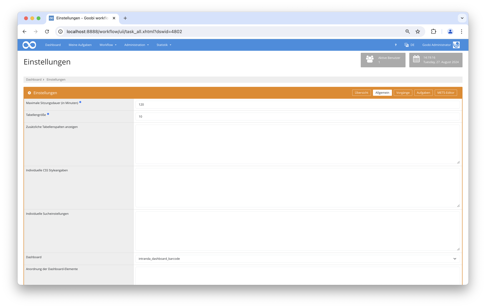
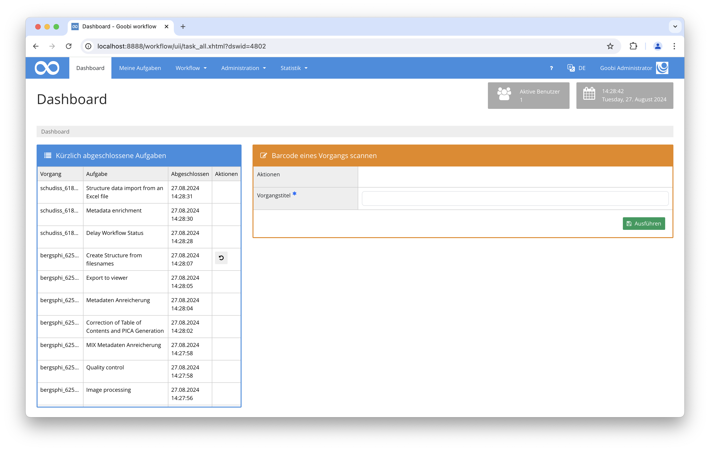

# Barcode Scanner Dashboard

## Übersicht

Name                     | Wert
-------------------------|-----------
Identifier               | intranda_dashboard_barcode
Repository               | [https://github.com/intranda/goobi-plugin-dashboard-barcode](https://github.com/intranda/goobi-plugin-dashboard-barcode)
Lizenz              | GPL 2.0 oder neuer 
Letzte Änderung    | 04.09.2024 09:34:05


## Einführung
Dieses Dashboard-Plugin wurde entwickelt, um die Verwendung eines Barcode-Scanners in Goobi Workflow zu erleichtern. Es ermöglicht auf der rechten Seite der Oberfläche verschiedene Aktionen, wie z.B. das Annehmen und Abschließen von Aufgaben oder auch das Ändern des Standorts für Objekte.

## Installation
Um das Plugin nutzen zu können, müssen folgende Dateien installiert werden:

```bash
/opt/digiverso/goobi/plugins/dashboard/plugin_intranda_dashboard_barcode.jar
/opt/digiverso/goobi/plugins/GUI/plugin_intranda_dashboard_barcode-GUI.jar
```

Um zu konfigurieren, wie sich das Plugin verhalten soll, können verschiedene Werte in der Konfigurationsdatei angepasst werden. Die Konfigurationsdatei befindet sich üblicherweise hier:

```bash
/opt/digiverso/goobi/config/plugin_intranda_dashboard_barcode.xml
```

Für eine Nutzung dieses Plugins muss der Nutzer innerhalb der Einstellungen für das Dashboard den Wert `intranda_dashboard_barcode` auswählen. 




## Überblick und Funktionsweise
Um dieses Dashboard-Plugin zu nutzen, muss man es zunächst über `Einstellungen` -> `Allgemein` -> `Dashboard` aktivieren und sich dann ggf. neu anmelden. Wenn das Plugin korrekt installiert und konfiguriert wurde, sollte es bereits unter dem Menüpunkt `Dashboard` aktiviert sein.



Auf der rechten Seite befindet sich ein Formular mit verschiedenen Aktionen. Sie können eine auswählen, indem Sie darauf klicken. Wird die Aktion `Nur Ortsänderung` gewählt, gibt es ein zusätzliches Eingabefeld, das den Namen des neuen Orts erwartet. Für alle Aktionen gibt es ein obligatorisches Eingabefeld, in dem der Titel des Goobi-Vorgangs erwartet wird. Dieses Feld wird nach dem Laden automatisch fokussiert, um die Verwendung eines Barcodescanners zu erleichtern. Durch Anklicken des Buttons `Ausführen` wird die gewählte Aktion ausgeführt, und es werden Meldungen über den Erfolg ausgegeben. Die durchgeführte Aktion sowie der Eingabeort werden zur Erleichterung weiterer Anwendungen gespeichert. Sie bleiben unverändert, bis eine manuelle Änderung vorgenommen wird.

## Konfiguration
Die Konfiguration des Plugins erfolgt in der Datei `plugin_intranda_dashboard_barcode.xml` wie hier aufgezeigt:

```xml
<?xml version="1.0" encoding="UTF-8"?>

<config_plugin>
	
	<!-- number of previous tasks that shall be shown -->
	<tasks-latestChanges-size>37</tasks-latestChanges-size>
	
	<!-- display the option to accept tasks -->
	<show-accept-option>true</show-accept-option>
	​
	<!-- display the option to finish tasks -->
	<show-finish-option>true</show-finish-option>
	​
	<!-- display the option to accept and finish tasks as one action -->
	<show-accept-and-finish-option>true</show-accept-and-finish-option>
	​
	<!-- display the option to change the location -->
	<show-change-location-option>true</show-change-location-option>
	
	<!-- define which filter shall be used to find the processes. Use {BARCODE} 
	as placeholder for the input field content (e.g. "meta:*:{BARCODE}" ) -->
	<filter>meta:*:{BARCODE}</filter>
	
</config_plugin>

```

Die folgende Tabelle enthält eine Zusammenstellung der Parameter und ihrer Beschreibungen:

Parameter               | Erläuterung
------------------------|------------------------------------
| `tasks-latestChanges-size` | Dieser Parameter legt fest, wie viele erledigten Aufgaben in der linken Tabelle angezeigt werden sollen. |
| `show-accept-option` | Dieser Parameter legt fest, ob der Button für die Annahme von Aufgaben aktiviert werden soll. Default ist hierfür `false`. |
| `show-finish-option` | Dieser Parameter legt fest, ob der Button für die Beendigung von Aufgaben aktiviert werden soll. Default ist hierfür `false`.|
| `show-accept-and-finish-option` | Dieser Parameter legt fest, ob der Button für die Annahme von Aufgaben und deren Beendigung aktiviert werden soll. Default ist hierfür `false`. |
| `show-change-location-option` | Dieser Parameter legt fest, ob der Button für den Ortswechsel aktiviert werden soll. Default ist hierfür `false`. |