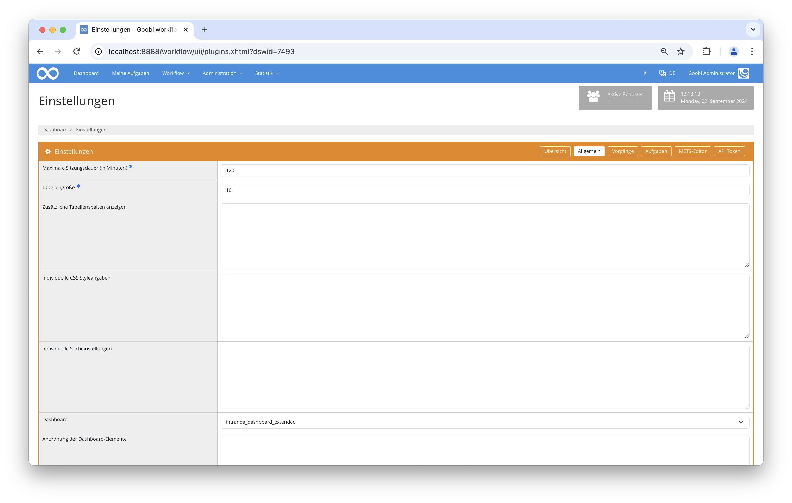
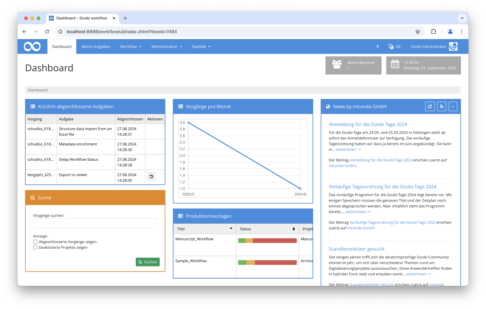

# Erweitertes Dashboard

## Übersicht

Name                     | Wert
-------------------------|-----------
Identifier               | intranda_dashboard_extended
Repository               | [https://github.com/intranda/goobi-plugin-dashboard-extended](https://github.com/intranda/goobi-plugin-dashboard-extended)
Lizenz              | GPL 2.0 oder neuer 
Letzte Änderung    | 04.09.2024 10:34:23


## Einführung
Dieses Dashboard Plugin ermöglicht durch eine detaillierte Darstellung einen verbesserten Überblick. Es können beispielsweise die zuletzt bearbeiteten Aufgaben oder relevante Statistiken angezeigt werden.

## Installation
Um das Plugin nutzen zu können, müssen folgende Dateien installiert werden:

```bash
/opt/digiverso/goobi/plugins/dashboard/plugin-dashboard-extended-base.jar
/opt/digiverso/goobi/plugins/GUI/plugin-dashboard-extended-gui.jar
/opt/digiverso/goobi/config/plugin_intranda_dashboard_extended.xml
```

Für eine Nutzung dieses Plugins muss der Nutzer innerhalb der Einstellungen für das Dashboard den Wert `intranda_dashboard_extended` auswählen. 




## Überblick und Funktionsweise
Wenn das Plugin korrekt installiert ist und Nutzer sich dieses als Dashboard eingestellt haben, ist es nach dem Login in Goobi workflow anstelle der Startseite sichtbar.



## Konfiguration
Die Konfiguration des Plugins erfolgt in der Datei `plugin_intranda_dashboard_extended.xml` wie hier aufgezeigt:

```xml
<?xml version="1.0" encoding="UTF-8"?>

<config_plugin>
	
	<!-- intranda TaskManager -->
	<itm-show>false</itm-show>
	<itm-cache-time>180000</itm-cache-time>
	<itm-url>http://localhost:8080/itm/</itm-url>
	
	<!-- Nagios Monitoring -->
	<nagios-show>false</nagios-show>
	<nagios-cache-time>180000</nagios-cache-time>
	<nagios-host>host.example.org</nagios-host>
	<nagios-login>user</nagios-login>
	<nagios-password>pass</nagios-password>
	
	<!-- RSS-Feed e.g. of last imports -->
	<rss-show>false</rss-show>
	<rss-cache-time>900000</rss-cache-time>
	<rss-url>https://www.intranda.com/feed/</rss-url>
	<rss-title>News by intranda GmbH</rss-title>
	
	<!-- Search -->
	<search-show>true</search-show>
	
	<!-- Show tasks the user works on -->
    <tasks-show>true</tasks-show>
    <tasks-show-size>5</tasks-show-size>
    
    <!-- show recent history  -->
    <tasks-history>false</tasks-history>
    <!-- show history for configured tasks -->
    <tasks-history-title>Data import via Excel sheet</tasks-history-title>
    <tasks-history-title>Scanning</tasks-history-title>
    <tasks-history-title>Fileupload</tasks-history-title>
    <!-- include status changes for the last X days -->
    <tasks-history-period>7</tasks-history-period>
	
    <!-- show the last tasks of the user -->
    <tasks-latestChanges>true</tasks-latestChanges>
    <tasks-latestChanges-size>5</tasks-latestChanges-size>
    
    <!-- Statistics -->
	<statistics-show>true</statistics-show>
	
	<!-- Batches -->
	<batches-show>true</batches-show>
	<!-- define time range as months before and after the today date -->
	<batches-timerange-start>2</batches-timerange-start>
	<batches-timerange-end>4</batches-timerange-end>
	
	<!-- Process creation -->
	<processTemplates-show>true</processTemplates-show>
	<processTemplates-show-statusColumn>true</processTemplates-show-statusColumn>
	<processTemplates-show-projectColumn>true</processTemplates-show-projectColumn>
	<processTemplates-show-massImportButton>true</processTemplates-show-massImportButton>
	
    <!-- Message queue -->
    <queue-show>true</queue-show>

	<!-- HTML box -->
	<html-box-show>false</html-box-show>
	<html-box-title>Goobi to go - Sample accounts</html-box-title>
	<html-box-content><![CDATA[
		<p>This is the Goobi workflow instance inside of your Goobi-to-go environment. It contains some demonstration material as well as sample user accounts. In the following table you can see the list of all user accounts which are available inside of this Goobi-to-go package. <br/><br/>
		<table class="table table-hover table-nomargin dataTable table-bordered responsive">
			<thead>
				<tr>
					<th>Login</th>
					<th>Password</th>
					<th>User description</th>
				</tr>
			</thead>
			<tr>
				<td>testscanning</td>
				<td>test</td>
				<td>User account for uploading content</td>
			</tr>
			<tr>
				<td>testqc</td>
				<td>test</td>
				<td>User account for manual Image QA</td>
			</tr>
			<tr>
				<td>testmetadata</td>
				<td>test</td>
				<td>Account for metadata enrichment work</td>
			</tr>
			<tr>
				<td>testimaging</td>
				<td>test</td>
				<td>User account for manual image optimisation</td>
			</tr>
			<tr>
				<td>testprojectmanagement</td>
				<td>test</td>
				<td>Project manager account</td>
			</tr>
			<tr>
				<td>testadmin</td>
				<td>test</td>
				<td>Administrator account</td>
			</tr>
			<tr>
				<td>goobi</td>
				<td>goobi</td>
				<td>Administrator account</td>
			</tr>
			
		</table>
	]]></html-box-content>
	
</config_plugin>

```

Die folgende Tabelle enthält eine Zusammenstellung der Parameter und ihrer Beschreibungen:

Parameter               | Erläuterung
------------------------|------------------------------------
`<itm-show>`            | Dieser Parameter legt fest, ob die aktuell laufenden Jobs des intranda Task Managers angezeigt werden sollen. 
`<itm-cache-time>`      | Dieser Wert wird in Millisekunden angegeben und legt fest, wie oft die Werte aus dem intranda Task Manager aktualisiert werden sollen.
`<itm-url>`             | Hier wird die URL angegeben, unter der der intranda Task Manager erreichbar ist.
`<rss-show>`            | Dieser Parameter legt fest, ob Neuigkeiten angezeigt werden sollen, die per RSS-Feed abgefragt werden können.
`<rss-cache-time>`      | Dieser Wert wird in Millisekunden angegeben und gibt an, wie oft der RSS-Feed aktualisiert werden soll.
`<rss-url>`             | Dieser Paramter legt fest, von welcher Webseite der RSS-Feed geladen werden soll.
`<rss-title>`           | Hier wird der Titel festgelegt, der über den Neuigkeiten stehen soll.
`<search-show>`         | Dieser Parameter legt fest, ob das `Suche`-Formular angezeigt werden soll.
`<tasks-show>`          | Dieser Parameter legt fest, ob der Bereich `Kürzlich abgeschlossene Aufgaben` angezeigt werden soll.
`<tasks-show-size>`     | Hier wird festgelegt, wie viele der kürzlich abgeschlossenen Aufgaben angezeigt werden sollen.
`<tasks-history>`       | Hiermit kann man sich den Verlauf der letzten Aufgaben anzeigen lassen. 
`<tasks-history-title>` | Mithilfe dieses Parameters kann festgelegt werden, welcher Aufgabentyp angezeigt werden soll.
`<tasks-history-period>` | Dieser Parameter legt fest, wie lange die letzte Bearbeitung maximal zurückliegen darf (in Tagen), damit diese noch angezeigt wird. |
`<tasks-latestChanges>` | Hier kann festgelegt werden, ob die zuletzt bearbeiteten Aufgaben angezeigt werden sollen.
`<tasks-latestChanges-size>` | Dieser Parameter gibt die Anzahl der letzten zu zeigenden Änderungen an.
`<statistics-show>`     | Hier wird definiert, ob Statistiken angezeigt werden sollen.
`<batches-show>`        | Dieser Parameter gibt, ob die `Batches` angezeigt werden sollen.
`<batches-timerange-start>` | Hier wird festgelegt, vor wie vielen Monaten die Batches angefangen wurden zu bearbeiten, damit diese angezeigt werden.
`<batches-timerange-end>` | Hier wird festgelegt, wie vielen Monate nach Beginn der Bearbeitung die Batches angezeigt werden.
`<processTemplates-show>` | Dieser Parameter legt fest, ob die Produktionsvorlagen angezeigt werden sollen.
`<processTemplates-show-statusColumn>` | Hier wird festgelegt, ob die Status-Spalte angezeigt werden soll.
`<processTemplates-show-projectColumn>` | Hier wird festgelegt, ob die Projekt-Spalte angezeigt werden soll.
`<processTemplates-show-massImportButton>` | Hier wird festgelegt, ob der Massenimport-Button angezeigt werden soll.
`<queue-show>`.           | Dieser Parameter legt fest, ob im Dashboard angezeigt werden soll, wie viele Vorgänge gerade in der Warteschlange sind und in welchem Status sie sich befinden.