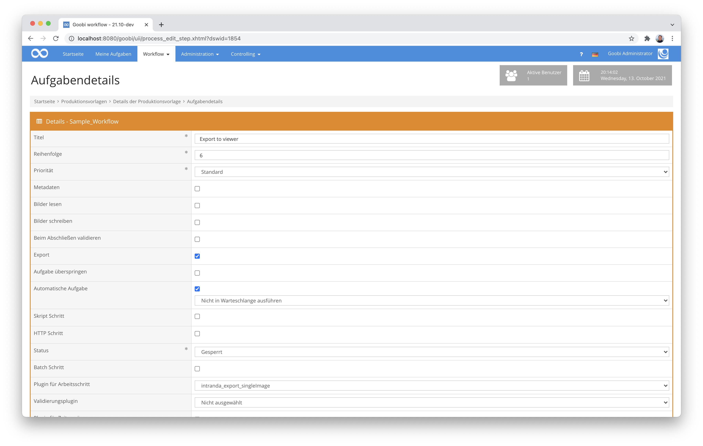

# Einzelseitenexport

## Übersicht

Name                     | Wert
-------------------------|-----------
Identifier               | intranda_export_singleImage
Repository               | [https://github.com/intranda/goobi-plugin-export-bda-single-image](https://github.com/intranda/goobi-plugin-export-bda-single-image)
Lizenz              | GPL 2.0 oder neuer 
Letzte Änderung    | 05.09.2024 06:55:52


## Einführung
Dieses Plugin dient für einen speziellen Export von mehreren METS-Dateien pro Vorgang. Aus einer einzigen METS-Datei innerhalb von Goobi workflow entstehen so während des Exports für jedes enthaltene Strukturelement eine eigene METS-Datei mit den zugehörigen Bilddateien.

Diese Plugin wurde für das Bundesdenkmalamt in Österreich entwickelt und ist funktionell auf dessen Bedürfnisse ausgerichtet und somit gegebenenfalls nicht für andere Anwendungsfälle unmittelbar einsetzbar.


## Installation
Das Plugin besteht insgesamt aus den folgenden zu installierenden Dateien:

```bash
plugin_intranda_export_bdaSingleImage-base.jar
```

Diese Datei muss in dem folgenden Verzeichnis installiert werden:

```bash
/opt/digiverso/goobi/plugins/export/plugin_intranda_export_bdaSingleImage-base.jar
```


## Überblick und Funktionsweise
Zur Inbetriebnahme des Plugins muss dieses für einen oder mehrere gewünschte Aufgaben im Workflow aktiviert werden. Dies erfolgt wie im folgenden Screenshot aufgezeigt durch Auswahl des Plugins `intranda_export_singleImage` aus der Liste der installierten Plugins.



Da dieses Plugin üblicherweise automatisch ausgeführt werden soll, sollte der Arbeitsschritt im Workflow als `automatisch` konfiguriert werden. Darüber hinaus muss die Aufgabe als Export-Schritt markiert sein.

Nachdem das Plugin vollständig installiert und eingerichtet wurde, wird es üblicherweise automatisch innerhalb des Workflows ausgeführt, so dass keine manuelle Interaktion mit dem Nutzer erfolgt. Stattdessen erfolgt der Aufruf des Plugins durch den Workflow im Hintergrund und führt die folgenden Arbeiten durch: 

Für jedes Strukturelement innerhalb der METS-Datei wird während des Exports eine eigenständige METS-Datei erzeugt, zu der die jeweiligen Bilddateien zugehörig mitexportiert werden. Die Gesamt-METS-Datei wird nicht mit exportiert. Die Anzahl der somit erzeugten METS-Dateien weicht entsprechend von der Anzahl der Goobi Vorgänge ab und entspricht der Anzahl der vorhandenen Strukturelemente.


## Konfiguration
Dieses Plugin verfügt über keine eigene Konfigurationsdatei.