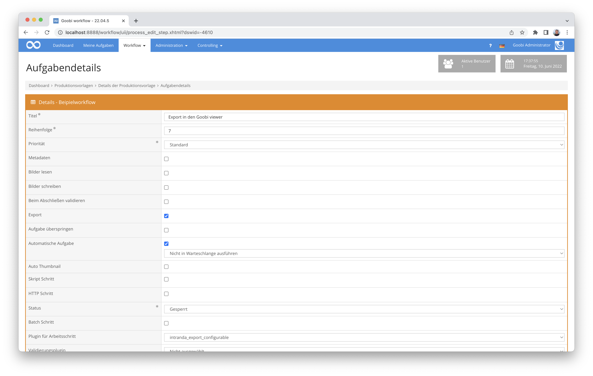
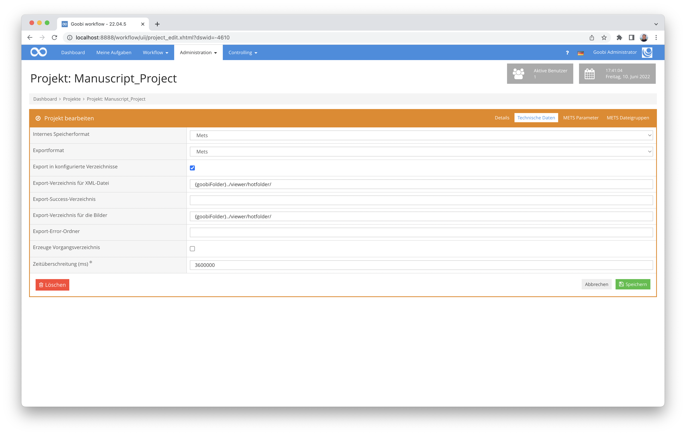

# Konfigurierbarer Export

## Übersicht

Name                     | Wert
-------------------------|-----------
Identifier               | intranda_export_configurable
Repository               | [https://github.com/intranda/goobi-plugin-export-configurable](https://github.com/intranda/goobi-plugin-export-configurable)
Lizenz              | GPL 2.0 oder neuer 
Letzte Änderung    | 25.07.2024 12:04:21


## Einführung
Die vorliegende Dokumentation beschreibt die Installation, Konfiguration und den Einsatz eines Export-Plugins in Goobi.

Mithilfe dieses Export-Plugins für Goobi können die Goobi-Vorgänge innerhalb eines Arbeitsschrittes gleichzeitig an mehrere Orte exportiert werden.


## Installation
Dieses Plugin wird in den Workflow so integriert, dass es automatisch ausgeführt wird. Eine manuelle Interaktion mit dem Plugin ist nicht notwendig. Zur Verwendung innerhalb eines Arbeitsschrittes des Workflows sollte es wie im nachfolgenden Screenshot konfiguriert werden.



Das Plugin muss zunächst in folgendes Verzeichnis kopiert werden:

```bash
/opt/digiverso/goobi/plugins/export/plugin_intranda_export_configurable-base.jar
```

Daneben gibt es eine Konfigurationsdatei, die an folgender Stelle liegen muss:

```bash
/opt/digiverso/goobi/config/plugin_intranda_export_configurable.xml
```


## Konfiguration
Die Konfiguration des Plugins erfolgt über die Konfigurationsdatei `plugin_intranda_export_configurable-base.jar` und über die Projekteinstellungen. Die Konfiguration kann im laufenden Betrieb angepasst werden. Im folgenden ist eine beispielhafte Konfigurationsdatei aufgeführt:

```xml
<?xml version="1.0" encoding="UTF-8"?>
<config_plugin>
	<!-- order of configuration is: 
	1.) project name matches 
	2.) project is * -->
	<config>
		<project>Manuscript_Project</project>
		<!-- List of folders that are included in the export. Each option can be included with the element attribute. -->
		<includeFolders>
			<!-- By default, all images in media will be exported to a _media folder, in master to a _master, etc. -->
			<media enabled="true" />
			<master enabled="true" />
			<source enabled="false" />
			<import enabled="false" />
			<export enabled="false" />
			<itm enabled="false" />
			<!-- By default all ocr folders are exported. If the optional and repeatable sub-element 'sourceFolderSuffix' is specified, only the folders 
			with the explicitly configured suffix will be copied. -->
			<ocr enabled="true">
				<!-- Export ocr folders whose names end with 'txt' or 'alto'. -->
				<sourceFolderSuffix>txt</sourceFolderSuffix>
				<sourceFolderSuffix>alto</sourceFolderSuffix>
			</ocr>
			<validation enabled="false" />
		</includeFolders>
	</config>
	
	<config>
		<project>Archive_Project</project>
		<!-- For all folders except 'ocr' configured inside the element 'includeFolders', one can use a sub-element 'destinationFolder' to configure whether a default export
		or a configured export should be used. For 'ocr' folders this does not apply, since 'ocr' folder may contain folders in itself, which makes this configuration nonsense. -->
		<includeFolders>
			<!-- If any sub-element 'destinationFolder' is configured, then the default export will be replaced with a configured export. -->
			<!-- The sub-element 'destinationFolder' is optional and repeatable. -->
			<!-- For any configured sub-element 'destinationFolder', the attribute '@name' is MANDATORY, while the attribute '@exportFileRegex' is optional. -->
			<media enabled="true">
				<!-- If the sub-element 'destinationFolder' has no '@exportFileRegex' attribute, then an empty folder with the configured '@name' will be created if it does not exist yet. -->
				<destinationFolder name="Images" />
				<!--
				<destinationFolder name="Survey Forms" exportFileRegex=".*Survey Form.*" />
				<destinationFolder name="Images/PLINExterior" exportFileRegex=".*Exterior.*" />
				-->
			</media>
			<master enabled="true" >
				<!-- If the sub-element 'destinationFolder' has both attributes configured, then a folder with the configured '@name' will be created if it does not exist yet,
				and all files whose names match the configured regular expression will be copied into that new folder. -->
				<destinationFolder name="Files_ending_with_1/files" exportFileRegex=".*1\..*" />
				<!-- ATTENTION: the regular expression configured here should be of JAVA style. -->
				<destinationFolder name="Files containing 7" exportFileRegex=".*7.*" />
			</master>
			<source enabled="false" />
			<import enabled="false" />
			<export enabled="false" />
			<itm enabled="false" />
			<!-- By default all ocr folders are exported. If the optional and repeatable sub-element 'sourceFolderSuffix' is specified, only the folders 
			with the explicitly configured suffix will be copied. -->
			<ocr enabled="false">
				<!--
				<sourceFolderSuffix>txt</sourceFolderSuffix>
				<sourceFolderSuffix>alto</sourceFolderSuffix>
				-->
			</ocr>
			<validation enabled="false" />
			<!-- To make a generic folder configuration work, one also has to configure the goobi_config.properties. -->
			<!-- The element 'genericFolder' is optional and repeatable. -->
			<!-- ATTENTION: all folders configured inside 'genericFolder' will be exported, and there is no '@enabled' attribute to configure that. Make sure that all folders are
			also correctly configured in the goobi_config.properties, otherwise it would be problematic. -->
			<genericFolder>
				<!-- In order to use 'some_folder' to configure a generic folder, say 'some_image_folder', one has to configure the goobi_config.properties in the following way: -->
				<!-- process.folder.images.some_folder=some_image_folder -->
				<!-- The path to this 'some_image_folder' should be '{imagepath}/some_image_folder', e.g. /opt/digiverso/goobi/metadata/27/images/some_image_folder -->
				some_folder
				<!-- No attribute '@exportFileRegex' configured, create an empty folder with '@name' if it does not exist yet. -->
				<destinationFolder name="empty_folder" />
				<destinationFolder name="first" exportFileRegex="^1.*" />
				<destinationFolder name="second" exportFileRegex="^2.*" />
				<destinationFolder name="txt" exportFileRegex=".*\.txt" />
			</genericFolder>
			<genericFolder>
				anotherFolder
				<destinationFolder name="third" exportFileRegex="3.*" />
			</genericFolder>
		</includeFolders>
	</config>
	
	<config>
		<project>*</project>
		<!-- An export is triggered for each 'target' condition that applies. If no 'target' condition is set, then a normal export will be performed. -->
		<!-- The 'target' element is optional, but if configured, then all three attributes are MANDATORY: -->
		<!-- 1. The '@key' attribute accepts a Goobi variable of the form '{meta.metadata name}'. -->
		<!-- 2. The '@value' attribute will be used to specify the desired value of '@key'. If set "", then the condition will be met if the metadata is empty or not set. -->
		<!-- 3. The '@projectName' attribute should contain the name of the export project with whose settings the export is to take place. If set "", then the settings
		of the project of the operation will be used for export. -->
		<target key="{meta.ViewerInstance}" value="eivfaanddigihub" projectName="eivfExportProject" />
		<target key="{meta.ViewerInstance}" value="eivfaanddigihub" projectName="gihubExportProject" />
		<target key="{meta.ViewerInstance}" value="" projectName="" />
		<!-- Whether any existing MARC-XML data should be embedded in the exported metafile. If not configured, then the default value false will be used. -->
		<includeMarcXml>false</includeMarcXml>
		<!-- List of folders that are included in the export. Each option can be included with the element attribute. -->
		<includeFolders>
			<media enabled="false" />
			<master enabled="false" />
			<source enabled="false" />
			<import enabled="false" />
			<export enabled="false" />
			<itm enabled="false" />
			<!-- Use default settings to export all ocr folders. -->
			<ocr enabled="true" />
			<validation enabled="false" />
		</includeFolders>
	</config>
</config_plugin>
```

| Parameter | Erläuterung |
| :--- | :--- |
| `project` | Dieser Parameter legt fest, für welches Projekt der aktuelle Block `<config>` gelten soll. Verwendet wird hierbei der Name des Projektes. Der `<config>`-Block mit dem `project` `*` wird immer verwendet, wenn kein anderer Block auf den Projektnamen passt.  
| `target` | Dieser Parameter hat 3 obligatorische Attribute: Im Parameter `key` sollte eine Goobi Variable der Form `{meta.Metadatenname}` verwendet werden. Im Attribut `value` kann dann der gewünschte Wert angegeben werden. Setzt man `value=""` So schlägt die Bedingung an, wenn das Metadatum leer oder nicht gesetzt ist. Im Attribut `projectName` sollte der Name des Exportprojektes, mit dessen Einstellungen der Export stattfinden soll, angegeben werden. Wird dem Attribut ein leerer String zugewiesen `projectName=""`, so werden die Einstellungen des Projektes des Vorgangs zum Export verwendet. Wenn keine target condition gesetzt ist, wird ein normaler Export durchgeführt. Für jede target Bedingung, die zutrifft, wird ein Export angestoßen.  |
|`includeMarcXml`| Dieser Parameter legt fest, ob evtl. vorhandene MARC-XML Daten in die exportierte Mets-Datei eingebettet werden sollen. Der Defaultwert ist `false`.|


### Der config-Block
Der Block `<config>` ist wiederholbar und kann so in unterschiedlichen Projekten verschiedene Metadaten definieren. Der Block mit `<project>*</project>` wird angewendet, wenn kein Block mit der Projektbezeichnung des Projektes existiert.


### Der includeFolders-Block
Der `includeFolders` Block befindet sich innerhalb von jedem `config`-Element. Er steuert, welche Verzeichnisse für den Export berücksichtigt werden sollen.

| Parameter | Erläuterung |
| :--- | :--- |
| `media` | Hier kann definiert werden, ob und wie der media-Ordner exportiert werden soll.|
| `master` | Hier kann definiert werden, ob und wie der master-Ordner exportiert werden soll. |
| `ocr` | Hier kann definiert werden, ob und wie der ocr-Ordner exportiert werden soll. |
| `source` | Hier kann definiert werden, ob und wie der source-Ordner exportiert werden soll. |
| `import` | Hier kann definiert werden, ob und wie der import-Ordner exportiert werden soll. |
| `export` | Hier kann definiert werden, ob und wie der export-Ordner exportiert werden soll. |
| `itm` | Hier kann definiert werden, ob und wie der TaskManager-Ordner exportiert werden soll. |
| `validation` | Hier kann definiert werden, ob und wie der validation-Ordner exportiert werden soll. |
| `genericFolder` | Hier kann ein Ordner frei definiert werden, der exportiert werden soll. |
| `sourceFolderSuffix` | Dieses Unterelement vom `ocr` Element wird benötigt, wenn man OCR-Ordner mit verschiedenen Suffixen verwendet. Es wird das konkrete Suffix zum Export angeben. |
| `destinationFolder` | Das ist ein Unterelement von allen Ordner-Elementen ausschließlich dem `ocr`-Element. Mithilfe seiner zwei Attribute `name` und `exportFileRegex` kann definiert werden, welche Dateien in welche Verzeichnisse exportiert werden sollen. | 

Wird das jeweilige Attribut `enabled` als `false` konfiguriert wird, findet kein Export des entsprechenden Ordners statt.

Die Konfiguration des Zielordners kann innerhalb der Projekteinstellungen in der Nutzeroberfläche von Goobi workflow vorgenommen werden. Wenn dort die Checkbox für `Erzeuge Vorgangsverzeichnis` gesetzt ist, wird der Vorgang in einen Unterordner mit seinem Titel als Namen im Zielverzeichnis abgelegt.

