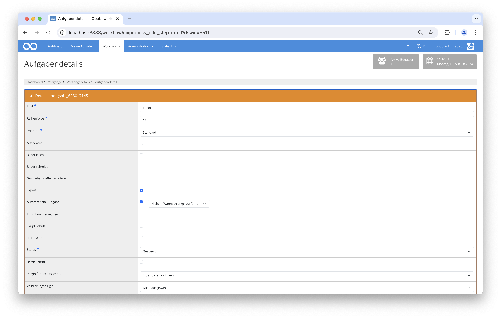

# Heris Export

## Übersicht

Name                     | Wert
-------------------------|-----------
Identifier               | intranda_export_heris
Repository               | [https://github.com/intranda/goobi-plugin-export-heris](https://github.com/intranda/goobi-plugin-export-heris)
Lizenz              | GPL 2.0 oder neuer 
Letzte Änderung    | 13.08.2024 14:38:49


## Einführung
Die vorliegende Dokumentation beschreibt die Installation, Konfiguration und den Einsatz des Heris-Export-Plugins in Goobi.

Mithilfe dieses Plugins für Goobi workflow können die in einem vorherigen Arbeitsschritt ausgewählten Bilder und dazugehörige Metadaten in eine JSON-Datei exportiert werden. Der Export erfolgt anschließend via SFTP auf einen externen Server.


## Installation
Um den Heris Export nutzen zu können, müssen folgende Dateien installiert werden:



```bash
/opt/digiverso/goobi/plugins/export/plugin_intranda_export_heris-base.jar
/opt/digiverso/goobi/config/plugin_intranda_export_heris.xml
```

Im Workflow muss ein automatischer Schritt eingefügt werden, bei dem das Plugin `intranda_export_heris` ausgewählt wurde. Dieser Schritt muss nach dem Arbeitsschritt mit dem Plugin `Image Selection` ausgeführt werden, in dem die Auswahl der zu exportierenden Bilder erfolgt.


## Überblick und Funktionsweise
Wenn das Plugin ausgeführt wird, prüft es als erstes, ob in dem Arbeitsschritt mit dem Plugin `Image Selection` mindestens ein Bild ausgewählt wurde. Wenn dies der Fall ist, werden die folgenden Arbeiten durchgeführt:

* Kopieren der ausgewählten Bilder in einen temporären Ordner
* Prüfung, ob es bereits einen älteren Export für die aktuelle HERIS ID gibt
    * Falls ja, Erstellung eines Backups der alten JSON Datei, Download der alten JSON Datei
    * Prüfung, ob die ausgewählten Dateien den Bildnamen in der alten JSON Datei entsprechen
        * für jedes gleich bleibende Bild wird der alte Bild-Identifier ermittelt, um im neuen JSON wiederverwendet zu werden
        * jedes schon exportierte Bild, das im neuen Export nicht mehr vorhanden ist, wird remote gelöscht
        * jedes neue Bild, das im alten Export noch nicht existierte, wird wie ein komplett neuer Export behandelt
* Ermittlung der Metadaten für die ausgewählten Bilder
* Erstellung der JSON-Datei aus den ermittelten Metadaten, gegebenfalls unter Beibehaltung der alten Bild-IDs
* Kopieren der erzeugten Daten an das Ziel
* Löschen der temporären Daten


## Konfiguration
Die Konfiguration erfolgt in der Datei `plugin_intranda_export_heris.xml` wie hier aufgezeigt:

```xml
<config_plugin>
    <config>
        <project>*</project>
        <step>*</step>
        <propertyName>plugin_intranda_step_image_selection</propertyName>

        <herisId>HERIS-ID</herisId>
        <jsonRootElement>Bilder</jsonRootElement>

        <json_format>
            <field type="identifier" name="Id"><!-- re-use old existing id --></field>
            <field type="metadata" name="Titel">TitleDocMain</field>
            <field type="metadata" name="alt_text">TitleDocMain</field>
            <field type="representative" name="Symbolbild"></field>
            <field type="static" name="media_type">JPEG</field>
            <field type="metadata" name="Aufnahmedatum">DateRecorded</field>
            <field type="metadata" name="Copyright BDA">Copyright</field>
            <field type="filename" name="Dateiinformation"></field>
            <field type="metadata" name="publikationsfähig">Published</field>
            <field type="metadata" name="Migrierte Information"></field>
        </json_format>

        <!-- sftp credentials for username + password authentication -->
        <sftp use="true">
            <username>username</username>
            <password>password</password>
            <hostname>localhost</hostname>
            <knownHosts>~/.ssh/known_hosts</knownHosts>
            <sftpFolder>/path/to/remote/folder/</sftpFolder>
            <port>22</port>
        </sftp>

        <!-- sftp credentials for username + public/private key authentication -->
        <!-- 
        <sftp use="true">
            <username>username</username>
            <keyfile>/path/to/private/key</keyfile>
            <hostname>localhost</hostname>
            <knownHosts>~/.ssh/known_hosts</knownHosts>
            <sftpFolder>/path/to/remote/folder/</sftpFolder>
            <port>22</port>
        </sftp> 
        -->

        <!-- sftp credentials for password protected public/private key authentication -->
        <!-- 
        <sftp use="true">
            <username>username</username>
            <keyfile>/path/to/private/key</keyfile>
            <password>password</password>
            <hostname>localhost</hostname>
            <knownHosts>~/.ssh/known_hosts</knownHosts>
            <sftpFolder>/path/to/remote/folder/</sftpFolder>
            <port>22</port>
        </sftp> 
        -->
    </config>
</config_plugin>
```

Dabei ist der Bereich `<config>` wiederholbar und erlaubt so unterschiedliche Exporte für verschiedene Projekte oder Schritte.

Im Feld `<propertyName>` wird definiert, in welcher Eigenschaft die ausgewählten Bilder gespeichert sind. Dieser Wert muss mit der Konfiguration des Plugins `Image Selection` übereinstimmen.

Anschließend wird die JSON-Datei beschrieben. Das Feld `<herisId>` enthält das Metadatum, in dem die HERIS-ID gespeichert wird und im `<jsonRootElement>` wird der Name des JSON-Objects konfiguriert, in dem die einzelnen Bilder beschrieben werden.

Die einzelnen Felder der Bild-Objekte werden in der `<field>` Liste beschrieben. Jedes Feld verfügt über drei Angaben.
- Im Attribut `name` wird definiert, wie das Element innerhalb der JSON Datei heißen soll.
- Im Element selbst wird der Wert beschrieben.
- Mittels `type` wird angegeben, um was für einen Typen es sich handelt. Je nach Typ wird der Wert anders interpretiert.

Dabei sind folgende Angaben möglich:

- `static`: Der Wert wird unverändert als Text in das JSON geschrieben.
- `filename`: Hier wird der Bildname gespeichert.
- `representative`: Kann die Werte `true/false` enthalten. Das erste Bild der Liste wird als Repräsentant genutzt.
- `identifier`: Enthält den Identifier des Bildes aus der HERIS-Datenbank. Bei einem Re-Export wird der vorherige Identfier wiederverwendet. Bei neuen Exporten bleibt das Feld leer.
- `metadata`: Der Wert wird als Metadatum interpretiert und aus den Metadaten ermittelt. Das Metadatum wird zuerst im Unterelement `Foto` gesucht, dass dem Bild zugewiesen wurde. Wenn das nicht existiert, wird das Metadatum im Hauptelement `Dokument` erwartet.

Im letzten Block wird die SFTP Verbindung konfiguriert. Hier stehen Optionen für die Authentifizierung mittels Nutzername und Passwort, Nutzername und Key oder Nutzername und passwortgeschützten Key zur Verfügung.