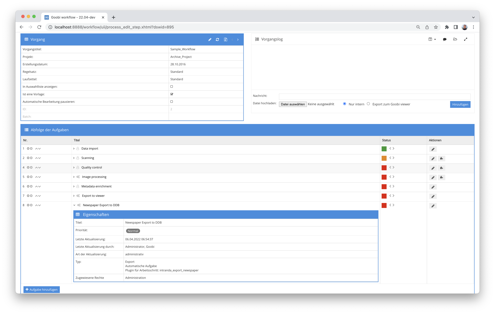

# Export für Zeitungen in das Portal der Deutschen Digitalen Bibliothek

## Übersicht

Name                     | Wert
-------------------------|-----------
Identifier               | intranda_export_newspaper
Repository               | [https://github.com/intranda/goobi-plugin-export-newspaper](https://github.com/intranda/goobi-plugin-export-newspaper)
Lizenz              | GPL 2.0 oder neuer 
Letzte Änderung    | 25.07.2024 12:03:52


## Einführung
Das Plugin dient zur Erstellung der METS Struktur für den Import in das Zeitungsportal der Deutschen Digitalen Bibliothek. Dabei wird für die Gesamtaufnahme einer Zeitung eine METS-Anchor Datei erzeugt, für jeden exportierten Jahrgang wird eine weitere METS-Anchor Datei erzeugt und innerhalb der Gesamtaufnahme verlinkt. Der Jahrgang enthält weitere Strukturen für Monat und Tag.

Jede Ausgabe wird als einzelne METS Dateien erstellt und in der METS-Anchor Datei des Jahrgangs verlinkt. Die Ausgabe kann weitere Strukturdaten wie Artikelbeschreibungen oder Beilagen enthalten. Hier wird auch auf die digitalisierten Bilder verwiesen.

[https://wiki.deutsche-digitale-bibliothek.de/display/DFD/Gesamtaufnahme+Zeitung+1.0](https://wiki.deutsche-digitale-bibliothek.de/display/DFD/Gesamtaufnahme+Zeitung+1.0)

[https://wiki.deutsche-digitale-bibliothek.de/display/DFD/Jahrgang+Zeitung+1.0](https://wiki.deutsche-digitale-bibliothek.de/display/DFD/Jahrgang+Zeitung+1.0)

[https://wiki.deutsche-digitale-bibliothek.de/display/DFD/Ausgabe+Zeitung+1.0](https://wiki.deutsche-digitale-bibliothek.de/display/DFD/Ausgabe+Zeitung+1.0)


## Installation
Das Plugin besteht aus der folgenden Datei:

```bash
plugin_intranda_export_newspaper-base.jar
```

Diese Datei muss in dem richtigen Verzeichnis installiert werden, so dass diese nach der Installation an folgendem Pfad vorliegt:

```bash
/opt/digiverso/goobi/plugins/export/plugin_intranda_export_newspaper-base.jar
```

Daneben gibt es eine Konfigurationsdatei, die an folgender Stelle liegen muss:

```bash
/opt/digiverso/goobi/plugins/config/plugin_intranda_export_newspaper.xml
```


## Überblick und Funktionsweise
Zur Inbetriebnahme des Plugins muss dieses für eine Aufgabe im Workflow aktiviert werden. Dies erfolgt wie im folgenden Screenshot aufgezeigt durch Auswahl des Plugins `intranda_export_newspaper` aus der Liste der installierten Plugins.



Da dieses Plugin üblicherweise automatisch ausgeführt werden soll, sollte der Arbeitsschritt im Workflow als automatisch konfiguriert werden. Darüber hinaus muss die Aufgabe als Export-Schritt markiert sein.

Daneben muss es noch einen weiteren, regulären Export Schritt geben, damit die verlinkten Bilder und ALTO Dateien über die Schnittstellen des Goobi viewers ausgeliefert werden können.

Nachdem das Plugin vollständig installiert und eingerichtet wurde, wird es üblicherweise automatisch innerhalb des Workflows ausgeführt, so dass keine manuelle Interaktion mit dem Nutzer erfolgt. Stattdessen erfolgt der Aufruf des Plugins durch den Workflow im Hintergrund und führt die folgenden Arbeiten durch:

Für jede Ausgabe wird eine eigene METS Datei erstellt, die zur Ausgabe gehörenden Bilder und OCR Daten verlinkt. Die Ausgabe kann weitere Unterelemente wie Artikel oder Beilagen haben.

Die einzelnen Ausgaben werden dann in einer METS Datei für den Jahrgang zusammengefasst. Die METS Dateien der Ausgaben sind innerhalb einer Struktur für Monat und Tag verlinkt.

Als letztes wird geprüft, ob im Zielverzeichnis ein Datensatz mit den Metadaten der Gesamtaufnahme existiert. Wenn nicht, wird eine METS Datei erstellt, ansonsten wird der Jahrgang in die Strukturdaten der Gesamtaufnahme eingetragen.


## Konfiguration
Die Konfiguration des Plugins erfolgt über die Konfigurationsdatei `plugin_intranda_export_newspaper.xml` und kann im laufenden Betrieb angepasst werden. Im folgenden ist eine beispielhafte Konfigurationsdatei aufgeführt:

```xml
<?xml version="1.0" encoding="UTF-8"?>
<config_plugin>
    <export>
        <images>false</images>
        <subfolderPerIssue>false</subfolderPerIssue>
        <exportFolder>/tmp/export/</exportFolder>
        <metsUrl>https://viewer.example.org/viewer/metsresolver?id=</metsUrl>
        <resolverUrl>https://viewer.org/viewer/piresolver?id=</resolverUrl>
    </export>
    <metadata>
        <purl>_purl</purl>
        <zdbiddigital>CatalogIDPeriodicalDBDigital</zdbiddigital>
        <zdbidanalog>CatalogIDPeriodicalDB</zdbidanalog>
        <identifier>CatalogIDDigital</identifier>
        <issueDate>DateIssued</issueDate>
        <yearDate>CurrentNoSorting</yearDate>
        <titleLabel>TitleDocMain</titleLabel>
        <modsTitle>MainTitle</modsTitle>
        <volumeNumber>VolumeNo</volumeNumber>
        <issueNumber>CurrentNo</issueNumber>
        <sortNumber>CurrentNoSorting</sortNumber>
        <language>DocLanguage</language>
        <location>PhysicalLocation</location>
        <licence>UseAndReproductionLicense</licence>
        <resourceType>TypeOfResource</resourceType>
        <anchorId>AnchorID</anchorId>
        <anchorTitle>AnchorTitle</anchorTitle>
        <anchorZDBIdDigital>AnchorCatalogIDPeriodicalDBDigital</anchorZDBIdDigital>
    </metadata>
    <docstruct>
        <newspaper>Newspaper</newspaper>
        <year>Year</year>
        <month>Month</month>
        <day>Day</day>
        <issue>NewspaperIssue</issue>
        <newspaperStub>NewspaperStub</newspaperStub>
    </docstruct>
</config_plugin>
```

Im ersten Bereich `<export>` werden einige globale Parameter gesetzt. Hier wird festgelegt, ob neben den Metsdateien auch Bilder exportiert werden sollen (`<images>` `true`/`false`), ob diese pro Ausgabe oder pro Jahrgang exportiert und in den Datensätzen verlinkt werden (`<subfolderPerIssue>` `true`/`false`), in welches Verzeichnis der Export durchgeführt werden soll (`<exportFolder>`) und welche Resolver für die METS Datei (`<metsUrl>`) und den Link auf den veröffentlichten Datensatz (`<resolverUrl>`) geschrieben werden sollen.

Im zweiten Bereich `<metadata>` werden eine Reihe von Metadaten definiert. Diese Felder müssen im Regelsatz existieren und werden zum Teil während des Exports von der Gesamtaufnahme in die einzelnen Ausgaben kopiert.

Der dritte Bereich `<docstruct>` definiert einige zu erzeugende Strukturelemente. Diese müssen ebenfalls im Regelsatz konfiguriert sein.