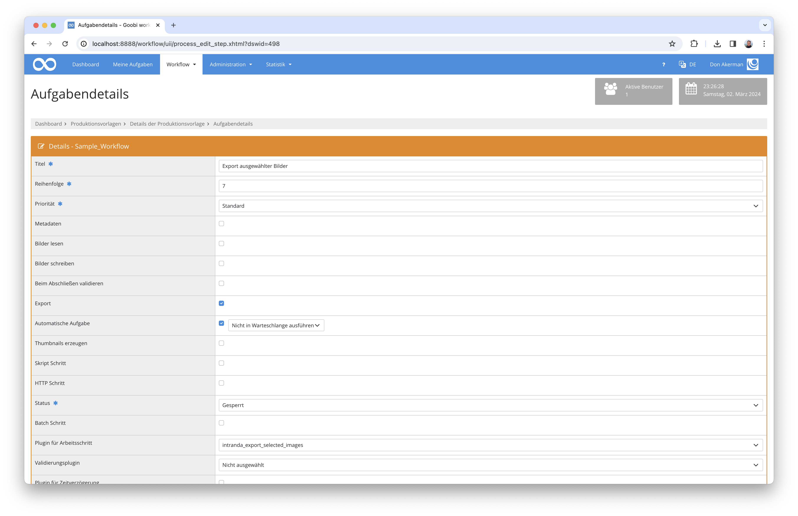

# Export ausgewählter Bilder

## Übersicht

Name                     | Wert
-------------------------|-----------
Identifier               | intranda_export_selected_images
Repository               | [https://github.com/intranda/goobi-plugin-export-selected-images](https://github.com/intranda/goobi-plugin-export-selected-images)
Lizenz              | GPL 2.0 oder neuer 
Letzte Änderung    | 25.07.2024 12:03:45


## Einführung
Die vorliegende Dokumentation beschreibt die Installation, Konfiguration und den Einsatz des Plugin zum Export ausgewählter Bilder in Goobi workflow.

Mithilfe dieses Plugins für Goobi workflow können die Goobi-Vorgänge innerhalb eines Arbeitsschrittes die zuvor ausgewählten Bilder und auf Wunsch ebenso auch die zugehörige METS-Datei an einen konfigurierten Ort entweder im Dateisystem oder per SCP exportieren.


## Installation
Dieses Plugin wird in den Workflow so integriert, dass es automatisch ausgeführt wird. Zur Verwendung innerhalb eines Arbeitsschrittes des Workflows sollte es wie im nachfolgenden Screenshot konfiguriert werden.



Das Plugin muss zunächst in folgendes Verzeichnis kopiert werden:

```bash
/opt/digiverso/goobi/plugins/export/plugin_intranda_export_selected_images-base.jar
```

Daneben gibt es eine Konfigurationsdatei, die an folgender Stelle liegen muss:

```bash
/opt/digiverso/goobi/config/plugin_intranda_export_selected_images.xml
```


## Konfiguration
Die Konfiguration des Plugins erfolgt über die Konfigurationsdatei `plugin_intranda_export_selected_images.xml`. Die Konfiguration kann im laufenden Betrieb angepasst werden. Im folgenden ist eine beispielhafte Konfigurationsdatei aufgeführt:

```xml
<?xml version="1.0" encoding="UTF-8"?>
<config_plugin>
	<!-- 
	Order of configuration is: 
	1.) project name matches
	2.) project is * 
	-->

	<!-- There could be multiple config blocks. -->
	<!-- Please make sure that the project names of different config blocks are also different. -->
	<!-- Given two config blocks with the same project name, the settings of the first one will be taken. -->
	<config>
		<project>*</project>
		<step>*</step>
		<!-- whether or not to export a METS file, DEFAULT false -->
		<exportMetsFile>false</exportMetsFile>
		<!-- whether or not to create subfolders for the results in the target folder, DEFAULT false -->
		<createSubfolders>true</createSubfolders>
		<!-- the name of the process property which contains information of selected images -->
		<propertyName>plugin_intranda_step_image_selection</propertyName>
		<!-- name of the source folder, media | master | ... -->
		<sourceFolder>media</sourceFolder>
		<!-- absolute path to the target folder for the export, where there is no difference whether you append a '/' to the end or not -->
		<targetFolder>CHANGE_ME</targetFolder>
		
		<!-- whether or not to use scp for the export, DEFAULT false -->
		<useScp>false</useScp>
		<!-- name to login to the remote server via ssh, MANDATORY if useScp is set true  -->
		<scpLogin>CHANGE_ME</scpLogin>
		<!-- password to login to the remote server via ssh, MANDATORY if useScp is set true -->
		<scpPassword>CHANGE_ME</scpPassword>
		<!-- name or ip of the remote host that awaits the export, MANDATORY if useScp is set true -->
		<scpHostname>CHANGE_ME</scpHostname>		
	</config>
        
	<config>
		<project>Manuscript_Project</project>
		<step>*</step>
		<exportMetsFile>false</exportMetsFile>
		<createSubfolders>true</createSubfolders>
		<!-- propertyName can also be set using a goobi variable -->
		<propertyName>{process.NAME}</propertyName>
		<!-- media | master | ... -->
		<sourceFolder>media</sourceFolder>
		<!-- path can also be set using a goobi variable, where there is no difference whether you add a '/' between '}' and '..' or not -->	
		<targetFolder>{goobiFolder}../viewer/hotfolder/</targetFolder>
		
		<useScp>false</useScp>
		<scpLogin>CHANGE_ME</scpLogin>
		<scpPassword>CHANGE_ME</scpPassword>
		<scpHostname>CHANGE_ME</scpHostname>
	</config>

</config_plugin>
```