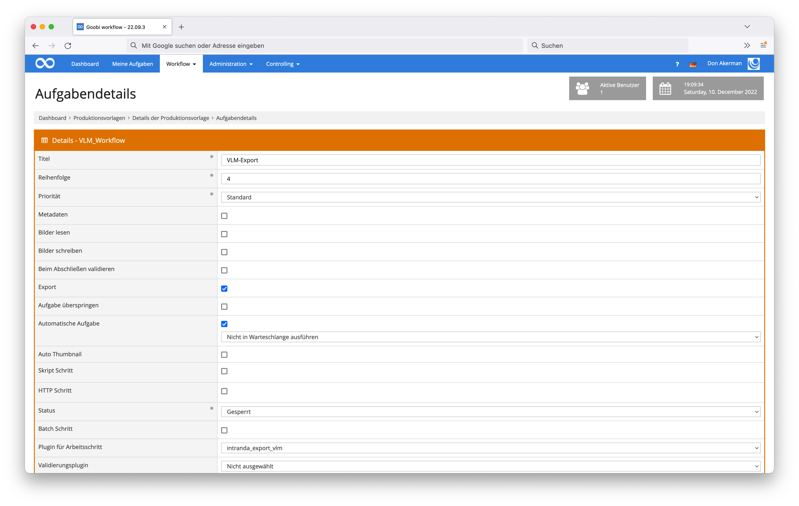

# VLM Export

## Übersicht

Name                     | Wert
-------------------------|-----------
Identifier               | intranda_export_vlm
Repository               | [https://github.com/intranda/goobi-plugin-export-vlm](https://github.com/intranda/goobi-plugin-export-vlm)
Lizenz              | GPL 2.0 oder neuer 
Letzte Änderung    | 25.07.2024 12:03:37


## Einführung
Die vorliegende Dokumentation beschreibt die Installation, Konfiguration und den Einsatz des VLM-Export-Plugins in Goobi.

Mithilfe dieses Plugins für Goobi können die Goobi-Vorgänge innerhalb eines Arbeitsschrittes an den konfigurierten Ort für VLM exportiert werden.


## Installation
Dieses Plugin wird in den Workflow so integriert, dass es automatisch ausgeführt wird. Zur Verwendung innerhalb eines Arbeitsschrittes des Workflows sollte es wie im nachfolgenden Screenshot konfiguriert werden.



Das Plugin muss zunächst in folgendes Verzeichnis kopiert werden:

```bash
/opt/digiverso/goobi/plugins/export/plugin_intranda_export_vlm-base.jar
```

Daneben gibt es eine Konfigurationsdatei, die an folgender Stelle liegen muss:

```bash
/opt/digiverso/goobi/config/plugin_intranda_export_vlm.xml
```


## Konfiguration
Die Konfiguration des Plugins erfolgt über die Konfigurationsdatei `plugin_intranda_export_vlm.xml`. Die Konfiguration kann im laufenden Betrieb angepasst werden. Im folgenden ist eine beispielhafte Konfigurationsdatei aufgeführt:

```xml
<?xml version="1.0" encoding="UTF-8"?>
<config_plugin>
	<!-- 
	Order of configuration is: 
	1.) project name matches
	2.) project is * 
	-->

	<!-- There could be multiple config blocks. -->
	<!-- Please make sure that the project names of different config blocks are also different. -->
	<!-- Given two config blocks with the same project name, the settings of the first one will be taken. -->
	<config>
		<!-- The name of the project -->
		<!-- MANDATORY -->
		<project>Archive_Project</project>
		
		<!-- The name of the system, e.g. AlmaIDDigital, AlephIDDigital, CatalogIDDigital.  -->
		<!-- This tag has the following two OPTIONAL attributes:
				- @anchorSplitter: if configured with a non-blank string, then it will be used to split the metadata value into two parts, where its head will be used 
						as the main folder's name, while its tail will be used as part of the volume's name. DEFAULT value is an empty string, i.e. no splitting expected.
				- @volumeFormat: only works when @anchorSplitter is configured with a non-blank string.
						It is used as the left padding if the volume's name is shorter than it. DEFAULT value is an empty string, i.e. no padding needed.
		 -->
		<!-- MANDATORY -->
		<identifier anchorSplitter="" volumeFormat="000">CatalogIDDigital</identifier>
	    
		<!-- The name to be used to distinguish between different volumes of one book series. -->
		<!-- Alternatively one may also choose "TitleDocMain", just assure its difference between volumes. -->
		<!-- Leave the default value unchanged if the book is a one-volume work. -->
		<!-- MANDATORY -->
		<volume>CurrentNoSorting</volume>
	    
		<!-- The place you would like to use for the export. -->
		<!-- Absolute path expected. No difference whether you append the directory separator '/' to the end or not. -->
		<!-- If left blank, then the default setting '/opt/digiverso/viewer/hotfolder' will be used. -->
		<path></path>
	    
		<!-- The prefix you would like to use for subfolders for different volumes. -->
		<!-- Leave it blank if no common prefix is needed. -->
		<subfolderPrefix>T_34_L_</subfolderPrefix>
		
		<!-- Whether or not use SFTP for the export. -->
		<!-- If true then use SFTP. If false then perform local export. -->
		<!-- If left blank, then the default setting 'false' will be used. -->
		<sftp>true</sftp>
		
		<!-- If true then use ssh key for connection. If false then use password. OPTIONAL. DEFAULT false. -->
		<useSshKey>false</useSshKey>
		
		<!-- Absolute path to the location of the file 'known_hosts'. -->
		<!-- If left blank, then the default setting '{user.home}/.ssh/known_hosts' will be used. OPTIONAL. -->
		<knownHosts></knownHosts>
		
		<!-- User name at the remote host. -->
		<!-- MANDATORY if sftp is set to be true. -->
		<username>CHANGE_ME</username>
		
		<!-- Name of the remote host. -->
		<!-- MANDATORY if sftp is set to be true. -->
		<hostname>CHANGE_ME</hostname>
		
		<!-- Port of the remote host. -->
		<!-- OPTIONAL. DEFAULT 22. -->
		<port>CHANGE_ME</port>
		
		<!-- Password to log into the remote host 'username'@'hostname'. -->
		<!-- MANDATORY if sftp is set to be true, while useSshKey is set to be false or not set. -->
		<password>CHANGE_ME</password>
		
		<!-- Path to the private key file, e.g. ~/.ssh/id_rsa -->
		<!-- The key is expected to be of PEM format, beginning with `BEGIN RSA PRIVATE KEY`. -->
		<!-- The OPENSSH format, beginning with `BEGIN OPENSSH PRIVATE KEY`, is not supported yet. -->
		<!-- MANDATORY if sftp and useSshKey are both set to be true. -->
		<keyPath>CHANGE_ME</keyPath>
	</config>
	
	<config>
		<project>Manuscript_Project</project>		
		<identifier>CatalogIDDigital</identifier>		
		<volume>CurrentNoSorting</volume>	
		<!-- Setting up path using a goobi variable. -->
		<!-- No difference whether you add a '/' between '}' and '..' or not. -->		
		<path>{goobiFolder}../viewer/hotfolder/</path>
		<!-- No common prefix needed. -->
		<subfolderPrefix></subfolderPrefix>
		
		<sftp>false</sftp>
		<!-- Use the default setting '{user.home}/.ssh/known_hosts'. -->
		<knownHosts></knownHosts>
		
		<username></username>
		<hostname></hostname>
		<password></password>
	</config>

	<!-- Apply this configuration only under the condition that the `singleDigCollection` in the metadata is a 20 digit number -->
	<config>
		<project>Manuscript_Project</project>		
		<identifier>CatalogIDDigital</identifier>		
		<volume>CurrentNoSorting</volume>		
		<path>/tmp/somewhere</path>
		<subfolderPrefix></subfolderPrefix>
		
		<condition>
            <type>variablematcher</type>
            <field>{meta.singleDigCollection}</field>
            <matches>\d{20}</matches>
        </condition>
		
		<sftp>false</sftp>
		<knownHosts></knownHosts>
		
		<username></username>
		<hostname></hostname>
		<password></password>
	</config>
	
	<config>
		<project>*</project>
		<identifier>CatalogIDDigital</identifier>
		<volume>CurrentNoSorting</volume>		
		<!-- Setting up path using an ABSOLUTE path. -->
		<path>/opt/digiverso/viewer/hotfolder</path>
		<!-- No common prefix needed. -->
		<subfolderPrefix></subfolderPrefix>
		
		<!-- Use the default setting 'false'. -->
		<sftp></sftp>
		<!-- Use the default setting '{user.home}/.ssh/known_hosts'. -->
		<knownHosts></knownHosts>
		
		<username></username>
		<hostname></hostname>
		<password></password>
	</config>

</config_plugin>
```

| Parameter         | Erläuterung                                                                                                            |
|:----------------- |:---------------------------------------------------------------------------------------------------------------------- |
| `identifier`      | Dieser Parameter legt fest, welches Metadatum als Ordnername verwendet werden soll. Er hat zwei optionale Attribute `@anchorSplitter` und `@volumeFormat`, die für den Fall verwendet werden, dass der Wert dieses `Identifier`s selbst sowohl den Namen des Hauptordners als auch den Namen des Datenträgers enthält, getrennt durch den konfigurierten `@anchorSplitter`. `@volumeFormat` wird in diesem Fall als linker Auffüller für den Namen des Datenträgers verwendet.  |
| `volume`          | Dieser Parameter steuert, mit dem Inhalt welchen Metadatums die Unterverzeichnisse für Bände benannt werden sollen. |
| `path`            | Dieser Parameter legt den Export-Pfad fest, wohin die Daten exportiert werden sollen. Erwartet wird ein absoluter Pfad. |
| `condition`       | Dieses Element ist optional und kann mehrfach auftreten um Bedingungen zu definieren, unter welchen dieser Konfigurationsabschnitt verwendet werden kann. Das Format den `condition` Elements ist weiter unten beschrieben. Ein Konfigurationsabschnitt kann verwendet werden, wenn alle Bedingungen erfüllt sind. Wenn es mehrere Konfigurationsabschnitte gibt und mehr als eine verwendet werden könnte wird der Konfigurationsabschnitt mit den meisten Bedingungen ausgewählt (je spezieller die Bedingungen werden, desto höher ist die Priorität). Sollte das nicht eindeutig sein, wird ein beliebiger Konfigurationsabschnitt gewählt. In diesem Fall wird dem Benutzer eine Fehlermeldung angezeigt. |
| `subfolderPrefix` | Dieser Parameter beschreibt den Präfix, der für jeden Band eines mehrbändigen Werkes in der Ornderbezeichnung vorangestellt werden soll. (Beispiel `T_34_L_`: Hier steht `T_34` für die Erkennung zur Erstellung eines Strukturknotens des Typs `Band` und das `L` gibt an, dass danach ein Text kommt.) |
| `sftp`            | Dieser Parameter legt fest, ob der Export mittels SFTP stattfinden soll. |
| `useSshKey`        | Dieser Parameter legt fest, ob die Verbindung zum Remote-Host mithilfe einer SSH Schlüssel Datei zu erledigen. |
| `knownHosts`      | Dieser Parameter legt fest, wo die Datei namens `known_hosts` ist. Wenn keine Datei angegeben wurde, dann wird der Pfad `{user.home}/.ssh/known_hosts` genutzt. Sonst wird hier ein absoluter Pfad erwartet. |
| `username`        | Dieser Parameter legt fest, welcher Nutzername für die Anmeldung bei dem Remote-Host verwendet werden soll. |
| `hostname`        | Dieser Parameter legt fest, wie der Remote-Host heißt. |
| `port`        | Dieser Parameter definiert die Portnummer des Remote-Hosts. DEFAULT 22. |
| `password`        | Dieser Parameter definiert das Passwort, das für die Anmeldung mittels `username`@`hostname` verwendet werden soll. |
| `keyPath`        | Dieser Parameter legt fest, wo sich die SSH Schlüssel Datei befindet, die für die Anmeldung mittels `username`@`hostname` verwendet werden soll. |


### Format der Bedingungen
Aktuell gibt es nur eine mögliche Art von Bedingungen, die `variablematcher` Bedingung. Diese Art der Bedingung prüft eine beliebige Variable, welche im Feld `field` definiert wird, gegen einen regulären Ausdruck, welcher im Feld `matches` definiert wird.

Eine Beispiel `condition` ist hier zu sehen:
```xml
<condition>
    <type>variablematcher</type>
    <field>{meta.singleDigCollection}</field>
    <matches>\d{20}</matches>
</condition>
```

Diese Bedingung hat den Typen `variablematcher`. Sie prüft das Feld `{meta.singleDigCollection}`, welches dem Metadatum `singleDigCollection` entspricht. Die Bedingung prüft, ob der Wert des Metadatums dem regulären Ausdruck `\d{20}` entspricht, also ob der Wert aus 20 Ziffern besteht.