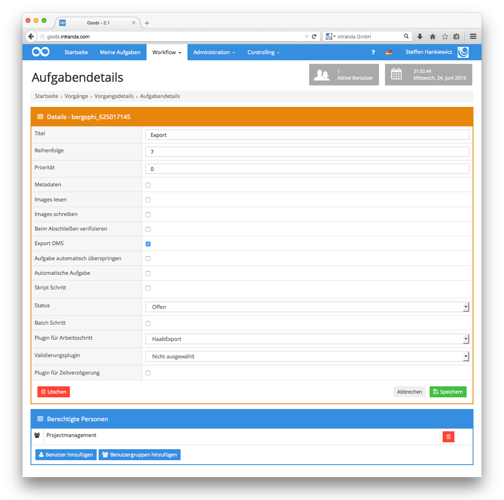

# HAAB Export

## Übersicht

Name                     | Wert
-------------------------|-----------
Identifier               | HaabExport
Repository               | [https://github.com/intranda/goobi-plugin-export-weimar-haab](https://github.com/intranda/goobi-plugin-export-weimar-haab)
Lizenz              | GPL 2.0 oder neuer 
Letzte Änderung    | 25.07.2024 11:45:20


## Einführung
Die vorliegende Dokumentation beschreibt die Installation, Konfiguration und den Einsatz eines Export-Plugins in Goobi, wie es für die Klassik Stiftung Weimar innerhalb des Digitalisierungsprojektes benötigt wird.

Mit Hilfe dieses Export-Plugins für Goobi können die Goobi-Vorgänge innerhalb eines Arbeitsschrittes gleichzeitig an mehrere Orte exportiert werden. Dabei bleiben die Besonderheiten der Klassik Stiftung Weimar, wie die Nutzung der EPNs als Identifier sowie das Zusammenführen von Einbänden und Blattschnitten zu einem gemeinsamen Strukturelement, bestehen.


## Installation
Das Plugin muss zunächst in folgendes Verzeichnis installiert werden:

```bash
/opt/digiverso/goobi/plugins/export/plugin_intranda_export_Haab-base.jar
```

Im Goobi-Konfigurationsverzeichnis muss im Rahmen der Installation die zusätzliche Plugin-Konfigurationsdatei unter dem folgenden Pfad bereitgestellt werden:

```bash
/opt/digiverso/goobi/config/plugin_HaabExportPlugin.xml
```


## Konfiguration
Der Inhalt der Konfigurationsdatei ist folgendermaßen aufgebaut:

```xml
<config_plugin>
        <exportFolder>/opt/digiverso/viewer/hotfolder/</exportFolder>
        <exportFolder>/opt/digiverso/archive/</exportFolder>
</config_plugin>
```

Mit Hilfe der Auflistung `<exportFolder>` können verschiedene Orte definiert werden, in die der Export erfolgen soll. Hierbei können beliebig viele Ordner definiert werden. Mindestens muss jedoch ein Ordner an dieser Stelle definiert sein.

Um das Export-Plugin nach der erfolgreichen Installation innerhalb des Workflows nutzen zu können, muss ein Arbeitsschritt definiert werden, bei dem die Funktion Export DMS aktiviert wurde. Darüber hinaus muss als Schritt-Plugin der Wert `HaabExport` eingetragen werden.

