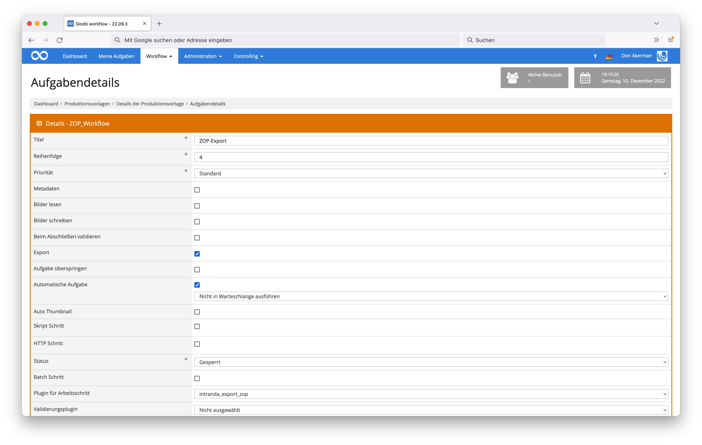

# ZOP Export

## Übersicht

Name                     | Wert
-------------------------|-----------
Identifier               | intranda_export_zop
Repository               | [https://github.com/intranda/goobi-plugin-export-zop](https://github.com/intranda/goobi-plugin-export-zop)
Lizenz              | GPL 2.0 oder neuer 
Letzte Änderung    | 25.07.2024 12:03:26


## Einführung
Die vorliegende Dokumentation beschreibt die Installation, Konfiguration und den Einsatz des ZOP-Export-Plugins in Goobi.

Mithilfe dieses Plugins für Goobi können die Goobi-Vorgänge innerhalb eines Arbeitsschrittes an den konfigurierten Ort für ZOP exportiert werden.


## Installation
Dieses Plugin wird in den Workflow so integriert, dass es automatisch ausgeführt wird. Zur Verwendung innerhalb eines Arbeitsschrittes des Workflows sollte es wie im nachfolgenden Screenshot konfiguriert werden.



Das Plugin muss zunächst in folgendes Verzeichnis kopiert werden:

```bash
/opt/digiverso/goobi/plugins/export/plugin_intranda_export_zop-base.jar
```

Daneben gibt es eine Konfigurationsdatei, die an folgender Stelle liegen muss:

```bash
/opt/digiverso/goobi/config/plugin_intranda_export_zop.xml
```


## Konfiguration
Die Konfiguration des Plugins erfolgt über die Konfigurationsdatei `plugin_intranda_export_zop.xml`. Die Konfiguration kann im laufenden Betrieb angepasst werden. Im folgenden ist eine beispielhafte Konfigurationsdatei aufgeführt:

```xml
<?xml version="1.0" encoding="UTF-8"?>
<config_plugin>
	<!--
	Order of configuration is:
	1.) project name matches
	2.) project is *
	-->

	<!-- There could be multiple config blocks. -->
	<!-- Please make sure that the project names of different config blocks are also different. -->
	<!-- Given two config blocks with the same project name, the settings of the first one will be taken. -->
	<config>
		<!-- The name of the project. -->
		<!-- MANDATORY -->
		<project>Archive_Project</project>

		<!-- The name of the item identifier, e.g. CatalogIDDigital.  -->
		<!-- For one-volume works, the value of this Metadata field will be used as the folder's as well as the .ctl file's name. -->
		<!-- For multi-volume works, the value of this Metadata field will be used as the name's first part. -->
		<!-- MANDATORY -->
		<identifier>CatalogIDDigital</identifier>

		<!-- The name to be used to distinguish between different volumes of one book series. -->
		<!-- Alternatively one may also choose "TitleDocMain", just assure its difference between volumes. -->
		<!-- For one-volume works, the value of this Metadata field will not be used. BUT do NOT leave it blank anyway. -->
		<!-- For multi-volume works, the value of this Metadata field will be used as the second part of the folder's and the .ctl file's name. -->
		<!-- MANDATORY -->
		<volume>CurrentNoSorting</volume>

		<!-- The place you would like to use for the export. -->
		<!-- Absolute path expected. No difference whether you append the directory separator '/' to the end or not. -->
		<!-- If left blank, then the default setting '/opt/digiverso/viewer/hotfolder' will be used. -->
		<path></path>
		
		<!-- Whether or not use SFTP for the export. -->
		<!-- If true then use SFTP. If false then perform local export. -->
		<!-- If left blank, then the default setting 'false' will be used. -->
		<sftp>true</sftp>

		<!-- User name at the remote host. -->
		<!-- MANDATORY if sftp is set to be true. -->
		<username>CHANGE_ME</username>

		<!-- Name of the remote host. -->
		<!-- MANDATORY if sftp is set to be true. -->
		<hostname>CHANGE_ME</hostname>

		<!-- Path to the private key file, e.g. ~/.ssh/id_rsa -->
		<!-- The key is expected to be of PEM format, beginning with `BEGIN RSA PRIVATE KEY`. -->
		<!-- The OPENSSH format, beginning with `BEGIN OPENSSH PRIVATE KEY`, is not supported yet. -->
		<!-- MANDATORY if sftp is set to be true. -->
		<keyPath>CHANGE_ME</keyPath>
	</config>

	<config>
		<project>Manuscript_Project</project>
		<identifier>CatalogIDDigital</identifier>
		<volume>CurrentNoSorting</volume>
		<!-- Setting up path using a goobi variable. -->
		<!-- No difference whether you add a '/' between '}' and '..' or not. -->		
		<path>{goobiFolder}../viewer/hotfolder/</path>
		
		<sftp>false</sftp>
		<username></username>
		<hostname></hostname>
		<keyPath></keyPath>
	</config>

	<config>
		<project>*</project>
		<identifier>CatalogIDDigital</identifier>
		<volume>CurrentNoSorting</volume>
		<!-- Setting up path using an ABSOLUTE path. -->
		<path>/opt/digiverso/viewer/hotfolder</path>
		
		<!-- Use the default setting 'false'. -->
		<sftp></sftp>
		<username></username>
		<hostname></hostname>
		<keyPath></keyPath>
	</config>

</config_plugin>
```

| Parameter         | Erläuterung                                                                                                            |
|:----------------- |:---------------------------------------------------------------------------------------------------------------------- |
| `identifier`      | Dieser Parameter legt fest, welches Metadatum als Ordnername verwendet werden soll. |
| `volume`          | Dieser Parameter steuert, mit dem Inhalt welchen Metadatums die Unterverzeichnisse für Bände benannt werden sollen. |
| `path`            | Dieser Parameter legt den Export-Pfad fest, wohin die Daten exportiert werden sollen. Erwartet wird ein absoluter Pfad. |
| `sftp`            | Dieser Parameter legt fest, ob der Export mittels SFTP stattfinden soll. |
| `username`        | Dieser Parameter legt fest, welcher Nutzername für die Anmeldung bei dem Remote-Host verwendet werden soll. |
| `hostname`        | Dieser Parameter legt fest, wie der Remote-Host heißt. |
| `keyPath`        | Dieser Parameter legt fest, mit welcher privaten Schlüssel bei `username`@`hostname` verwendet werden soll. |