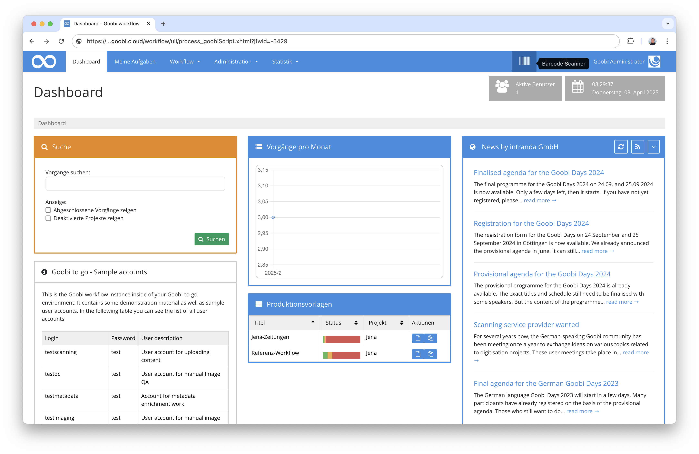
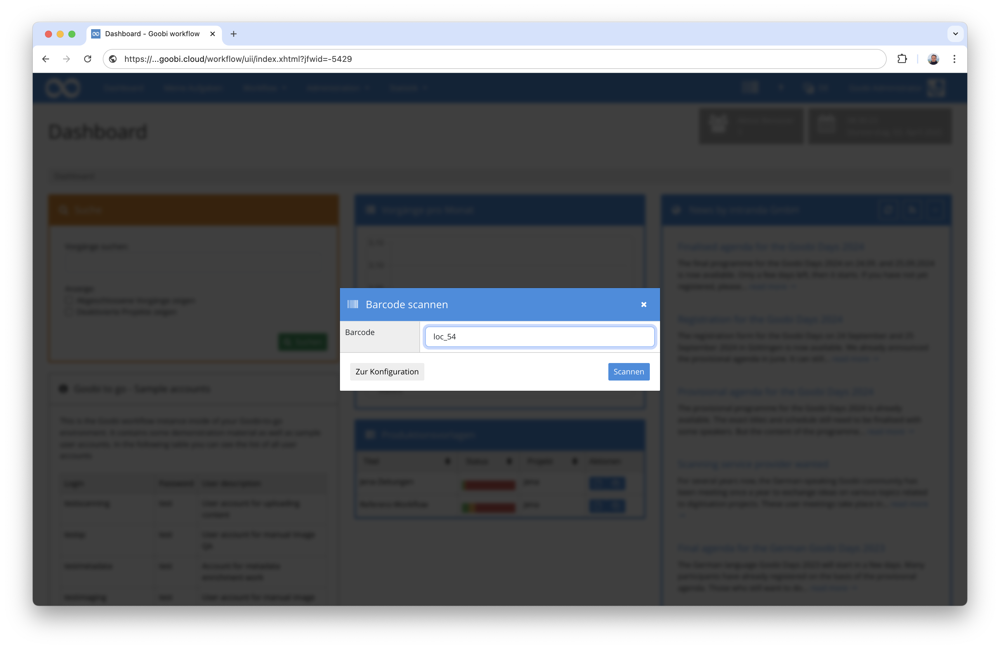
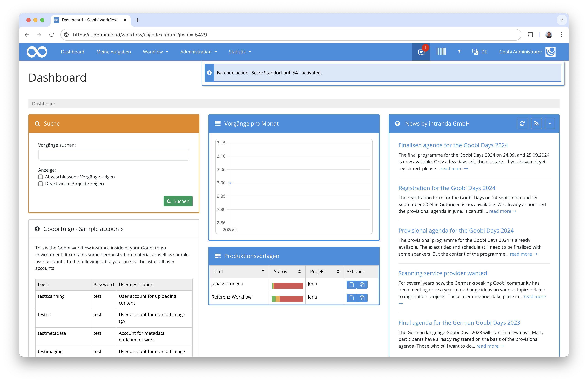
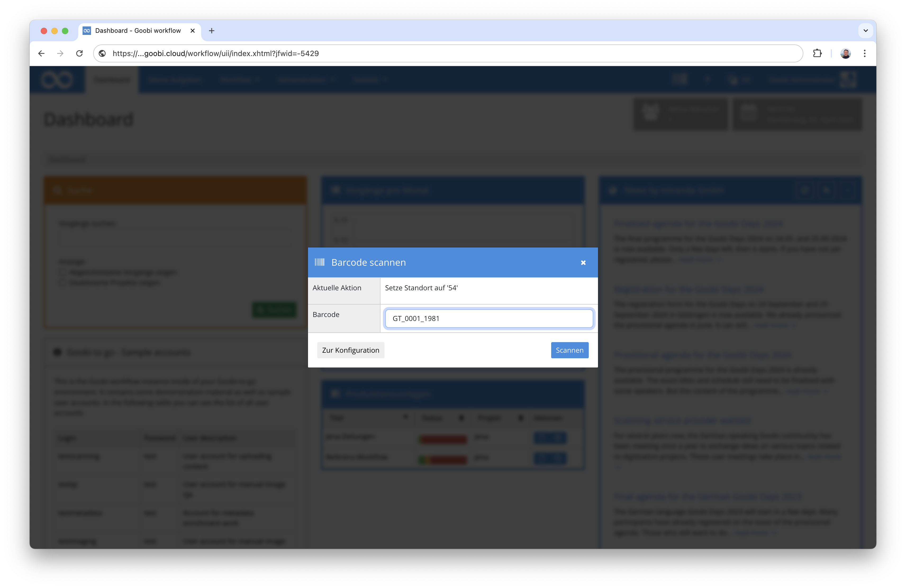
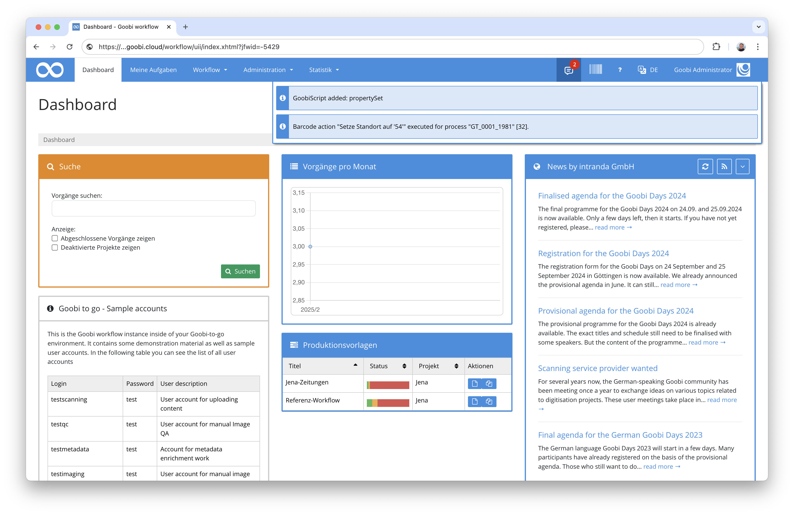
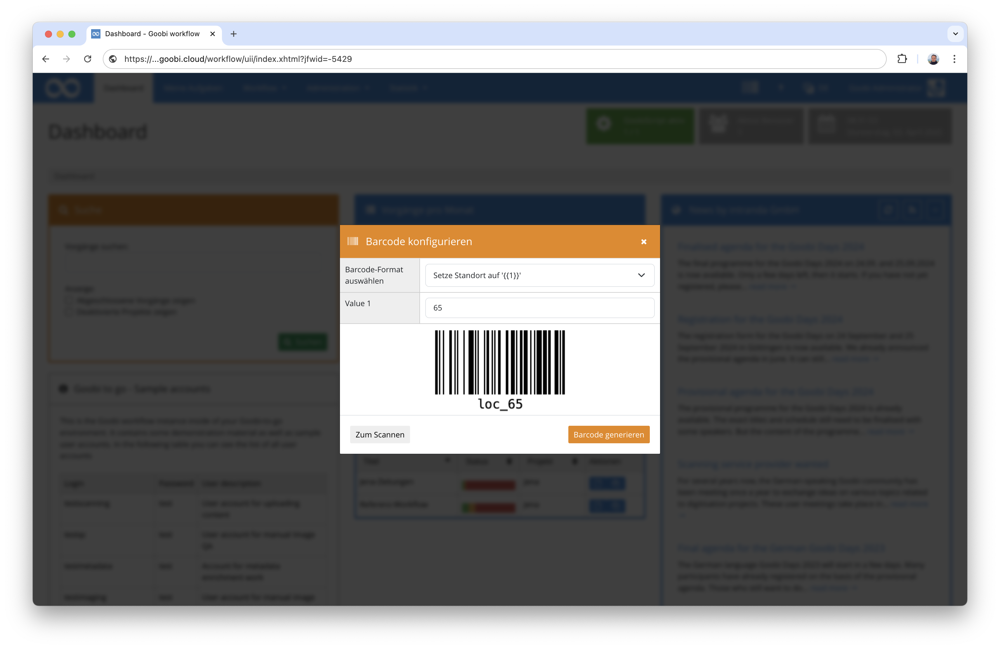

# Barcode Scanner

## Übersicht

Name                     | Wert
-------------------------|-----------
Identifier               | intranda_generic_barcodeScanner
Repository               | [https://github.com/intranda/goobi-plugin-generic-barcode-scanner](https://github.com/intranda/goobi-plugin-generic-barcode-scanner)
Lizenz              | GPL 2.0 oder neuer 
Letzte Änderung    | 03.04.2025 14:24:35


## Einführung
Dieses Plugin erlaubt die Ausführung beliebiger, konfigurierbarer GoobiScripte durch das Scannen von parametrisierten Barcodes. 


## Installation
Um das Plugin nutzen zu können, müssen folgende Dateien installiert werden:

```bash
/opt/digiverso/goobi/plugins/generic/plugin-generic-barcode-scanner-base.jar
/opt/digiverso/goobi/plugins/GUI/plugin-generic-barcode-scanner-gui.jar
/opt/digiverso/goobi/config/plugin_intranda_generic_barcodeScanner.xml
```

Nach der Installation des Plugins kann dieses konfigurierbar an verschiedenen Stellen der Nuzteroberfläche eingebunden werden (beispielsweise als Barcode-Button in der Menüleiste).




## Überblick und Funktionsweise
Beim Betreten des Plugins erscheint ein Dialogfenster, in dem Barcodes sowohl gescannt als auch generiert werden können.

### Scan-Ansicht
In der Scanansicht des Plugins kann dann im Feld `Barcode` ein Barcode von Hand eingetragen oder über einen Barcodescanner gescannt werden.



Wenn der Barcode einem konfigurierten Barcodeformat entspricht, wird das entsprechende GoobiScript aktiv geschaltet.



Wenn das Plugin erneut betreten wird und dann ein Vorgangstitel gescannt wird, wird das zuvor aktivierte GoobiScript auf diesen Vorgang angewandt.




Anstelle von Vorgängen können auch Batches gescannt werden. In diesem Fall wird das GoobiScript für alle Vorgänge des Batches ausgeführt.

### Konfigurationsansicht
In der Konfigurationsansicht des Plugins können für konfigurierte Barcodeformate Barcodes erzeugt werden. Wählen Sie hierzu ein Barcodeformat
aus der Drop-Down Liste aus. Danach können für alle Parameter des Barcodeformats Werte eingetragen werden. Anschließend können Sie den so konfigurierten Barcode generieren lassen, um ihn beispielsweise via Drag-and-Drop in beliebigen anderen Programmen nachnutzen oder ausdrucken zu können.




## Konfiguration
Die Konfiguration des Plugins erfolgt in der Datei `plugin_intranda_generic_barcodeScanner.xml` wie hier aufgezeigt:

```xml
<config>
    <docking>MENU_BAR</docking>
    <barcode description="Setze Vorgangseigenschaft '{{1}}' auf '{{2}}'" pattern="ps_(.*)_(\d+)" sample="ps_Standort_54">
        ---
        action: propertySet
        name: {{1}}
        value: {{2}}
	</barcode>
</config>
```

### Allgemeine Parameter 
Der Block `<config>` enthält Parameter, die für alle generischen Plugins verwendet werden können: 

| Parameter | Erläuterung | 
| :-------- | :---------- | 
| `docking` | Mit diesem Element wird gesteuert, wo das Plugin eingebunden werden soll. Mit `MENU_BAR` kann das Plugin beispielsweise in der Hauptleiste eingeblendet werden. Das Element kann wiederholt werden, um das Plugin an mehreren Stellen einzubinden. Derzeit sind hierfür die Werte `FOOTER` und `MENU_BAR` wählbar, um das Plugin entweder in der Menüleiste oder in der Footerleiste anzuzeigen. | 


### Weitere Parameter 
Neben den allgemeinen Parametern stehen die folgenden Parameter für die weitergehende Konfiguration zur Verfügung: 


Parameter               | Erläuterung
------------------------|------------------------------------
`barcode`               | Das `barcode` Element kann beliebig häufig wiederholt werden, um Barcodeformate zu spezifizieren. Ein Barcodeformat hat die Attribute `description`, `pattern` und `sample`. <br /><br />Die `description` ist eine textuelle Beschreibung des Barcodeformats. Falls das Barcodeformat Parameter enthalten kann, können diese mit `{{n}}` in die Beschreibung eingebunden werden. Hierbei ist `n` durch die Nummer des Parameters zu ersetzen, beginnend bei `1`.<br /><br />Das `pattern` ist ein regulärer Ausdruck, der den gesamten Barcode beschreibt. Im regulären Ausdruck können mit Klammern Gruppen definiert werden. Das kann verwendet werden, um Teile des Barcodes als Parameter zu definieren. Im Falle der Beispielkonfiguration ist `(\d+)` eine Gruppe, die eine Zahl mit mindestens einer Ziffer beschreibt. Diese Gruppe ist dann als `{{1}}` (der erste Parameter) verwendbar.<br /><br />Das `sample` ist ein möglicher Beispielbarcode. Dieser wird bei der Barcodegenerierung verwendet, um mögliche Beispielbarcodes anzeigen zu können. Dieser Beispielbarcode muss zum regulären Ausdruck passen.<br /><br />Der Inhalt des `barcode` Elements ist ein beliebiges GoobiScript. Es können mit `---` auch mehrere GoobiScripte hintereinander eingetragen werden. Mit `{{n}}` können die Parameter des Barcodes im GoobiScript verwendet werden.

Weil die Konfiguration etwas komplex ist, erklären wir sie am Beispiel des zweiten Barcodeformats in der Konfiguration:

Der Barcode hat die Beschreibung `Setze Vorgangseigenschaft '{{1}}' auf '{{2}}'`. Der reguläre Ausdruck ist `ps_(.*)_(\d+)` und ein Beispielbarcode könnte `ps_Standort_54` sein.
Der reguläre Ausdruck passt zu allen Eingaben die mit `ps_` beginnen, danach kann irgendetwas beliebiges folgen, dann wieder ein Unterstrich `_` gefolgt von einer Zahl mit mindestens einer Ziffer.
Wird ein solcher Barcode gescannt, beispielsweise `ps_Standort_54`, wird folgendes GoobiScript aktiviert:

```yaml
action: propertySet
name: Standort
value: 54
```
Die beiden Platzhalten `{{1}}` und `{{2}}` wurden hier bereits durch die Werte `Standort` und `54` des gescannten Barcodes ersetzt.

Wenn jetzt ein Vorgangstitel gescannt wird, wird dieses GoobiScript für den Vorgang ausgeführt. Das hat dann zur Folge, dass die Vorgangseigenschaft `Standort` auf den Wert `54` gesetzt wird.