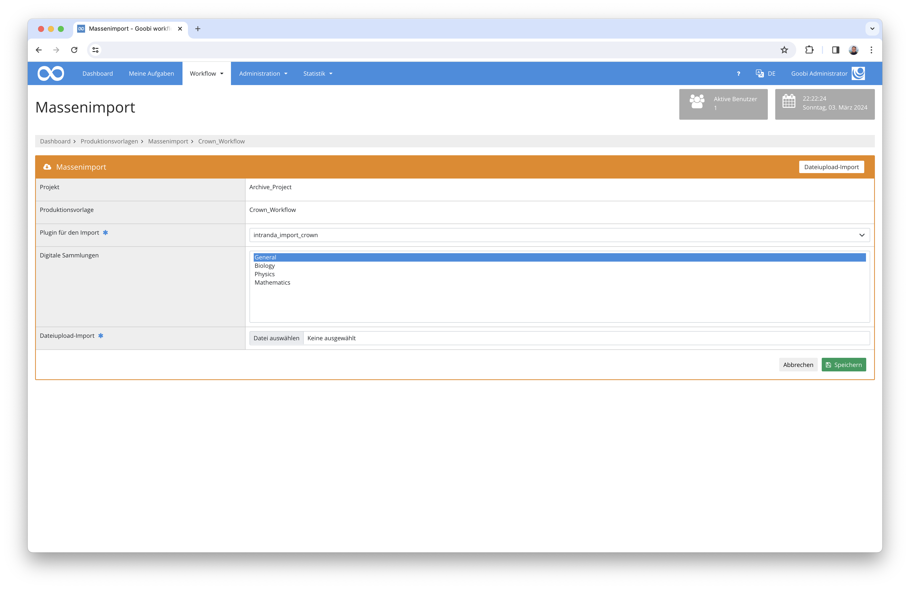

# Archiv-Daten-Import

## Übersicht

Name                     | Wert
-------------------------|-----------
Identifier               | intranda_import_crown
Repository               | [https://github.com/intranda/goobi-plugin-import-crown](https://github.com/intranda/goobi-plugin-import-crown)
Lizenz              | GPL 2.0 oder neuer 
Letzte Änderung    | 25.07.2024 12:03:18


## Einführung
Die vorliegende Dokumentation beschreibt die Installation, Konfiguration und den Einsatz des Importplugins für Archiv-Daten aus einer hierarchisch organisierten Exceldatei.

Mithilfe dieses Plugins können Daten aus einer Exceldatei importiert werden. Dabei werden die einzelnen Zeilen zu Goobi-Vorgängen konvertiert und es können Bilder automatisch mit importiert werden. Darüber hinaus wird ebenfalls eine hierarchische EAD-Tektonik erstellt.


## Installation
Um das Plugin nutzen zu können, müssen folgende Dateien installiert werden:

```bash
/opt/digiverso/goobi/plugins/import/plugin_intranda_import_crown-base.jar
/opt/digiverso/goobi/config/plugin_intranda_import_crown.xml
```

Außerdem muss die XML-Datenbank `BaseX` im Hintergrund laufen und korrekt eingerichtet sein. Die Installation wird [hier](https://docs.goobi.io/goobi-workflow-plugins-de/administration/intranda_administration_archive_management/installation_for_productive_use) detailliert beschrieben.


## Überblick und Funktionsweise
Um den Import zu nutzen, muss in den Produktionsvorlagen der Massenimportbereich geöffnet werden und im Reiter Dateiupload-Import das Plugin `intranda_import_crown` ausgewählt werden. Anschließend kann eine Excel-Datei hochgeladen und importiert werden.



Die zu importierende Exceldatei muss beispielhaft eine folgende Struktur beinhalten:

|  |  |          |                       |                                |          |     |                                                  |
|:---|:---|:---|:---|:---|:---|:---|:---|
|  |  |          |                       |                                |                                                        |  Shelfmark       | Comment |
| **CR_1** | <font color="grey">Reichskrone</font> |          |                       |                                |                                                        | CR_1 | comment |
|      | **CR_1_A-H**    | <font color="grey">Kronreif</font> |                       |                                |                                                        | CR_1_A-H | another comment |
|      |             | **CR_1_A**   | <font color="grey">Platte A, Stirnplatte</font> |                                |                                                        |   |   |
|      |             |          | **CR_1_A_GrPl**           | <font color="grey">Grundplatte</font>                    |                                                        |   |   |
|      |             |          |                       | **CR_1_A_GrPl_1**                  | <font color="grey">Riss in Grundplatte (?)</font>                                |   |   |
|      |             |          |                       | **CR_1_A_GrPl_2**                  | <font color="grey">Riss in Grundplatte und Grundplattenperldrahtumsäumung</font> |   |   |
|      |             |          |                       | **CR_1_A_GrPl_3**                  | <font color="grey">Riss in Grundplatte</font>                                    |   |   |
|      |             |          |                       | **CR_1_A_GrPl_4**                  | <font color="grey">Riss in Grundplatte und Grundplattenperldrahtumsäumung</font> |   |   |
|      |             |          |                       | **CR_1_A_GrPl_5**                  | <font color="grey">Deformierung von Grundplatte</font>                           |   |   |
|      |             |          |                       | **CR_1_A_GrPl_6**                  | <font color="grey">Steg durch Öffnung in Grundplatte hinter Fa_4</font>          |   |   |
|      |             |          |                       | **CR_1_A_GrPl_7**                  | <font color="grey">4 Löcher in Grundplatte</font>                                |   |   |
|      |             |          |                       | **CR_1_A_GrPl_8**                  | <font color="grey">Löcher in Grundplatte</font>                                  |   |   |
|      |             |          |                       | **CR_1_A_GrPl_9**                  | <font color="grey">4 Löcher in Grundplatte</font>                                |   |   |
|      |             |          |                       | **CR_1_A_GrPl_10**                 | <font color="grey">angelöteter Span auf Grundplatte</font>                       |   |   |
|      |             |          | **CR_1_A_SchS**           | <font color="grey">Scharnierstift</font>                 |                                                        |   |   |
|      |             |          | CR_1_A_SchR           | <font color="grey">Scharnierrohre</font>                 |                                                        |   |   |
|      |             |          |                       | **CR_1_A_SchR_1**                  | <font color="grey">Scharnierrohr</font>                                          |   |   |
|      |             |          |                       | **CR_1_A_SchR_2**                  | <font color="grey">Scharnierrohr</font>                                          |   |   |
|      |             |          |                       | **CR_1_A_SchR_3**                  | <font color="grey">Scharnierrohr</font>                                          |   |   |
|      |             |          | **CR_1_A_GrUm**           | <font color="grey">Grundplattenperldrahtumsäumung</font> |                                                        |   |   |
|      |             |          |                       | **CR_1_A_GrUm_1**                  | <font color="grey">Grundplattenperldrahtumsäumung</font>                         |   |   |
|      |             |          |                       | **CR_1_A_GrUm_2**                  | <font color="grey">Grundplattenperldrahtumsäumung</font>                         |   |   |
|      |             |          | **CR_1_A_GrFi**           | <font color="grey">Grundplattenfiliigrandekor</font>     |                                                        |   |   |
|      |             |          | CR_1_A_RoeG           | <font color="grey">Röhrchen mit Granalien</font>         |                                                        |   |   |
|      |             |          |                       | **CR_1_A_RoeG_1**                  | <font color="grey">Röhrchen mit Kugelpyramide</font>                             |   |   |
|      |             |          |                       | **CR_1_A_RoeG_2**                  | <font color="grey">Röhrchen mit Kugelpyramide</font>                             |   |   |


Diese Excel-Datei wird während des Imports zeilenweise eingelesen und analysiert. Dabei wird zuerst geprüft, wie tief die aktuelle Zeile eingerückt wurde. Ist keine Einrückung vorhanden, liegt das root-Element der Tektonik vor. Ansonsten handelt es sich um Unterelemente. Das übergeordnete Element einer jeden Zeile ist dabei jeweils das letzte Element mit einer geringeren Einrückung.

Als nächstes wird der Inhalt der Zellen gelesen. Dabei werden sowohl die hierarchisch eingerückten Zellen als auch eventuell vorhandene fest definierte Spalten beachtet.

Welcher Inhalt zu welchem EAD- oder Metadatenfeld importiert wird, wird in der dazugehörigen Konfigurationsdatei festgelegt.

Wenn die erste Information innerhalb der Excel-Datei **fett** formatiert ist, wird für diese Zeile auch ein Vorgang erstellt und nach zugehörigen Bildern gesucht. Diese Bilder werden innerhalb eines konfigurierten Ordners in Unterordnern erwartet, die nach der Inventarnummer benannt sind. Diese können entweder flach in einer Ordnerliste organisiert sein oder der gleichen hierarchischen Struktur folgen wie die Tektonik.

Wird ein Ordner gefunden, werden alle darin enthaltenen Dateien aufgelistet und nach folgenden Regeln geprüft:

1. ignoriere alle Daten, die kein `tif`, `jpg` oder ´wmv` sind
2. ignoriere alle Dateien, die das Wort `komprimiert`´` enthalten
3. wenn eine Datei ohne den suffix `_bearbeitet` gefunden wurde, prüfe, ob es eine Datei mit dem gleichen Namen und dem suffix `_bearbeitet` gibt. Falls ja, ignoriere die aktuelle Datei un nutze die Version mit `_bearbeitet`
4. wenn eine `jpg`-Datei gefunden wurde, prüfe, ob es ein `tif` mit dem gleichen Namen gibt, falls ja, ignoriere die `jpg`-Datei und nutze das `tif`


## Konfiguration
Die Konfiguration erfolgt in der Datei `plugin_intranda_import_crown.xml`:

```xml
<config_plugin>
	<config>
		<!-- which workflow template shall be used -->
		<template>*</template>

		<!-- define if import shall use GoobiScript to run in the background -->
		<runAsGoobiScript>false</runAsGoobiScript>
		
		<!-- first data row in excel file -->
		<startRow>7</startRow>

		<!-- basex database name and file name -->
        <basex>
            <database>EadStore</database>
            <filename>ead.xml</filename>
        </basex>

              <!-- metadata -->
        <metadata>
            <!-- document type for the process, can be a fixed value or a column header name -->
            <doctype>File</doctype>

            <!-- column header for the node type, leave it empty when a fixed type should be used (file for nodes with processes, folder for all other)  -->
            <nodetype></nodetype>
            
            <!-- process title metatada -->
            <!-- can be generated from other fields like "CatalogIDDigital + '_' + ContentDescription" , or use 'first' and 'second' to get the hierarchical information-->
            <title>first</title>

            <!--    
                - @eadField: name of the field in ead record
                - @metadataField: name of the metadata field in mets file
                - @identifier: one field must be marked as the identifier field
                - @level: metadata level, allowed values are 1-7:
                    * 1: metadata for Identity Statement Area 
                    * 2: Context Area 
                    * 3: Content and Structure Area
                    * 4: Condition of Access and Use Area
                    * 5: Allied Materials Area
                    * 6: Note Area
                    * 7: Description Control Area 
                    -->
            <firstField eadField="recordid" metadataField="CatalogIDDigital" level="1" identifier="true" />

            <!-- if enabled is set to false, the field is not searched in the hierarchical part. In this case, a
            separate configuration for the fixed area can exist -->
            <secondField enabled="true" metadataField="TitleDocMain" eadField="unittitle" level="1"/>

            <!-- fixed metadata columns-->
            <additionalField column="Shelfmark" eadField="Shelfmark" metadataField="shelfmarksource" level="1"/>
            <additionalField column="Comment" eadField="oddnote" metadataField="Odd" level="6"/>

        <!-- image folder name. Sub folder are organized by the identifier metadata -->
        <images>/opt/digiverso/import/crown/</images>


	</config>
</config_plugin>
```

Im Feld `<template>` wird definiert, für welche Produktionsvorlage die vorliegende Konfiguration angewendet werden soll. Da das `<config>`-Element wiederholbar ist, sind unterschiedliche Konfigurationen für verschiedene Produktionsvorlagen möglich. So kann es zum Beispiel für die Reichskrone eine andere Konfiguration geben als für den Reichsapfel.

Das Feld `<runAsGoobiScript>` steuert, ob der Import direkt in der Nutzersession oder im Hintergrund als GoobiScript ausgeführt wird. Bei größeren Exceldateien empfielt sich die Nutzung von GoobiScript.

`<startRow>` legt fest, welche Zeile die erste Datenzeile der Exceldatei ist. Damit können oberhalb weitere Informationen wie Header, Beschreibungen oder Hilfetexte angegeben werden, die dann vom Import ignoriert werden.

Der Bereich `<basex>` legt fest, wo die EAD-Tektonik gespeichert wird. Das Unterelement `<database>` enthält den Namen der BaseX-Datenbank, diese muss bereits existieren. In `<filename>` wird der Name der EAD-Datei festgelegt. Wenn dieser Name bereits verwendet wird, werden vorhandene Daten überschrieben.

Der root-Ordner der Bilder wird im `<images>` Element festgelegt. `<metadata>` enthält die zu verwendenden Metadaten. Mittels `<doctype>` wird der Strukturtyp definiert und die Felder `<title>`, `<identifier>` und `<description>` enthalten die Namen der Metadaten für Titel, Inventarnummer und Beschreibungstext.

Das Mapping der Metadaten passiert innerhalb des `<metadata>` Blocks. Hier wird in `<doctype>` festgelegt, welcher Publikationstyp für die einzelnen METS-Dateien verwendet werden soll.

Anschließend kann der zu verwendende Knotentyp definiert werden, falls dieser als Excelspalte vorhanden ist. Dies passiert in `<nodetype>`. Wenn dies nicht der Fall ist, kann das Feld leer gelassen werden. Dann wird für alle Knoten, für die ein Vorgang erstellt wurde, `file` genutzt, alle anderen Knoten bekommen den Typ `folder`. 

In `<title>` wird die Generierung der Vorgangstitel konfiguiert. Hier gelten die selben Regeln wie in der normalen Anlegemaske. Zusätzlich stehen die beiden Schlüsselworte `first` und `second` zur Verfügung, um auf den Inhalt der beiden hierarchischen Felder zugreifen zu können.

Anschließend erfolgt die Konfiguration des Metadatenmappings zu EAD und METS/MODS. In `<firstField>` wird das erste hierarchische Feld definiert, `<secondField>` enthält optional den Inhalt des zweiten Feldes. Wenn nur mit einem Feld gearbeitet wird, kann es mittels `enabled="false"` deaktiviert werden. Zusätzliche, fest definierte Spalten lassen sich mittels `<additionalField>` konfigurieren. Hier muss im Attribut `column` angegeben werden, wie die Überschrift der Spalte lautet. Die anderen Konfigurationsoptionen sind identisch zu den anderen beiden. Das Feld `metadataField` definiert das zu verwendende Metadatum innerhalb der METS/MODS Datei. In `eadField` wird das entsprechende Feld im EAD-Knoten definiert und `level` gibt an, in welchem Bereich sich das Metadatum befindet. 

Zusätzlich muss ein Feld als `identifier="true"` markiert werden. Der Inhalt dieses Feldes muss für jede Zeile innerhalb des Dokuments eindeutig sein und wird für die `id` der EAD-Knoten und das Metadatum `NodeId` verwendet. Es dient zur Verknüpfung zwischen EAD-Knoten und Goobi-Vorgang.