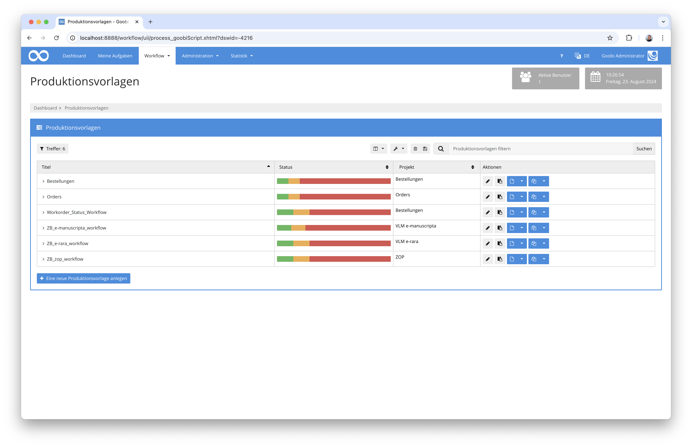
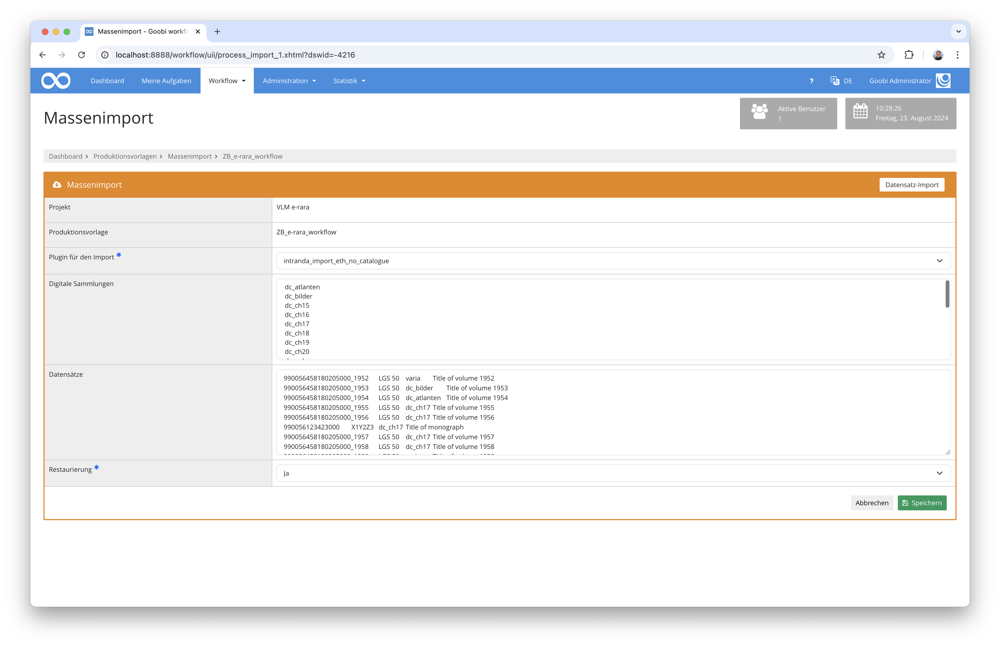

# Datenimport ohne Katalogabfrage für die ETH Zürich

## Übersicht

Name                     | Wert
-------------------------|-----------
Identifier               | intranda_import_eth_no_catalogue
Repository               | [https://github.com/intranda/goobi-plugin-import-eth-no-catalogue](https://github.com/intranda/goobi-plugin-import-eth-no-catalogue)
Lizenz              | GPL 2.0 oder neuer 
Letzte Änderung    | 16.02.2025 11:25:03


## Einführung
Dieses Import-Plugin erlaubt das Einspielen von Daten ohne vorherige Katalogabfrage. Dabei werden in der Nutzeroberfläche Daten eingefügt, die zuvor aus einer Excel-Datei kopiert wurden und wo deren Spalten mittels `TAB` voneinander getrennt sind.

## Installation
Um das Plugin nutzen zu können, müssen folgende Dateien installiert werden:

```bash
/opt/digiverso/goobi/plugins/import/plugin-import-eth-no-catalogue-base.jar
/opt/digiverso/goobi/config/plugin_intranda_import_eth_no_catalogue.xml
```

Nach der Installation des Plugins, kann dieses aus der Übersicht der Produktionsvorlagen durch Nutzung des zweiten blauen Buttons neben der gewählten Produktionsvorlage betreten werden.



Wenn das Plugin betreten wurde, steht eine Nutzeroberfläche zur Verfügung, in der die einzuspielenden Daten ausgewählt bzw. hochgeladen werden können.




## Überblick und Funktionsweise
Nach der Auswahl des richtigen Plugins können in der Nutzeroberfläche die Daten die entweder als CSV-Daten TAB-getrennt vorliegen oder die aus einer Excel-Datei kopiert werden in das Feld `Datensätze` eingefügt werden. Die Daten haben dabei den folgenden Aufbau:

### Vier Spalten für Monographien und Mehrbändige Werke
Wenn vier Spalten verwendet werden, haben diese den folgenden Aufbau:

Spalte    | Metadatum       | Erläuterung
----------|-----------------|-------------------------
`1`       | `MMS-ID`        | Wenn diese einen Unterstrich enthält, wird ein Mehrbändiges Werk angelegt, andernfalls eine Monographie. Hierbei handelt es sich um eine Pflichtangabe.
`2`       | `Signatur`      | Hierbei handelt es sich um eine Pflichtangabe.
`3`       | `Kollektion`    | Angabe der zuzuweisenden Kollektion. Hierbei handelt es sich um eine Pflichtangabe.
`4`       | `Titel`         | Hierbei handelt es sich um eine optionale Angabe.


### Zwei Spalten für Archivalien
Wenn zwei Spalten verwendet werden, haben diese den folgenden Aufbau:

Spalte    | Metadatum       | Erläuterung
----------|-----------------|-------------------------
`1`       | `Signatur`      | Hierbei handelt es sich um die Pflichtangabe der Signatur.
`2`       | `Datum`         | Hierbei handelt es sich um die Pflichtangabe des Digitalisierungsdatums.


### Acht Spalten für Karten
Wenn acht Spalten verwendet werden, haben diese den folgenden Aufbau:

Spalte    | Metadatum       | Erläuterung
----------|-----------------|-------------------------
`1`       | `Identifier`    | Hierbei handelt es sich um die Pflichtangabe des Identifiers.
`2`       | `Signatur`      | Hierbei handelt es sich um die Pflichtangabe der Signatur.
`3`       | `Sammlung`      | Hierbei handelt es sich um die Pflichtangabe der Sammlung.
`4`       | `Datum`         | Hierbei handelt es sich um die Pflichtangabe des Digitalisierungsdatums.
`5`       | `Einheiten`     | Hierbei handelt es sich um die Pflichtangabe der Einheiten.
`6`       | `Scans`         | Hierbei handelt es sich um die Pflichtangabe der Scans.
`7`       | `dpi`           | Hierbei handelt es sich um die Pflichtangabe der Auflösung.
`8`       | `Bemerkungen`   | Hierbei handelt es sich um die Pflichtangabe mit Bemerkungen.


Unmittelbar nach dem Einfügen der Daten und dem Klick auf `Speichern` startet das Anlegen der Vorgänge, ohne dass dabei ein Katalog abgefragt wird.


## Konfiguration
Die Konfiguration des Plugins erfolgt in der Datei `plugin_intranda_import_eth_no_catalogue.xml` wie hier aufgezeigt:

```xml
<config_plugin>
	<config>

		<!-- which workflow template shall be used -->
		<template>*</template>

		<!-- which digital collection to use 
		<collection>General</collection> 
		-->

		<!-- define if import shall use GoobiScript to run in the background -->
		<runAsGoobiScript>true</runAsGoobiScript>

	</config>
</config_plugin>

```

Die folgende Tabelle enthält eine Zusammenstellung der Parameter und ihrer Beschreibungen:

Parameter               | Erläuterung
------------------------|------------------------------------
`template`              | Hiermit kann festgelegt werden für welche Produktionsvorlabe der jeweilige `config`-Block gelten soll. 
`runAsGoobiScript`      | Mit diesem Parameter kann festgelegt werden, ob der Import als GoobiScript im Hintergrund stattfinden soll.