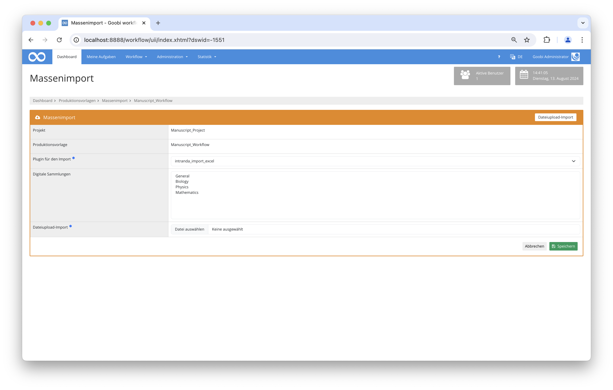

# Import von Datensätzen aus einer Excel-Datei

## Übersicht

Name                     | Wert
-------------------------|-----------
Identifier               | intranda_import_excel
Repository               | [https://github.com/intranda/goobi-plugin-import-excel](https://github.com/intranda/goobi-plugin-import-excel)
Lizenz              | GPL 2.0 oder neuer 
Letzte Änderung    | 13.08.2024 14:33:43


## Einführung
Die vorliegende Dokumentation beschreibt die Installation, die Konfiguration und den Einsatz des Plugins für den Massenimport von Datensätzen aus Excel-Dateien.


## Installation
Das Plugin muss in den folgenden Ordner installiert werden:

```bash
/opt/digiverso/goobi/plugins/import/plugin_intranda_import_excel-base.jar
```

Daneben gibt es eine Konfigurationsdatei, die an folgender Stelle liegen muss:

```bash
/opt/digiverso/goobi/config/plugin_intranda_import_excel.xml
```

## Überblick und Funktionsweise
Um den Import zu nutzen, muss in den Produktionsvorlagen der Massenimportbereich geöffnet werden und im Reiter Dateiupload-Import das Plugin `intranda_import_excel` ausgewählt werden. Anschließend kann eine Excel-Datei hochgeladen und importiert werden.

Der Import erfolgt anschließend zeilenweise. Dabei wird für jede Zeile ein neuer Vorgang erzeugt und die konfigurierten Regeln angewendet. Wenn dabei ein valider Datensatz erzeugt wurde und der generierte Vorgangstitel noch nicht vergeben wurde, wird der Vorgang tatsächlich erzeugt und gespeichert.



## Konfiguration
Die Konfiguration erfolgt über die Datei `plugin_intranda_import_excel.xml`. Diese Datei kann im laufenden Betrieb angepasst werden.

```xml
<config_plugin>
    <config>
        <!-- which workflow template shall be used -->
        <template>*</template>

        <!-- publication type to create -->
        <publicationType>Monograph</publicationType>

        <!-- which digital collection to use -->
        <collection>mycollection</collection>

        <!-- define if a catalogue shall get requested to import metadata -->
        <useOpac>true</useOpac>
        <!-- which catalogue to use (as default) -->
        <opacName>GBV PICA</opacName>
        <!-- which catalogue to use per record; if missing the default will be used -->
        <opacHeader>Catalogue</opacHeader>
        <searchField>12</searchField>

        <!-- define in which row the header is written, usually 1 -->
        <rowHeader>1</rowHeader>
        <!-- define in which row the data starts, usually 2 -->
        <rowDataStart>2</rowDataStart>
        <!-- define in which row the data ends, usually 20000 -->
        <rowDataEnd>20000</rowDataEnd>

        <!-- define which column is the one to use for catalogue requests -->
        <identifierHeaderName>PPN-A</identifierHeaderName>

        <!-- Rules to generate the process title, the same syntax as in goobi_projects.xml can be used.
            Use the column names to get the right metadata values.
            If the field is missing or empty, the value of CatalogIDDigital is used. -->
        <processTitleRule>2-Titel+'_'+PPN-O</processTitleRule>

        <!-- prefix path to the image folder. Can be empty or missing if the import doesn't contain images or if the excel field contains absolute path  -->
        <imageFolderPath>/opt/digiverso/images/</imageFolderPath>
        <!-- define which column contains the image folder name. Can be combined with <imageFolderPath> prefix or an absolute path.
        If the field is missing, empty or does not contain an existing directory, no images will be imported -->
        <imageFolderHeaderName>images</imageFolderHeaderName>

        <!-- defines, if images are moved from the source folder to the destination (true) or copied (false) -->
        <moveFiles>true</moveFiles>

        <!-- Run the import as GoobiScript -->
        <runAsGoobiScript>true</runAsGoobiScript>

        <!-- Overwrite any existing processes -->
        <replaceExistingProcesses>true</replaceExistingProcesses>

        <!-- define here which columns shall be mapped to which ugh metadata
            ugh: name of the metadata to use. if it is empty or missing, no metadata is generated
            headerName: title inside of the header column
            property: name of the process property. if it is empty or missing, no process property gets generated
            normdataHeaderName: title of the header column to use for a gnd authority identifier
            docType: define if the metadata should be added to the anchor or child element. Gets ignored, when the
            record is no multivolume. Default is 'child', valid values are 'child' and 'anchor' -->
        <metadata ugh="CatalogIDSource" headerName="PPN-A" />
        <metadata ugh="CatalogIDDigital" headerName="PPN-O" />
        <metadata ugh="TitleDocMain" headerName="2-Titel" />
        <metadata ugh="PlaceOfPublication" property="Ort" normdataHeaderName="4-GND-ORT" headerName="3-Ort" docType="anchor" />
        <metadata ugh="DocLanguage" headerName="10-DocLanguage" />

        <!-- a configuration for a person might look like this -->
        <person ugh="Author" normdataHeaderName="7-GND-Person" docType="child">
            <!-- use this field if the column contains the complete name -->
            <nameFieldHeader>11-Person</nameFieldHeader>
            <!-- set this field to true, if the name must be splitted into first- and lastname. The complete name gets written into lastname -->
            <splitName>true</splitName>
            <!-- define at which character the name is separated. @firstNameIsFirstPart defines, if the firstname is the first or last part of the name -->
            <splitChar firstNameIsFirstPart="false">, </splitChar>

            <!-- use this fields, if the firstname and lastname are in different columns -->
            <!--
            <firstnameFieldHeader>5-Vorname</firstnameFieldHeader>
            <lastnameFieldHeader>6-Nachname</lastnameFieldHeader>
            -->
        </person>

    </config>

    <config>
        <template>json_opac_import</template>
        <publicationType>Monograph</publicationType>
        <collection>DefaultCollection</collection>

        <useOpac>true</useOpac>
        <opacName>ArchiveSpace</opacName>
        <rowHeader>1</rowHeader>
        <rowDataStart>2</rowDataStart>
        <rowDataEnd>20000</rowDataEnd>

        <processTitleRule>aspace_uri+bib_id+'_'+barcode+holdings+item</processTitleRule>

        <runAsGoobiScript>false</runAsGoobiScript>

        <metadata opacSearchField="ao" headerName="aspace_uri" />
        <metadata opacSearchField="bib" headerName="bib_id" />
        <metadata opacSearchField="type" headerName="barcode" />
        <metadata opacSearchField="type" headerName="holdings" />
        <metadata opacSearchField="type" headerName="item" />
    </config>
</config_plugin>
```


### Individuelle Konfigurierbarkeit
Es ist sowohl möglich, eine globale Konfiguration für alle Produktionsvorlagen, als auch individuelle Einstellungen für einzelne Produktionsvorlagen zu erstellen. Dazu kann das Element `config` in der XML Datei wiederholt werden. Wenn in Goobi der Massenimport ausgewählt wurde, wird jeweils derjenige Konfigurationsblock gesucht, bei dem im Element `template` der Name der ausgewählten Produktionsvorlage steht. Existiert solch ein Eintrag nicht, wird die `default` Konfiguration verwendet. Diese ist durch `*` gekennzeichnet.

```xml
<!-- which workflow template shall be used -->
<template>*</template>
```


### Sammlung
Mit dem optionalen Element `collection` ist es möglich, eine Sammlung zu definieren, die in alle Datensätze eingefügt werden soll. Daneben können aber auch Sammlungen aus der Oberfläche ausgewählt werden, oder die Sammlung kann als Teil der Excel-Datei oder aus dem Katalog mit importiert werden.

```xml
<!-- which digital collection to use -->
<collection>Example collection</collection>
```


### Katalogimport
Die nächsten vier Elemente `useOpac`, `opacName`, `opacHeader` und `searchField` steuern, ob während des Imports eine Katalogabfrage durchgeführt werden soll. Wenn `useOpac` den Wert `true` enthält, findet eine solche Abfrage statt. Hierzu werden der Katalog und das Suchfeld verwendet, die in den Feldern konfiguriert wurden. Der Name des Katalogs muss dabei einem Eintrag aus der Goobi-Konfigurationsdatei `goobi_projects.xml` entsprechen. Er kann entweder fest definiert werden im Parameter `opacName` oder auch dynamisch aus einer Zeile des jeweiligen Datensatzes (`opacHeader`) verwendet werden. Der Strukturtyp wird dabei automatisch anhand den OPAC-Daten erkannt.

```xml
<!-- define if an opac request is made -->
<useOpac>true</useOpac>
<!-- name of the configured catalogue -->
<opacName>K10Plus</opacName>
<!-- which catalogue to use per record; if missing the default will be used -->
<opacHeader>Catalogue</opacHeader>
<!-- field to search in -->
<searchField>12</searchField>
```

Wird hingegen kein OPAC genutzt, muss der Strukturtyp der anzulegenden Vorgänge im Feld `publicationType` angegeben werden. Der hier verwendete Name muss entsprechend innerhalb des Regelsatzes existieren. Wenn der OPAC genutzt werden soll, wird dieses Feld nicht ausgewertet.

```xml
<!-- publication type to create -->
<publicationType>Monograph</publicationType>
```


### Zeilenbereich
Die folgenden Elemente beschreiben den Aufbau der zu importierenden Excel-Datei.

In `rowHeader` wird definiert, in welcher Zeile die Spaltenüberschriften eingetragen wurden, die später für das Mapping relevant sind. Üblicherweise ist dies die erste Zeile. Dies kann bei mehrzeiligen Angaben jedoch auch davon abweichen.

```xml
<!-- define in which row the header is written, usually 1 -->
<rowHeader>1</rowHeader>
```

`rowDataStart` und `rowDataEnd` beschreiben den Bereich, der die Daten enthält. Üblicherweise sind dies die Zeilen, die direkt dem `rowHeader` folgen, bei besonderen Formatierungen können jedoch auch Leerzeilen enthalten sein, die hierüber entfernt werden können.

```xml
<!-- define in which row the data starts, usually 2 -->
<rowDataStart>2</rowDataStart>
<!-- define in which row the data ends, usually 20000 -->
<rowDataEnd>20000</rowDataEnd>
```


### Identifier
Der Eintrag `identifierHeaderName` enthält die Überschrift derjenigen Spalte, in der ein Identifier enthalten ist. Dieses Feld wird intern zur Identifikation der Zeilen genutzt. Bei einer OPAC Abfrage wird dieser Wert verwendet. Darüber hinaus wird dieser Wert ebenso für die Generierung des Vorgangstitels genutzt, wenn keine andere Generierung für Vorgangstitel angegeben wurde.

```xml
<!-- define which column is the one to use for catalogue requests and to identify the row during the import -->
<identifierHeaderName>Identifier</identifierHeaderName>
```


### Vorgangstitel
Das Element `processTitleRule` dient zur Generierung des Vorgangstitel. Hier stehen dieselben Möglichkeiten zur Verfügung, die auch in der Goobi-Konfigurationsdatei `goobi_projects.xml` genutzt werden können.

```xml
<!-- Rules to generate the process title, the same syntax as in goobi_projects.xml can be used.
     Use the column names to get the right metadata values.
     If the field is missing or empty, the value of the identifier column is used.
-->
<processTitleRule>'StaticPrefix_'+Identifier</processTitleRule>
```

Hierbei kann die `processTitleRule` mit dem zusätzlichen Parameter `replacewith` versehen werden. Das hierbei angegebene Zeichen (bspw. `replacewith="_"`) ersetzt alle Sonderzeichen durch ebendieses Zeichen.


### Übernahme von Bildern
Mit Hilfe der Elemente `imageFolderHeaderName`, `imageFolderPath` und `moveFiles` können zusätzlich zu den Metadaten auch Bilder importiert werden. In `imageFolderHeaderName` wird hierfür der Spaltenname eingetragen, in dem in der Excel-Datei die Ordnernamen zu finden sind, die die Bilder enthalten. Dort kann entweder ein absoluter Pfad oder auch ein relativer Pfad angegeben werden. Wenn hierbei ein relativer Pfad angegeben wird, muss das Element `imageFolderPath` den `root` Pfad zu den Bildern enthalten.

Mittels des Elements`moveFiles` kann gesteuert werden, ob die Bilder kopiert oder verschoben werden sollen.

```xml
<!-- define which column contains the image folder name. Can be combined with <imageFolderPath> prefix or an absolute path.
      If the field is missing, empty or does not contain an existing directory, no images will be imported -->
<imageFolderHeaderName>image folder</imageFolderHeaderName>

<!-- prefix path to the image folder. Can be empty or missing if the import doesn't contain images or if the excel field contains absolute path  -->
<imageFolderPath>/mnt/images/</imageFolderPath>

<!-- defines, if images are moved from the source folder to the destination (true) or copied (false) -->
<moveFiles>true</moveFiles>
```


### Ausführung mittels GoobiScript
Das Element `runAsGoobiScript` steuert, ob ein Import asynchron im Hintergrund über die GoobiScript Warteschlange abgearbeitet werden soll oder ob der Import direkt innerhalb der Nutzersession verarbeitet werden soll. Hier muss abgewägt werden, welche Einstellung sinnvoll ist. Soll ein ein Import inklusive Bildern erfolgen oder enthält die Excel-Datei sehr viele Datensätze, so ist es vermutlich sinnvoller, diesen Import als GoobiScript durchzuführen.

```xml
<!-- Run the import as GoobiScript -->
<runAsGoobiScript>true</runAsGoobiScript>
```

**Achtung:** Wenn die Spalte `identifierHeaderName` keinen eindeutigen Identifier enthält oder nicht konfiguriert wurde, kann die Option `runAsGoobiScript` nicht genutzt werden.


### Konfiguration der einzelnen Excel-Spalten
Über die Felder `metadata`, `person` und `group` können einzelne Spalten als Metadatum oder als Vorgangseigenschaft importiert werden. Dazu enthält jedes Feld eine Reihe von Attributen und Unterelementen.

### Import von Metadaten
Mit dem Element `metadata` werden deskriptive Metadaten erzeugt.

| Name | Typ | Beschreibung |
| :--- | :--- | :--- |
| `headerName` | Attribut | Spaltentitel in der Exceldatei |
| `ugh` | Attribut | Name des Metadatums |
| `property` | Attribut | Name der Eigenschaft |
| `docType` | Attribut | `anchor` oder `child` |
| `normdataHeaderName` | Attribut | Spaltentitel einer Spalte mit dazugehörigen Identifiern |
| `opacSearchField` | Attribut | Definition, welches Suchfeld für die Katalogabfrage verwendet werden soll. Dies ist für den Einsatz des JSON-Opac-Plugins notwendig. |

Das Attribut `headerName` enthält den Spaltentitel. Die Regel greift nur dann, wenn die Excel-Datei eine Spalte mit diesem Titel enthält und die Zelle nicht leer ist. Von den beiden Attributen `ugh` und `name` muss mindestens eines existieren. Das Feld `ugh` kann den Namen eines Metadatums enthalten. Wenn dies der Fall ist (und das Metadatum für den konfigurierten Publikationstyp erlaubt ist), wird ein neues Metadatum erzeugt. Mittels `name` wird eine Eigenschaft mit diesem Namen erstellt.

Das Attribut `docType` wird relevant, wenn aus dem Katalog ein mehrbändiges Werk oder eine Zeitschrift importiert wurde. Darüber kann gesteuert werden, ob das Feld zur Gesamtaufnahme oder zum Band gehören soll.

Falls zusätzlich zum Inhalt noch eine weitere Spalte mit Normdatenidentifiern oder URIs existiert, kann diese Spalte im Attribut `normdataHeaderName` hinzugefügt werden.

### Import von Personen
Mittels des Elements `person` können automatisiert Personen angelegt werden.

| Name | Typ | Beschreibung |
| :--- | :--- | :--- |
| `ugh` | Attribut | Name der Personenrolle |
| `docType` | Attribut | `anchor` oder `child` |
| `normdataHeaderName` | Attribut | Spaltentitel einer Spalte mit dazugehörigen Identifiern |
| `firstnameFieldHeader` | Element | Spaltentitel des Feldes für Vorname |
| `lastnameFieldHeader` | Element | Spaltentitel für Nachnamen |
| `nameFieldHeader` | Element | Spaltentitel für den kompletten Namen |
| `splitName` | Element | Definiert, ob der Wert in `nameFieldHeader` gesplittet werden soll |
| `splitChar` | Element | Element, an dem gesplittet wird. Default ist das erste Leerzeichen |
| `firstNameIsFirstPart` | Attribut | Definiert, in welcher Reihenfolge die Angaben gemacht wurden |

Personen unterscheiden sich von normalen Metadaten dadurch, dass sie aus Vor- und Nachnamen bestehen. Diese Angabe kann in zwei verschiedenen Spalten stehen, dann werden die Elemente `firstnameFieldHeader` und `lastnameFieldHeader` genutzt. Stehen die Namen nur in einer Spalte, wird das Feld `nameFieldHeader` genutzt. In dem Fall wird geprüft, ob die Angaben nur den Nachnamen enthalten sollen, oder ob der Inhalt aufgesplittet werden muss. Dabei kann mit `splitChar` das Zeichen/die Sequenz gesetzt werden, an der die Aufsplittung erfolgen soll. Das Attribut `firstNameIsFirstPart` enthält die Information, ob der Name als `Vorname Nachname` oder `Nachname Vorname` zu importieren ist.

### Import von Metadatengruppen
Mittels des Elements `group` können Metadatengruppen erstellt werden.

| Name | Typ | Beschreibung |
| :--- | :--- | :--- |
| `ugh` | Attribut | Name der Metadatengruppe |
| `docType` | Attribut | `anchor` oder `child` |
| `metadata` | Element | Metadatum innerhalb der Gruppe |
| `person` | Element | Person innerhalb der Gruppe |

Eine Metadatengruppe besteht aus mehreren Metadaten und Personen. Die Konfiguration der einzelnen Unterelemente erfolgt identisch zu den einzelnen Metadaten und Personen.