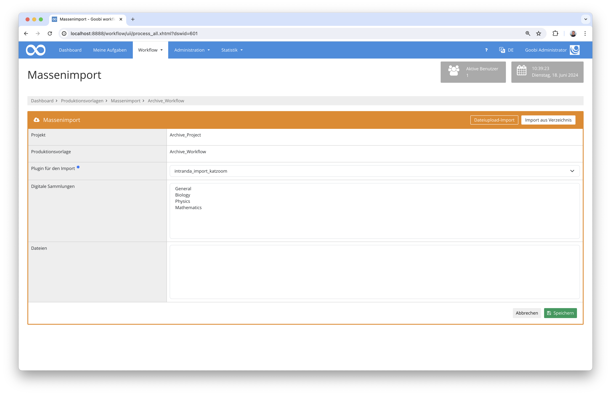

# Import von Zettelkatalogen aus KatZoom

## Übersicht

Name                     | Wert
-------------------------|-----------
Identifier               | intranda_import_katzoom
GitHub Repository        | https://github.com/intranda/goobi-plugin-import-katzoom
Lizenz              | GPL 2.0 oder neuer 
Letzte Änderung    | 13.07.2024 09:57:12


## Einführung
Die vorliegende Dokumentation beschreibt die Installation, Konfiguration und den Einsatz des Plugins für die Datenübernahme von Zettelkatalogen aus dem System KatZoom nach Goobi workflow.


## Installation
Um das Plugin nutzen zu können, müssen folgende Dateien installiert werden:

```bash
/opt/digiverso/goobi/plugins/import/plugin-import-katzoom.jar
/opt/digiverso/goobi/config/plugin_intranda_import_katzoom.xml
```

Daneben muss das Plugin für das Archivmanagement installiert und konfiguriert sein. Eine Anleitung hierfür ist unter der folgenden Adresse zu finden: https://docs.goobi.io/goobi-workflow-plugins-de/administration/intranda_administration_archive_management


## Überblick und Funktionsweise
Bei diesem Plugin handelt es sich um ein sogenanntes `Import-Plugin`. Öffnet man den Bereich für den Massenimport, kann anschließend das Plugin im Reiter `Import aus Verzeichnis` ausgewählt werden.



Das Plugin erwarten für dessen Ausführung innerhalb des konfigurierten Import-Ordners die folgende Struktur:

```bash
ank bis 45 Nominal/
	ank.ind
	ank.lli
	m001/
		z001/
			h001/
				c0000001.pdf
				c0000001.png
				c0000001.tif
				c0000001.txt
				c0000002.pdf
				c0000002.png
				c0000002.tif
				c0000002.txt
				o0000001.png
				[...]
				o0000001.png
			h002/
				[...]
ask bis 45 Schlagwort/
	ask.ind
	ask.lli
	m001/	
		[...]
hhn HHStA Nominal/
[...]
```

Der Nutzer kann nun im unteren Bereich des Plugins den zu importierenden Hauptordner auswählen, um den entsprechenden Zettelkatalog zu importieren. Hierbei ist zu beachten, dass immer ein kompletter Zettelkatalog auf einmal importiert wird. Teilimporte sind nicht vorgesehen.

Innerhalb des ausgewählten Ordners wird eine `*.ind` Datei und optional eine `*.lli` Datei erwartet. Die ind-Datei enthält für jeden Buchstaben die Nummer des ersten Datensatzes. Die lli-Datei hingegen enthält die Nummer des ersten Datensatzes zu einer Lade. Da die Laden nicht bei allen Zettelkatalogen existieren, ist diese Datei optional.
Des weiteren wird eine Ordnerstruktur mit bis zu 3 Unterordnern erwartet, in denen die einzelnen Dateien liegen. Die Dateien beginnen immer mit einem Buchstaben gefolgt von einer fortlaufenden Nummer und der Dateiendung.
Pro Objekt können verschiedenen Derivate existieren, die dann bis auf die Dateiendung gleich heißen. Eine Ausnahme ist ein heruntergerechnetes Vorschaubild, das mit einem anderen Buchstaben startet.

Alle Dateinamen werden gesammelt und anhand der Nummer aufsteigend sortiert. Es kann pro Zettelkatalog festgelegt werden, ob nur die Vorderseite (z.B. `hhn HHStA Nominal`) oder Vorder- und Rückseite gescannt wurden (z.B. `ank bis 45 Nominal`). Im ersten Fall wird aus jeder Nummer ein Datensatz erzeugt, im zweiten Fall aus jeder ungeraden Nummer. Die folgende, gerade Zahl ist dann die Rückseite des Datensatzes.

Für jeden Datensatz wird der dazugehörige Buchstabe, sofern vorhanden die Lade sowie die Positionen innerhalb des Katalogs, des Buchstaben und der Lade ermittelt. Diese Informationen werden mit der originalen Ordnerstruktur als Metadaten gespeichert.

Außerdem wird für jeden Zettelkatalog ein Bestand im Archivmanagement erzeugt. Dabei entspricht der Hauptknoten dem Katalog, anschließend folgen die Buchstaben. Innerhalb der Buchstaben gibt es optional die einzelnen Laden und darunter folgen die einzelnen Datensätze.  

Die Bestände sind nach den einzelnen Katalogen benannt.

### Konfiguration
Die Konfiguration des Plugins erfolgt in der Datei `plugin_intranda_import_katzoom.xml` wie hier aufgezeigt:

```xml
<config_plugin>
    <config>

        <!-- which workflow template shall be used -->
        <template>*</template>
        <!-- define if import shall use GoobiScript to run in the background -->
        <runAsGoobiScript>false</runAsGoobiScript>
        
        <eadDatabaseName>eadStore</eadDatabaseName>
        <generateEadFile>true</generateEadFile>
        
        <!-- root folder, contains all index folder -->
        <importRootFolder>/opt/digiverso/import/</importRootFolder>

        <!-- list all indexes where backside was scanned -->
        <backsideScan>ask bis 45 Schlagwort</backsideScan>
        <backsideScan>ssk ÖSTA Schlagwort</backsideScan>
        <backsideScan>swk BKA Schlagwort</backsideScan>
        <backsideScan>ank bis 45 Nominal</backsideScan>
        <backsideScan>nka BKA Nominal</backsideScan>
        <!-- collection name -->
        <collection>Zettelkatalog</collection>
        <!-- docstruct type -->
        <doctype>Note</doctype>

        <!-- metadata -->
        <!-- contains the folder structure -->
        <folderStructure>FolderStructure</folderStructure>
        <!-- contains the total position -->
        <position>TotalPosition</position>
        <!-- assigned letter -->
        <letter>Letter</letter>
        <!-- position within the letter -->
        <letterPosition>LetterPosition</letterPosition>
        <!-- assigned tray -->
        <tray>Tray</tray>
        <!-- position within tray -->
        <trayPosition>TrayPosition</trayPosition>
    </config>
</config_plugin>

```

Zuerst wird innhalb von `<template>` definiert, für welche Produktionsvorlagen der Import gelten soll. 

Anschließend erfolgt die Konfiguration des Archivbestandes innerhalb des Archivmanagement-Plugins sowie die Angabe des Import-Ordners, in dem die Ordner für die einzelnen Zettelkataloge erwartet werden. Das Element `<backsideScan>` enthält die Namen der Zettelkataloge, zu denen auch die Rückseite digitalisiert wurde. Fehlt ein Katalog in dieser Liste, geht der Import davon aus, dass nur die Vorderseite existiert.

Im Element `<collection>` kann der Name der Sammlung festgelegt werden. Diese Information wird in jeden Datensatz geschrieben. Das Element `<doctype>` enthält den zu erzeugenden Strukturtyp und die weiteren Angaben die Bezeichnungen der einzelnen Metadaten.