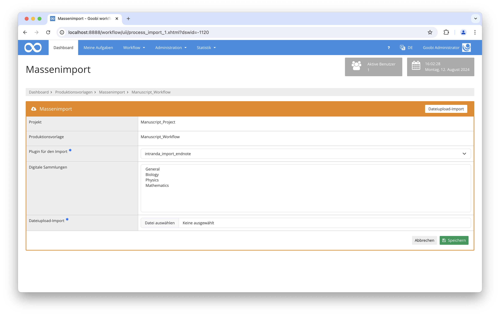

# Import für Zeitschriftenartikel aus einem Endnote Export

## Übersicht

Name                     | Wert
-------------------------|-----------
Identifier               | intranda_import_endnote
Repository               | [https://github.com/intranda/goobi-plugin-import-wuwien](https://github.com/intranda/goobi-plugin-import-wuwien)
Lizenz              | GPL 2.0 oder neuer 
Letzte Änderung    | 15.08.2024 06:16:33


## Einführung
Die vorliegende Dokumentation beschreibt die Installation, die Konfiguration und den Einsatz des Plugins zum Import von Zeitschriftenartikeln aus einer aus Endnote exportierten Excel Datei.


## Installation
Das Plugin muss in den folgenden Ordner installiert werden:

```bash
/opt/digiverso/goobi/plugins/import/plugin_intranda_import_endnote-base.jar
```

Daneben gibt es eine Konfigurationsdatei, die an folgender Stelle liegen muss:

```bash
/opt/digiverso/goobi/config/plugin_intranda_import_endnote.xml
```


## Überblick und Funktionsweise
Um den Import zu nutzen, muss in den Produktionsvorlagen der Massenimport Bereich geöffnet werden und im Reiter `Dateiupload-Import` das Plugin `intranda_import_endnote` auswählen. Anschließend kann eine Excel Datei hochladen und importiert werden.



Der Import erfolgt zeilenweise. Dabei wird für jede Zeile der Vorgangstitel aus den konfigurierten Feldern erzeugt und geprüft, ob der Jahrgang bereits in Goobi existiert. Ist dies nicht der Fall, wird der Vorgang neu angelegt und die konfigurierten Metadaten für `anchor` und `volume` importiert.

Nun wird geprüft, ob ein Heft erzeugt werden soll. Dies passiert auf Basis der Angabe der Spalte `Issue`. Wenn das Feld leer ist, wird der Artikel direkt an den Jahrgang angehängt, ansonsten wird nach dem richtigen Heft gesucht. Existiert es noch nicht, wird es ebenfalls erzeugt. Die Sortierung der Hefte basiert auf der Nummer der Spalte `Issue`.

Anschließend wird der Artikel erzeugt und dem Heft oder Jahrgang hinzugefügt. Sofern mehrere Artikel existieren, passiert die Sortierung anhand der Angabe der Startseite aus der Spalte `Pages`.


## Konfiguration
Die Konfiguration erfolgt über die Konfigurationsdatei `plugin_intranda_import_endnote.xml` und kann im laufenden Betrieb angepasst werden.

```xml
<config_plugin>
    <config>
        <template>*</template>
        <processTitleGeneration>TSL+'_'+ISSN+'_'+Volume</processTitleGeneration>
        <anchorDocType>Periodical</anchorDocType>
        <volumeDocType>PeriodicalVolume</volumeDocType>
        <issueDocType>PeriodicalIssue</issueDocType>
        <articleDocType>Article</articleDocType>

        <metadata ugh="CatalogIDDigital" headerName="Key" docType="child"/>
        <metadata ugh="PublicationYear" headerName="Publication Year" docType="volume"/>
        <metadata ugh="Author" headerName="Author" docType="child" />
        <metadata ugh="TitleDocMain" headerName="Title" docType="child"/>
        <metadata ugh="TitleDocMain" headerName="Publication Title" docType="anchor"/>
        <metadata ugh="ISSN" headerName="ISSN" docType="anchor"/>
        <metadata ugh="DOI" headerName="DOI" docType="child"/>
        <metadata ugh="URL" headerName="Url" docType="child"/>
        <metadata ugh="Abstract" headerName="Abstract Note" docType="child"/>
        <metadata ugh="Pages" headerName="Pages" docType="child"/>
        <metadata ugh="CurrentNo" headerName="Issue" docType="child"/>
        <metadata ugh="CurrentNo" headerName="Volume" docType="volume"/>
        <metadata ugh="DocLanguage" headerName="Language" docType="child"/>
        <metadata ugh="Note" headerName="Manual Tags" docType="volume"/>
    </config>
</config_plugin>
```

Die Konfiguration erlaubt grundsätzlich verschiedene Konfigurationen für unterschiedliche Produktionsvorlagen. Dazu muss im Feld `<template>` nur der Name der gewünschten Vorlage eingetragen werden. Der Eintrag mit dem Wert `*` wird für alle Vorlagen verwendet, für die keine eigene Konfiguration existiert.

Das Element `<processTitleGeneration>` definiert die Regeln, mit denen der Vorgangstitel generiert werden soll. Dabei gelten die selben Konventionen wie in der `goobi_projects.xml`. Die beiden Werte `ATS` (Autor-Titel-Schlüssel) und `TSL` (Titelschlüssel) werden automatisch aus den vorliegenden Metadaten erzeugt, für die Nutzung weiterer Metadaten können die Spaltennamen aus der Exceldatei verwendet werden.

Die Elemente `<anchorDocType>`, `<volumeDocType>`, `<issueDocType>` und `<articleDocType>` definieren die Strukturelemente, die für die Elemente Zeitschrift, Jahrgang, Heft und Artikel verwendet werden sollen. Sie müssen im Regelsatz existieren.

Anschließend folgt das Mapping der Metadaten. Hierzu dient das Element `<metadata>`. Darin sind drei Atrribute erlaubt, in `ugh` wird der Metadatenname aus dem Regelsatz hinterlegt, in `headerName` die Überschrift der Spalte aus der Excel Datei und in `docType` wird definiert, ob das Metadatum in Zeitschriftentitel (`anchor`), Jahrgang (`volume`) oder Artikel (`child`) hinzugefügt werden soll.