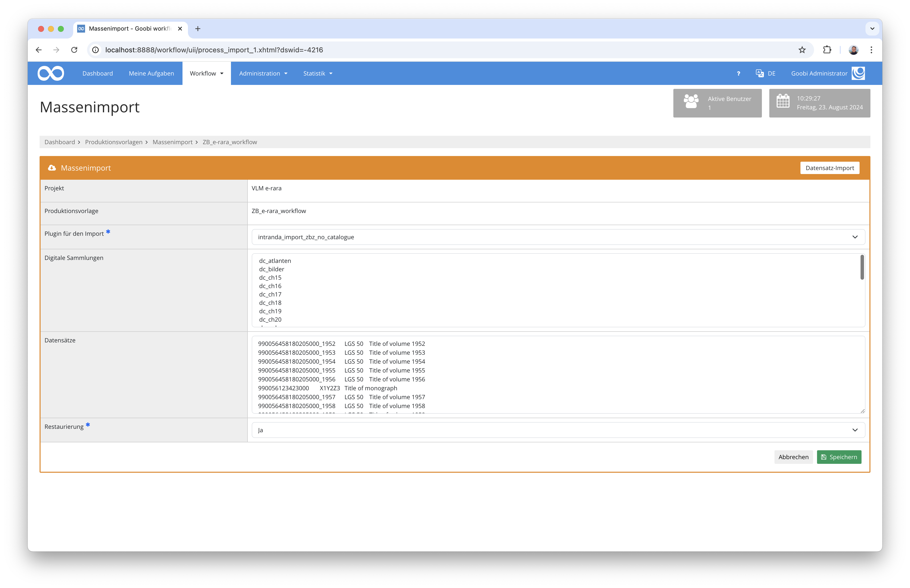

# Datenimport ohne Katalogabfrage für die Zentralbibliothek Zürich

## Übersicht

Name                     | Wert
-------------------------|-----------
Identifier               | intranda_import_zb_no_catalogue
Repository               | [https://github.com/intranda/goobi-plugin-import-zbz-no-catalogue](https://github.com/intranda/goobi-plugin-import-zbz-no-catalogue)
Lizenz              | GPL 2.0 oder neuer 
Letzte Änderung    | 23.08.2024 11:12:56


## Einführung
Dieses Import-Plugin erlaubt das Einspielen von Daten ohne vorherige Katalogabfrage. Dabei werden in der Nutzeroberfläche Daten eingefügt, die zuvor aus einer Excel-Datei kopiert wurden und wo deren Spalten mittels `TAB` voneinander getrennt sind.

## Installation
Um das Plugin nutzen zu können, müssen folgende Dateien installiert werden:

```bash
/opt/digiverso/goobi/plugins/import/plugin-import-zbz-no-catalogue-base.jar
/opt/digiverso/goobi/config/plugin_intranda_import_zbz_no_catalogue.xml
```

Nach der Installation des Plugins, kann dieses aus der Übersicht der Produktionsvorlagen durch Nutzung des zweiten blauen Buttons neben der gewählten Produktionsvorlage betreten werden.


Wenn das Plugin betreten wurde, steht eine Nutzeroberfläche zur Verfügung, in der die einzuspielenden Daten ausgewählt bzw. hochgeladen werden können.




## Überblick und Funktionsweise
Nach der Auswahl des richtigen Plugins können in der Nutzeroberfläche die Daten die entweder als CSV-Daten TAB-getrennt vorliegen oder die aus einer Excel-Datei kopiert werden in das Feld `Datensätze` eingefügt werden. Die Daten haben dabei den folgenden Aufbau:

Spalte    | Metadatum       | Erläuterung
----------|-----------------|-------------------------
`1`       | `MMS-ID`        | Wenn diese einen Unterstrich enthält, wird ein Mehrbändiges Werk angelegt, andernfalls eine Monographie. Hierbei handelt es sich um eine Pflichtangabe.
`2`       | `Signatur`      | Hierbei handelt es sich um eine Pflichtangabe.
`3`       | `Titel`         | Hierbei handelt es sich um eine optionale Angabe.

Unmittelbar nach dem Einfügen der Daten und dem Klick auf `Speichern` startet das Anlegen der Vorgänge, ohne dass dabei ein Katalog abgefragt wird.


## Konfiguration
Die Konfiguration des Plugins erfolgt in der Datei `plugin_intranda_import_zbz_no_catalogue.xml` wie hier aufgezeigt:

```xml
<config_plugin>
	<config>

		<!-- which workflow template shall be used -->
		<template>*</template>

		<!-- define if import shall use GoobiScript to run in the background -->
		<runAsGoobiScript>false</runAsGoobiScript>

	</config>
</config_plugin>

```

Die folgende Tabelle enthält eine Zusammenstellung der Parameter und ihrer Beschreibungen:

Parameter               | Erläuterung
------------------------|------------------------------------
`template`              | Hiermit kann festgelegt werden für welche Produktionsvorlabe der jeweilige `config`-Block gelten soll. 
`runAsGoobiScript`      | Mit diesem Parameter kann festgelegt werden, ob der Import als GoobiScript im Hintergrund stattfinden soll.