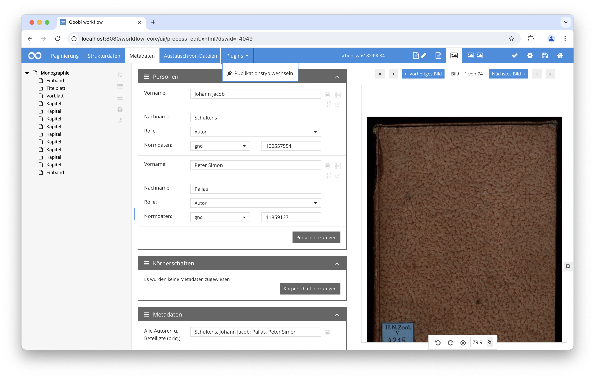
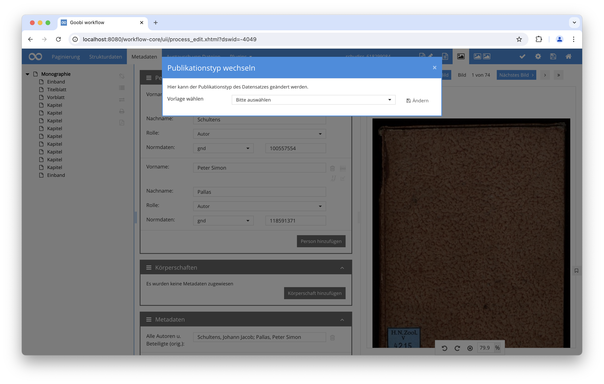

# Publikationstyp ändern

## Übersicht

Name                     | Wert
-------------------------|-----------
Identifier               | intranda_metadata_changeType
Repository               | [https://github.com/intranda/goobi-plugin-metadata-change-type](https://github.com/intranda/goobi-plugin-metadata-change-type)
Lizenz              | GPL 2.0 oder neuer 
Letzte Änderung    | 04.09.2024 10:05:14


## Einführung
Dieses Plugin ermöglicht die Änderung des Publikationstyps aus dem Metadateneditor von Goobi workflow.

## Installation
Um das Plugin nutzen zu können, müssen folgende Dateien installiert werden:

```bash
/opt/digiverso/goobi/mete/metadata/plugin_intranda_metadataeditor_changeType.jar
/opt/digiverso/goobi/plugins/GUI/plugin_intranda_metadataeditor_changeType-GUI.jar
/opt/digiverso/goobi/config/plugin_intranda_metadata_changeType.xml
```

Nach der Installation steht die Funktionalität des Plugins innerhalb der REST-API von Goobi workflow zur Verfügung.

## Überblick und Funktionsweise
Nachdem das Plugin installiert wurde, erscheint im Metadateneditor eine neue Funktion im Menü, die alle installierten und konfigurierten Plugins auflistet. Um das Plugin zur Änderung des Publikationstyps nutzen zu können, müssen zunächst im konfigurierten Projekt Templates erstellt werden. Diese Templates müssen mit den gewünschten Metadaten vorbelegt und die Vorgangseigenschaft für das Label muss vergeben werden. Sobald die Templates erstellt sind, stehen sie in einer Auswahlliste zur Verfügung.



Wählt der Benutzer das Plugin aus, öffnet sich ein Dialogfenster, in dem die vorhandenen Vorlagen für die verschiedenen Publikationstypen aufgelistet werden. Der Benutzer kann den gewünschten Publikationstyp auswählen und die Änderung speichern.



Beim Wechsel des Publikationstyps wird zuerst ein Backup der bestehenden Metadatendatei erstellt. Danach werden die Metadaten des ausgewählten Templates in den Vorgang kopiert. Wenn der alte Datensatz bereits Paginierung und Seitenzuweisungen enthält, werden diese Daten ebenfalls übernommen.

Abschließend wird für jedes konfigurierte Metadatum geprüft, ob es im alten Datensatz vorhanden war. Falls ja, wird dieses Metadatum, einschließlich Personen oder Gruppen, in den neuen Datensatz übertragen. Sollte im neuen Datensatz bereits ein entsprechendes Feld mit einer Default-Belegung vorhanden sein, wird dieses mit den originalen Daten überschrieben.

## Konfiguration
Die Konfiguration des Plugins erfolgt in der Datei `plugin_intranda_metadata_changeType.xml` wie hier aufgezeigt:

```xml
<config_plugin>
    <!-- Eine Sektion enthält einen Konfigurationsblock. -->
    <section>
        <!-- Das Element project ist wiederholbar und definiert, innerhalb welcher
            Projekte diese section genutzt werden kann. -->
        <project>Project_A</project>
        <project>Project_B</project>
        <project>Archive_Project</project>
        
        <!-- property name, in dem das anzuzeigende Label gespeichert ist -->
        <titleProperty>Title</titleProperty>
        
        <!-- Das Element templateProject ist wiederholbar und definiert diejenigen
            Projekte in Goobi workflow, aus denen Template-Vorgänge geladen und genutzt
            werden sollen. Per Konvention ist festgelegt, dass der Ursprungsregelsatz
            und Templateregelsatz identisch sein müssen, damit ein Vorgang in dem
            Makro-Modal angezeigt wird. -->
        <templateProject>Template_1</templateProject>
        <templateProject>Template_2</templateProject>
        
        <!-- list of metadata to copy into the new template -->
        <metadata>CatalogIDDigital</metadata>
        <metadata>DisplayLayout</metadata>
    </section>
</config_plugin>
```

Die folgende Tabelle enthält eine Zusammenstellung der Parameter und ihrer Beschreibungen:

Parameter               | Erläuterung
------------------------|------------------------------------
`<section>`                      | ist wiederholbar und erlaubt somit unterschiedliche Konfigurationen für verschiedene Projekte |
`<project>`                      | legt fest, für welche Projekt(e) der aktuelle Bereich gilt; das Feld ist wiederholbar, um so eine gemeinsame Konfiguration für mehrere Projekte verwenden zu können |
`<titleProperty>`                      | enthält den Namen der Vorgangseigenschaft, in dem das zu verwendende Label steht |
`<templateProject>`                      | Name des Projekts, aus dem die Templates gelesen werden sollen. Es werden alle Vorgänge aus dem Projekt aufgelistet, die über ein Label verfügen. |
`<metadata>`                      | Liste an Metadaten, die aus der originalen Datei in die neue Datei überführt werden sollen |