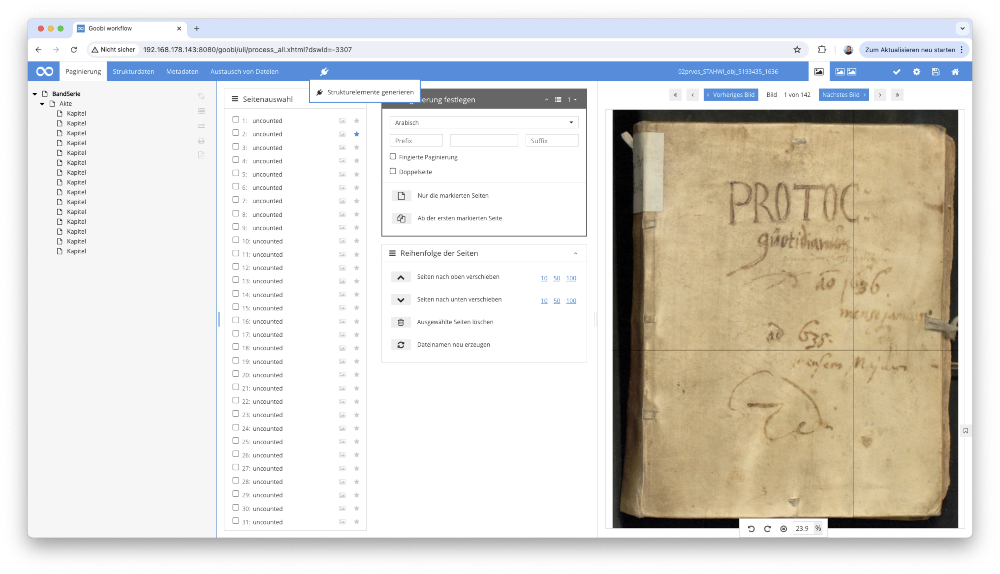
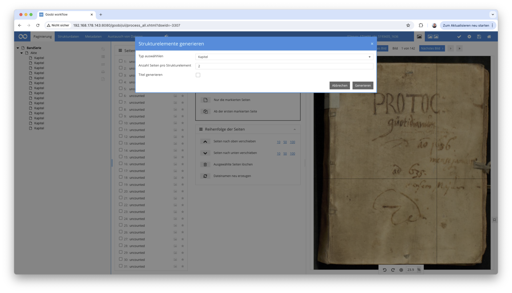

# Metadatenerweiterung zur Erstellung von Strukturelementen pro Bild

## Übersicht

Name                     | Wert
-------------------------|-----------
Identifier               | intranda_metadata_createStructureElements
Repository               | [https://github.com/intranda/goobi-plugin-metadata-create-structure-elements](https://github.com/intranda/goobi-plugin-metadata-create-structure-elements
Lizenz              | GPL 2.0 oder neuer 
Letzte Änderung    | 13.07.2024 14:38:34


## Einführung
Die vorliegende Dokumentation beschreibt die Installation, Konfiguration und den Einsatz des Plugins für Erstellung von Strukturelementen pro Bild innerhalb des Metadateneditors.


## Installation
Um das Plugin nutzen zu können, müssen folgende Dateien installiert werden:

```bash
/opt/digiverso/goobi/plugins/metadata/plugin-metadataeditor-create-structure-elements-base.jar
/opt/digiverso/goobi/plugins/GUI/plugin-metadataeditor-create-structure-elements-gui.jar
/opt/digiverso/goobi/config/plugin_intranda_metadata_createStructureElements.xml
```


## Überblick und Funktionsweise
Bei diesem Plugin handelt es sich um ein sogenanntes `Metadataeditor-Plugin`. Es kann es im Metadateneditor im Menüpunkt für Plugins unter dem Namen `Strukturelemente generieren` ausgewählt werden.



Wenn es ausgewählt wird, öffnet sich ein Popup, in dem der gewünschte Typ der zu erzeugenden Strukturelemente gewählt werden kann. Hier stehen automatisch alle Strukturelemente zur Verfügung, die im Regelsatz für den vorliegenden Publikationstyp erlaubt wurden.

Außerdem lässt sich definieren, wie viele Bilder dem jeweiligen Strukturelement zugewiesen werden sollen, bevor das nächste Strukturelement erstellt wird und ob für das Strukturelement ein Titel erzeugt werden soll. Wenn diese Option aktiviert wurde, wird bei jedem Strukturelement der Dateiname ohne Endung als Titel eingetragen, sofern der Haupttitel im gewählten Typ erlaubt ist.



Die Generierung der Strukturelemente wird alle vorhandenen Elemente überschreiben.

## Konfiguration
Die Konfiguration des Plugins erfolgt in der Datei `plugin_intranda_metadata_createStructureElements.xml` wie hier aufgezeigt:

```xml
<config_plugin>
    <config>
        <!-- To which project does the current section apply? 
        The field can be repeated to summarize different projects. 
        In addition, * can be used for any project -->
        <project>*</project>

        <!-- To which document type does the current section apply? 
        The field can be repeated to summarize different types. 
        In addition, * can be used for any type -->
        <doctype>*</doctype>

        <!-- default structure type. The value is preselected in the UI. Leave it blank if no preselection is needed -->
        <defaultType>Chapter</defaultType>

        <!-- define the default number of images, leave it blank if no default value is needed -->
        <numberOfImagesPerElement>2</numberOfImagesPerElement>
    </config>
</config_plugin>

```

Die Konfiguration lässt sich auf Projekte einschränken oder auf bestimmte Publikationstypen. Dazu können in die Felder `<project>` und `<doctype>` genutzt werden. In `<defaultType>` kann definiert werden, welches Strukturelement in der Liste bereits vorausgewählt sein soll. Wenn das hier definierte Element nicht in der Liste des aktuellen Publikationstyps existiert oder leer ist, wird kein Element vorausgewählt.
In `<numberOfImagesPerElement>` kann außerdem ein Wert für die Anzahl der Bilder pro Strukturelement vorbelegt werden. Hierbei muss es sich um eine positive, ganze Zahl handeln. Beide Werte lassen sich vom Nutzer in der Oberfläche ändern.