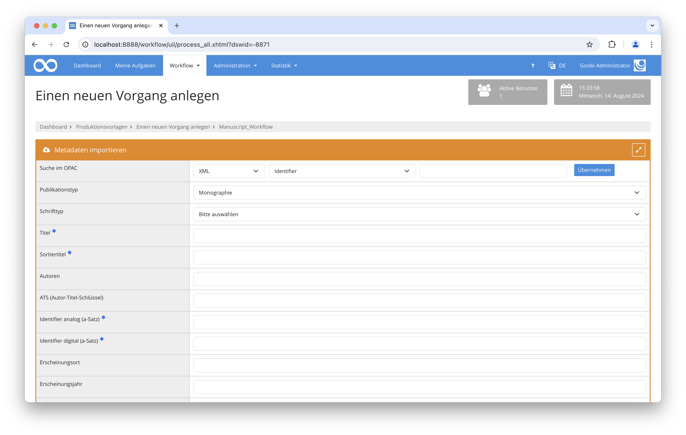

# Generischer XML Import

## Übersicht

Name                     | Wert
-------------------------|-----------
Identifier               | intranda_opac_xml
Repository               | [https://github.com/intranda/goobi-plugin-opac-generic-xml](https://github.com/intranda/goobi-plugin-opac-generic-xml)
Lizenz              | GPL 2.0 oder neuer 
Letzte Änderung    | 15.08.2024 06:22:21


## Einführung
Die vorliegende Dokumentation beschreibt die Installation, Konfiguration und den Einsatz des Plugins. Mit Hilfe dieses Plugins können Daten aus einem externen System abgefragt und in Goobi übernommen werden. Der Katalog muss eine API haben, über die Datensätze als XML ausgeliefert werden können.


## Installation
Das Plugin besteht aus zwei Dateien:

```bash
plugin_intranda_opac_xml-base.jar
plugin_intranda_opac_xml.xml
```

Die Datei `plugin_intranda_opac_xml-base.jar` enthält die Programmlogik und muss für den Nutzer `tomcat` lesbar in folgendes Verzeichnis installiert werden:

```bash
/opt/digiverso/goobi/plugins/opac/
```

Die Datei`plugin_intranda_opac_xml.xml` muss ebenfalls für den Nutzer `tomcat` lesbar sein und in folgendes Verzeichnis installiert werden:

```bash
/opt/digiverso/goobi/config/
```

## Überblick und Funktionsweise
Nachdem das Plugin vollständig installiert wurde, steht es in der Anlegemaske zur Verfügung.



Wenn in Goobi nach einem Identifier gesucht wird, wird im Hintergrund eine Anfrage an die konfigurierte URL oder an das Dateisystem gestellt:

```bash
https://example.com/opac?id={pv.id}
file:///import/hotfolder/{pv.id}.xml
```

Sofern hier ein gültiger Datensatz gefunden wird, wird dieser nach dem Feld durchsucht, in dem der Dokumententyp stehen soll. Wenn die Query nicht definiert ist, wird stattdessen der Dokumententyp aus der Konfigurationsdatei gelesen. Mit dem ermittelten Typ wird dann das gewünschte Strukturelement erzeugt.

Im Anschluß daran werden alle XPath Ausdrücke ausgewertet, die konfiguriert wurden. Sofern mit einem Ausdruck Daten gefunden werden, wird das entsprechend angegebene Metadatum erzeugt. Bei Personen wird geprüft, ob der Wert ein Komma enthält. In diesem Fall werden Vor- und Nachname am Komma getrennt, andernfalls wird der Wert als Nachname interpretiert.


## Konfiguration
Die Konfiguration erfolgt in den folgenden Dateien, die sich im Verzeichnis `/opt/digiverso/goobi/config/` befinden.

```bash
goobi_opac.xml
plugin_intranda_opac_xml.xml
```

In der Datei `goobi_opac.xml` muss die Schnittstelle zum gewünschten Katalogsystem bekannt gemacht werden. Dies geschieht durch einen Eintrag, der wie folgt aussieht:

```xml
<catalogue title="EAD">
    <config description="EAD database" address="https://example.com/opac?id={pv.id}"
    port="443" database="x" iktlist="x" ucnf="x" opacType="intranda_opac_xml" />
    <searchFields>
        <searchField label="Identifier" value="12"/>
    </searchFields>
</catalogue>
```

Das Attribut `title` enthält den Namen, unter dem der Katalog in der Nutzeroberfläche ausgewählt werden kann, `address` die URL zum API Endpoint und `opacType`das zu nutzende Plugin. In diesem Fall muss der Eintrag `intranda_opac_xml` lauten.

Es ist nur eine Suchanfrage konfigurierbar. Daher können die anderen Suchoptionen ausgeblendet werden. Dies geschieht innerhalb des `<searchFields>` Blocks. In der oben beschriebenen Konfiguration kann nur nach einem Identifier gesucht werden.

Der Wert des `address`- Attributes muss den String {pv-id} enthalten, damit das Plugin den Suchwert an der richtigen Stelle einfügt. Z.b. um in einem Hotfolder anhand des Dateinamens zu filtern z.B. `/import/hotfolder/{pv.id}.xml`.

Das Plugin kann bei Bedarf auch Dateien aus dem Dateisystem lesen. Zum Beispiel aus einem Hotfolder in dem Dateien abgelegt werden. Dazu muss folgendes beachtet werden. Der String in `address` muss mit `file://` beginnen und die Datei muss einen eindeutigen Namen haben der z.B. dem Prozesstitel entspricht.

Das Mapping der Inhalte des XML Records hin zu Goobi Metadaten geschieht in der Datei `plugin_intranda_opac_xml.xml`:

```xml
<config_plugin>
    <!-- define the list of namespaces. They are used to read the document and run xpath queries -->
    <namespaces>
        <namespace prefix="ead" uri="urn:isbn:1-931666-22-9" />
        <namespace prefix="oai" uri="http://www.openarchives.org/OAI/2.0/" />
    </namespaces>

    <docstructs>
        <!-- use the configured document type -->
        <!--
        <documenttype isanchor="false">Record</documenttype>
        <documenttype isanchor="true">VolumeRun</documenttype>
        -->
        <!-- or detect the document type in xml record -->
        <doctumenttypequery xpath="//ead:c/@level"  xpathType="Attribute" />
        <docstruct xmlName="Item" rulesetName="Item" />
        <docstruct xmlName="File" rulesetName="Item" />
        <docstruct xmlName="Book" rulesetName="Monograph" />
        <docstruct xmlName="Photo" rulesetName="Picture" />
        <docstruct xmlName="Periodica" rulesetName="Volume" anchorName="Periodical"/>
    </docstructs>

    <mapping>
            <element name="TitleDocMain" xpath="//ead:c[@level='file']/ead:did/ead:unittitle" level="topstruct" xpathType="Element"/>
            <element name="TitleDocMainShort" xpath="//ead:c[@level='file']/ead:did/ead:unittitle" level="topstruct" xpathType="Element"/>
            <element name="CatalogIDDigital" xpath="//ead:c[@level='file']/@id" level="topstruct" xpathType="Attribute"/>
            <element name="CatalogIDSource" xpath="//ead:c[@level='file']/@id" level="topstruct" xpathType="Attribute"/>
            <element name="PublicationRun" xpath="//ead:c[@level='file']/ead:did/ead:unitdate" level="topstruct" xpathType="Element"/>
            <element name="PublicationStart" xpath="substring-before(//ead:c[@level='file']/ead:did/ead:unitdate/@normal\, '/')" level="topstruct" xpathType="String"/>
            <element name="PublicationEnd" xpath="substring-after(//ead:c[@level='file']/ead:did/ead:unitdate/@normal\, '/')" level="topstruct" xpathType="String"/>
            <element name="ShelfmarkOld" xpath="//ead:c[@level='file']/ead:did/ead:unitid[@type='Altsignatur']" level="topstruct" xpathType="Element"/>
            <element name="shelfmarksource" xpath="concat('HU UA '\, //ead:c[@level='collection']/ead:did/ead:unitid\, ' Nr. '\, //ead:c[@level='file']/ead:did/ead:unitid)" level="topstruct" xpathType="String"/>
            <element name="SizeSourcePrint" xpath="//ead:c[@level='file']/ead:did/ead:physdesc/ead:extent" level="topstruct" xpathType="Element"/>
            <element name="OtherPerson" xpath="//ead:c[@level='file']/ead:odd/ead:p" level="topstruct" xpathType="Element"/>
            <element name="Information" xpath="//ead:c[@level='file']/ead:did/ead:abstract[@type='Enthält']" level="topstruct" xpathType="Element"/>
            <element name="Contains" xpath="//ead:c[@level='file']/ead:did/ead:abstract[@type='Darin']" level="topstruct" xpathType="Element"/>
            <element name="Provenience" xpath="//ead:c[@level='file']/ead:did/ead:origination" level="topstruct" xpathType="Element"/>
    </mapping>

</config_plugin>
```

Als erstes werden die XML Namespaces definiert, die zum Lesen des XML Dokuments notwendig sind. Hierzu dient der Bereich `<namespaces>`, der alle verwendeten Namespace in `<namespace>` Elementen enthält. Jeder Namespace wird durch die beiden Attribute `prefix` und `uri` definiert. Wenn das XML ohne Namespaces gelesen werden kann, kann der Bereich leer bleiben oder fehlen. Die hier beispielhaft aufgezeigte Konfiguration bezieht sich auf die Konvertierung von EAD Dateien, die über eine OAI Schnittstelle bezogen werden.

Im Bereich `<docstructs>` kann der zu verwendende Typ festgelegt werden. Dies geschieht durch die Verwendung von `<documenttype>`. Wenn der Dokumententyp konfigurierbar sein soll, muss es ein Element mit dem Attribut `isanchor="false"` geben. Sofern Mehrbändige Werke oder Zeitschriften angelegt werden sollen, wird ein zweites Element `isanchor="true"` benötigt, in dem der Anchor-Typ definiert ist.

Alternativ kann der Typ des Dokuments auch aus dem XML Record gelesen werden. Dann wird das Element `<doctumenttypequery>` verwendet, in dem ein XPath-Ausdruck definiert ist, der beschreibt, welches Feld verwendet werden soll. Zusätzlich gibt es eine Reihe von `<docstruct>` Elementen, die mögliche Feldinhalte beschreiben. Das Attribut `xmlName` enthält den Wert aus dem XML Dokument, in `rulesetName` steht der anzulegende Strukturtyp. Sofern es sich um ein mehrbändiges Werk handelt, muss zusätzlich noch `anchorName` mit dem Namen des übergeordneten Strukturtyps angegeben werden.

Anschließend wird das Mapping für Personen und Metadaten im Bereich `<mapping>` konfiguriert. Hier gibt es eine Liste von `<element>` mit den Attributen `xpath`, `level`, `xpathType` und `name`. In `xpath` wird ein XPath Ausdruck konfiguriert, der beschreibt, in welchem Teil des XML Dokuments der Inhalt erwartet wird, in `name`wird der Name des Metadatums definiert, in das der Inhalt anschließend geschrieben werden soll. Mit der Angabe in `level` kann gesteuert werden, ob das Metadatum bei mehrbändigen Werken zum Datensatz des Anchors oder des Bandes geschrieben werden soll. In `xpathType` wird angegeben, welchen Typ das Ergebnis der XPath query hat. Dies kann ein `Element`, `Attribute` oder `String` sein.

Im Fall von `String` können auch Manipulationen wie concat, substring genutzt werden. Die möglichen Funktionen sind hier beschrieben: [https://www.w3schools.com/xml/xsl_functions.asp](https://www.w3schools.com/xml/xsl_functions.asp)