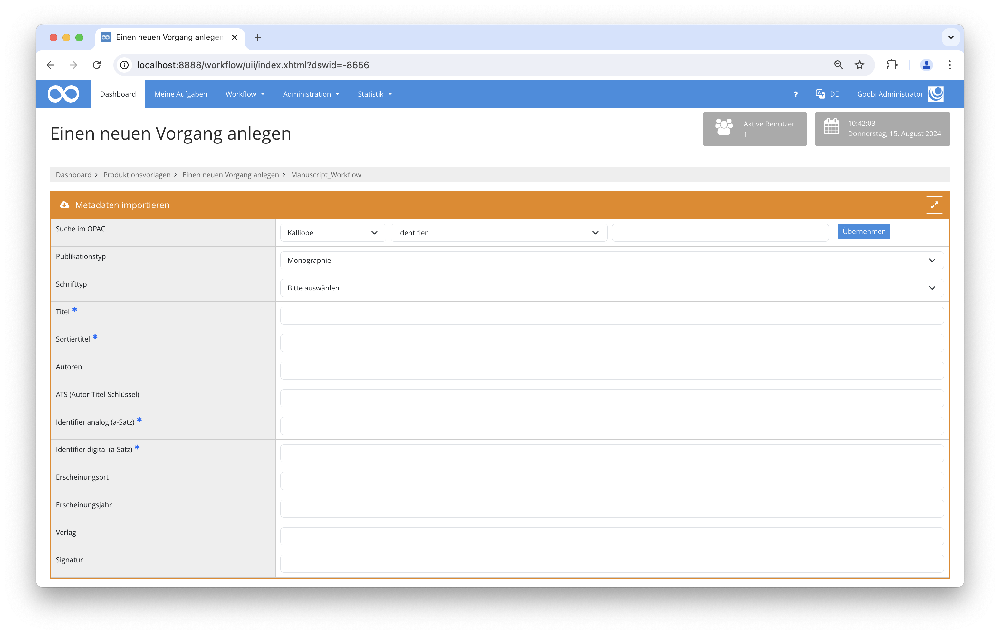

# Kalliope Import

## Übersicht

Name                     | Wert
-------------------------|-----------
Identifier               | goobi-plugin-opac-kalliope
Repository               | [https://github.com/intranda/goobi-plugin-opac-kalliope](https://github.com/intranda/goobi-plugin-opac-kalliope)
Lizenz              | GPL 2.0 oder neuer 
Letzte Änderung    | 14.08.2024 18:45:15


## Einführung
Die vorliegende Dokumentation beschreibt die Installation, Konfiguration und den Einsatz des Plugins. Mit Hilfe dieses Plugins können Daten aus dem Datenbestand des Kalliope-Verbundes abgefragt und in Goobi übernommen werden. Zur Übertragung der Daten werden die Daten aus dem Kalliope-Datenbestand im MODS-Format abgefragt und mit einer dezidierten Mapping-Datei ins Datenformat von Goobi übersetzt.


## Installation
Das Plugin besteht aus einer Java-Jar-Datei, einer Goobi-Konfigurationsdatei und einer Metadaten-Mapping-Datei:

```bash
plugin_intranda_opac_kalliope-base.jar
plugin_KalliopeOpacImport.xml
mods_map_kalliope.xml
```

Diese Dateien müssen für den Nutzer `tomcat` lesbar an folgenden Pfaden installiert werden:

```bash
/opt/digiverso/goobi/plugins/opac/plugin_intranda_opac_kalliope-base.jar
/opt/digiverso/goobi/config/plugin_KalliopeOpacImport.xml
/opt/digiverso/goobi/xslt/mods_map_kalliope.xml
```


## Überblick und Funktionsweise
Wenn in Goobi nach einem Identifier gesucht wird, wird im Hintergrund eine Anfrage an die in der Datei `goobi_opac.xml` konfigurierte URL gestellt.
Nach der Abfrage des Datensatzes im MODS-Format erfolgt das Mapping der Metadaten gemäß der in der Datei `mods_map_kalliope.xml` konfigurierten Regeln.



## Konfiguration
Die Konfigurationsdatei des Plugins hat folgenden Aufbau:

```xml
<?xml version="1.0" encoding="UTF-8"?>
<config_plugin>
    <charset>utf-8</charset>
    <mapping>/opt/digiverso/goobi/xslt/mods_map_kalliope.xml</mapping>
    <defaultDocType>Monograph</defaultDocType>
    <defaultPicaType>Aa</defaultPicaType>
</config_plugin>
```

Die Option `<charset>` legt den Zeichensatz fest, in dem die Daten durch der Kalliope-Schnittstelle ausgeliefert werden. `<mapping>` bezeichnet den Dateipfad zur Metadaten-Mapping-Datei. Mit den Feldern `<defaultDocType>` und `<defaultPicaType>` wird der für das Dokument zu verwendende Publikationstyp festgelegt.

Zusätzlich zur Konfigurationsdatei des Plugins muss der Kalliope-Katalog in der Datei `goobi_opac.xml` bekannt gemacht werden. Das geschieht durch einen Eintrag, der wie folgt aussieht:

```xml
<catalogue title="Kalliope">
    <config address="kalliope-verbund.info" database="sru" description="SRU-Schnittstelle des Kalliope Verbundes" port="80" opacType="Kalliope-SRU"/>
</catalogue>
```