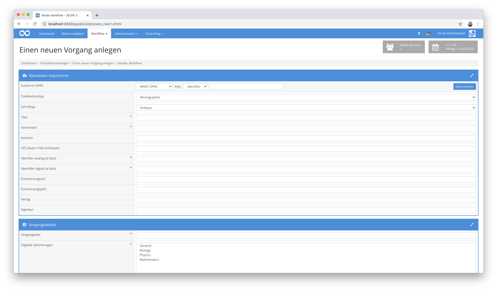

# MARC Import

## Übersicht

Name                     | Wert
-------------------------|-----------
Identifier               | intranda_opac_marc
Repository               | [https://github.com/intranda/goobi-plugin-opac-marc](https://github.com/intranda/goobi-plugin-opac-marc)
Lizenz              | GPL 2.0 oder neuer 
Letzte Änderung    | 25.07.2024 12:02:11


## Einführung
Die vorliegende Dokumentation beschreibt die Installation, Konfiguration und den Einsatz des Plugins. Mit Hilfe dieses Plugins können Daten aus einem externen System abgefragt und in Goobi übernommen werden. Der Katalog muss eine API bzw. URL haben, über die Datensätze als OPAC ausgeliefert werden können.


## Installation
Das Plugin besteht aus einer Datei:

```bash
plugin_intranda_opac_marc-base.jar
```

Diese Datei muss für den Nutzer `tomcat` lesbar an folgendem Pfad installiert werden:

```bash
/opt/digiverso/goobi/plugins/opac/plugin_intranda_opac_marc-base.jar
```


## Überblick und Funktionsweise
Wenn in Goobi nach einem Identifier gesucht wird, wird im Hintergrund eine Anfrage an die konfigurierte URL gestellt.



Nach der Abfrage des eigentlichen Datensatzes aus dem Katalog erfolgt das Mapping der Metadaten gemäß der im Regelsatz konfigurieren Regeln.


## Konfiguration
Das Plugin selbst verfügt nicht über keine eigene Konfiguration. Stattdessen erfolgt sämtliche Konfiguration über Anpassungen innerhalb von Goobi workflow bzw. der zugehörigen Regelsätze.

In der Datei `goobi_opac.xml` muss die Schnittstelle zum gewünschten Katalogsystem bekannt gemacht werden. Dies geschieht durch einen Eintrag, der wie folgt aussieht:

```xml
<catalogue title="MARC OPAC">
    <config address="http://opac.intranda.com/sru/DB=1" database="1" ucnf="XPNOFF=1"
      description="Description of the catalogue" iktlist="IKTLIST.xml" port="80" opacType="GBV-MARC" />
    <searchFields>
        <searchField label="Identifier" value="12" />
        <searchField label="ISBN" value="7" />
        <searchField label="ISSN" value="8" />
    </searchFields>
</catalogue>
```

Das Attribut `title` enthält den Namen, unter dem der Katalog in der Nutzeroberfläche ausgewählt werden kann, `address` die URL zum API-Endpoint und `database` die zu verwendende Datenbank. Das Attribut `opacType` muss auf den Wert `GBV-MARC` gesetzt sein.

Das Mapping der Inhalte eines MARC-Datensatzes erfolgt innerhalb des jeweilig verwendeten Regelsatzes von Goobi workflow. Genauere Informationen, wie dieses Mapping konfiguriert werden kann finden sich innerhalb der UGH-Dokumentation hier:

[https://docs.goobi.io/ugh-de/4/4.1/4.1.3](https://docs.goobi.io/ugh-de/4/4.1/4.1.3)