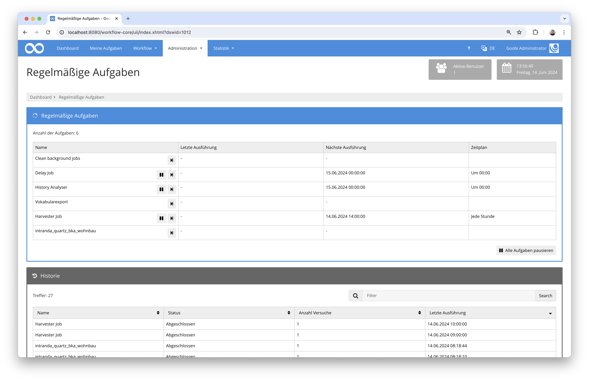

# Datenimport für Wohnbauförderungsfond Österreich

## Übersicht

Name                     | Wert
-------------------------|-----------
Identifier               | intranda_quartz_bka_wohnbau
Repository               | [https://github.com/intranda/goobi-plugin-quartz-bka-wohnbau](https://github.com/intranda/goobi-plugin-quartz-bka-wohnbau
Lizenz              | GPL 2.0 oder neuer 
Letzte Änderung    | 13.07.2024 09:56:58


## Einführung
Die vorliegende Dokumentation beschreibt die Installation, Konfiguration und den Einsatz des zeitgesteuerten Plugins für den Import von Wohnbauförderungsakten in Österreich nach Goobi workflow. Die Metadaten werden hierbei aus einer bereitgestellten JSON-Datei übernommen und die zugehörigen PDF-Dateien extrahiert. Die Bereitstellung der Akten erfolgt über einen S3 Speicher in mehreren Lieferungen, die jeweils innerhalb der METS-Dateien berücksichtigt werden.

## Installation
Um das Plugin nutzen zu können, müssen folgende Dateien installiert werden:

```bash
/opt/digiverso/goobi/plugins/GUI/plugin-quartz-bka-wohnbau.jar
/opt/digiverso/goobi/config/plugin_intranda_quartz_bka_wohnbau.xml
```

Nach der Installation steht das Plugin innerhalb des Menüpunkts `Administration` - `Regelmäßige Aufgaben` zur Verfügung.



## Überblick und Funktionsweise
Bei diesem Plugin handelt es sich um ein sogenanntes `Quartz-Plugin` für eine wiederholte automatische Ausführung. Bei jedem Aufruf geht das Plugin von aus, dass konfigurierte `Collections` innerhalb eines S3-Buckets Verzeichnisse beinhalten. Jedes Verzeichnis entspricht hierbei einer `Lieferung` für eine ggf. schon bestehende `Akte`. Das nachfolgende Beispiel enspricht hierbei der `zweiten Lieferung` für die Akte `ST-1431`

```bash
/BWSF/ST-1431_02
```

Innerhalb einer solchen Lieferung liegen mehrere Daten vor:
    - eine `json-Datei` mit Metadaten
    - eine oder mehrere `PDF-Dateien` sowie `Volltext-Dateien` für jedes `Dokument` einer `Lieferung`
  
Bei Ausführung des Plugins werden alle vorhandenen `Lieferungen` durchlaufen und es wird geprüft, ob diese bereits in Goobi eingespielt wurden. Sind sie noch nicht eingespielt, wird die `Akte` als neuer Vorgang erzeugt, wenn sie nicht bereits vorhanden ist. Der Vorgang wird dabei auf Basis der konfigurierten `Produktionsvorlage` und innerhalb des konfigurierten `Projektes` angelegt. Aus der `json-Datei` werden alle Metadaten so in die METS-Datei übernommen, wie diese in der Konfigurationsdatei festgelegt sind. 

Für die jeweilige `Lieferung` wird innerhalb der bestehenden oder neu angelegten `Akte` ein neues Strukturelement erzeugt, dem dann die Metadaten der `Lieferung` zugewiesen werden. Innerhalb der `Lieferung` wird anschließend für jede bereitgestellte PDF-Datei ein `Dokument` erzeugt, dem die Metadaten des Dokuments zugewiesen werden. Jedes `Dokument` wird dabei von der gelieferten PDF-Datei in Bild-Dateien konvertiert und die Volltexte im ALTO-Format extrahiert. Die dabei eingespielten Bild-Dateien erhalten einen Präfix für die Angabe der Liefernummer und einen Suffix für die jeweilige Seitenzahl innerhalb der PDF-Datei aus der sie stammen.

Die Bilddatei werden innerhalb des `master`-Verzeichnisses des Vorgangs gespeichert. Die Volltext-Dateien landen im `alto`-Verzeichnis in dem Ordner `ocr`. Die `json-Datei` wird innerhalb des `import`-Verzeichnisses gespeichert.


## Konfiguration
Die Konfiguration erstreckt sich über zwei Bereiche. Einerseits wird die Funktion des Plugins in dessen Konfigurationsdatei festgelegt. Andererseits erfolgt in einer zentralen Goobi-Konfiguration die Zeitsteuerung, die festlegt, wann dieses Plugin regelmäßig gestart werden soll, um automatisch zu laufen.

### Konfiguration des Plugins
Die Konfiguration des Plugins erfolgt in der Datei `plugin_intranda_quartz_bka_wohnbau.xml` wie hier aufgezeigt:

```xml
<config>

	<!-- collections to import, can exist multiple times -->
	<collection>
	
		<!-- name of the collection -->
		<name>BWSF</name>
	
		<!-- Goobi Project to assign -->
		<project>Archive_Project</project>
	
		<!-- process template (workflow) to use for the process creation -->
		<template>Sample_Workflow</template>
	
		<!-- Endpoint for the S3 server with URL and port -->
		<s3endpoint>http://127.0.0.1:9000</s3endpoint>
	
		<!-- User for the S3 access -->
		<s3user>goobi</s3user>
		
		<!-- Password for the S3 access -->
		<s3password>goobigoobi</s3password>

		<!-- Bucket name to use as sourcee -->
		<s3bucket>bwsf</s3bucket>
		
		<!-- Prefix (folder) to use where the content is located, can be empty -->
		<s3prefix></s3prefix>
		
	</collection>

	<!-- second collections to import -->
	<collection>
		<name>WWF</name>
		<project>Manuscript_Project</project>
		<template>Sample_Workflow</template>
		<s3endpoint>http://127.0.0.1:9000</s3endpoint>
		<s3user>goobi</s3user>
		<s3password>goobigoobi</s3password>
		<s3bucket>wwf</s3bucket>
		<s3prefix></s3prefix>
	</collection>
	
	
	<!-- mapping for the individual metadata fields from JSON to ruleset fields -->
	<mapping>
	
		<!-- per record -->
		<recordType>BkaFile</recordType>
		<identifier>CatalogIDDigital</identifier>
		<collection>singleDigCollection</collection>
		<title>TitleDocMain</title>
		<fondname>BkaFondname</fondname>
	    <bundesland>BkaBundesland</bundesland>
	    <geschaeftszahl>BkaGeschaeftszahl</geschaeftszahl>
	    <bezugszahlen>BkaBezugszahlen</bezugszahlen>
	    <anmerkungRecord>BkaAnmerkung</anmerkungRecord>
	    <grundbuchKg>BkaGrundbuchKg</grundbuchKg>
	    <grundbuchEz>BkaGrundbuchEz</grundbuchEz>
	    <adresseGemeindKZ>BkaAdresseGemeindKZ</adresseGemeindKZ>
	    <adresseGemeindename>BkaAdresseGemeindeName</adresseGemeindename>
	    <adresseEz>BkaAdresseEz</adresseEz>
	    <adresseOrt>BkaAdresseOrt</adresseOrt>
	    <adressePlz>BkaAdressePlz</adressePlz>
	    <adresseHauptAdresse>BkaAdresseHauptadresse</adresseHauptAdresse>
	    <adresseIdentAdressen>BkaAdresseIdentAdressen</adresseIdentAdressen>
	    <adresseStrasse>BkaAdresseStrasse</adresseStrasse>
	    <adresseTuer>BkaAdresseTuer</adresseTuer>
	    <adresseStiege>BkaAdresseStiege</adresseStiege>
	    <adresseHistorischeAdresse>BkaAdresseHistorischeAdresse</adresseHistorischeAdresse>
	    <adresseAnmerkung>BkaAdresseAnmerkung</adresseAnmerkung>
	    <detailsAnmerkungen>BkaDetailsAnmerkungen</detailsAnmerkungen>
	    <detailsAuffaelligkeiten>BkaDetailsAuffaelligkeiten</detailsAuffaelligkeiten>
	    <detailsDarlehensNehmer>BkaDetailsDarlehensnehmer</detailsDarlehensNehmer>
	    <detailsDarlehensSchuld>BkaDetailsDarlehensschuld</detailsDarlehensSchuld>
	    <detailsRueckzahlung>BkaDetailsRueckzahlung</detailsRueckzahlung>
	    <detailsBksAnmerkung>BkaDetailsBksAnmerkung</detailsBksAnmerkung>
    		
		<!-- per delivery -->
		<deliveryType>BkaDelivery</deliveryType>
		<deliveryNumber>BkaDeliveryNumber</deliveryNumber>
	    <deliveryDate>BkaDeliveryDate</deliveryDate>    
		    
		<!-- per document -->
		<documentType>BkaDocument</documentType>
		<scanId>BkaFileScanId</scanId>
	    <fuehrendAkt>BkaFileFuehrendAkt</fuehrendAkt>
	    <dokumentArt>BkaFileDokumentArt</dokumentArt>
	    <ordnungszahl>BkaFileOrdnungszahl</ordnungszahl>
	    <ordnungszahlMappe>BkaFileOrdnungszahlMappe</ordnungszahlMappe>
	    <filename>BkaFileFilename</filename>
	    <foldername>BkaFileFoldername</foldername>
	    <filesize>BkaFileFilesize</filesize>
	    <md5>BkaFileMd5</md5>
	    <mimetype>BkaFileMimetype</mimetype>
	
	</mapping>
	
	<!-- Select the command line tool which should be used to create the images. Either 'ghostscript' or 'pdftoppm'. -->
	<imageGenerator>pdftoppm</imageGenerator>						
	
	<!-- A parameter to add to the generator call. Repeatable -->
	<imageGeneratorParameter>-cropbox</imageGeneratorParameter>
</config>
```


### Konfiguration der Zeitsteuerung
Das Plugin kann automatisch wiederholt oder auch manuell ausgeführt werden. Die manuelle Ausführung ist möglich, indem es innerhalb des Menüpunkts `Administration` - `Regelmäßige Aufgaben` aufgerufen wird. Die automatische Ausführung hingegen muss innerhalb der Konfigurationsdatei `goobi_config.properties` erfolgen. Dafür muss die Konfiguration folgendermaßen aussehen, wenn das Plugin einmal zu jeder Stunde ausgeführt werden soll:

```properties
intranda_quartz_bka_wohnbau=0 0 */1 * * ?
```

Beispielhaft sind hier einige weitere Konfiguration für eine andere Ausführungszeit aufgeführt (Cron-Syntax):

```properties
# Ausführung alle 5 Minuten
intranda_quartz_exportEadFile=0 */5 * * * ?

# Ausführung jede Stunde
harvesterJob=0 0 */1 * * ? 

# Ausführung täglich um Mitternacht 
dailyDelayJob=0 0 0 * * ? 
```