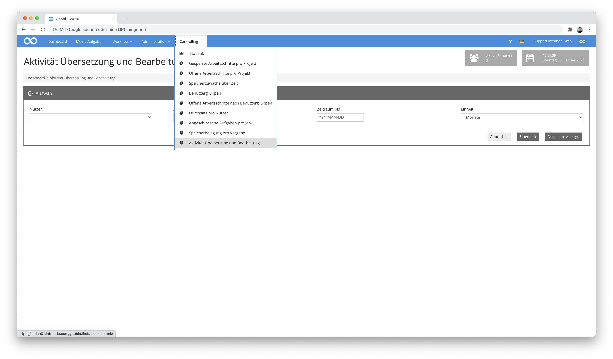

# identifier: intranda_statistics_ZZZ

## Übersicht

Name                     | Wert
-------------------------|-----------
Identifier               | intranda_statistics_sudan_memory_activity_by_user
Repository               | [https://github.com/intranda/goobi-plugin-statistics-sudan-memory](https://github.com/intranda/goobi-plugin-statistics-sudan-memory)
Lizenz              | GPL 2.0 oder neuer 
Letzte Änderung    | 25.07.2024 12:01:34


## Einführung
Dieses Statistik-Plugin ermöglicht eine statistische Erfassung der Aktivität von Übersetzern und Bearbeitern, die innerhalb des METS-Dateien spezifische Metadatenfelder bearbeiten. Hierbei werden insbesondere die Übersetzungsarbeiten in den Metadatenfeldern `Title (Arabic)`, `Title (English)`, `Description (English)` und `Description (Arabic)` berücksichtigt.


## Installation
Zur Installation des Plugins müssen folgende beiden Dateien installiert werden:

```bash
/opt/digiverso/goobi/plugins/statistics/plugin_intranda_statistics_sudan-base.jar
/opt/digiverso/goobi/plugins/GUI/plugin_intranda_statistics_sudan-gui.jar
```

Zusätzlich muss innerhalb der Datenbank die folgende Funktion erstellt werden:

```sql
DROP FUNCTION IF EXISTS wordcount;

    DELIMITER $$
    CREATE FUNCTION wordcount(str TEXT CHARSET utf8mb4)
            RETURNS INT
            DETERMINISTIC
            SQL SECURITY INVOKER
            NO SQL
       BEGIN
         DECLARE wordCnt, idx, maxIdx INT DEFAULT 0;
         DECLARE currChar, prevChar BOOL DEFAULT 0;
         SET maxIdx=char_length(str);
         WHILE idx < maxIdx DO
             SET currChar=SUBSTRING(str, idx, 1) RLIKE '[[:alnum:]]';
             IF NOT prevChar AND currChar THEN
                 SET wordCnt=wordCnt+1;
             END IF;
             SET prevChar=currChar;
             SET idx=idx+1;
         END WHILE;
         RETURN wordCnt;
       END
     $$
     DELIMITER ;
```

Dieser Funktion kann ein UTF8-codierter Text übergeben werden. Der Text wird Zeichen für Zeichen überprüft. Wenn das aktuelle Zeichen ein alnumerisches Zeichen ist (Buchstaben, Zahlen, Punkt, Komma, Buchstaben mit Diakritika, Klammern), das vorherige Zeichen jedoch nicht (Nichts, Leerzeichen, Zeilenumbruch, Tabulator), beginnt an dieser Stelle ein neues Wort und der Wortzähler wird erhöht. Am Ende wird der Wortzähler zurückgegeben.


## Überblick und Funktionsweise
Für eine Nutzung dieses Plugins muss der Nutzer über die korrekte Rollenberechtigung verfügen.


Bitte weisen Sie daher der Gruppe die Rolle `view_translation_activity` zu.


Anschließend kann der Menüpunkt `Aktivität Übersetzung und Bearbeitung` im Bereich `Controlling` ausgewählt werden.



Um den Zeitraum der Auswertung zu begrenzen, können die beiden Felder `Zeitraum von` und `Zeitraum bis` für das Startdatum und Enddatum genutzt werden. Hier kann ein Datum in der Form `YYYY-MM-DD` angegeben werden. Beide Angaben sind optional. Wenn das Startdatum nicht ausgefüllt wurde, gilt das Datum, an dem der erste Schritt abgeschlossen wurde. Fehlt das Enddatum, dann wird der aktuelle Zeitpunkt genutzt.


Im Feld `Einheit` wird festgelegt, in welchen Zeiträumen die Auswertung zusammengefasst werden soll. Hier kann aus den Werten `Tage`, `Monate`, `Quartale` oder `Jahre` gewählt werden.

Nach Angabe der benötigten Informationen können von diesem Plugin zwei verschiedene Auswertungen generiert werden:


### Auswertung: Überblick
Die Auswertung `Überblick` listet für jeden Zeitraum innerhalb des Start- und Enddatums auf, welcher Nutzer wie viele Arbeitsschritte `Translation of Arabic content to English` oder `Translation of English content to Arabic` bearbeitet hat. Dabei wird ebenfalls angegeben, wie viele Worte in den Feldern `Title (Arabic)`, `Title (English)`, `Description (English)` und `Description (Arabic)` in diesen Schritten insgesamt erfasst wurden.


### Auswertung: Detaillierte Anzeige
Die `Detaillierte Anzeige` listet jeden Arbeitsschritt `Translation of Arabic content to English` oder `Translation of English content to Arabic` auf, der innerhalb des angegebenen Start- und Enddatums abgeschlossen wurde. Zu jedem Arbeitsschritt wird außerdem der Nutzer, der zugehörige Vorgang, sowie der Inhalt und die Anzahl der Wörter aus den vier Feldern `Title (Arabic)`, `Title (English)`, `Description (English)` und `Description (Arabic)` angezeigt.


Die beiden Auswertungen lassen sich auch jeweils als Excel-Datei herunterladen.


## Weitere technische Informationen
Im folgenden werden einige SQL-Statements aufgeführt, die für die Arbeit mit den Daten im Rahmen dieses Plugins nützlich sein können.

SQL query über eine Gesamtübersicht:

```sql
    SELECT
    DATE_FORMAT(s.BearbeitungsEnde, '%Y-%m') AS plugin_statistics_sudan_timeRange,
    WORDCOUNT(GROUP_CONCAT(m1.value SEPARATOR ' ')) AS plugin_statistics_sudan_titleCount,
    WORDCOUNT(GROUP_CONCAT(m2.value SEPARATOR ' ')) AS plugin_statistics_sudan_titlearabicCount,
    WORDCOUNT(GROUP_CONCAT(m3.value SEPARATOR ' ')) AS plugin_statistics_sudan_descriptionCount,
    WORDCOUNT(GROUP_CONCAT(m4.value SEPARATOR ' ')) AS plugin_statistics_sudan_descriptionarabicCount,
    COUNT(s.Titel) AS plugin_statistics_sudan_workflowTitleCount,
    CONCAT(u.Nachname, ', ', u.Vorname) AS plugin_statistics_sudan_userName
    FROM
    metadata m1
        JOIN
    metadata m2 ON m1.processid = m2.processid
        JOIN
    metadata m3 ON m1.processid = m3.processid
        JOIN
    metadata m4 ON m1.processid = m4.processid
        JOIN
    schritte s ON m1.processid = s.ProzesseID
        LEFT JOIN
    benutzer u ON s.BearbeitungsBenutzerID = u.BenutzerID
    WHERE
    m1.name = 'TitleDocMain'
        AND m2.name = 'TitleDocMainArabic'
        AND m3.name = 'ContentDescription'
        AND m4.name = 'ContentDescriptionArabic'
        AND s.typMetadaten = TRUE
        AND s.Bearbeitungsstatus = 3
        AND s.titel like '%ranslat%'
        AND s.BearbeitungsEnde BETWEEN '2019-01-01' AND '2020-12-31'
    GROUP BY plugin_statistics_sudan_timeRange, plugin_statistics_sudan_userName;
```

SQL query für einen detaillierten Bericht:

```sql
    SELECT
    m1.processid,
    m1.value AS plugin_statistics_sudan_title,
    WORDCOUNT(m1.value) AS plugin_statistics_sudan_titleCount,
    m2.value AS plugin_statistics_sudan_titlearabic,
    WORDCOUNT(m2.value) AS plugin_statistics_sudan_titlearabicCount,
    m3.value AS plugin_statistics_sudan_description,
    WORDCOUNT(m3.value) AS plugin_statistics_sudan_descriptionCount,
    m4.value AS plugin_statistics_sudan_descriptionarabic,
    WORDCOUNT(m4.value) AS plugin_statistics_sudan_descriptionarabicCount,
    s.Titel AS plugin_statistics_sudan_workflowTitle,
    p.Titel AS plugin_statistics_sudan_processTitle,
    CONCAT(u.Nachname, ', ', u.Vorname) AS plugin_statistics_sudan_userName
    FROM
    metadata m1
        JOIN
    metadata m2 ON m1.processid = m2.processid
        JOIN
    metadata m3 ON m1.processid = m3.processid
        JOIN
    metadata m4 ON m1.processid = m4.processid
        JOIN
    schritte s ON m1.processid = s.ProzesseID
        LEFT JOIN
    prozesse p ON s.ProzesseID = p.ProzesseID
        LEFT JOIN
    benutzer u ON s.BearbeitungsBenutzerID = u.BenutzerID
    WHERE
    m1.name = 'TitleDocMain'
        AND m2.name = 'TitleDocMainArabic'
        AND m3.name = 'ContentDescription'
        AND m4.name = 'ContentDescriptionArabic'
        AND s.typMetadaten = TRUE
        AND s.titel like '%ranslat%'
        AND s.Bearbeitungsstatus = 3
        AND s.BearbeitungsEnde BETWEEN '2019-01-01' AND '2020-12-31';
```