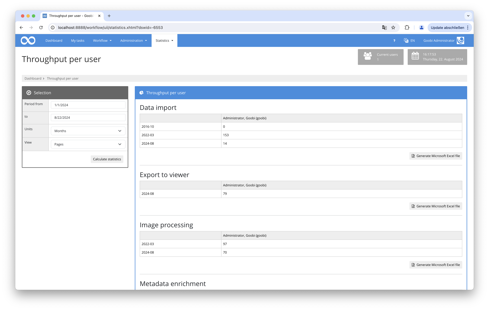

# Visualisierung des Durchsatzes pro Nutzer

## Übersicht

Name                     | Wert
-------------------------|-----------
Identifier               | intranda_statistics_user_througput
Repository               | [https://github.com/intranda/goobi-plugin-statistics-user-throughput](https://github.com/intranda/goobi-plugin-statistics-user-throughput)
Lizenz              | GPL 2.0 oder neuer 
Letzte Änderung    | 23.08.2024 13:53:00


## Einführung
Die vorliegende Dokumentation beschreibt die Installation und den Einsatz des Durchsatz pro Nutzer Plugins.

## Installation
Zur Installation des Plugins müssen folgende Dateien installiert werden:

```bash
/opt/digiverso/goobi/plugins/GUI/plugin_intranda_statistics-user-throughput-GUI.jar
/opt/digiverso/goobi/plugins/statistics/plugin_intranda_statistics-user-throughput.jar
/opt/digiverso/goobi/plugins/statistics/user_throughput_template.xlsx
/opt/digiverso/goobi/plugins/statistics/user_throughput_template_process.xlsx
```

## Konfiguration des Plugins

Dieses Plugin braucht keine weitere Konfiguration.

## Bedienung des Plugins

Um den Zeitraum der Auswertung zu begrenzen, können die beiden Felder `Zeitraum von` und `Zeitraum bis` für das Startdatum und Enddatum genutzt werden. Hier kann ein Datum in der Form `YYYY-MM-DD` angegeben werden. Beide Angaben sind optional. Wenn das Startdatum nicht ausgefüllt wurde, gilt das Datum, an dem der erste Schritt abgeschlossen wurde. Fehlt das Enddatum, dann wird der aktuelle Zeitpunkt genutzt.

Im Feld `Einheit` wird festgelegt, in welchen Zeiträumen die Auswertung zusammengefasst werden soll. Hier kann aus den Werten `Jahre`, `Monate`, `Wochen` oder `Tage` gewählt werden.

Im Feld `Anzeige` wird festgelegt, welche Zahlen angezeigt werden sollen. Hier kann aus den Werten `Seiten` oder `Vorgänge` gewählt werden.

Nach einem Klick an den Knopf `Statistik berechnen` werden der Durchsatz pro Nutzer in Tabellen detailliert angezeigt. Unter jeder Tabelle gibt es auch einen Link, wodurch man diese Tabelle als Excel-Datei herunterladen kann.

