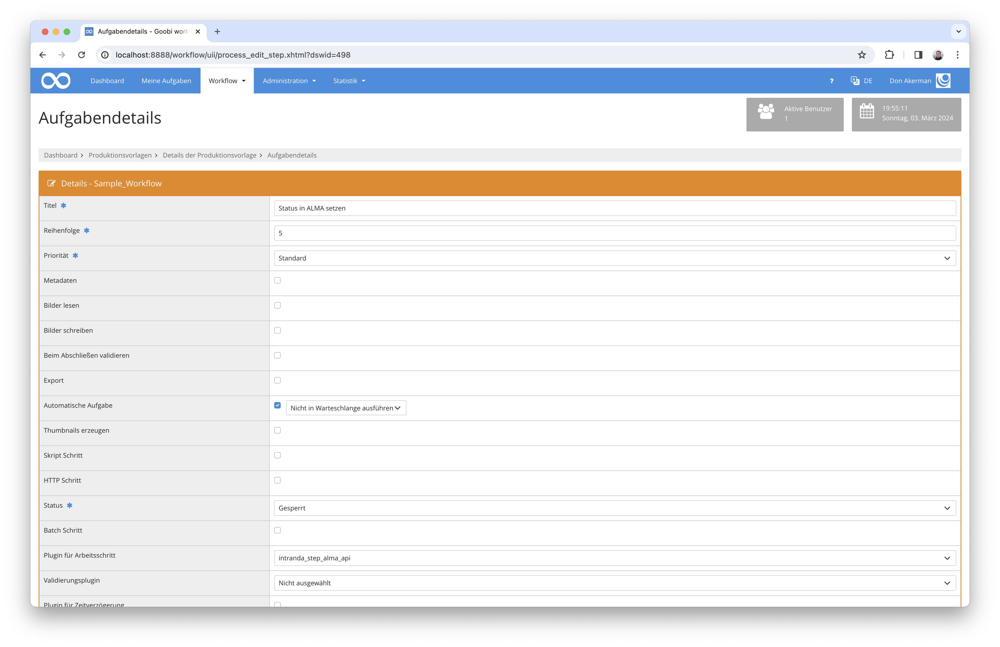

# ALMA API Plugin

## Übersicht

Name                     | Wert
-------------------------|-----------
Identifier               | intranda_step_alma_api
Repository               | [https://github.com/intranda/goobi-plugin-step-alma-api](https://github.com/intranda/goobi-plugin-step-alma-api)
Lizenz              | GPL 2.0 oder neuer 
Letzte Änderung    | 25.07.2024 12:01:27


## Einführung
Dieses Plugin wird verwendet, um Anfragen an REST-APIs, z.B. ALMA, zu senden und die zurückgegebenen Antworten zu verarbeiten. Mehrere Befehle können konfiguriert werden, um eine komplizierte Aufgabe zusammenzustellen. Das Plugin führt diese Befehle nacheinander in definierten Reihenfolge aus.


## Installation
Zur Nutzung des Plugins muss die Datei `plugin_intranda_step_alma_api-base.jar` an folgendem Ort gespeichert werden:

```bash
/opt/digiverso/goobi/plugins/step/plugin_intranda_step_alma_api-base.jar
```

Die Konfigurationsdatei `plugin_intranda_step_alma_api.xml` wird unter folgendem Pfad erwartet:

```bash
/opt/digiverso/goobi/config/plugin_intranda_step_alma_api.xml
```


## Überblick und Funktionsweise
Dieses Plugin wird in den Workflow so integriert, dass es automatisch ausgeführt wird. Eine manuelle Interaktion mit dem Plugin ist nicht notwendig. Zur Verwendung innerhalb eines Arbeitsschrittes des Workflows sollte es wie im nachfolgenden Screenshot konfiguriert werden.




## Konfiguration
Die Konfiguration des Plugins ist beispielhaft folgendermaßen aufgebaut:

```xml
<config_plugin>
    <!--
        order of configuration is:
          1.) project name and step name matches
          2.) step name matches and project is *
          3.) project name matches and step name is *
          4.) project name and step name are *
	-->
    <config>
        <!-- which projects to use for (can be more then one, otherwise use *) -->
        <project>*</project>
        <step>*</step>

        <!-- Base URL -->
        <url>https://api-eu.hosted.exlibrisgroup.com</url>

        <!-- API key -->
        <api-key>CHANGE_ME</api-key>

        <!-- Variables that can be used for following commands.
              @name: name of the variable, e.g. VARIABLE. To use this variable's value, one can simply use {$VARIABLE}.
              @value: value to initialize this variable. It can be plain string value, or a Goobi variable, e.g. {meta.NAME} for a Metadata named NAME.
         -->
        <variable name="MMS_ID" value="{meta.CatalogIDDigital}" />
        <!-- There can be multiple variables defined before all commands. -->
        <variable name="SIGNATURE" value="{meta.shelfmarksource}" />

        <!-- A command is a step to perform. There can be several commands configured, and if so, they will be run one by one in the same order as they are defined.
              @method: get | put | post | patch
              @accept: json | xml. Used to set up the header parameter 'Accept'. OPTIONAL. DEFAULT json.
              @content-type: json | xml. Used to set up the header parameter 'Content-type'. OPTIONAL. DEFAULT json.
              @endpoint: raw endpoint string without replacing the placeholders enclosed by {}. For every placeholder say {PLACEHOLDER}, one has to configure it in a
                                sub-tag, and in our example it would be <PLACEHOLDER>. Options for values of these sub-tags are:
                                - plain text value
                                - any variable defined by a <variable> tag before all <command> blocks
                                - any variable defined by a <target> sub-tag of any previous <command> block
        -->      
        <command method="get" accept="json" content-type="json" endpoint="/almaws/v1/bibs/{mms_id}/holdings/ALL/items">
        	<!-- define the value of the placeholder {mms_id} using the variable named MMS_ID -->
        	<mms_id>{$MMS_ID}</mms_id>

        	<!-- Filter condition that is to be applied on the REST call response. OPTIONAL.
        	      @key: JSON path from which the values are to be fetched for the filtering process
        	      @fallback: JSON path that shall be used when the JSON path configured by @key contains no value. OPTIONAL.
        	      @value: value to be compared with, which can be a plain text value, or a variable defined previously in the format {$VARIABLE}
        	      @alt: alternative option if there is no match found. Options are: all | first | last | random | none. OPTIONAL.
                      - all: filter nothing out, search the whole JSONObject for the following targets
                      - first: get the first JSONObject related to the common heading path shared by filter and targets, and search for targets within it
                      - last: get the last JSONObject related to the common heading path shared by filter and targets, and search for targets within it
                      - random: get a random JSONObject related to the common heading path shared by filter and targets, and search for targets within it
                      - none: filter everything out and stop searching. DEFAULT.
        	 -->
        	<filter key="item.item_data.alternative_call_number" fallback="item.holding_data.permanent_call_number" value="{$SIGNATURE}" alt="all" />

        	<!-- Target values that is to be retrieved from the REST call response and saved as a variable. OPTIONAL.
        	      @var: name of the variable that is to be used to save the target values retrieved.
                      If the variable was already defined before, then its value will be updated. Otherwise a new variable under this name will be created.
        	      @path: JSON path from where values are to be retrieved.
        	 -->
        	<target var="ITEM_PID" path="item.item_data.pid" />

        	<!-- There can be multiple targets configured. -->
        	<!-- In this example, the new variable will be named HOLDING_ID and it can be reused in the following steps using {$HOLDING_ID}. -->
        	<target var="HOLDING_ID" path="item.holding_data.holding_id" />
        </command>

        <command method ="post" endpoint="/almaws/v1/bibs/{mms_id}/holdings/{holding_id}/items/{item_pid}">
        	<!-- define the value of the placeholder {mms_id} using the variable named MMS_ID -->
        	<mms_id>{$MMS_ID}</mms_id>
        	<!-- define the value of the placeholder {holding_id} using the variable named HOLDING_ID -->
        	<holding_id>{$HOLDING_ID}</holding_id>
        	<!-- define the value of the placeholder {item_pid} using the variable named ITEM_PID -->
        	<item_pid>{$ITEM_PID}</item_pid>

          <!-- A parameter tag can be used to define parameters that shall be sent by the REST request. There can be multiple parameters configured. OPTIONAL.
                  @name: parameter name
                  @value: parameter value, which can only be plain text values here
            -->
        	<parameter name="op" value="scan" />
        	<parameter name="library" value="" />
        	<parameter name="department" value="InDigiZ_Dep" />
        	<parameter name="work_order_type" value="InDigiZ" />
        	<parameter name="done" value="false" />
        </command>

        <!-- A save tag is used to define an entry that is to be saved after running all previous commands. OPTIONAL.
              @type: type of the entry, OPTIONS are property | metadata
                         - property: save the entry as a process property
                         - metadata: save the entry as a metadata
              @name: name of the entry, which means
                           - property name if @type is "property"
                           - metadata type name if @type is "metadata"
              @value: value of the new process property, possible values are
                           - a plain text value
                           - a variable defined before all <command> blocks via a <variable> tag
                           - a variable defined within some <command> block via a <target> tag
              @choice: indicates how many items should be saved into this new property, OPTIONS are first | last | random, or any non-blank strings following a colon.
                           - first: save only the first one among all retrieved values
                           - last: save only the last one among all retrieved values
                           - random: save a random one from all retrieved values
                           - For any non-blank strings following a colon: the substring following this colon will be used as a whole delimiter to combine all results.
                           - For all other cases, including the case where there is only one single colon configured: all results will be combined using commas.
              @overwrite: true if the old property named so should be reused, false if a new property should be created, DEFAULT false.
        -->     
        <save type="property" name="holding_id" value="{$HOLDING_ID}" choice="first" overwrite="true" />
        <!-- There can be multiple save tags configured. -->
        <save type="property" name="item_pid" value="{$ITEM_PID}" choice="first" overwrite="true" />

    </config>

    <config>
        <!-- which projects to use for (can be more then one, otherwise use *) -->
        <project>*</project>
        <step>upload marc and portfolio</step>

        <!-- Base URL -->
        <url>https://api-eu.hosted.exlibrisgroup.com</url>

        <!-- API key -->
        <api-key>CHANGE_ME</api-key>

        <variable name="MARC_FOLDER" value="/opt/digiverso/g2g/workspace/workflow/marcexport/{processid}" />
        <variable name="PORTFOLIO_PATH" value="/opt/digiverso/g2g/workspace/demo_content/portfolio.xml" />

        <command method="post" accept="json" content-type="xml" endpoint="/almaws/v1/bibs">
            <parameter name="normalization" value="43588" />
            <parameter name="validate" value="false" />
            <parameter name="override_warning" value="true" />
            <parameter name="check_match" value="false" />

            <!-- Set up request body. OPTIONAL.
                 @src: absolute path to the file whose contents shall be used as request body. OPTIONAL. It accepts one of the following both:
                          - a plain text value stating the absolute path
                          - a predefined variable containing the absolute path
                          ATTENTION: one can also use the absolute path of the folder containing this file here, in which case the content of the first file in that folder will be used.
                 @wrapper: wrappers separated by space that shall be wrapped around the content read from the file. ONLY applicable if @src is configured. OPTIONAL.
                                  The precise way of wrapping depends on the setting of @content-type of the command tag.
                                  For example, say one has wrapper configured as "wrapper1 wrapper2 wrapper3" then:
                                  - If @content-type="json", the file content will be wrapped as {wrapper1: {wrapper2: {wrapper3: {FILE_CONTENT}}}}
                                  - If @content-type="xml", the file content will be wrapped as <wrapper1><wrapper2><wrapper3>{FILE_CONTENT}</wrapper3></wrapper2></wrapper1>
                 @value: use a plain text value or a predefined variable instead of the content of a file. OPTIONAL. ATTENTION:
                              - to use a plain text value one has to assure that its format matches the configured @content-type correctly
                              - to use a variable one has to assure that the format of the variable's value matches the configured @content-type correctly
              -->
            <body src="{$MARC_FOLDER}" wrapper="bib" />

            <target var="MMS_ID" path="mms_id" />
        </command>

        <command method="post" accept="json" content-type="xml" endpoint="/almaws/v1/bibs/{mms_id}/portfolios">
            <mms_id>{$MMS_ID}</mms_id>
            <!-- use content of the file as request body, no wrapper needed -->
            <body src="{$PORTFOLIO_PATH}" wrapper="" />
            <!-- create a new variable to hold the value on this JSON path  -->
            <target var="PORTFOLIO_ID" path="id" />         
        </command>       

        <!-- save values of variables as process properties  -->
        <save type="metadata" name="MMS_ID" value="{$MMS_ID}" choice="first" overwrite="true" />
        <save type="metadata" name="PortfolioId" value="{$PORTFOLIO_ID}" choice="first" overwrite="true" />
    </config>

    <config>
        <!-- which projects to use for (can be more then one, otherwise use *) -->
        <project>*</project>
        <step>update portfolio</step>

        <!-- Base URL -->
        <url>https://api-eu.hosted.exlibrisgroup.com</url>

        <!-- API key -->
        <api-key>CHANGE_ME</api-key>

        <!-- create variables using values read from process properties -->
        <variable name="MMS_ID" value="{meta.MMS_ID}" />
        <variable name="PORTFOLIO_ID" value="{meta.PortfolioId}" />

        <command method="get" accept="json" content-type="json" endpoint="/almaws/v1/bibs/{mms_id}/portfolios/{portfolio_id}">
            <!-- define the value of the placeholder {mms_id} using the value of the variable named MMS_ID -->
            <mms_id>{$MMS_ID}</mms_id>
            <!-- define the value of the placeholder {portfolio_id} using the value of the variable named PORTFOLIO_ID -->
            <portfolio_id>{$PORTFOLIO_ID}</portfolio_id>      

            <!-- An update tag is used to save the MAYBE updated response JSONObject as an variable. AT MOST ONE allowed. OPTIONAL.
                   ATTENTION: to use this tag, one has to assure that the @accept configured in the command tag is json.
                   @var: name of the variable that shall be used to save the JSONObject.
               -->
            <update var="UPDATED_PORTFOLIO" >
                <!-- An entry tag is used to define modifications that shall be made on the response JSONObject. OPTIONAL. Multiple entry sub-tags possible.
                       @path: JSON path(s) of the item(s) that shall be modified, where plural comes into use when there is a JSONArray with multiple elements mixed in this JSON path
                       @value: new value of the item(s) selected by the JSON path
                    -->
                <entry path="availability.value" value="11" />
            </update>
        </command>

        <!-- use default settings of @accept and @content-type, which are both json -->
        <command method="put" endpoint="/almaws/v1/bibs/{mms_id}/portfolios/{portfolio_id}">
            <mms_id>{$MMS_ID}</mms_id>
            <portfolio_id>{$PORTFOLIO_ID}</portfolio_id>        
            <!-- use the JSONObject saved by the last command as the request body --> 	
            <body value="{$UPDATED_PORTFOLIO}" />        	
        </command>                     
    </config>

</config_plugin>
```


### Allgemeine Konfigurationen
Die Konfiguration des Plugins erfolgt wie hier beschrieben:

| Wert | Beschreibung |
| :--- | :--- |
| `project` | Dieser Parameter legt fest, für welches Projekt der aktuelle Block `<config>` gelten soll. Verwendet wird hierbei der Name des Projektes. Dieser Parameter kann mehrfach pro `<config>`-Block vorkommen. |
| `step` | Dieser Parameter steuert, für welche Arbeitsschritte der Block `<config>` gelten soll. Verwendet wird hier der Name des Arbeitsschritts. Dieser Parameter kann mehrfach pro `<config>` Block vorkommen. |
| `url` | Hier wird die Basis-URL der REST-API angegeben. |
| `api-key` | Hier wird der API-Schlüssel für die Verbindung zu der REST-API konfiguriert. |
| `variable` | Mit diesem Tag kann eine Variable definiert werden, die von allen nachfolgenden Befehlen verwendet werden kann. Dieses Tag hat zwei Attribute, wobei `@name` den Namen und `@value` den Wert definiert. `@value` erwartet einen einfachen Textwert oder eine Goobi-Variable. |
| `command` | Ein Befehlsblock definiert einen Befehl, der im Auftrag ausgeführt werden soll. Es hat selbst zwei obligatorische Attribute, wobei `@method` die zu verwendende Methode angibt und `@endpoint` den Pfad zum Endpoint, bei dem alle Platzhalter nicht ersetzt werden. Es verfügt auch über die zwei optionalen Attribute `@accept` und `@content-type`, die verwendet werden, um die Request-Parameter `Accept` und `Content-type` anzugeben. Beide erwarten entweder `json` oder `xml`. Wird einer der beiden Parameter weggelassen, wird der Standardwert `json` verwendet. Weitere Einzelheiten finden Sie in der nachstehenden Tabelle und in der obigen Beispielkonfiguration. |
| `save` | Ein optionales `save`-Element definiert einen Wert, der nach der Ausführung aller Befehle gespeichert werden soll. Es hat drei obligatorische Attribute, wobei `type` angibt, ob der Wert als Vorgangseigenschaft oder als Metadatum gespeichert werden soll. Das Attribut `@name` definiert den Namen der Vorgangseigenschaft oder des Metadatentyps. Das Attribut `@value` bestimmt den Wert, der ein einfacher Textwert oder eine zuvor definierte Variable sein kann. Es verfügt über zwei optionale Attribute, wobei `@choice` angibt, welcher Wert gespeichert werden soll, wenn mehrere gefunden werden, und `@overwrite` bestimmt, ob eine zuvor erstellte Vorgangseigenschaft oder ein Metadatum desselben Namens wiederverwendet werden soll. |


### Konfigurationen innerhalb von Befehlsblöcken
Die Konfiguration innerhalb der Befehlsblöcke erfolgt wie hier beschrieben:

| Wert | Beschreibung |
| :--- | :--- |
| `filter` | Hier wird angegeben, welche Teile der JSON-Antwort für die Suche nach den `target`-Werten verwendet werden sollen. Es hat vier Attribute, wobei `@key` und `@value` obligatorisch sind, während `@fallback` und `@alt` optional sind. Weitere Einzelheiten finden sich in den Kommentaren in der Beispielkonfiguration. |
| `target` | Hier wird angegeben, welche Werte als Variablen zur späteren Verwendung gespeichert werden sollen. Der Parameter hat zwei Attribute, wobei `@var` den Variablennamen und `@path` den JSON-Pfad zum Abrufen der Werte angibt. |
| `parameter` | Hier wird ein Parameter angegeben, der zusammen mit einer Anfrage an die REST-API gesendet werden soll. Er verfügt über zwei Attribute, wobei `@name` für den Parameternamen und `@value` für den Parameterwert verwendet wird, der auschließlich aus reinen Textwerten bestehen kann. |
| `body` | Hier wird der Request-Body festgelegt. Er verfügt über drei Attribute, wobei eines von `@src` und `@value` angegeben werden muss. Ist `@src` gesetzt, wird auch `@wrapper` anwendbar. Mit `@src` wird dabei die Datei angegeben, deren Inhalt als Request-Body verwendet werden soll, während `@value` den Wert einer Variable festlegt, die von vorherige Befehle erhalten worden ist. Für die Verwendung von `@wrapper` ist eine Berücksichtigung der Kommentare in der Beispielkonfiguration empfehlenswert.  |
| `update` | Dieses Element wird verwendet, um das JSON-Objekt der Antwort als Variable zu speichern. Es hat ein Attribut `@var`, das den Namen der Variablen angibt. Jedes `Command`-Tag kann höchstens ein `update`-Unterelement haben. Innhalb des `update`-Unterelement kann es mehrere `Entry`-Unterelemente geben, von denen jedes eine Änderung am JSON-Antwortobjekt angibt. |