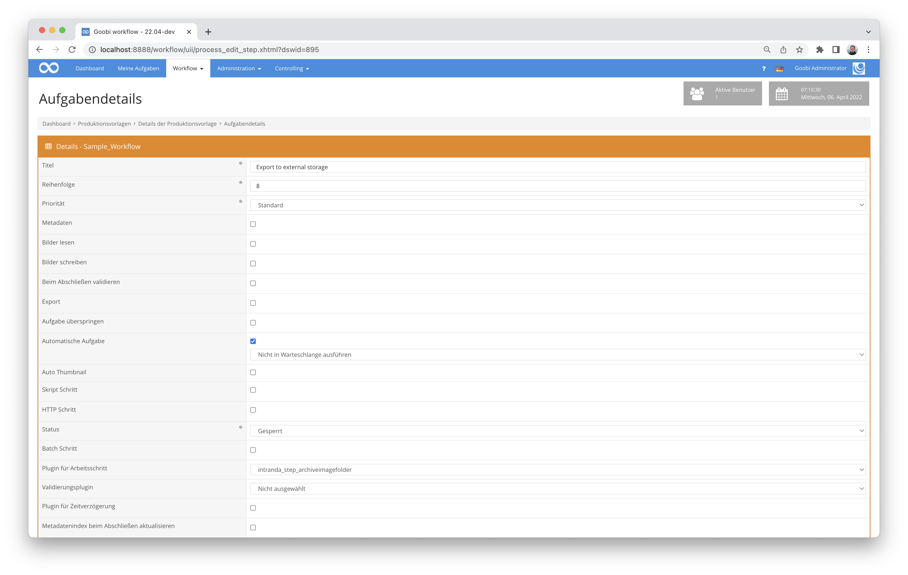

# Archivierung von Bildordnern

## Übersicht

Name                     | Wert
-------------------------|-----------
Identifier               | intranda_step_archiveimagefolder
Repository               | [https://github.com/intranda/goobi-plugin-step-archive-image-folder](https://github.com/intranda/goobi-plugin-step-archive-image-folder)
Lizenz              | GPL 2.0 oder neuer 
Letzte Änderung    | 26.08.2024 10:42:47


## Einführung
Dieses Step Plugin für Goobi workflow kopiert Bildordner auf einen externen Speicher, der mittels sftp (ssh) angebunden ist und legt eine Datei an, die Goobi workflow dazu veranlasst eine Warnung im Vorgang anzuzeigen. Die Warnung wird in den Vorgangsdetails sowie im Metadateneditor angezeigt. Als Alternative zu sftp kann auch ein s3 Bucket eingebunden werden.


## Installation
Das Plugin besteht aus der folgenden Datei:

```bash
goobi_plugin_step_archiveimagefolder-base.jar
```

Diese Datei muss in dem richtigen Verzeichnis installiert werden, so dass diese nach der Installation an folgendem Pfad vorliegt:

```bash
/opt/digiverso/goobi/plugins/step/plugin_intranda_step_archiveimagefolder-base.jar
```

Daneben gibt es eine Konfigurationsdatei, die an folgender Stelle liegen muss:

```bash
/opt/digiverso/goobi/config/plugin_intranda_step_archiveimagefolder.xml
```


## Überblick und Funktionsweise
Zur Inbetriebnahme des Plugins muss dieses für einen oder mehrere gewünschte automatische Aufgaben im Workflow aktiviert werden. Dies erfolgt wie im folgenden Screenshot aufgezeigt durch Auswahl des Plugins `intranda_step_archiveimagefolder` aus der Liste der installierten Plugins.



Das Plugin kopiert die Dateien aus dem konfigurierten Ordner auf den SSH-Server oder den S3 Bucket, schreibt eine XML-Datei mit den Infos wo die Dateien liegen in den Vorgangsordner und löscht (wenn so konfiguriert) danach die Bilder auf dem Goobi-Speicher und schließt den Schritt.

Die Bilder können danach mit dem Plugin `goobi-plugin-administration-restorearchivedimagefolder` wieder hergestellt werden.


## Konfiguration
Die Konfiguration des Plugins erfolgt über die Konfigurationsdatei `plugin_intranda_step_archiveimagefolder.xml` und kann im laufenden Betrieb angepasst werden. Im folgenden ist eine beispielhafte Konfigurationsdatei aufgeführt:

```xml
<?xml version="1.0" encoding="UTF-8"?>
<config_plugin>
        <!--
        order of configuration is:
          1.) project name and step name matches
          2.) step name matches and project is *
          3.) project name matches and step name is *
          4.) project name and step name are *
	-->

    <config>
        <!-- which projects to use for (can be more then one, otherwise use *) -->
        <project>*</project>
        <step>*</step>

        <!-- the folder to archive -->
        <folder>master</folder>
        <!-- delete local files after copying and close step -->
        <deleteAndCloseAfterCopy>false</deleteAndCloseAfterCopy>
        <method>
            <name>SSH</name>
            <host>bandspeicher.intranda.com</host>
            <user>intranda</user>
        </method>
    </config>

    <config>
        <project>*</project>
        <step>Copy to S3 storage</step>
        <folder>media</folder>
        <deleteAndCloseAfterCopy>false</deleteAndCloseAfterCopy>
        <method>
            <name>s3</name>
            <S3Endpoint>http://127.0.0.1:9000</S3Endpoint>
            <S3Bucket>storage-bucket</S3Bucket>
            <S3Prefix>archive</S3Prefix>
            <S3AccessKeyID>CHANGEME</S3AccessKeyID>
            <S3SecretAccessKey>CHANGEME</S3SecretAccessKey>
        </method>
    </config>

</config_plugin>
```

Für die Authentifizierung am ssh-Server wird an den üblichen Stellen (`$USER_HOME/.ssh`) nach public keys gesucht. Andere Authentifizierungsmethoden wie username/password sind bisher nicht vorgesehen. 

Bei der Nutzung von s3 muss der s3 Endpoint, sowie der zu nutzende bucket Name angegeben werden. Optional kann ein Präfix gesetzt werden, wenn die Archivierung nicht direkt im Root des Buckets erfolgen soll. S3AccessKeyID und S3SecretAccessKey enthalten die Zugangsdaten.
 
Die Einstellung `<deleteAndCloseAfterCopy>false</deleteAndCloseAfterCopy>` ist für den Fall gedacht, dass die Dateien auf dem SSH-Server erst einmal in einem Buffer gespeichert und danach noch auf ein Band geschrieben werden. In diesem Fall kann der Arbeitsschritt offen bleiben und durch einen Callback des Bandspeicher-Systems geschlossen werden. Der Callback ist bisher für keinen Bandspeicher implementiert, lässt sich jedoch durch die Standard Goobi workflow REST API abbilden.