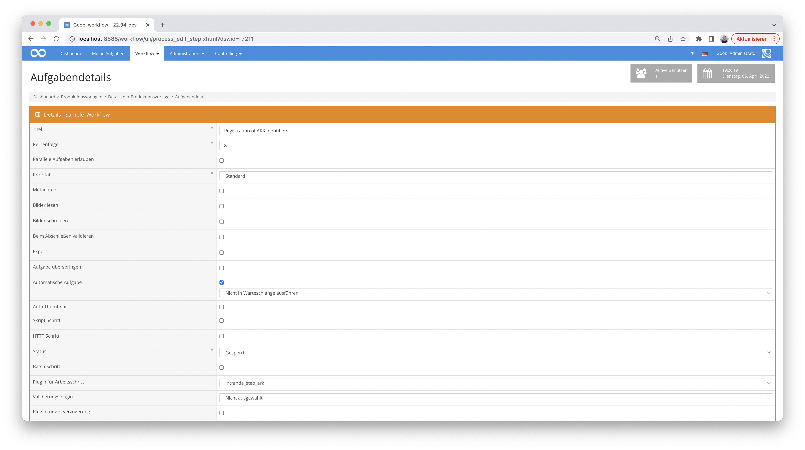

# Erzeugen von Archival Resource Keys (ARK)

## Übersicht

Name                     | Wert
-------------------------|-----------
Identifier               | intranda_step_ark
Repository               | [https://github.com/intranda/goobi-plugin-step-ark](https://github.com/intranda/goobi-plugin-step-ark)
Lizenz              | GPL 2.0 oder neuer 
Letzte Änderung    | 25.07.2024 12:01:12


## Einführung
Die vorliegende Dokumentation beschreibt die Installation, die Konfiguration und den Einsatz des Step Plugins für die Generierung von ARK-Identifiern in Goobi workflow.

**ACHTUNG:** Dieses Update ist seit dem 01.01.2024 nur sehr eingeschränkt einzusetzen. Die Erzeugung von ARKs im Plugin erfolgte über die Rest-API von [arketype.ch](https://arketype.ch), einem Dienst der Fachhochschule Genf, der im Laufe des Jahres 2024 abgeschaltet wird. Arketype ist ein Fork von [EZID](https://github.com/CDLUC3/ezid) und könnte theoretisch damit bedient werden. Empfohlen wird aber der Betrieb eines lokalen ARK-Services mittels des [ARK-Services](https://gitlab.com/zhbluzern/zentralgut-ark-service) der ZHB Luzern für [ZentralGut](https://zentralgut.ch). Dieses Python-Skript erzeugt lokale Identifier, registriert diese im globalen Resolver und trägt sie in Goobi Workflow in die Vorgänge ein. 


## Installation
Das Plugin besteht aus der folgenden Datei:

```bash
plugin_intranda_step_ark-base.jar
```

Diese Datei muss in dem richtigen Verzeichnis installiert werden, so dass diese nach der Installation an folgendem Pfad vorliegt:

```bash
/opt/digiverso/goobi/plugins/step/plugin_intranda_step_ark-base.jar
```

Daneben gibt es eine Konfigurationsdatei, die an folgender Stelle liegen muss:

```bash
/opt/digiverso/goobi/config/plugin_intranda_step_ark.xml
```


## Überblick und Funktionsweise
Das Plugin wird üblicherweise vollautomatisch innerhalb des Workflows ausgeführt. Es ermittelt zunächst, ob bereits ein Archival Resource Key (ARK) vorhanden ist. Sollte noch kein ARK vorhanden sein, wird ein neuer ARK registriert. Falls schon ein ARK in den Metadaten vorhanden ist, wird versucht die Metadaten des ARKs zu aktualisieren.

Dieses Plugin wird in den Workflow so integriert, dass es automatisch ausgeführt wird. Eine manuelle Interaktion mit dem Plugin ist nicht notwendig. Zur Verwendung innerhalb eines Arbeitsschrittes des Workflows sollte es wie im nachfolgenden Screenshot konfiguriert werden.




## Konfiguration
Die Konfiguration des Plugins erfolgt über die Konfigurationsdatei `plugin_intranda_step_ark.xml` und kann im laufenden Betrieb angepasst werden. Im folgenden ist eine beispielhafte Konfigurationsdatei aufgeführt:

```xml
<?xml version="1.0" encoding="UTF-8"?>
<config_plugin>
	<!-- order of configuration is:
    1.) project name and step name matches
    2.) step name matches and project is *
    3.) project name matches and step name is *
    4.) project name and step name are *
  -->

	<config>
		<!-- which projects to use for (can be more then one, otherwise use *) -->
		<project>*</project>
		<step>*</step>

		<!-- URI of the ARK API, must use https -->
		<uri>https://www.arketype.ch/</uri>

		<!-- Name Assigning Number Authority -->
		<naan>99999</naan>

		<!-- name of the API user -->
		<apiUser>apiUser</apiUser>

		<!-- password of the API user -->
		<apiPassword></apiPassword>

		<!-- shoulder on which new ARKs shall be minted -->
		<shoulder>fgt</shoulder>

		<!-- Datacite Metadata fields -->

		<!-- metadata field datacite.creator -->
		<metadataCreator>{meta.CreatorsAllOrigin}</metadataCreator>

		<!-- metadata field datacite.title -->
		<metadataTitle>{meta.TitleDocMain}</metadataTitle>

		<!-- metadata field datacite.publisher -->
		<metadataPublisher>{meta.PublisherName}</metadataPublisher>

		<!-- metadata field datacite.publicationyear -->
		<metadataPublicationYear>{meta.PublicationYear}</metadataPublicationYear>

		<!-- metadata field datacite.resourcetype can only contain following values:
			Audiovisual, Collection, Dataset, Event, Image ,InteractiveResource, Model,
			PhysicalObject, Service, Software, Sound, Text, Workflow, Other. For more
			information consult the API-documentation https://www.arketype.ch/doc/api -->
		<metadataResourceType>Text</metadataResourceType>

		<!--target url ark will forward to -->
		<publicationUrl>https://viewer.example.org/image/{meta.CatalogIDDigital}</publicationUrl>

		<!--metadatatype in METS-File -->
		<metadataType>ARK</metadataType>

	</config>
</config_plugin>
```

| Parameter | Erläuterung |
| :--- | :--- |
| `project` | Dieser Parameter legt fest, für welches Projekt der aktuelle Block `<config>` gelten soll. Verwendet wird hierbei der Name des Projektes. Dieser Parameter kann mehrfach pro `<config>` Block vorkommen. |
| `step` | Dieser Parameter steuert, für welche Arbeitsschritte der Block `<config>` gelten soll. Verwendet wird hier der Name des Arbeitsschritts. Dieser Parameter kann mehrfach pro `<config>` Block vorkommen. |
| `uri` | In diesem Parameter muss die URL der API hinterlegt werden. In der Regel kann der Standardeintrag `https://www.arketype.ch` übernommen werden.  |
| `naan` | NAAN ist ein Akronym für Name Assigning Number Authority. Es handelt sich um einen eindeutigen Bezeichner, welchem der Account zugeordnet ist. |
| `apiUser` |  Name des API Nutzers |
| `apiPassword` | Passwort des API Nutzers |
| `shoulder` | Name des Unternamensraumes, in dem die neuen ARKs erzeugt werden sollen |
| `metadataCreator` | Entspricht dem `datacite.creator` Feld und sollte die Personen benennen, die die Daten erzeugt haben. In der Regel kann der vorgegebene Wert `{meta.CreatorsAllOrigin}` beibehalten werden.  |
| `metadataTitle` | Entspricht dem `datacite.title` Feld und sollte den Namen beinhalten, unter dem die Veröffentlichung bekannt ist. In der Regel kann der vorgegebene Wert `{meta.TitleDocMain}` beibehalten werden. |
| `metadataPublisher` | Entspricht dem `datacite.publisher` Feld. In der Regel kann der vorgegebene Wert `{meta.PublisherName}` beibehalten werden. |
| `metadataResourceType` | Entspricht dem `datacite.publicationyear` Feld. In der Regel kann der vorgegebene Wert `{meta.PublicationYear}` beibehalten werden. |
| `metadataResourceType`   | Entspricht dem `datacite.resourcetype` Feld. Es sind nur die Werte `Audiovisual`, `Collection`, `Dataset`, `Event`, `Image`, `InteractiveResource`, `Model`, `PhysicalObject`, `Service`, `Software`, `Sound`, `Text`, `Workflow`, und `Other` zulässig. Zusätzlich können noch spezifische Untertypen angegeben werden. Ein Beispiel wäre Image/`Photo`. Der Untertyp, also der Teil hinter dem `/`, unterliegt dabei keiner Einschränkung.|
| `publicationUrl`   | URL unter der das digitalisierte Werk in Zukunft zur Verfügung steht. In der Regel wird die Veröffentlichungs-URL einem Muster folgen, z.B. `https://viewer.example.org/{meta.CatalogIDDigital}`. In diesem Fall wird davon ausgegangen, dass die Werke in Zukunft unter einer URL veröffentlicht werden, die das Metadatum `Identifier` enthält. |
| `metadataType`  | Gibt den Metadatentyp an, unter dem die URN erfasst werden soll. Hier sollte die Vorgabe nicht verändert werden.  |