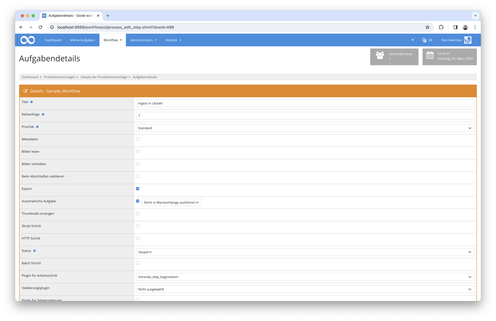

# Libsafe Integration

## Übersicht

Name                     | Wert
-------------------------|-----------
Identifier               | intranda_step_bagcreation,intranda_step_bagsubmission
Repository               | [https://github.com/intranda/goobi-plugin-step-bag-creation](https://github.com/intranda/goobi-plugin-step-bag-creation)
Lizenz              | GPL 2.0 oder neuer 
Letzte Änderung    | 25.07.2024 11:50:00


## Einführung
Die vorliegende Dokumentation beschreibt die Installation, Konfiguration und den Einsatz des Plugins zum Ingest in die Langzeitarchivierung Libsafe.

Mithilfe dieses Plugins für Goobi können die in Goobi vorliegenden Metadaten Objekte, sowie zusätzliche beschreibende Dokumente zu einem [E-ARK](https://www.eark-project.com/)-[BagIt](https://datatracker.ietf.org/doc/html/rfc8493) zusammengefasst und auf den Libsafe Server transferiert werden.


## Installation
Um den Libsafe Ingest nutzen zu können, müssen folgende Dateien installiert werden:

```bash
/opt/digiverso/goobi/plugins/step/plugin_intranda_step_bagcreation-base.jar
/opt/digiverso/goobi/plugins/config/plugin_intranda_step_bagcreation.xml
```

Im Workflow müssen zwei neue Arbeitsschritte eingefügt werden. Als erstes ein automatischer Schritt, der das auf E-ARK basierende `BagIt Submission Information Package (SIP)` erstellt, hier muss als Plugin `intranda_step_bagcreation` ausgewählt werden. Anschließend wird ein zweiter automatischer Arbeitsschritt benötigt, der die eigentliche Datenlieferung übernimmt. Hierfür wird das Plugin `intranda_step_bagsubmission` benötigt.


## Überblick und Funktionsweise
Dieses Plugin wird in den Workflow so integriert, dass es automatisch ausgeführt wird. Eine manuelle Interaktion mit dem Plugin ist nicht notwendig. Zur Verwendung innerhalb eines Arbeitsschrittes des Workflows sollte es wie im nachfolgenden Screenshot konfiguriert werden.



Die Langzeitarchivierung besteht aus mehreren Teilschritten:


### Ordnerstruktur
Als erstes wird die für das SIP notwendige Datei- und Ordnerstruktur erstellt.

Dabei werden innerhalb eines root-Ordners ein `metadata` Ordner und ein `representations` Ordner erstellt. Innerhalb des `metadata` Ordners gibt es die Unterordner `descriptive` und `other`, um MODS-Dateien sowie andere Formate wie die DFG-Viewer-extensions zu speichern. Innerhalb von `representations` gibt es Unterordner für verschiedene Formate, die jeweils einen Unterordner `data` enthalten, in dem sich die Dateien befinden.


### Metadaten
Zu jedem Format gehört eine METS-Datei, in der die Dateien im `data`-Ordner aufgelistet sind. Jedes Format wird in einer eigenen METS-Datei beschrieben, die je eine `fileGroup` und eine `structMap` enthalten.

Die Metadaten werden in MODS beschrieben. Hierbei gibt es im `descriptive` Ordner pro Strukturelement eine eigene Datei. Diese Datei enthält alle Metadaten, für die im Regelsatz ein Exportmapping definiert wurde. Da es auch Metadaten geben kann, die im regulären Export nicht exportiert werden sollen, bei der Langzeitarchivierung jedoch ebenfalls archiviert werden müssen, besteht die Option, in der Konfigurationsdatei weitere Exportparameter zu definierten, die nur beim Libsafe-Export genutzt werden.

Technische oder administrative Metadaten werden im Ordner `other` hinterlegt. Anschließend wird im root-Ordner eine METS-Datei erstellt, die auf die anderen erstellten METS, MODS und AMD verweist.


### SIP Erstellung
Die vorbereiteten Daten werden nun zu einem `SIP BagIt` zusammengefasst. Hierzu werden alle Dateien mit einer Checksumme versehen und in der Datei `manifest-sha256.txt` aufgelistet. `bagit.txt` enthält Informationen zur Bag-Version und dem Encoding und `bag-info.txt` enthält Informationen zum Ersteller des Bags, der Größe, Payload und dem Erstellungsdatum, sowie einige Angaben zur Übermittlung des Ingest-Status zurück an Goobi.

Als letztes wird die `tagmanifest-sha256.txt` Datei erstellt. Diese enthält die Namen und Checksummen der zuvor genannten 3 Dateien.


### Tar Generierung
Die zuvor vorbereiteten Ordner und Dateien werden zu einer Tar-Datei zusammgengefasst und im Vorgangsordner gespeichert.


### Datenlieferung
Die Datenlieferung erfolgt per SFTP-Upload. Hierzu wird die zuvor erzeugte SIP-Datei auf den entfernten Server hochgeladen. Alternativ kann der Export in ein lokales Verzeichnis auf dem Server oder einen Netzwerk-Share durchgeführt werden. Der Dateiname entspricht dem Bag-Namen und dem Suffix `_bag.tar`.


### Rückmeldung an Goobi
Die Statusmeldung zurück an Goobi findet via Rest-API-Aufrufen statt. Hierzu gibt es verschiedene Endpoints, um die einzelnen Informationen zu liefern. Die Rest-API kann mit XML oder JSON umgehen. Hierzu muss bei GET-Abfragen der `Accept` header und bei anderen Anfragen `Content-Type` auf `application/xml` oder `application/json` gesetzt werden. Fehlt die Angabe, wird der default JSON genutzt.

Die Authentifizierung kann auf 2 Arten erfolgen. Die notwendigen Methoden können in `goobi_rest.xml` für eine IP Adresse freigeschaltet werden, dann klappen die Anfragen von diesem einen Server, oder man generiert einen API-Token. Für diesen API-Token können dann einzelne Methoden auch ohne IP-Adressen Beschränkung erlaubt werden. Die Authentifizierung erfolgt dann via HTTP Header `Authorization: Basic <TOKEN>`.

Bei allen Anfragen wird die `processid` benötigt. Diese Information wird an zwei Stellen übermittelt. Zum einen ist sie Teil der Metadaten und kann in der MODS-Datei im Feld `<mods:identifier type="GOOBI">` gefunden werden, alternativ wird sie im Feld `Process-ID` in `bag-info.txt` übermittelt.

### Übermittlung der Libsafe ID
Um die generierte Libsafe ID in Goobi bekannt zu machen, muss eine `POST` Anfrage an `/process/<process id>/metadata` gestellt werden.

```bash
curl -H Authorization: Basic <TOKEN> -H 'Content-Type: application/json' -X POST <GOOBI URL>/api/process/<PROCESSID>/metadata -d '{"name":"LibsafeID","value":"<LIBSAFE ID>","metadataLevel":"topstruct"}'
```


### Erfolgs-/Fehlermeldung
Eine Meldung im Vorgangsjournal kann via `POST` Anfrage an `/process/<process id>/journal` erstellt werden.

```bash
curl -H Authorization: Basic <TOKEN> -H 'Content-Type: application/json' -X POST <GOOBI URL>/api/process/<PROCESSID>/journal -d '{"userName": "<USERNAME>", "type": "<TYPE>", "message": "<MESSAGE>"}'
```

Die Variable `USERNAME` und `MESSAGE` können beliebigen Text beinhalten, `TYPE` muss ein Wert aus der Liste `error`, `warn`, `info` oder `debug` kommen.


### Statusänderung
Um den Ingest-Vorgang in Goobi abzuschließen, muss die ID des zu schließenden Schrittes bekannt sein. Diese ID lässt sich über die Rest-API ermitteln, indem ein `GET`-Request nach allen Schritten des Vorgangs gestellt wird.

```bash
curl -H Authorization: Basic <TOKEN> -H 'Accept: application/json'  <GOOBI URL>/api/process/<PROCESSID>/steps
```

Aus der Antwort kann entweder über `steptitle` oder `status` der richtige Schritt und dessen ID gefunden werden. Anschließend kann ein `PUT` Request den Schritt abschließen:


```bash
curl -H Authorization: Basic <TOKEN> -H 'Content-Type: application/json' -X PUT <GOOBI URL>/api/process/<PROCESSID>/step/<STEPID>/close
```


## Konfiguration
Die Konfiguration des Plugins erfolgt in der Datei `plugin_intranda_step_bagcreation.xml`die hier erläutert wird:

```xml
<config_plugin>
    <!--
        order of configuration is:
          1.) project name and step name matches
          2.) step name matches and project is *
          3.) project name matches and step name is *
          4.) project name and step name are *
	-->

    <config>
        <!-- which projects to use for (can be more then one, otherwise use *) -->
        <project>*</project>
        <step>*</step>
```

Der Bereich `<config>` ist beliebig oft wiederholbar und erlaubt dadurch unterschiedliche Metadatenkonfigurationen oder den Ingest an verschiedene Ziele für verschiedene Projekte.

Die Unterelemente `<project>` und `<step>` werden zur Prüfung genutzt, ob der vorliegende Block für den aktuellen Schritt genutzt werden soll. Dabei wird zuerst geprüft, ob es einen Eintrag gibt, der sowohl den Projektnamen als auch den Schrittenamen enthält. Ist dies nicht der Fall, wird nach einem Eintrag für durch den `*` gekennzeichnete, beliebige Projekte und dem verwendeten Schrittenamen gesucht. Wenn dazu ebenfalls kein Eintrag gefunden wurde, erfolgt eine Suche nach dem Projektnamen und beliebigen Schritten, ansonsten greift der default-Block, bei dem sowohl `<project>` als auch `<step>` `*` enthalten.


```xml
        <filegroups>
            <group folder="master" fileGrpName="Representations/master" prefix="data/" suffix="iso" mimeType="application/octet-stream" useOriginalFileExtension="true" />
            <group folder="xml" fileGrpName="Representations/ocr-alto" prefix="data/" suffix="xml" mimeType="text/xml" />
            <group folder="txt" fileGrpName="Representations/ocr-txt" prefix="data/" suffix="txt" mimeType="text/plain" />
            <group folder="pdf" fileGrpName="Representations/pdf" prefix="data/" suffix="pdf" mimeType="application/pdf" />
            <group folder="docuPdf" fileGrpName="Documentation/pdf" prefix="data/" suffix="pdf" mimeType="application/pdf" />
            <group folder="docuMsg" fileGrpName="Documentation/msg" prefix="data/" suffix="msg" mimeType="application/vnd.ms-outlook" />
        </filegroups>
```

Hier werden die verschiedenen `<mets:fileGrp>` Elemente definiert. Jede `Filegroup` entspricht einem Dateiformat, das bei der Lieferung berücksichtigt wird. Jedes definierte Element enthält die Attribute `folder`, `fileGrpName`, `prefix`, `suffix` und `mimeType`, sowie `useOriginalFileExtension`. 

In `folder` wird angegeben, welcher Ordner verwendet werden soll. Zuerst wird geprüft, ob der Ordner existiert und Dateien enthält. Wenn dies der Fall ist, wird ein Ordner in der SIP-Ordnerstruktur erstellt, der dem `fileGrpName` entspricht. Diese Angabe wird auch als `USE` innerhalb der METS Datei verwendet. 
Die einzelnen `<mets:file>` Angaben innerhalb der `fileGroup` werden aus `prefix`, dem eigentlichen Dateinamen und `suffix` zusammengesetzt:

```xml
<mets:fileSec>
    <mets:fileGrp USE="{fileGrpName}">
    </mets:fileGrp>
</mets:fileSec> 

<mets:file MIMETYPE="{mimeType}">
    <mets:FLocat xlink:href="{prefix}{FILENAME}.{suffix}" />
</mets:file>
```

Optional kann mittels `useOriginalFileExtension="true"` festgelegt werden, dass `file Extension` und `MIMETYPE` automatisch für jede Datei individuell ermittelt werden. Dies funktioniert sowohl für Dateien direkt im angegebenen Ordner als auch für Dateien in Unterordnern.

Im Anschluss erfolgt die Konfiguration der einzelnen Parameter, die auch aus der Projektkonfiguration bekannt sind. Da hier unter Umständen andere Angaben als im regulären Export zum Goobi viewer notwendig sind, können hier abweichende Angaben vorgenommen werden:

```xml
        <metsParameter>
            <userAgent>WU Wien</userAgent>
            <rightsOwner>WU Wien</rightsOwner>
            <rightsOwnerLogo>http://example.com/logo.png</rightsOwnerLogo>
            <rightsOwnerSiteURL>http://example.com</rightsOwnerSiteURL>
            <rightsOwnerContact>user@example.com</rightsOwnerContact>
            <metsRightsLicense>CC0</metsRightsLicense>
            <metsRightsSponsor>DFG</metsRightsSponsor>
            <metsRightsSponsorLogo>http://example.com/logo.png</metsRightsSponsorLogo>
            <metsRightsSponsorSiteURL>http://example.com</metsRightsSponsorSiteURL>
            <digiprovPresentation>http://example.com/opac?id=$(meta.CatalogIDDigital)</digiprovPresentation>
            <digiprovPresentationAnchor>http://example.com/opac?id=$(meta.topstruct.CatalogIDDigital)</digiprovPresentationAnchor>
            <digiprovReference>http://example.com//viewer/ppnresolver?id=$(meta.CatalogIDDigital)</digiprovReference>
            <digiprovReferenceAnchor>http://example.com//viewer/ppnresolver?id=$(meta.topstruct.CatalogIDDigital)</digiprovReferenceAnchor>
            <iiifUrl>http://example.com//viewer/iiif</iiifUrl>
            <sruUrl>http://example.com//viewer/sru</sruUrl>
        </metsParameter>
```

Die einzelnen Parameter und ihre Funktion werden im [Goobi workflow Handbuch](https://docs.goobi.io/goobi-workflow-de/admin/4/4.2) beschrieben.

Der Bereich `<submissionParameter>` beinhaltet Angaben zum Besitzer der Daten, die in `bag-info.txt` geschrieben werden.

```xml
        <submissionParameter>
            <organizationName>Source-Organization</organizationName>
            <organizationAddress>Organization-Address</organizationAddress>
            <organizationIdentifier>ISIL:AT-UBWW</organizationIdentifier>
            <contactName>Contact-Name</contactName>
            <contactEmail>Contact-Email</contactEmail>
            <softwareName>Goobi</softwareName>
        </submissionParameter>

        <submissionParameter>
            <organizationName>Source-Organization</organizationName>
            <organizationAddress>Organization-Address</organizationAddress>
            <organizationIdentifier>ISIL</organizationIdentifier>
            <contactName>Contact-Name</contactName>
            <contactEmail>Contact-Email</contactEmail>
            <softwareName>Goobi</softwareName>
        </submissionParameter>
```

Neben diesen Feldern enthält die Datei `bag-info.txt` noch eine Reihe weiterer Informationen, wie Erstellungsdatum, Größe des Sets und Oxum, die jedoch nicht konfiguriert werden müssen, da dise automatisch ermittelt werden.

Der Bereich `<additionalMetadata>` dient zur Erweiterung des Regelsatzes. Hier kann ein Mapping für Metadaten, Körperschaften, Personen oder Gruppen hinzugefügt werden, für die im Regelsatz kein Exportmapping vorgesehen ist, weil diese Informationen im regulären Export zum Goobi viewer nicht veröffentlicht werden sollen.

Die Syntax ist dabei identisch zum MODS-Mapping im Regelsatz.

```xml
        <additionalMetadata>
            <Metadata>
                <InternalName>HiddenMetadata</InternalName>
                <WriteXPath>./mods:mods/mods:extension/#intranda:something</WriteXPath>
            </Metadata>

            <Group>
                <InternalName>Documentation</InternalName>
                <WriteXPath>./mods:mods/mods:relatedItem[@type='references']</WriteXPath>
                <Metadata>
                    <InternalName>TitleDocMain</InternalName>
                    <WriteXPath>./mods:titleInfo/#mods:title</WriteXPath>
                </Metadata>
                <Metadata>
                    <InternalName>DateOfOrigin</InternalName>
                    <WriteXPath>./mods:originInfo[1]/#mods:dateCreated</WriteXPath>
                </Metadata> 
                <Person>
                    <InternalName>Author</InternalName>
                    <WriteXPath>./#mods:name[@type='personal'][mods:role/mods:roleTerm="aut"[@authority='marcrelator'][@type='code']]</WriteXPath>
                    <FirstnameXPath>./mods:namePart[@type='given']</FirstnameXPath>
                    <LastnameXPath>./mods:namePart[@type='family']</LastnameXPath>
                    <DisplayNameXPath>./mods:displayForm</DisplayNameXPath>
                    <IdentifierXPath>../mods:name[@authority='gbv'][@ID='']</IdentifierXPath>
                </Person>
            </Group>            
        </additionalMetadata>
```

Als letztes werden die Zugangsdaten für den SFTP-Transfer konfiguriert.

```xml
        <sftp>
            <username>username</username>
            <password>password</password>
            <keyfile>~/.ssh/keyname</keyfile>
            <hostname>127.0.0.1</hostname>
            <port>22</port>
            <remoteFolder>/tmp</remoteFolder>
            <knownHostsFile>~/.ssh/known_hosts</knownHostsFile>
        </sftp>
```

Die Authentifizierung kann entweder mittels Username und Passwort oder mittels private/public Key erfolgen. Um sich mittels Passwort zu authentifizieren, bleibt das Feld `<keyfile>` leer. Ansonsten wird der dort konfigurierte Key verwendet.

`<hostname>` und `<port>` beschreiben den Zugriff auf den entfernten Server. Mittels `<remoteFolder>` kann ein Zielordner auf dem Server angegeben werden, falls der Upload nicht in das root Verzeichnis erfolgen soll. `<knownHostsFile>` enthält den Pfad zu einer known_hosts Datei, in der ein Fingerprint des hosts enthalten sein muss. 

```xml
    </config>
</config_plugin>
```