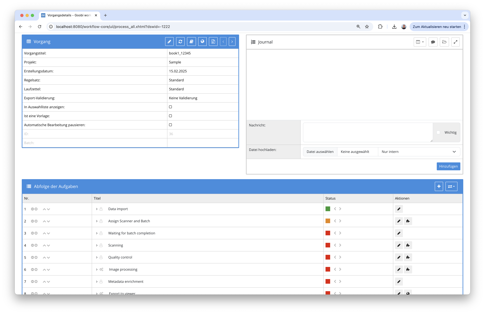
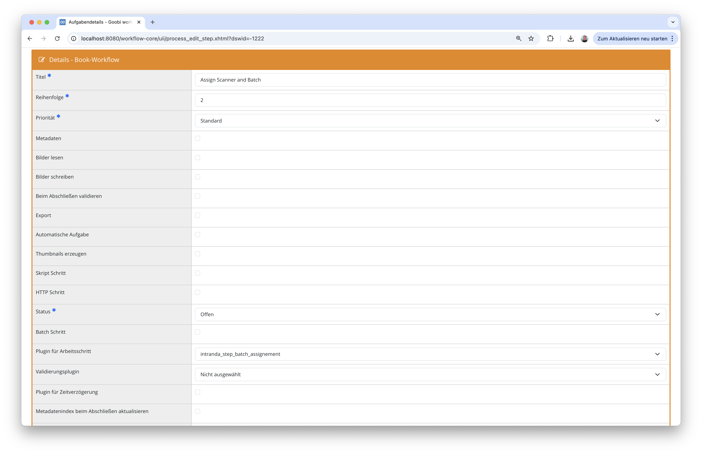
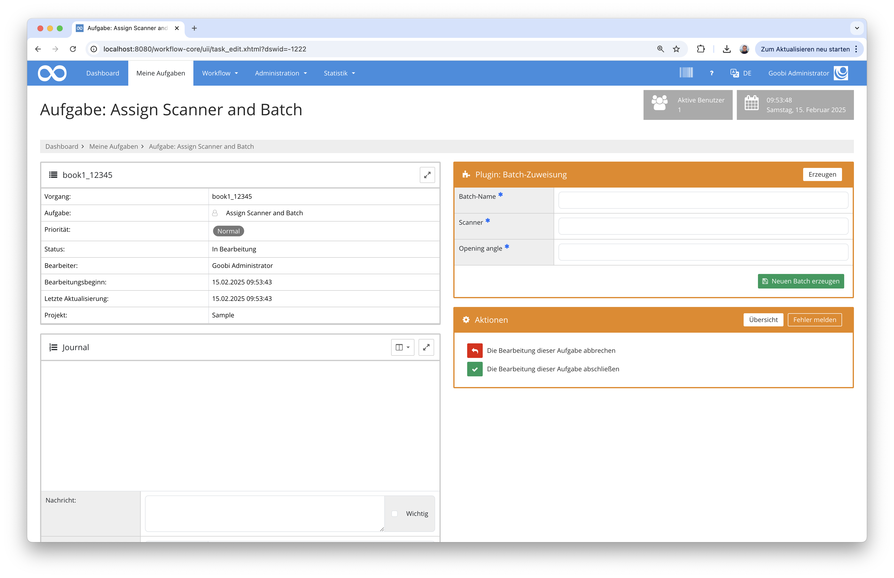
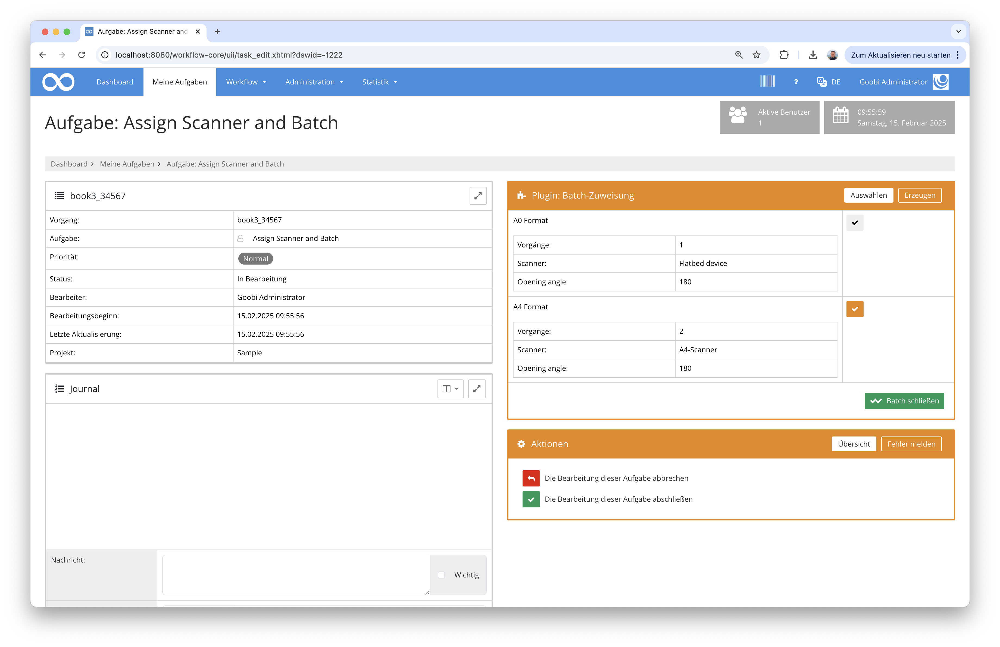
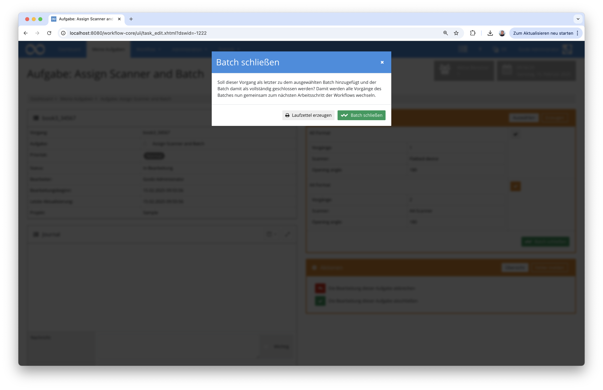
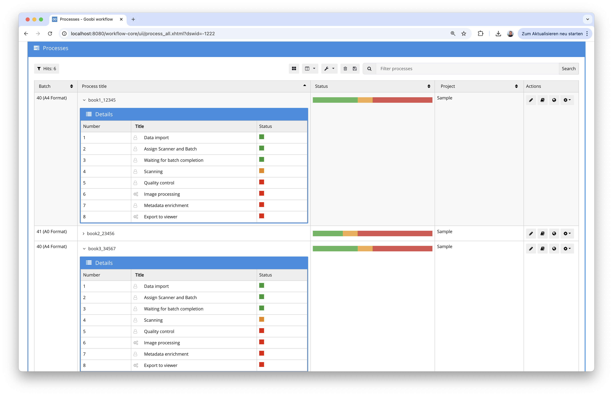

# Batch zuweisen

## Übersicht

Name                     | Wert
-------------------------|-----------
Identifier               | intranda_step_batch_assignment
Repository               | [https://github.com/intranda/goobi-plugin-step-batch-assignment](https://github.com/intranda/goobi-plugin-step-batch-assignment)
Lizenz              | GPL 2.0 oder neuer 
Letzte Änderung    | 25.02.2025 11:03:03


## Einführung
Diese Dokumentation erläutert das Plugin für Zuweisung eines einzelnen Vorgangs zu einem Batch. Diese Zuweisung erfolgt hierbei direkt aus einer angenommenen Aufgabe heraus. Dort kann entweder ein neuer Batch erzeugt oder aus einer Liste von bereits vorhandenen wartenden Batches ausgewählt werden. 

## Installation
Um das Plugin nutzen zu können, müssen folgende Dateien installiert werden:

```bash
/opt/digiverso/goobi/plugins/step/plugin-step-ZZZ-base.jar
/opt/digiverso/goobi/plugins/GUI/plugin-step-ZZZ-gui.jar
/opt/digiverso/goobi/config/plugin_intranda_step_ZZZ.xml
```

Nach der Installation des Plugins kann dieses innerhalb des Workflows für die jeweiligen Arbeitsschritte ausgewählt werden. Zu beachten ist hierbei, dass zwei Arbeitsschritte im Workflow eingeplant werden müssen:

- Ein Arbeitsschritt dient für den Nutzer als derjenige, in dem die Batch-Zuweisung erfolgt. 
- Ein weiterer Arbeitsschritt dient als eine Art `Wartezone`, in dem alle bereits zu einem Batch zugewiesenen Vorgänge stehenbleiben und erst bei Vollständigkeit des Batches gemeinsam zum nachfolgenden Schritt wechseln werden. 
 
Ein Workflow könnte somit beispielhaft wie folgt aussehen:



Für die Verwendung des Plugins muss dieses in dem ersten der beiden Arbeitsschritte ausgewählt sein:



## Überblick und Funktionsweise
Nachdem der Nutzer die Aufgabe angenommen hat, kann er in dem Plugin zunächst entscheiden, ob ein neuer Batch angelegt oder eine Auswahl aus den bereits vorhandenen noch wartenden Batches erfolgen soll. Möchte der Nutzer einen neuen Batch definieren, kann er hier den Titel für den Batch definieren sowie bei Bedarf auch Eigenschaften mit erfassen, die über die Konfiguration festgelegt wurden:



Alternativ kann der Nutzer aus der Liste der aktuell wartenden Batches einen Batch auswählen. Nach der Auswahl des gewünschten Batches kann die Aufgabe regulär abgeschlossen werden.



Nach der Zuweisung zu einem bestehenden oder neu erzeugten Batches, geht der Workflow für den Vorgang in den nachfolgenden Arbeitsschritt über, der als eine Art `Wartezone` betrachtet werden kann. Dort verbleiben alle Vorgänge eines Batches zunächst und durchlaufen noch nicht die weiteren nachfolgenden Schritte. 

Wenn der Nutzer in dem Arbeitsschritt eines Vorgangs entscheidet, dass der Batch mit diesem Vorgang nun vollständig ist, kann er auf den Button für das `Schließen des Batches` klicken. Damit öffnet sich ein Dialogfenster, in dem ein Batch-Laufzettel heruntergeladen sowie der Batch geschlossen werden kann:



Durch das Schließen des Batches, wird der Arbeitsschritt für das Warten auf Vollständigkeit aller Vorgänge des Batches abgeschlossen und auch der der Arbeitsschritt des gerade geöffneten Arbeitsschritt wird abgeschlossen. Somit wechseln alle zu einem Batch zugewiesenen Vorgänge gleichzeitig in den nächsten nachfolgenden Arbeitsschritt, um dann gemeinsam weiter verarbeitet werden zu können.



## Konfiguration
Die Konfiguration des Plugins erfolgt in der Datei `plugin_intranda_step_batch_assignment.xml` wie hier aufgezeigt:

```xml
<config_plugin>
    <!--
        order of configuration is:
          1.) project name and step name matches
          2.) step name matches and project is *
          3.) project name matches and step name is *
          4.) project name and step name are *
	-->
    
    <config>
        <!-- which projects to use for (can be more then one, otherwise use *) -->
        <project>*</project>
        <step>*</step>
        
        <!-- batch is complete step in the workflow that shall be finished once the last process is added to the batch -->
        <batchWaitStep>Waiting for batch completion</batchWaitStep>

        <!-- properties to be editable for new batches -->
        <property vocabularyPropertyFilterField="Working" vocabularyPropertyFilterValue="Yes">Scanner</property>
        <property>Opening angle</property>

    </config>

</config_plugin>

```

### Allgemeine Parameter 
Der Block `<config>` kann für verschiedene Projekte oder Arbeitsschritte wiederholt vorkommen, um innerhalb verschiedener Workflows unterschiedliche Aktionen durchführen zu können. Die weiteren Parameter innerhalb dieser Konfigurationsdatei haben folgende Bedeutungen: 

| Parameter | Erläuterung | 
| :-------- | :---------- | 
| `project` | Dieser Parameter legt fest, für welches Projekt der aktuelle Block `<config>` gelten soll. Verwendet wird hierbei der Name des Projektes. Dieser Parameter kann mehrfach pro `<config>` Block vorkommen. | 
| `step` | Dieser Parameter steuert, für welche Arbeitsschritte der Block `<config>` gelten soll. Verwendet wird hier der Name des Arbeitsschritts. Dieser Parameter kann mehrfach pro `<config>` Block vorkommen. | 


### Weitere Parameter 
Neben diesen allgemeinen Parametern stehen die folgenden Parameter für die weitergehende Konfiguration zur Verfügung: 


Parameter               | Erläuterung
------------------------|------------------------------------
`batchWaitStep`         | Name desjenigen Arbeitsschrittes, in dem die Vorgänge verbleiben sollen, bis er letzte Vorgang zu dem Batch hinzugefügt wird
`property`              | Namen derjenigen Eigenschaften des Vorgangs, die beim Erzeugen des Batches bearbeitbar sein sollen und die für alle zugehörigen Vorgänge übernommen werden sollen