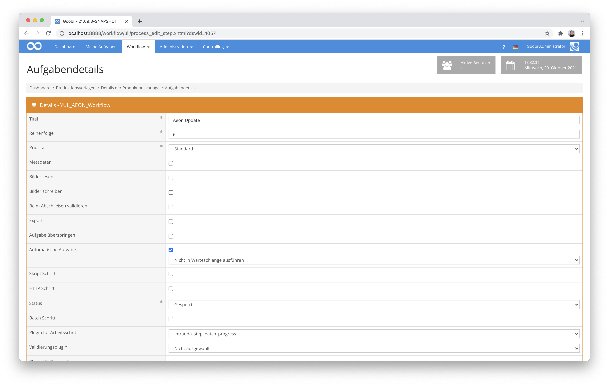

# Batch Progress Plugin

## Übersicht

Name                     | Wert
-------------------------|-----------
Identifier               | intranda_step_batch_progress
Repository               | [https://github.com/intranda/goobi-plugin-step-batch-progress](https://github.com/intranda/goobi-plugin-step-batch-progress)
Lizenz              | GPL 2.0 oder neuer 
Letzte Änderung    | 25.07.2024 12:01:04


## Einführung
Dieses Step Plugin für Goobi workflow erlaubt, dass mehrere Goobi Vorgänge, die zu einem Batch gehören aber einen unterschiedlichen Fortschritt in ihren Workflows haben, alle an eine festgelegten Arbeitsschritt des Workflows auf einander warten. Erst wenn der letzte zugehörige Vorgang den definierten Arbeitsschritt des Workflows erreicht, findet ein Aufruf einer festgelegten REST-URL statt, so dass anschließend alle Vorgänge mit ihren jeweils nächsten Arbeitsschritten fortfahren können.

Der initiale Einsatzzweck dieses Plugins zielt auf den Aufruf von AEON REST URLs, um darin den Fortschritt der Goobi Workflows zu protokollieren. Weitere Einsatzzwecke für dieses Plugin sind möglich, erfordern unter Umständen allerdings Anpassungsarbeiten an dem Plugin.


## Installation
Das Plugin besteht insgesamt aus den folgenden zu installierenden Dateien:

```bash
plugin_intranda_step_batch_progress-base.jar
plugin_intranda_step_batch_progress-gui.jar
plugin_intranda_step_batch_progress.xml
```

Diese Dateien müssen in den richtigen Verzeichnissen installiert werden, so dass diese nach der Installation unter den folgenden Pfaden vorliegen:

```bash
/opt/digiverso/goobi/plugins/step/plugin_intranda_step_batch_progress-base.jar
/opt/digiverso/goobi/config/plugin_intranda_step_batch_progress.xml
```


## Überblick und Funktionsweise
Zur Inbetriebnahme des Plugins muss dieses für einen oder mehrere gewünschte Aufgaben im Workflow aktiviert werden. Dies erfolgt wie im folgenden Screenshot aufgezeigt durch Auswahl des Plugins `intranda_step_batch_progress` aus der Liste der installierten Plugins.



Da dieses Plugin üblicherweise automatisch ausgeführt werden soll, sollte der Arbeitsschritt im Workflow als `automatisch` konfiguriert werden.

Nachdem das Plugin vollständig installiert und eingerichtet wurde, wird es üblicherweise automatisch innerhalb des Workflows ausgeführt, so dass keine manuelle Interaktion mit dem Nutzer erfolgt. Stattdessen erfolgt der Aufruf des Plugins durch den Workflow im Hintergrund und führt die folgenden Arbeiten durch: 

Als erstes geprüft, ob der Vorgang zu einem Batch gehört. Ist dies nicht der Fall, wird der Arbeitsschritt geschlossen und der weitere Workflow wird gestartet.

Ansonsten wird geprüft, ob der aktuelle Arbeitsschritt in allen Vorgängen des Batches bereits erreicht wurde (der Status darf nicht `Gesperrt` sein). Falls dies noch nicht der Fall ist, bleibt der Schritt im Status `In Bearbeitung` stehen.

Wenn jedoch alle anderen Vorgänge des Batches den Arbeitsschritt erreicht haben oder es nur den aktuellen Vorgang im Batch gibt, wird ein neuer Status in AEON gesetzt, sofern dies mit dem Parameter `updateQueue` aktiviert wurde. Hierzu wird in den Eigenschaften des Vorgangs nach der Eigenschaft `transaction identifier` gesucht, mit dem die Vorgänge initial angelegt wurden. Dieser Datensatz wird dann in AEON aufgerufen, um den konfigurierte `queueName` als neuen Status zu setzen.

Anschließend wird der aktuelle Arbeitsschritt in allen Vorgängen des Batches geschlossen und der weitere Workflow fortgeführt.


## Konfiguration
Die Konfiguration des Plugins erfolgt über die Konfigurationsdatei `plugin_intranda_step_batch_progress.xml` und kann im laufenden Betrieb angepasst werden. Im folgenden ist eine beispielhafte Konfigurationsdatei aufgeführt:

```xml
<config_plugin>
    <global>
        <aeon>
            <url>https://example.com</url>
            <username>user</username>
            <password>pw</password>
        </aeon>
        <!-- must match field title of field <field aeon="transactionNumber"> in aeon config -->
        <property>Transaction Identifier</property>
    </global>
    <!--
        order of configuration is:
        1.) project name and step name matches
        2.) step name matches and project is *
        3.) project name matches and step name is *
        4.) project name and step name are *
    -->
    <config>
        <!-- which projects to use for (can be more then one, otherwise use *) -->
        <project>*</project>
        <step>*</step>
        <!-- define if a queue in AEON shall be updated, which would then 
          use the following parameter for the queue name -->
        <updateQueue>true</updateQueue>
        <!-- name of the AEON queue/status to be updated if this is activated
             Examples:
        
             4     Submitted by Staff
             8     Awaiting Order Processing
             10    In Item Retrieval
             111   Order Finished
             1142  DIVY-Item Checked Out to Staff
             1158  Arrived at DRMS
         -->
        <queueName>Order Finished</queueName>
    </config>
</config_plugin>
```

Innerhalb der Konfigurationsdatei können verschiedene Parameter konfiguriert werden. Die Datei ist in zwei Bereiche aufgeteilt. Im Bereich `<global>` werden allgemein gültige Informationen wie die Zugangsdaten zu AEON verwaltet. Hier sind folgende Parameter vorhanden:

Parameter           |  Erläuterung
------------------- | ----------------------------------------------------- 
`url`               | Geben Sie hier die URL für die API von AEON an.
`apiKey`            | Hier kann ein Key festgelegt werden, der statt Login und Passwort verwendet werden soll.
`username`          | Definieren Sie hier den zu verwendenden Nutzernamen.
`password`          | Tragen Sie hier das Passwort für den Zugriff auf die API ein.

Daneben gibt es den zweiten Bereich `<config>`, in dem für einzelne Arbeitsschritte unterschiedliche Angaben vorgenommen werden können. Hier kann für einzelne Projekte und Schritte festgelegt werden, in welche Queue der Datensatz geschrieben werden soll. 

Der Block `<config>` kann für verschiedene Projekte oder Arbeitsschritte wiederholt vorkommen, um innerhalb verschiedener Workflows unterschiedliche Aktionen durchführen zu können und auch um für verschiedener Schritte einen unterschiedlichen Status in AEON setzen zu können. Die weiteren Parameter innerhalb dieser Konfigurationsdatei haben folgende Bedeutungen:

Parameter           |  Erläuterung
------------------- | ----------------------------------------------------- 
`project`           | Dieser Parameter legt fest, für welches Projekt der aktuelle Block `<config>` gelten soll. Verwendet wird hierbei der Name des Projektes. Dieser Parameter kann mehrfach pro `<config>` Block vorkommen.
`step`              | Dieser Parameter steuert, für welche Arbeitsschritte der Block `<config>` gelten soll. Verwendet wird hier der Name des Arbeitsschritts. Dieser Parameter kann mehrfach pro `<config>` Block vorkommen.
`<updateQueue>`     | Hier läßt sich festlegen, ob ein Update einer Queue in AEON stattfinden soll oder nicht. Wenn der Parameter fehlt, wird `false` angenommen.
`<queueName>`       | Name der Aeon Queue, die aktualisiert werden soll