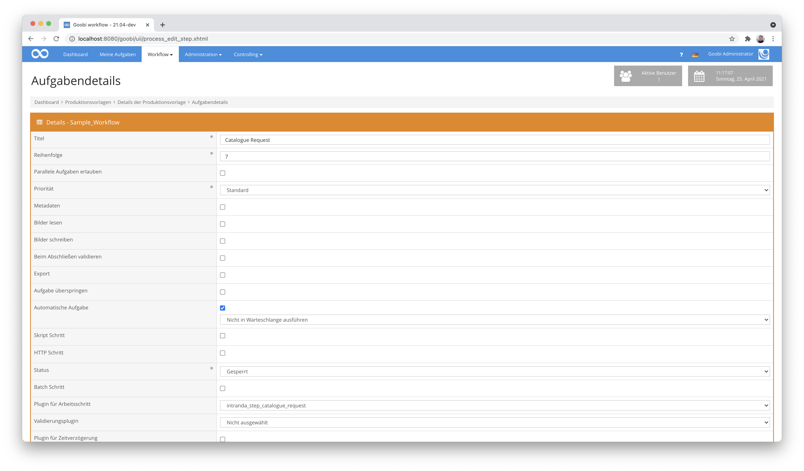

# Katalogabfrage

## Übersicht

Name                     | Wert
-------------------------|-----------
Identifier               | intranda_step_catalogue_request
Repository               | [https://github.com/intranda/goobi-plugin-step-catalogue-request](https://github.com/intranda/goobi-plugin-step-catalogue-request)
Lizenz              | GPL 2.0 oder neuer 
Letzte Änderung    | 25.07.2024 12:00:56


## Einführung
Die vorliegende Dokumentation beschreibt die Installation, die Konfiguration und den Einsatz des Step Plugins für die Katalogabfrage zur Aktualisierung von Datensätzen in Goobi workflow.


## Installation
Das Plugin besteht aus der folgenden Datei:

```bash
plugin_intranda_step_catalogue_request-base.jar
```

Diese Datei muss in dem richtigen Verzeichnis installiert werden, so dass diese nach der Installation an folgendem Pfad vorliegt:

```bash
/opt/digiverso/goobi/plugins/step/plugin_intranda_step_catalogue_request-base.jar
```

Daneben gibt es eine Konfigurationsdatei, die an folgender Stelle liegen muss:

```bash
/opt/digiverso/goobi/config/plugin_intranda_step_catalogue_request.xml
```


## Überblick und Funktionsweise
Das Plugin wird üblicherweise vollautomatisch innerhalb des Workflows ausgeführt. Es ermittelt zunächst, ob sich innerhalb der Konfigurationsdatei ein Block befindet, der für den aktuellen Workflow bzgl. des Projektnamens und Arbeitsschrittes konfiguriert wurde. Wenn dies der Fall ist, werden die weiteren Parameter ausgewertet und es erfolgt die Katalogabfrage mit dem innerhalb der Konfigurationsdatei angegebenen Feldinhalt der METS-Datei als Identifier.

Dieses Plugin wird in den Workflow so integriert, dass es automatisch ausgeführt wird. Eine manuelle Interaktion mit dem Plugin ist nicht notwendig. Zur Verwendung innerhalb eines Arbeitsschrittes des Workflows sollte es wie im nachfolgenden Screenshot konfiguriert werden.




## Konfiguration
Die Konfiguration des Plugins erfolgt über die Konfigurationsdatei `plugin_intranda_step_catalogue_request.xml` und kann im laufenden Betrieb angepasst werden. Im folgenden ist eine beispielhafte Konfigurationsdatei aufgeführt:

```xml
<?xml version="1.0" encoding="UTF-8"?>
<config_plugin>

    <config>

        <!-- which projects to use for (can be more then one, otherwise use *) -->
        <project>*</project>
        <step>*</step>

        <!-- which catalogue to use ('GBV', 'Wiener', 'CBL Adlib' ...), can use variable replacer compatible value as well, e.g. '$(meta.Catalogue)' -->
        <catalogue>Wiener</catalogue>

        <!-- which field to use for the catalogue request (typically '12' for identifier, sometimes '1007' for barcodes, and 
          which identifier to use for the catalogue request (use standard variable replacer compatible value here, e.g. '$(meta.CatalogIDDigital)') -->
        <catalogueField fieldName="12" fieldValue="$(meta.CatalogIDDigital)" />
        
        <!-- define if existing structure subelements shall be kept (true), otherwise a complete new mets file is created and overwrites the existing one (false) -->
        <mergeRecords>true</mergeRecords>

        <!-- define here if the catalogue request shall simply be skipped in case of missing catalogue plugin or missing catalogue identifier; if set to true the plugin will respond with an error status in case of missing information -->
        <ignoreMissingData>false</ignoreMissingData>

        <!-- define here if the catalogue request shall be skipped in case of request issues (e.g. wrong record identifier or network issues) -->
        <ignoreRequestIssues>false</ignoreRequestIssues>

        <!-- define if children are analysed as well. If a sub element contains an identifier, the metadata will get imported as well -->
        <analyseSubElements>false</analyseSubElements>

        <!-- if records shall be merged: which existing fields shall not be replace with new values? (use the metadatatypes from ruleset) -->
        <skipField>TitleDocMain</skipField>
        <skipField>CatalogIDDigital</skipField>
        <skipField>DocLanguage</skipField>
        <skipField>_urn</skipField>
        <skipField>_representative</skipField>
    </config>

</config_plugin>
```

| Parameter | Erläuterung |
| :--- | :--- |
| `project` | Dieser Parameter legt fest, für welches Projekt der aktuelle Block `<config>` gelten soll. Verwendet wird hierbei der Name des Projektes. Dieser Parameter kann mehrfach pro `<config>` Block vorkommen. |
| `step` | Dieser Parameter steuert, für welche Arbeitsschritte der Block `<config>` gelten soll. Verwendet wird hier der Name des Arbeitsschritts. Dieser Parameter kann mehrfach pro `<config>` Block vorkommen. |
| `catalogue` | Hier kann definiert werden, welcher Katalog für die Abfrage von neuen Daten verwendet werden soll. Hierbei handelt es sich um die Bezeichnung eines Kataloges, wie er innerhalb der globalen Goobi-Katalogkonfiguration innerhalb von `goobi_opac.xml` definiert wurde. |
| `catalogueField` | Hiermit wird festgelegt, welches Feld für die Abfrage des Katalogidentifiers genutzt werden soll. |
| `catalogueIdentifier` | Definition desjenigen Metadatums aus der METS-Datei, das für die Abfrage des Katalogs verwendet werden soll. Üblicherweise handelt es sich hierbei um denjenigen Identifier, der auch bei der erstmaligen Katalogabfrage verwendet wurde und der zumeist innerhalb der Metadatums `${meta.CatalogIDDigital}` gespeichert vorliegt. |
| `mergeRecords` | Wenn der Wert `true` gesetzt ist, wird die bestehende METS-Datei mit den aktuellen Daten aus dem Katalog aktualisiert. Eventuelle zusätzliche Metadaten können für die Aktualisierung ausgeschlossen werden. Auch bleibt der logische und physische Strukturbaum innerhalb der METS-Datei unverändert.Wenn der Wert auf `false` gesetzt wird, dann wird die bestehende METS-Datei vollständig durch eine neue METS-Datei ersetzt, die mittels der Katalogabfrage generiert wurde. |
| `ignoreMissingData` | Mit diesem Parameter kann festgelegt werden, ob der Arbeitsschritt des Plugins im Falle von fehlenden Katalogdaten fortfahren soll oder in einen Fehlerstatus wechseln soll. |
| `ignoreRequestIssues` | Hier kann definiert werden, wie sich das Plugin im Falle eines Abfragefehlers verhalten soll, beispielsweise bei Netzwerkproblemen. Auf diese Weise läßt sich definieren, dass der Workflow unterbrochen oder dennoch fortgeführt werden soll. |
| `analyseSubElements` | Mit diesem Parameter läßt sich definieren, ob auch Metadaten für bereits innerhalb der METS-Dateien vorhandene Strukturelemente vom Katalog abgefragt werden sollen. Hierfür muss pro Unterelement das festgelegte Metadatum für den abzufragenden Identifier vorhanden sein. |
| `skipField` | Hier können mehrere Metadatenfelder definiert werden, die keinesfalls durch eine Katalogabfrage geändert werden sollen. Dies ist insbesondere für diejenigen Felder sinnvoll, die nicht aus einer Katalogabfrage kommen und daher zuvor zusätzlich zu den Katalogdaten erfasst wurden. Typische Beispiele für solche Felder sind unter anderem `singleDigCollection`,`accesscondition` und `pathimagefiles`. Bitte beachten Sie, dass dieser Parameter nur dann Anwendung findet, wenn der Wert für `mergeRecords` auf `true` steht. |