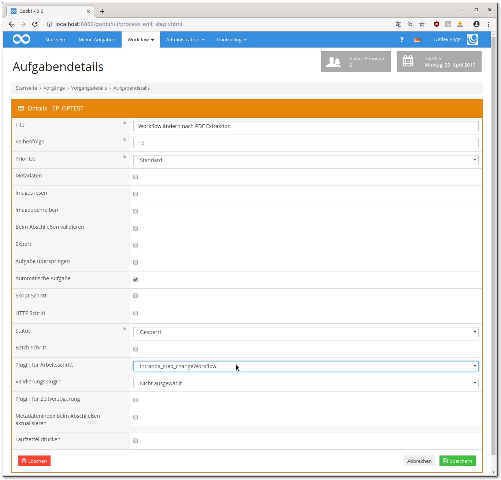

# Ändern des Workflows auf Grundlage von Vorgangseigenschaften

## Übersicht

Name                     | Wert
-------------------------|-----------
Identifier               | intranda_step_changeWorkflow
Repository               | [https://github.com/intranda/goobi-plugin-step-change-workflow](https://github.com/intranda/goobi-plugin-step-change-workflow)
Lizenz              | GPL 2.0 oder neuer 
Letzte Änderung    | 25.07.2024 12:00:43


## Einführung
Die vorliegende Dokumentation beschreibt die Installation, Konfiguration und den Einsatz eines Plugins zum automatischen Ändern von Workflows zur Laufzeit. Das Plugin kann (je nach Konfiguration) Schritte öffnen, schließen oder deaktivieren. Benutzergruppen können zugwiesen werden und auch Produktionsvorlagen vollständig getauscht werden. Die Entscheidung, was jeweils genau geschehen soll, wird auf Grundlage von Vorgangseigenschaften getroffen.


## Installation
Zur Nutzung des Plugins muss es an folgenden Ort kopiert werden:

```bash
/opt/digiverso/goobi/plugins/step/plugin_intranda_step_changeWorkflow-base.jar
```

Die Konfiguration des Plugins wird unter folgendem Pfad erwartet:

```bash
/opt/digiverso/goobi/config/plugin_intranda_step_changeWorkflow.xml
```


## Überblick und Funktionsweise
Nachdem das Plugin installiert und konfiguriert wurde, kann es in der Nutzeroberfläche in einem Workflowschritt konfiguriert werden. Hierbei sollte darauf geachtet werden, dass der Schritt so heißt, wie in der Konfigurationsdatei. Außerdem sollte ein Haken bei `Automatische Aufgabe` gesetzt sein.




## Konfiguration
Es folgt eine kommentierte Beispielkonfiguration:

```xml
<config_plugin>
    <!--
        order of configuration is: 
        1.) project name and step name matches 
        2.) step name matches and project is * 
        3.) project name matches and step name is * 
        4.) project name and step name are * 
    -->

    <config>
        <!-- which projects to use for (can be more then one, otherwise use *) -->
        <project>Register</project>
        <step>Check</step>

        <!-- multiple changes can be done within one configuration rule; simply add another 'change' element with other properties here -->
        <change>
            <!-- name of the property or metadata to check: please take care to use the syntax of the Variable replacer here -->
            <propertyName>{process.TemplateID}</propertyName>
            <!-- expected value (can be blank too) -->
            <propertyValue>183</propertyValue>
            <!-- condition for value comparing, can be 'is' or 'not' or 'missing' or 'available' -->
            <propertyCondition>is</propertyCondition>
            <!-- list of steps to open, if property value matches -->
            <steps type="open">
                <title>Box preparation</title>
            </steps>
            <!-- list of steps to deactivate -->
            <steps type="deactivate">
                <title>Image QA</title>
            </steps>
            <!-- list of steps to close -->
            <steps type="close">
                <title>Automatic LayoutWizzard Cropping</title>
                <title>LayoutWizzard: Manual confirmation</title>
            </steps>
            <!-- list of steps to lock -->
            <steps type="lock">
                <title>Automatic export to Islandora</title>
            </steps>
		
            <!-- If any title under priority is configured with a *, then this priority value will be applied to all steps of this process. -->
            <!-- If more than two titles are configured with *, then the first match in the order of values 0, 1, 2, 3, 10 will be used. -->
            <!-- list of steps of priority 0 (standard) -->
            <priority value="0">
                <title>Some standard step</title>
            </priority>
			
            <!-- list of steps of priority 1 (priority) -->
            <priority value="1">
                <title>Step of priority</title>
            </priority>
			
            <!-- list of steps of priority 2 (high priority) -->
            <priority value="2">
                <title>Step of high priority</title>
            </priority>

            <!-- list of steps of priority 3 (highest priority) -->
            <priority value="3">
                <title>Step of highest priority</title>
                <title>another step of highest priority</title>
            </priority>
			
            <!-- list of steps of priority 10 (correction) -->
            <priority value="10">
                <title></title>
            </priority>

            <usergroups step="Image QA">
                <usergroup>Administration</usergroup>
                <usergroup>AutomaticTasks</usergroup>
            </usergroups>
        </change>
    </config>

    <config>
        <!-- which projects to use for (can be more then one, otherwise use *) -->
        <project>*</project>
        <step>*</step>

        <!-- multiple changes can be done within one configuration rule; simply add another 'change' element with other properties here -->
        <change>
            <!-- name of the property or metadata to check: please take care to use the syntax of the Variable replacer here -->
            <propertyName>{process.upload to digitool}</propertyName>
            <!-- expected value (can be blank too) -->
            <propertyValue>No</propertyValue>
            <!-- condition for value comparing, can be 'is' or 'not' or 'missing' or 'available' -->
            <propertyCondition>is</propertyCondition>
            <!-- list of steps to open, if property value matches -->
            <steps type="open">
                <title>Create derivates</title>
                <title>Jpeg 2000 generation and validation</title>
            </steps>
            <!-- list of steps to deactivate -->
            <steps type="deactivate">
                <title>Rename files</title>
            </steps>
            <!-- list of steps to close -->
            <steps type="close">
                <title>Upload raw tiffs to uploaddirectory Socrates</title>
                <title>Automatic pagination</title>
            </steps>
            <!-- list of steps to lock -->
            <steps type="lock">
                <title>Create METS file</title>
                <title>Ingest into DigiTool</title>
            </steps>
        </change>
    </config>

    <config>
        <!-- which projects to use for (can be more then one, otherwise use *) -->
        <project>Archive_Project</project>
        <step>Check process template change</step>

        <!-- multiple changes can be done within one configuration rule; simply add another 'change' element with other properties here -->
        <change>
            <!-- name of the property or metadata to check: please take care to use the syntax of the Variable replacer here -->
            <propertyName>{process.TemplateID}</propertyName>
            <!-- expected value (can be blank too) -->
            <propertyValue>309919</propertyValue>
            <!-- condition for value comparing, can be 'is' or 'not' or 'missing' or 'available' -->
            <propertyCondition>is</propertyCondition>
            <!-- Name of the new process template -->
            <workflow>Manuscript workflow</workflow>

            <!-- write a message into the journal (aka process log) -->
			<log type="info">My info message</log>
			<log type="error">My error message</log>
			<log type="user">My user message</log>
			<log type="debug">My debug message</log>
        </change>
    </config>
</config_plugin>
```

Jeder `<config>`-Block ist hier für ein bestimmtes Projekt und einen bestimmten Schritt verantwortlich, wobei auch die Wildcard `*` und Mehrfachnennungen von Prozessen bzw. Schritten möglich sind. Wenn im Workflow also ein Schritt mit diesem Plugin ausgeführt wird, wird nach einem `<config>`-Block gesucht, der zum gerade geöffneten Schritt passt. Wenn zum Beispiel im Projekt "PDF Digitalisierung" der Schritt mit Titel "Workflow ändern nach PDF Extraktion" mit diesem Plugin konfiguriert und ausgeführt wird, sucht das Plugin einen `<config>`-Block der folgendermaßen aussieht:

```xml
<config>
    <project>PDF Digitalisierung</project>
    <step>Workflow ändern nach PDF Extraktion</step>
    [...]
</config>
```

In jedem `<change>`-Element wird dann konfiguriert, welche Prozesseigenschaft überprüft wird (`<propertyName>`) und welcher Wert erwartet wird (`<propertyValue>`). Bitte beachten Sie, dass die Angabe zur Definition, welche Eigenschaft für die Prüfung eines Wertes verwendet werden soll, mit der Syntax für den sog. Variablen Replacer angegeben werden muss. Entsprechend muss bei der Definition des Feldes, das geprüft werden soll die Angabe wir wie in in folgenden Beispielen erfolgen:

```xml
<propertyName>{process.ABC}</propertyName>
<propertyName>{{meta.ABC}}</propertyName>
<propertyName>{meta.topstruct.ABC}</propertyName>
<propertyName>{meta.firstchild.ABC}</propertyName>
<propertyName>{db_meta.ABC}</propertyName>
```

Weitere Erläuterungen über die Verwendung von Variablen finden sich hier:

[https://docs.goobi.io/goobi-workflow-de/manager/8](https://docs.goobi.io/goobi-workflow-de/manager/8)

Nach der Definition, wie die Eigenschaften auszuwerten sind, wird die auszuführende Aktion festgelegt. Hier bestehen folgende Möglichkeiten:


### Ändern des Status von Arbeitsschritten des Workflows
Abhängig von vorhandenen Eigenschaften kann der Status festgelegter Arbeitsschritte innerhalb des Workflows automatisiert geändert werden. Hierbei können Arbeitsschritte geöffnet `type="open"`, deaktiviert `type="deactivate"`, geschlossen `type="close"` oder gesperrt `type="lock"` werden.

```xml
<steps type="open">
    <title>Create derivates</title>
    <title>Jpeg 2000 generation and validation</title>
</steps>
<steps type="deactivate">
    <title>Rename files</title>
</steps>
<steps type="close">
    <title>Upload raw tiffs to uploaddirectory Socrates</title>
    <title>Automatic pagination</title>
</steps>
<steps type="lock">
    <title>Create METS file</title>
    <title>Ingest into DigiTool</title>
</steps>
```

| Parameter | Erläuterung |
| :--- | :--- |
| `type` | Legen Sie fest, welchen Status die Arbeitsschritte erhalten sollen. |
| `title` | Definieren Sie hier den Namen der Arbeitsschritte, die auf den gewünschten Status gesetzt werden sollen. |


### Ändern der Priorität von Arbeitsschritten des Workflows
Abhängig von vorhandenen Eigenschaften kann die Priorität festgelegter Arbeitsschritte innerhalb des Workflows automatisiert geändert werden. Mögliche Werte für die Prioritäten sind Standard `value="0"`, Priorität `value="1"`, Hohe Priorität `value="2"`, Höchste Priorität `value="3"`, oder Korrektur `value="10"`. Wenn ein `title` mit `*` konfiguriert ist, dann wird der zugehörige Prioritätswert für alle Schritte von diesem Vorgang benutzt. Wenn aber mehr als zwei `title` mit `*` konfiguriert sind, dann wird nur der erste vorkommende in der Reihenfolge 0, 1, 2, 3, 10 berücksichtigt.

```xml
<priority value="0">
    <title>Some standard step</title>
</priority>

<priority value="1">
    <title>Step of priority</title>
</priority>

<priority value="2">
    <title>Step of high priority</title>
</priority>

<priority value="3">
    <title>Step of highest priority</title>
    <title>another step of highest priority</title>
</priority>

<priority value="10">
    <title></title>
</priority>
```

| Parameter | Erläuterung |
| :--- | :--- |
| `value` | Legen Sie fest, welche Priorität die Arbeitsschritte erhalten sollen. |
| `title` | Definieren Sie hier den Namen der Arbeitsschritte, die auf die gewünschte Priorität gesetzt werden sollen. Verwenden Sie `*`, falls alle Schritte angepasst werden sollen. |


### Ändern der Zuständigkeit von Benutzergruppen für Arbeitsschritte
Abhängig von vorhandenen Eigenschaften lassen sich die zuständigen Benutzergruppen für mehrere Arbeitsschritte festlegen. Die Konfiguration erfolgt dabei wie wie hier aufgezeigt:

```xml
<usergroups step="Image QA">
    <usergroup>Administration</usergroup>
    <usergroup>AutomaticTasks</usergroup>
</usergroups>
```

| Parameter | Erläuterung |
| :--- | :--- |
| `step` | Legen Sie fest, für welchen Arbeitsschritt Sie die Benutzergruppen eintragen möchten. |
| `usergroup` | Definieren Sie hier den Namen der Benutztergruppe, die für den konfigurierten Schritt als zuständig eingetragen werden soll. |


### Ändern der Produktionsvorlage auf der der Vorgang basiert
Mit einer Konfiguration wie im folgenden Beispiel kann während des laufenden Workflows die Produktionsvorlage des Vorgangs getauscht werden. Abhängig von vorhandenen Eigenschaften läßt sich somit ein Workflow während der Ausführung gegen einen anderen Workflow ersetzen. Arbeitsschritte, die in dem neuen Workflow ebenfalls vorhanden sind, werden dabei automatisch auf den korrekten Status gesetzt.

```xml
 <workflow>Manuscript workflow</workflow>
```

| Parameter | Erläuterung |
| :--- | :--- |
| `workflow` | Definieren Sie hier den Namen der Produktionsvorlage, die für den Vorgang verwendet werden soll. |