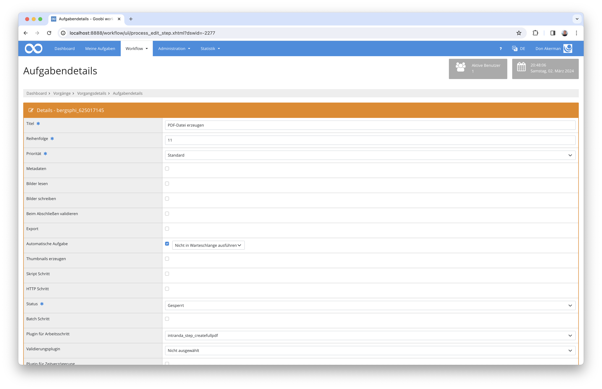

# Generierung von PDF-Dateien

## Übersicht

Name                     | Wert
-------------------------|-----------
Identifier               | intranda_step_createfullpdf
Repository               | [https://github.com/intranda/goobi-plugin-step-create-full-pdf](https://github.com/intranda/goobi-plugin-step-create-full-pdf)
Lizenz              | GPL 2.0 oder neuer 
Letzte Änderung    | 25.07.2024 12:00:34


## Einführung
Die vorliegende Dokumentation beschreibt die Installation, Konfiguration und den Einsatz dieses Plugins zum Generieren der PDF Dateien aus Bildern.


## Installation
Zur Nutzung des Plugins muss es an folgenden Ort kopiert werden:

```bash
/opt/digiverso/goobi/plugins/step/plugin_intranda_step_createfullpdf-base.jar
```

Die Konfiguration des Plugins wird unter folgendem Pfad erwartet:

```bash
/opt/digiverso/goobi/config/plugin_intranda_step_createfullpdf.xml
```


## Überblick und Funktionsweise
Nachdem das Plugin korrekt installiert wurde, kann es in der Nutzeroberfläche für die Verwendung innerhalb des Workflows bei dem gewünschten Arbeitsschritt konfiguriert werden. Hierfür muss als Plugin der Wert `intranda_step_createfullpdf` ausgewählt und die Ausfühlung sollte als automatisch festgelegt werden.




## Konfiguration
Eine Beispielkonfiguration könnte folgendermaßen aussehen:

```xml
<config_plugin>
    <!-- order of configuration is: 
         1.) project name and step name matches 
         2.) step name matches and project is * 
         3.) project name matches and step name is * 
         4.) project name and step name are * 
    -->
    <config>
        <!-- which projects to use for (can be more then one, otherwise use *) -->
        <project>*</project>
        <!-- which stepss to use for (can be more then one, otherwise use *) -->
        <step>*</step>
         <!-- Choose the source images folder that shall be used for PDF generation. Possible values are 'media' and 'master' -->
        <imagesFolder>media</imagesFolder>
        <!-- If set to true, then PDF files for every single image are generated before the full PDF file. -->
        <!-- If set to false, then PDF files for every single image are generated after the full PDF file. -->
        <pagePdf enabled="true" /> 
        <!-- If enabled, a PDF file for the entire record is generated. This file includes the table of contents from the METS file if exists. -->
        <!-- The attribute pdfConfigVariant sets up which config variant in contentServerConfig.xml should be used. If not set, then use default. -->
        <fullPdf enabled="true" pdfConfigVariant="pdfa"/>
        
        <!-- If set, then the path will be used to export the results. Otherwise the default settings will be used. -->
        <!-- Here is an ABSOLUTE path expected. -->
        <exportPath>/tmp/export</exportPath>
    </config>
    
    <config>
        <project>testocr</project>
        <step>testpdf</step>
        <imagesFolder>master</imagesFolder>
        <pagePdf enabled="true" />
        <fullPdf enabled="false" />
    </config>
</config_plugin>
```


Die Parameter innerhalb dieser Konfigurationsdatei haben folgende Bedeutungen: ​

| Wert | Beschreibung |
| :--- | :--- |
| `imageFolder` | Dieser Parameter erwartet den Namen des Bildordners. Mögliche Werte sind `media` und `master`. Alle anderen Angaben werden als `media` interpretiert. |
| `pagePdf` | Dieser Parameter bestimmt die Reihenfolge der Erzeugung von PDF-Dateien. Ist er auf `true` gesetzt, werden einzelne Dateien vor der vollständigen PDF-Datei erzeugt; ist er auf `false` gesetzt, ist es umgekehrt. |
| `fullPdf` | Dieser Parameter hat zwei Attribute. Das erste `enabled` ist zwingend erforderlich und legt fest, ob eine vollständige PDF-Datei erzeugt werden soll oder nicht. Das zweite Attribut `pdfConfigVariant` hingegen ist optional und legt fest, welche Konfigurationsvariante verwendet werden soll. Ist sie nicht gesetzt, wird `default` verwendet. |
| `exportPath` | Dieser optionale Parameter kann verwendet werden, um einen anderen Pfad für den Export der PDF-Dateien festzulegen. Wenn er verwendet wird, wird ein absoluter Pfad erwartet. Ist er nicht angegeben, werden die Standardeinstellungen verwendet. |