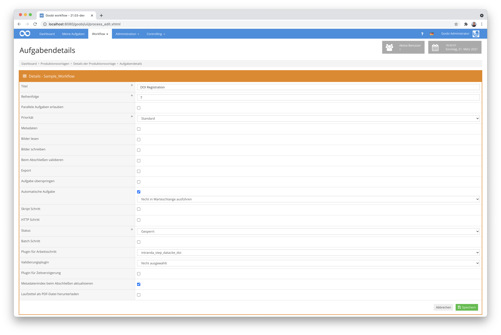

# Plugin zur Registrierung von DOIs via DataCite API

## Übersicht

Name                     | Wert
-------------------------|-----------
Identifier               | intranda_step_datacite_doi
Repository               | [https://github.com/intranda/goobi-plugin-step-datacite-doi](https://github.com/intranda/goobi-plugin-step-datacite-doi)
Lizenz              | GPL 2.0 oder neuer 
Letzte Änderung    | 25.07.2024 11:46:41


## Einführung
Diese Dokumentation beschreibt die Installation, Konfiguration und Verwendung des Plugins zur Registrierung von DOIs.

**ACHTUNG:** Für diese Funktionalität existiert noch ein neueres Plugin, das mittels XSL-Transformation einen höheren Freiheitsgrad der DOI-Registrierung erlaubt. Eine Dokumentation des neuen Plugins findet sich hier: https://docs.goobi.io/goobi-workflow-plugins-de/step/intranda_step_doi


## Installation
Das Plugin besteht aus den folgenden Dateien:

```bash
plugin_intranda_step_datacite_doi-base.jar
plugin_intranda_step_datacite_doi.xml
plugin_intranda_step_datacite_mapping.xml
```

Die Datei `plugin_intranda_step_datacite_doi-base.jar` enthält die Programmlogik. Sie muss unter folgendem Pfad installiert werden:

```bash
/opt/digiverso/goobi/plugins/step/plugin_intranda_step_datacite_doi-base.jar
```

Bei der Datei `plugin_intranda_step_datacite_mapping.xml` handelt es sich um die Mapping-Datei, die definiert, wie lokale Metadaten in die für die DOI-Registrierung erforderliche Form übersetzt werden sollen. Sie muss unter diesem Pfad installiert werden:

```bash
/opt/digiverso/goobi/config/plugin_intranda_step_datacite_mapping.xml
```

Die Datei `plugin_intranda_step_datacite_doi.xml` ist die Hauptkonfigurationsdatei für das Plugin. Sie muss unter diesem Pfad installiert werden:

```bash
/opt/digiverso/goobi/config/plugin_intranda_step_datacite_doi.xml
```


## Überblick und Funktionsweise
Um das Plugin in Betrieb zu nehmen, muss es für eine oder mehrere gewünschte Aufgaben im Workflow aktiviert werden. Dies geschieht wie im folgenden Screenshot gezeigt durch Auswahl des Plugins `intranda_step_datacite_doi` aus der Liste der installierten Plugins.



Da dieses Plugin in der Regel automatisch ausgeführt werden soll, sollte der Workflow-Schritt im Workflow als automatisch konfiguriert werden. Da das Plugin den DOI in die Metadatendatei des Vorgangs schreibt, sollte das Kontrollkästchen für `Update metadata index when finishing` ebenfalls aktiviert sein.

Das Programm untersucht die Metadatenfelder der METS/MODS-Datei aus dem Goobi-Vorgang. Wenn ein `<typeForDOI>` angegeben ist, dann geht es jedes Strukturlement dieses Typs in der Datei durch. Wenn nicht, dann nimmt es das oberste Strukturlement. Daraus erstellt es die Daten für ein DOI, wobei es die Mapping-Datei zum Übersetzen verwendet. Dann wird der DOI über die MDS-API von DataCite registriert, wobei der DOI durch die `<base>` zusammen mit einem beliebigen `<prefix>` und `<name>` und der ID des Dokuments (seine `CatalogIDDigital`) plus einem inkrementierten Zähler angegeben wird, falls mehr als ein DOI für das gegebene Dokument erzeugt wurde. Der Datensatz erhält eine registrierte URL, die durch `<url>` definiert ist, gefolgt von der DOI. Der generierte DOI wird in die METS/MODS-Datei unter den in `<doiMetadata>` angegebenem Metadatum gespeichert. Wenn der Wert für `<typeForDOI>` zum Beispiel `Article` lautet, dann erhält jeder Artikel in der METS/MODS-Datei einen DOI, der in den Metadaten unter `<doiMetadata>` für jeden Artikel gespeichert wird.


## Konfiguration

### Hauptkonfiguration
Die Konfiguration erfolgt über die Konfigurationsdatei `plugin_intranda_step_datacite_doi.xml` und kann im laufenden Betrieb angepasst werden. Sie ist wie folgt aufgebaut:

```xml
<config_plugin>
	<!-- order of configuration is:
      1.) project name and step name matches
      2.) step name matches and project is *
      3.) project name matches and step name is *
      4.) project name and step name are *
  -->

	<config>
		<!-- which projects to use for (can be more then one, otherwise use *) -->
		<project>*</project>
		<step>*</step>

    <!-- authentication and main information -->
    <!-- For testing: for deployment, remove "test" -->
    <serviceAddress>https://mds.test.datacite.org/</serviceAddress>

		<!-- authentication and main information -->
		<base>10.123456789</base>
    <url>https://viewer.example.org/resolver?field=MD_PI_DOI&identifier=</url>
		<username></username>
		<password></password>

		<!-- configuration for Handles -->
		<prefix>go</prefix>
		<name>goobi</name>
		<separator>-</separator>
		<doiMetadata>DOI</doiMetadata>

		<!-- configuration for DOIs -->
		<doiMapping>/opt/digiverso/goobi/config/plugin_intranda_step_datacite_mapping.xml</doiMapping>

    <!-- Type of DocStruct which should be given DOIs -->
    <typeForDOI>Article</typeForDOI>

	</config>

</config_plugin>
```

Der Block `<config>` kann für verschiedene Projekte oder Workflow-Schritte mehrfach vorkommen, um unterschiedliche Aktionen innerhalb verschiedener Workflows durchführen zu können. Die weiteren Parameter innerhalb dieser Konfigurationsdatei haben die folgende Bedeutung:

| Wert | Beschreibung |
| :--- | :--- |
| `project` | Dieser Parameter legt fest, für welches Projekt der aktuelle Block `<config>` gelten soll. Verwendet wird hierbei der Name des Projektes. Dieser Parameter kann mehrfach pro `<config>` Block vorkommen. |
| `step` | Dieser Parameter steuert, für welche Arbeitsschritte der Block `<config>` gelten soll. Verwendet wird hier der Name des Arbeitsschritts. Dieser Parameter kann mehrfach pro `<config>` Block vorkommen. |
| `serviceAddress` | Dieser Parameter definiert die URL für den Datacite-Dienst. Im obigen Beispiel ist es der Testserver. |
| `base` | Dieser Parameter definiert die DOI-Basis für die Einrichtung, die bei Datacite registriert wurde. |
| `url` | Der Parameter url definiert den Präfix, den jeder DOI-Link erhält. Ein DOI "10.80831/goobi-1" erhält hier z. B. den Hyperlink "[https://viewer.goobi.io/idresolver?doi=10.80831/goobi-1](https://viewer.goobi.io/idresolver?doi=10.80831/goobi-1)" |
| `username` | Dies ist der Benutzername, der für die DataCite-Registrierung verwendet wird. |
| `password` | Dies ist das Passwort, das für die DataCite-Registrierung verwendet wird. |
| `prefix` | Dies ist das Präfix, das dem DOI vor dem Namen und der ID des Dokuments gegeben werden soll. |
| `name` | Dies ist der Name, der dem DOI vor der ID des Dokuments gegeben werden soll. |
| `separator` | Definieren Sie hier ein Trennzeichen, das zwischen den verschiedenen Teilen des DOI verwendet werden soll. |
| `doiMetadata` | Dieser Parameter gibt an, unter welchem Metadatennamen der DOI in der METS-MODS-Datei gespeichert werden soll. Standard ist `DOI`. |
| `doiMapping` | In diesem Parameter wird der Pfad zur Mapping-Datei für die DOI-Registrierung festgelegt. |
| `typeForDOI` | Mit diesem Parameter kann der DocStruct-Typ definiert werden, dem DOIs zugewiesen werden sollen. Wenn dieser leer ist oder fehlt, erhält nur das oberste DocStruct-Element einen DOI. Enthält der Parameter Namen eines tieferen Strukturelements, so werden diese mit DOIs versehen. |


### Konfiguration innerhalb der Mapping-Datei
Die Mapping-Konfigurationsdatei sieht in etwa so aus:

```xml
<?xml version="1.0" encoding="UTF-8"?>
<Mapping>
  <!-- Mandatory fields: -->
  <map>
      <field>title</field>
      <metadata>TitleDocMain</metadata>
      <altMetadata>TitleDocMainShort</altMetadata>
      <altMetadata>Title</altMetadata>
      <default>unkn</default>
  </map>

  <map>
      <field>creators</field>
      <metadata>Author</metadata>
      <altMetadata>Composer</altMetadata>
      <altMetadata>IllustratorArtist</altMetadata>
      <altMetadata>WriterCorporate</altMetadata>
      <default>unkn</default>
  </map>

  <map>
      <field>publisher</field>
      <metadata>Publisher</metadata>
      <altMetadata>PublisherName</altMetadata>
      <altMetadata>PublisherPerson</altMetadata>
      <default>unkn</default>
  </map>

  <map>
      <field>publicationYear</field>
      <metadata>_dateDigitization</metadata>
      <default>#CurrentYear</default>
  </map>

  <map>
      <field>hostingInstitution</field>
      <metadata>_electronicPublisher</metadata>
      <default>intranda GmbH</default>
  </map>

  <map>
      <field>resourceType</field>
      <default>document</default>
  </map>

  <!-- Optional fields: -->

  <listMap alternateIdentifierType="Goobi identifier">
      <field>alternateIdentifier</field>
      <list>alternateIdentifiers</list>
      <metadata>CatalogIDDigital</metadata>
  </listMap>

  <listMap>
      <field>contributors</field>
      <list>contributors</list>
      <metadata>Editor</metadata>
  </listMap>

  <listMap relatedIdentifierType="ISSN" relationType="IsPublishedIn">
      <field>relatedIdentifier</field>
      <list>relatedIdentifiers</list>
      <metadata>anchor_ISSN</metadata>
  </listMap>

  <listMap descriptionType="SeriesInformation">
      <field>description</field>
      <list>descriptions</list>
      <metadata>anchor_TitleDocMain</metadata>
  </listMap>

  <listMap descriptionType="SeriesInformation">
      <field>description</field>
      <list>descriptions</list>
      <metadata>CurrentNo</metadata>
  </listMap>

  <listMap dateType="Created">
      <field>date</field>
      <list>dates</list>
      <metadata>Dating</metadata>
      <altMetadata>PublicationYear</altMetadata>
      <altMetadata>anchor_PublicationYear</altMetadata>
  </listMap>

	<!-- create related item information just for the following publication types -->
	<publicationTypeWithRelatedItem>Article</publicationTypeWithRelatedItem>

  <!-- Specific fields for publication info: -->

  <publicationData>
      <field>ISSN</field>
      <metadata>anchor_ISSN</metadata>
  </publicationData>

  <publicationData>
      <field>title</field>
      <metadata>anchor_TitleDocMain</metadata>
  </publicationData>

  <publicationData>
      <field>publicationYear</field>
      <metadata>anchor_PublicationYear</metadata>
  </publicationData>

  <publicationData>
      <field>volume</field>
      <metadata>CurrentNo</metadata>
  </publicationData>

</Mapping>
```

Für jede `<map>` gibt das `<field>` den Namen des DOI-Elements an, und die Einträge `<metadata>` und `<altMetadata>` geben an, aus welchen Metadaten der Strukturelemente der Reihe nach der Wert genommen werden soll. Wenn es keinen solchen Eintrag in den Strukturelementen gibt, dann wird der `<default>`-Wert genommen. Der Wert `"unkn"` für "unbekannt" wird von Datacite für fehlende Daten empfohlen.

Die Elemente `<listMap>` erlauben Listenelemente anzulegen innerhalb der genererirten Datacite-Struktur, so dass sich wiederholende Werte definiert werden können. Dabei können auch Attribute angegeben werden, die für das zu erzeugende Listenelement so itentisch mit Name und Wert übernommen werden (z.B. `alternateIdentifierType="Goobi identifier"`);

Für die Pflichtfelder muss ein `<default>` angegeben werden; für optionale Felder ist dies nicht notwendig, kann aber auf Wunsch erfolgen.

Der Standardeintrag `#CurrentYear` ist ein Sonderfall: er wird während der DOI-Generierng durch das aktuelle Jahr ersetzt.

Soll für ausgewählte Strukturelemente eine Referenzierung des Werkes erfolgen, in dem dieses Element erschienen ist, so können mehrere Elemente als `publicationTypeWithRelatedItem` aufgeführt werden. Für diese wird kann ebenfalls der Block der Elemente `<publicationData>` ausgewertet. Dies könnte beispielsweise für wissenschaftliche Artikel Verwendung finden.


## Nützliche Zusatzinformationen
- Dokumentation von Datacite: https://support.datacite.org/docs/getting-started
- Metadatenschema-Übersicht: https://schema.datacite.org/
- Metadatenschema für die Version 4.4 mit Beispieldateien: https://schema.datacite.org/meta/kernel-4.4/
- Admin-Bereich für Datacite-Kunden: https://doi.datacite.org/
- Admin-Bereich im Testsystem für Datacite-Kunden: https://doi.test.datacite.org/


## Beispiel
- Beispiel für eine Datacite-XML-Datei aus Goobi:

```xml
<?xml version="1.0" encoding="UTF-8"?>
<resource
    xmlns="http://datacite.org/schema/kernel-4"
    xmlns:xsi="http://www.w3.org/2001/XMLSchema-instance"
    xsi:schemaLocation="http://datacite.org/schema/kernel-4 http://schema.datacite.org/meta/kernel-4.2/metadata.xsd">
    <identifier identifierType="DOI">10.48644/1776214552</identifier>
    <titles>
        <title>Della forza de'corpi che chiamano viva libri tre</title>
    </titles>
    <publisher>Pisarri</publisher>
    <publicationYear>2022</publicationYear>
    <resourceType resourceTypeGeneral="Text">document</resourceType>
    <creators>
        <creator>
            <creatorName>Zanotti, Francesco Maria</creatorName>
            <givenName>Francesco Maria</givenName>
            <familyName>Zanotti</familyName>
        </creator>
    </creators>
    <dates>
        <date dateType="Created">1752</date>
    </dates>
    <alternateIdentifiers>
        <alternateIdentifier alternateIdentifierType="Goobi identifier">1776214552</alternateIdentifier>
    </alternateIdentifiers>
    <contributors>
        <contributor contributorType="HostingInstitution">
            <contributorName>Max-Planck-Institut für Wissenschaftsgeschichte</contributorName>
        </contributor>
    </contributors>
</resource>
```