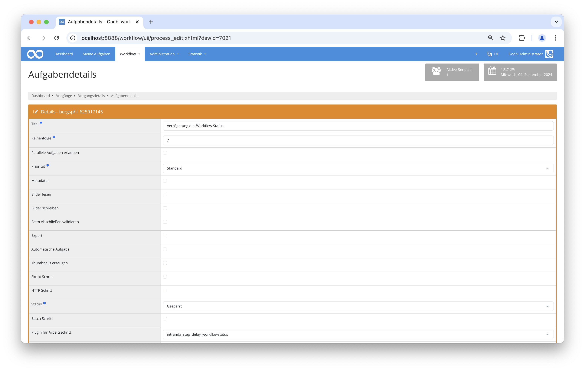

# Bedingte Verzögerung des Workflow Status

## Übersicht

Name                     | Wert
-------------------------|-----------
Identifier               | intranda_step_delay_workflow_status
Repository               | [https://github.com/intranda/goobi-plugin-step-delay-workflow-status](https://github.com/intranda/goobi-plugin-step-delay-workflow-status)
Lizenz              | GPL 2.0 oder neuer 
Letzte Änderung    | 04.09.2024 09:02:25


## Einführung
Die vorliegende Dokumentation beschreibt die Installation, Konfiguration und den Einsatz des Plugins. Mit Hilfe dieses Plugins kann geprüft werden, ob ein Workflow einen bestimmten Status erreicht hat. Nur wenn dies der Fall ist, wird ein definierter Arbeitschritt geschlossen und der nächste Schritt geöffnet.

## Installation
Um das Plugin nutzen zu können, müssen folgende Dateien installiert werden:

```bash
/opt/digiverso/goobi/plugins/step/plugin_intranda_step_delay_workflowstatus.jar
/opt/digiverso/goobi/config/plugin_intranda_step_delay_workflowstatus.xml
```

Für die Verwendung des Plugins muss dieses in einem Arbeitsschritt ausgewählt sein, wobei folgende Einstellungen gemacht werden müssen:

|Parameter|Belegung|
|-- |-- |
|Automatische Aufgabe|Ja|
|Plugin für Arbeitsschritt|intranda_step_delay_workflowstatus|
|Plugin für Zeitverzögerung|Ja|




## Überblick und Funktionsweise
Wenn der Vorgang den konfigurierten Schritt erreicht, findet eine Prüfung statt, ob die Bedingungen erfüllt sind. Wenn dies der Fall ist, wird der Schritt direkt geschlossen und die nächste Aufgabe kann bearbeitet werden. Falls nicht, bleibt die Aufgabe in Bearbeitung. Im Anschluss wird jede Nacht erneut geprüft, ob die Bedingung erfüllt wird.

Die Bedingung gilt nur dann als erfüllt, wenn alle konfigurierten Regeln erfüllt wurden.

## Konfiguration
Die Konfiguration des Plugins erfolgt in der Datei `plugin_intranda_step_delay_workflowstatus.xml` wie hier aufgezeigt:

```xml
<config_plugin>
    <!--
    	order of configuration is: 
	    1.) project name and step name matches 
	    2.) step name matches and project is * 
	    3.) project name matches and step name is * 
	    4.) project name and step name are * 
    -->
    
    <config>
        <!-- which projects to use for (can be more then one, otherwise use *) -->
        <project>*</project>
        <step>*</step>
        
        <condition>
	        <!-- name: name of t he property to check -->
	        <!-- value: expected value (can be blank too) -->
	        <!-- type: condition for value comparing, can be 'is' or 'not' or 'missing' or 'available' -->
            <property name="" value="" type=""/>
            
            <!-- name: name of the workflow step to check -->
            <!-- status: expected status, can be 'locked', 'open', 'inwork', 'done', 'deactivated' 'error'  -->
            <!-- type: condition, can be 'is' 'not' or 'atleast' -->
            <step name="" status="" type=""/>
        </condition>
    </config>
   
    <config>
        <!-- which projects to use for (can be more then one, otherwise use *) -->
        <project>Example</project>
        <step>Delay Test</step>
        
        <condition>
            <property name="Schrifttyp" value="Antiqua" type="is"/>
            <property name="TemplateID" value="1" type="not"/>

            <step name="Fileupload" status="done" type="is"/>
            <step name="teststep" status="open" type="atleast"/>
        </condition>
    </config>    
</config_plugin>
```

### Allgemeine Parameter 
Der Block `<config>` kann für verschiedene Projekte oder Arbeitsschritte wiederholt vorkommen, um innerhalb verschiedener Workflows unterschiedliche Aktionen durchführen zu können. Die weiteren Parameter innerhalb dieser Konfigurationsdatei haben folgende Bedeutungen: 

| Parameter | Erläuterung | 
| :-------- | :---------- | 
| `project` | Dieser Parameter legt fest, für welches Projekt der aktuelle Block `<config>` gelten soll. Verwendet wird hierbei der Name des Projektes. Dieser Parameter kann mehrfach pro `<config>` Block vorkommen. | 
| `step` | Dieser Parameter steuert, für welche Arbeitsschritte der Block `<config>` gelten soll. Verwendet wird hier der Name des Arbeitsschritts. Dieser Parameter kann mehrfach pro `<config>` Block vorkommen. | 


### Weitere Parameter 
Neben diesen allgemeinen Parametern stehen die folgenden Parameter für die weitergehende Konfiguration zur Verfügung: 


Das Feld `<condition>` enthält die zu überprüfenden Regeln. Dabei können sowohl Eigenschaften als auch Schritte geprüft werden. Die darin enthaltenen Felder sind wiederholbar, um mehrere Regeln definieren zu können. In dem Fall müssen alle zutreffen, damit die Bedingung als erfüllt gilt.

Im Feld `<property>` werden zu prüfende Eigenschaften definiert. Im Attribut `name` wird der Name der Eigenschaft festgelegt, in `value` der zu überprüfende Wert. Die Art der Prüfung kann in `type` definiert werden. Hier sind vier Arten möglich:

Parameter               | Erläuterung
------------------------|------------------------------------
| `is`|der Status des Schrittes muss dem konfigurierte Status entsprechen|
| `not`|der Schritt darf nicht im konfigurierten Status sein|
| `atleast`| der Schritt muss mindestens den konfigurierten Status erreicht haben. Diese Option funktioniert nicht mit `deactivated` oder `error`.