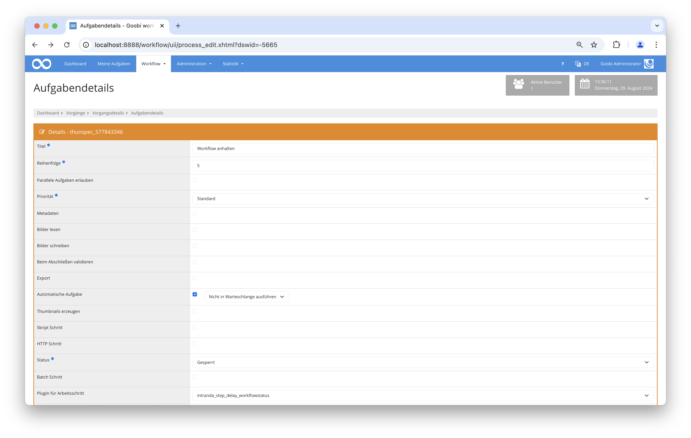

# Workflow pausieren

## Übersicht

Name                     | Wert
-------------------------|-----------
Identifier               | intranda_step_delay
Repository               | [https://github.com/intranda/goobi-plugin-step-delay](https://github.com/intranda/goobi-plugin-step-delay)
Lizenz              | GPL 2.0 oder neuer 
Letzte Änderung    | 04.09.2024 10:13:18


## Einführung
Diese Dokumentation erläutert das Plugin, das es erlaubt einen Workflow für eine bestimmte Zeitspanne zu pausieren.

## Installation
Um das Plugin nutzen zu können, müssen folgende Dateien installiert werden:

```bash
/opt/digiverso/goobi/plugins/step/plugin-step-delay-base.jar
/opt/digiverso/goobi/config/plugin_intranda_delay_configurable.xml
```

Nach der Installation des Plugins kann dieses innerhalb des Workflows für die jeweiligen Arbeitsschritte ausgewählt und somit automatisch ausgeführt werden.

Für die Verwendung des Plugins muss dieses in einem Arbeitsschritt ausgewählt sein:




## Überblick und Funktionsweise
Dieses Plugin pausiert den Workflow, solange wie es in der Konfigurationsdatei angegeben ist. Ist der konfigurierte Zeitpunkt erreicht, wird der betreffende Arbeitsschritt automatisch geschlossen und der weitere Workflow fortgeführt.

## Konfiguration
Die Konfiguration des Plugins erfolgt in der Datei `plugin_intranda_delay_configurable.xml` wie hier aufgezeigt:

```xml
<?xml version="1.0" encoding="UTF-8"?>
<config_plugin>
    <!--
        order of configuration is:
          1.) project name and step name matches
          2.) step name matches and project is *
          3.) project name matches and step name is *
          4.) project name and step name are *
	-->
    
    <config>
        <!-- which projects to use for (can be more then one, otherwise use *) -->
        <project>*</project>
        <step>*</step>
        
        <!-- Delay in days -->
        <delayInDays>3</delayInDays>
    </config>

</config_plugin>
```

### Allgemeine Parameter 
Der Block `<config>` kann für verschiedene Projekte oder Arbeitsschritte wiederholt vorkommen, um innerhalb verschiedener Workflows unterschiedliche Aktionen durchführen zu können. Die weiteren Parameter innerhalb dieser Konfigurationsdatei haben folgende Bedeutungen: 

| Parameter | Erläuterung | 
| :-------- | :---------- | 
| `project` | Dieser Parameter legt fest, für welches Projekt der aktuelle Block `<config>` gelten soll. Verwendet wird hierbei der Name des Projektes. Dieser Parameter kann mehrfach pro `<config>` Block vorkommen. | 
| `step` | Dieser Parameter steuert, für welche Arbeitsschritte der Block `<config>` gelten soll. Verwendet wird hier der Name des Arbeitsschritts. Dieser Parameter kann mehrfach pro `<config>` Block vorkommen. | 


### Weitere Parameter 
Neben diesen allgemeinen Parametern stehen die folgenden Parameter für die weitergehende Konfiguration zur Verfügung: 


Parameter               | Erläuterung
------------------------|------------------------------------
`delayInDays`           | Pausierung des Workflows in Tagen. |