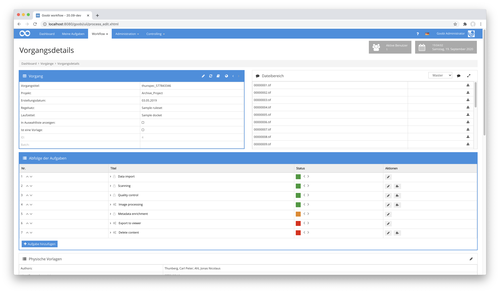

# Inhalte löschen

## Übersicht

Name                     | Wert
-------------------------|-----------
Identifier               | intranda_step_deleteContent
Repository               | [https://github.com/intranda/goobi-plugin-step-delete-content](https://github.com/intranda/goobi-plugin-step-delete-content)
Lizenz              | GPL 2.0 oder neuer 
Letzte Änderung    | 25.07.2024 12:00:07


## Einführung
Das Plugin dient zum automatischen Löschen von Daten eines Vorgangs. Hierzu kann in einer Konfigurationsdatei sehr granular festgelegt werden, welche Daten genau gelöscht werden sollen.


## Installation
Zur Installation des Plugins muss die folgende Datei installiert werden:

```bash
/opt/digiverso/goobi/plugins/step/plugin_intranda_step_deleteContent-base.jar
```

Um zu konfigurieren, wie sich das Plugin verhalten soll, können verschiedene Werte in der Konfigurationsdatei angepasst werden. Die Konfigurationsdatei befindet sich üblicherweise hier:

```bash
/opt/digiverso/goobi/config/plugin_intranda_step_deleteContent.xml
```


## Überblick und Funktionsweise
Zur Inbetriebnahme des Plugins muss dieses für einen oder mehrere gewünschte Aufgaben im Workflow aktiviert werden. Dies erfolgt wie im folgenden Screenshot aufgezeigt durch Auswahl des Plugins `intranda_step_deleteContent` aus der Liste der installierten Plugins.



Da dieses Plugin üblicherweise automatisch ausgeführt werden soll, sollte der Arbeitsschritt im Workflow als automatisch konfiguriert werden.

Nachdem das Plugin vollständig installiert und eingerichtet wurde, wird es üblicherweise automatisch innerhalb des Workflows ausgeführt, so dass keine manuelle Interaktion mit dem Nutzer erfolgt. Stattdessen erfolgt der Aufruf des Plugins durch den Workflow im Hintergrund und startet die Löschung der konfigurierten Daten. Hierbei werden die konfigurierten Ordner und Daten gelöscht, sofern diese vorhanden sind. Nicht vorhandene Daten werden übersprungen. Wenn konfiguriert wurde, dass der Vorgang deaktiviert werden soll, werden alle Arbeitsschritte durchlaufen und geprüft, ob diese bereits innerhalb des Workflows regulär geschlossen wurden. Sollte dies nicht der Fall sein, wird der Arbeitsschritt deaktiviert.

Nach Abschluss der Löschung wird im Vorgangslog eine Meldung über den Aufruf dieses Plugins und das Löschen der Daten hinzugefügt.


## Konfiguration
Die Konfiguration des Plugins ist folgendermaßen aufgebaut:

```xml
<config_plugin>

  <config>
      <project>*</project>
      <step>*</step>

      <!-- delete all data within the images/ folder -->
      <deleteAllContentFromImageDirectory>false</deleteAllContentFromImageDirectory>

      <!-- OR delete a single image folder - this is only used if deleteAllContentFromImageDirectory is set to false -->
      <deleteMediaDirectory>false</deleteMediaDirectory>
      <deleteMasterDirectory>false</deleteMasterDirectory>
      <deleteSourceDirectory>false</deleteSourceDirectory>
      <deleteFallbackDirectory>false</deleteFallbackDirectory>

      <!-- delete all data within the thumbs/ folder -->
      <deleteAllContentFromThumbsDirectory>false</deleteAllContentFromThumbsDirectory>

      <!-- delete all data within the ocr/ folder -->
      <deleteAllContentFromOcrDirectory>false</deleteAllContentFromOcrDirectory>

      <!-- OR delete a single ocr folder - this is only used if deleteAllContentFromOcrDirectory is set to false -->
      <deleteAltoDirectory>false</deleteAltoDirectory>
      <deletePdfDirectory>false</deletePdfDirectory>
      <deleteTxtDirectory>false</deleteTxtDirectory>
      <deleteWcDirectory>false</deleteWcDirectory>
      <deleteXmlDirectory>false</deleteXmlDirectory>

      <!-- delete export folder -->
      <deleteExportDirectory>false</deleteExportDirectory>

      <!-- delete import folder -->
      <deleteImportDirectory>false</deleteImportDirectory>

      <!-- delete processlog folder -->
      <deleteProcesslogDirectory>false</deleteProcesslogDirectory>

      <!-- delete metadata -->
      <deleteMetadataFiles>false</deleteMetadataFiles>

      <!-- deactivate all unfinished tasks -->
      <deactivateProcess>false</deactivateProcess>

      <!-- delete specific metadata in the structure main object (e.g. Monograph or Volume) 
        use the internal ruleset name here, e.g. singleDigCollection, DocLanguage etc. 
        this field is repeatable -->
      <deleteMetadata name="myMetadataType"/>

      <!-- delete specific process properties, e.g. Font type, Opening angle etc. 
        this field is repeatable -->
      <deleteProperty name="Opening angle"/>
  </config>

</config_plugin>
```

Der Block `<config>` kann für verschiedene Projekte oder Arbeitsschritte wiederholt vorkommen, um innerhalb verschiedener Workflows unterschiedliche Aktionen durchführen zu können. Die weiteren Parameter innerhalb dieser Konfigurationsdatei haben folgende Bedeutungen:

| Wert | Beschreibung |
| :--- | :--- |
| `project` | Dieser Parameter legt fest, für welches Projekt der aktuelle Block `<config>` gelten soll. Verwendet wird hierbei der Name des Projektes. Dieser Parameter kann mehrfach pro `<config>` Block vorkommen. |
| `step` | Dieser Parameter steuert, für welche Arbeitsschritte der Block `<config>` gelten soll. Verwendet wird hier der Name des Arbeitsschritts. Dieser Parameter kann mehrfach pro `<config>` Block vorkommen. |
| `deleteAllContentFromImageDirectory` | Legen Sie hier fest, ob alle Daten aus dem `images` Ordner gelöscht werden sollen. |
| `deleteMediaDirectory` | Legen Sie hier fest, ob der `media`-Ordner gelöscht werden soll. Diese Option wird nicht ausgewertet, wenn `deleteAllContentFromImageDirectory` aktiviert ist. |
| `deleteMasterDirectory` | Legen Sie hier fest, ob der `master`-Ordner gelöscht werden soll. Diese Option wird nicht ausgewertet, wenn `deleteAllContentFromImageDirectory` aktiviert ist. |
| `deleteSourceDirectory` | Legen Sie hier fest, ob der `source`-Ordner gelöscht werden soll. Diese Option wird nicht ausgewertet, wenn `deleteAllContentFromImageDirectory` aktiviert ist. |
| `deleteFallbackDirectory` | Legen Sie hier fest, ob der konfigurierte fallback-Ordner gelöscht werden soll. Diese Option wird nicht ausgewertet, wenn `deleteAllContentFromImageDirectory` aktiviert ist. |
| `deleteAllContentFromThumbsDirectory` | Legen Sie hier fest, ob alle Daten aus dem `thumbs` Ordner gelöscht werden sollen. |
| `deleteAllContentFromOcrDirectory` | Legen Sie hier fest, ob alle Daten aus dem `ocr` Ordner gelöscht werden sollen. |
| `deleteAltoDirectory` | Legen Sie hier fest, ob der `alto`-Ordner gelöscht werden soll. Diese Option wird nicht ausgewertet, wenn `deleteAllContentFromOcrDirectory` aktiviert ist. |
| `deletePdfDirectory` | Legen Sie hier fest, ob der `pdf`-Ordner gelöscht werden soll. Diese Option wird nicht ausgewertet, wenn `deleteAllContentFromOcrDirectory` aktiviert ist. |
| `deleteTxtDirectory` | Legen Sie hier fest, ob der `txt`-Ordner gelöscht werden soll. Diese Option wird nicht ausgewertet, wenn `deleteAllContentFromOcrDirectory` aktiviert ist. |
| `deleteWcDirectory` | Legen Sie hier fest, ob der `wc`-Ordner gelöscht werden soll. Diese Option wird nicht ausgewertet, wenn `deleteAllContentFromOcrDirectory` aktiviert ist. |
| `deleteXmlDirectory` | Legen Sie hier fest, ob der `xml`-Ordner gelöscht werden soll. Diese Option wird nicht ausgewertet, wenn `deleteAllContentFromOcrDirectory` aktiviert ist. |
| `deleteExportDirectory` | Legen Sie hier fest, ob der `export`-Ordner gelöscht werden soll. |
| `deleteImportDirectory` | Legen Sie hier fest, ob der `import`-Ordner gelöscht werden soll. |
| `deleteProcesslogDirectory` | Legen Sie hier fest, ob der Ordner gelöscht werden soll, in dem die Dateien verwaltet werden, die im Vorgangslog hochgeladen wurden. |
| `deleteMetadataFiles` | Legen Sie hier fest, ob die Metadaten und dazugehörigen Backups gelöscht werden sollen. |
| `deactivateProcess` | Wenn diese Option aktiviert wurde, werden alle Schritte des Vorgangs deaktiviert, wenn diese zuvor nicht bereits abgeschlossen wurden. |
| `deleteMetadata` | Hier kann ein bestimmtes Metadatum gelöscht werden, das sich auf der Ebene des Werkes in der Metadatendatei befindet. Das Element ist wiederholbar und muss einen gültigen Namen für ein Metadatentyp aus dem Regelsatz verwenden. |
| `deleteProperty` | Hier kann eine bestimmte Vorgangseigenschaft gelöscht werden., Das Element ist wiederholbar und muss den Namen der Eigenschaft aufführen. |