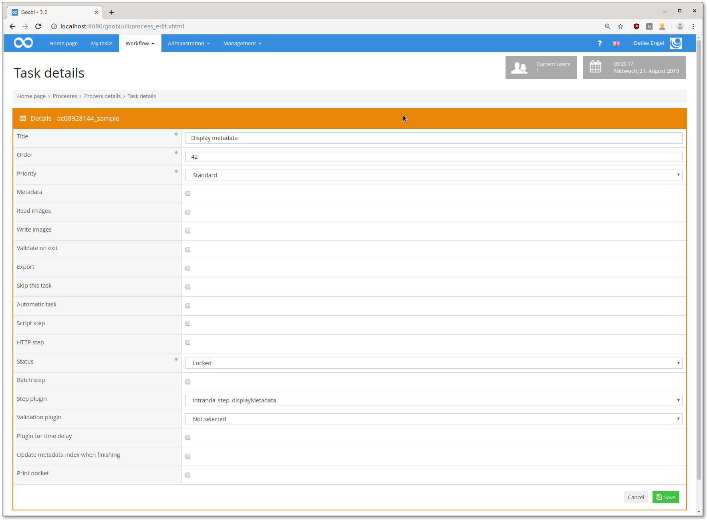

# Anzeige von Metadaten in einer Aufgabe

## Übersicht

Name                     | Wert
-------------------------|-----------
Identifier               | intranda_step_displayMetadata
Repository               | [https://github.com/intranda/goobi-plugin-step-display-metadata](https://github.com/intranda/goobi-plugin-step-display-metadata)
Lizenz              | GPL 2.0 oder neuer 
Letzte Änderung    | 25.07.2024 11:59:59


## Einführung
Die vorliegende Dokumentation beschreibt die Installation, Konfiguration und den Einsatz eines Plugins zur Anzeige von Metadaten in einem Workflow-Schritt. Das Plugin kann beliebige Metadaten in einem Schritt anzeigen. Die Konfiguration von Prä- und Suffixen ist auch möglich.


## Installation 
Zur Nutzung des Plugins müssen die beiden Artefakte an folgende Orte kopiert werden:

```bash
/opt/digiverso/goobi/plugins/step/plugin_intranda_step_displayMetadata-base.jar
/opt/digiverso/goobi/plugins/GUI/plugin_intranda_step_displayMetadata-gui.jar
```

Die Konfiguration des Plugins wird unter folgendem Pfad erwartet:

```bash
/opt/digiverso/goobi/config/plugin_intranda_step_displayMetadata.xml
```


## Überblick und Funktionsweise
In Goobi muss das Plugin in den Workflow einkonfiguriert werden. Dafür muss in der Schritte-Konfiguration als Schritte-Plugin `intranda_step_displayMetadata` ausgewählt werden.



Wenn dann nach erfolgreicher Konfiguration der Schritt geöffnet wird, werden alle Metadaten - sofern im Vorgang vorhanden - angezeigt:


## Konfiguration
Es können mehrere Metadaten zur Anzeige konfiguriert werden, zusätzlich kann ein Präfix und ein Suffix angezeigt werden. Das `key`-Attribut dient für die Übersetzung des labels des Metadatums:

```xml
<?xml version="1.0" encoding="UTF-8"?>
<config_plugin>
    <config>
        <project>*</project>
        <step>*</step>
        <metadatalist>
            <metadata>Author</metadata>
            <metadata>TitleDocMain</metadata>
            <metadata>_urn</metadata>
            <metadata prefix="http://svdmzgoobiweb01.klassik-stiftung.de/viewer/image/" suffix="/1/" key="url">CatalogIDDigital</metadata>
        </metadatalist>
    </config>
</config_plugin>
```